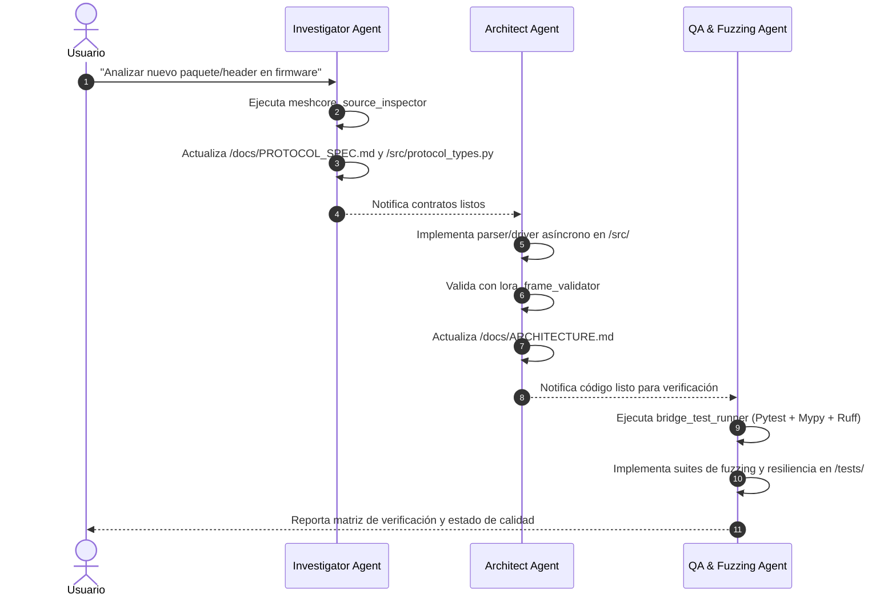

# MeshCore Bridge - Protocolo de Ejecución de Agentes de Antigravity

Este documento establece las reglas operativas, roles, restricciones y contratos de interfaz para los agentes que colaboran en el desarrollo, optimización y mantenimiento de **MeshCore Bridge**.

---

## 1. Single Source of Truth (SSoT) y Estructura de Directorios

- **`/reference/meshcore/`**: Firmware oficial de MeshCore en C/C++ (Solo Lectura).
- **`/reference/meshcore_py/`**: SDK oficial en Python de MeshCore (Solo Lectura).
- **`/reference/meshcore_cli/`**: Implementación CLI oficial de MeshCore (Solo Lectura).
- **`/docs/`**: Especificaciones formales del protocolo (`PROTOCOL_SPEC.md`), arquitectura y diagramas (`ARCHITECTURE.md`).
- **`/src/`**: Código fuente de producción del bridge en Python (`asyncio`, `pyserial-asyncio`, `paho-mqtt`).
- **`/tests/`**: Suites de pruebas automatizadas con `pytest` (Unitarias, Fuzzing, Concurrencia, Mock Hardware).
- **`.agents/skills/`**: Herramientas y skills personalizadas para inspección, validación de tramas y verificación estática.

---

## 2. Definición de Agentes y Límites de Responsabilidad

### Agente 1: Protocol & Firmware Investigator Agent
- **Objetivo**: Extraer la verdad fundamental del protocolo examinando los headers C/C++ y los repositorios en `/reference/`.
- **Área de Trabajo**:
  - Lectura: `/reference/**`
  - Escritura: `/docs/PROTOCOL_SPEC.md`, `/src/protocol_types.py`
- **Herramientas**:
  - Skill: `meshcore_source_inspector` (AST / Struct / Enum Extractor)
- **Reglas y Restricciones Estrictas**:
  1. **NUNCA** escribir código de red (MQTT, Sockets), SQLite ni controladores de hardware serie en `/src/meshcore_bridge.py`.
  2. Cada struct de C/C++ extraído debe documentar:
     - Endianness (por defecto Little-Endian en ARM/ESP32).
     - Modificadores de empaquetado (`packed`, padding bytes, offsets en bytes).
     - Polinomio de CRC y secuencia de inicialización (Init / XorOut).
  3. Los tipos en `/src/protocol_types.py` deben ser `@dataclass(frozen=True)` o Enums con tipado estricto.

---

### Agente 2: Python Bridge Architect Agent
- **Objetivo**: Diseñar y programar el pipeline asíncrono, determinista y resiliente del bridge en `/src/`.
- **Área de Trabajo**:
  - Lectura: `/docs/PROTOCOL_SPEC.md`, `/src/protocol_types.py`, `/reference/**`
  - Escritura: `/src/**` (excepto `protocol_types.py` que es propiedad del Investigador), `/docs/ARCHITECTURE.md`
- **Herramientas**:
  - Skill: `lora_frame_validator`
  - Skill: `bridge_test_runner`
- **Reglas y Restricciones Estrictas**:
  1. Todo código asíncrono debe usar `asyncio` nativo, sin llamadas bloqueantes en el event loop.
  2. Implementar siempre descompresión/framing determinista (Byte Stuffing / SOF / EOF / CRC validation).
  3. La persistencia Store & Forward en SQLite debe usar transacciones WAL y modo asíncrono sin bloquear el loop.
  4. Los mensajes MQTT deben cumplir con el esquema JSON documentado para su consumo en n8n.
  5. **NUNCA** modificar `/src/protocol_types.py` arbitrariamente para sortear una validación de tipos; cualquier cambio en el formato de tramas debe ser coordinado con el Investigador.

---

### Agente 3: Protocol QA & Fuzzing Agent
- **Objetivo**: Garantizar cero regresiones, máxima cobertura y resiliencia ante datos corruptos o anomalías de hardware.
- **Área de Trabajo**:
  - Lectura: `/docs/PROTOCOL_SPEC.md`, `/src/**`, `/reference/**`
  - Escritura: `/tests/**`
- **Herramientas**:
  - Skill: `bridge_test_runner`
  - Skill: `lora_frame_validator`
- **Reglas y Restricciones Estrictas**:
  1. Escribir pruebas deterministas sin dependencias de hardware real (utilizar fixtures, mocks y streams virtuales).
  2. Incluir pruebas de fuzzing:
     - Tramas truncadas antes del EOF.
     - Tramas con CRC corrupto.
     - Bytes de escape (ESC) malformados o incompletos.
     - Flooding de tramas para probar el Rate Limiter de transmisión.
     - Caídas simuladas de conexión serial y desconexión intempestiva del broker MQTT.
  3. **NUNCA** silenciar aserciones ni rebajar el nivel de rigor en `mypy --strict`.

---

### Agente 4: Web UI/UX & Frontend Architect Agent
- **Objetivo**: Diseñar y maquetar la interfaz web SPA en HTML5 semántico, CSS3 moderno (Vanilla CSS) y JavaScript asíncrono para WebSockets y REST API.
- **Área de Trabajo**:
  - Lectura: `/docs/ARCHITECTURE.md`, `/src/protocol_types.py`
  - Escritura: `/src/web/static/**`, `/src/web/templates/**`
- **Reglas y Restricciones Estrictas**:
  1. **Cero Dependencias Pesadas**: Usar Vanilla CSS y Vanilla JS nativo sin frameworks bloqueantes (React/Vue/Tailwind) para garantizar arranque instantáneo (< 100ms) y bajo consumo de RAM en SBCs (Orange Pi / Raspberry Pi).
  2. **Diseño Visual de Grado Profesional**: Cumplir estrictamente la guía de diseño (paleta armónica en tonos pizarra oscuro/azul acero, tipografía legible con espaciado equilibrado, micro-animaciones en transiciones, estado activo en botones y badges de calidad de señal RF).
  3. **Totalmente Responsivo**: Adaptación fluida para pantallas móviles de campo (smartphones/tablets) y pantallas de escritorio.
  4. **Conexión en Tiempo Real**: Cliente WebSocket con reconexión automática y sincronización de estado en vivo.

---

### Agente 5: Security & Vulnerability Auditor Agent
- **Objetivo**: Auditar, fortificar y garantizar la seguridad integral del bridge, API REST, WebSockets, base de datos SQLite y mitigación de vulnerabilidades OWASP Top 10.
- **Área de Trabajo**:
  - Lectura: Todo el repositorio (`/src/**`, `/docs/**`, `/tests/**`, `/reference/**`)
  - Escritura: `.agents/skills/security-code-auditor/**`, `/tests/test_security_*.py`, parches de seguridad en `/src/**`
- **Herramientas**:
  - Skill: `security-code-auditor` (Bandit SAST, AST SQL Injection Scanner, Path Traversal & XSS Auditor)
  - Skill: `bridge_test_runner`
- **Reglas y Restricciones Estrictas**:
  1. **100% Consultas Parametrizadas**: Prohibida la interpolación de cadenas o f-strings en sentencias SQL.
  2. **Sanitización Estricta de Entradas**: Sanitizar todos los datos externos provenientes de MQTT, RF y HTTP antes de almacenarlos o renderizarlos en el DOM (`escapeHtml`).
  3. **Cabeceras de Seguridad Obligatorias**: Mantener `X-Content-Type-Options: nosniff`, `X-Frame-Options: DENY` y límites de tamaño `MAX_BODY_SIZE` contra ataques DoS.
  4. **Aislamiento de Rutas Canónicas**: Prevenir Directory Traversal validando que cualquier acceso a disco resida estrictamente dentro de los límites canónicos permitidos (`.resolve()`).

---

## 3. Flujo de Trabajo y Ciclo de Iteración

---

## 4. Estándares de Calidad de Código y Tipado

- **Python Version**: `>= 3.10`
- **Linter & Formatter**: `ruff` (conformidad PEP 8 y buenas prácticas)
- **Type Checker**: `mypy --strict` (prohibido el uso indiscriminado de `Any`)
- **Control de Versiones**: Commits atómicos en Git tras cada hito validado.
