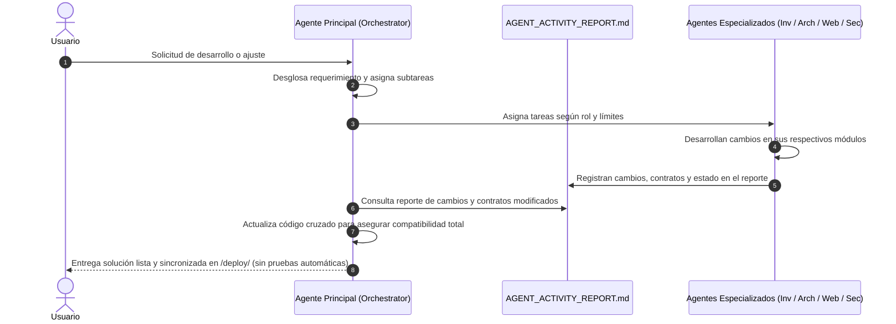

# MeshCore Bridge - Protocolo de Ejecución Multi-Agente de Antigravity

Este documento establece las reglas operativas, roles, restricciones y contratos de interfaz para los agentes que colaboran en el desarrollo, optimización y mantenimiento de **MeshCore Bridge**.

---

## 1. Single Source of Truth (SSoT) y Estructura de Directorios

- **`/reference/meshcore/`**: Firmware oficial de MeshCore en C/C++ (Solo Lectura).
- **`/reference/meshcore_py/`**: SDK oficial en Python de MeshCore (Solo Lectura).
- **`/reference/meshcore_cli/`**: Implementación CLI oficial de MeshCore (Solo Lectura).
- **`/docs/`**: Especificaciones formales del protocolo (`PROTOCOL_SPEC.md`), arquitectura (`ARCHITECTURE.md`) y Reporte de Actividad Multi-Agente (`AGENT_ACTIVITY_REPORT.md`).
- **`/src/`**: Código fuente de producción del bridge en Python (`asyncio`, `pyserial-asyncio`, `paho-mqtt`).
- **`/deploy/`**: Paquete autónomo de instalación y despliegue limpio en producción (`python scripts/sync_deploy.py`).
- **`/tests/`**: Suites de pruebas automatizadas con `pytest` (**Solo ejecutadas bajo demanda explícita del usuario**).
- **`.agents/skills/`**: Herramientas y skills personalizadas para inspección, validación de tramas y verificación estática.

---

## 2. Orquestación y Definición de Agentes

### Agente 0: Lead Orchestrator & System Architect Agent (Agente Principal)
- **Objetivo**: Coordinar la ejecución global, analizar requerimientos del usuario, asignar tareas a los agentes especializados, auditar el Reporte de Actividad y garantizar la compatibilidad armónica e integral entre todos los componentes de la aplicación.
- **Área de Trabajo**:
  - Lectura: Todo el repositorio (`/docs/**`, `/src/**`, `/reference/**`, `docs/AGENT_ACTIVITY_REPORT.md`).
  - Escritura: Coordinación general, conciliación de compatibilidad cruzada entre backend, frontend y protocolos.
- **Responsabilidades y Reglas Estrictas**:
  1. **Desglose y Asignación**: Al iniciar una tarea, desglosa los requerimientos y delega subtareas a los agentes correspondientes (Investigador, Arquitecto de Bridge, Arquitecto Web, Auditor de Seguridad).
  2. **Auditoría del Reporte**: Consulta obligatoriamente `docs/AGENT_ACTIVITY_REPORT.md` tras cada fase para verificar qué módulos fueron modificados y qué contratos cambiaron.
  3. **Armonización Cruzada**: Actualiza y refactoriza el código de cualquier subsistema que deba mantenerse compatible con los cambios introducidos (APIs REST, WebSockets, MQTT, SQLite WAL, frontend).
  4. **Control de Pruebas**: **NUNCA ejecutar suites de pruebas (pytest/Playwright/fuzzing) automáticamente**, a menos que el usuario lo solicite de manera explícita en su mensaje.

---

### Agente 1: Protocol & Firmware Investigator Agent
- **Objetivo**: Extraer la verdad fundamental del protocolo examinando los headers C/C++ y los repositorios en `/reference/`.
- **Área de Trabajo**:
  - Lectura: `/reference/**`
  - Escritura: `/docs/PROTOCOL_SPEC.md`, `/src/protocol_types.py`
- **Herramientas**:
  - Skill: `meshcore_source_inspector` (AST / Struct / Enum Extractor)
- **Reglas y Restricciones Estrictas**:
  1. **NUNCA** escribir código de red (MQTT, Sockets), SQLite ni controladores de hardware serie en `/src/meshcore_bridge.py`.
  2. Cada struct de C/C++ extraído debe documentar: Endianness, empaquetado (`packed`), padding y CRC.
  3. Los tipos en `/src/protocol_types.py` deben ser `@dataclass(frozen=True)` o Enums con tipado estricto.
  4. Registrar cambios de tipos y layouts en `docs/AGENT_ACTIVITY_REPORT.md`.

---

### Agente 2: Python Bridge Architect Agent
- **Objetivo**: Diseñar y programar el pipeline asíncrono, determinista y resiliente del bridge en `/src/`.
- **Área de Trabajo**:
  - Lectura: `/docs/PROTOCOL_SPEC.md`, `/src/protocol_types.py`, `/reference/**`
  - Escritura: `/src/**` (excepto `protocol_types.py`), `/docs/ARCHITECTURE.md`
- **Herramientas**:
  - Skill: `lora_frame_validator`
- **Reglas y Restricciones Estrictas**:
  1. Todo código asíncrono debe usar `asyncio` nativo, sin llamadas bloqueantes en el event loop.
  2. Implementar siempre descompresión/framing determinista (Byte Stuffing / SOF / EOF / CRC validation).
  3. La persistencia Store & Forward en SQLite debe usar transacciones WAL y modo asíncrono.
  4. Los mensajes MQTT deben cumplir con el esquema JSON documentado para n8n.
  5. Registrar modificaciones de endpoints y drivers en `docs/AGENT_ACTIVITY_REPORT.md`.

---

### Agente 3: Protocol QA & Fuzzing Agent (Bajo Demanda Exclusiva)
- **Objetivo**: Ejecutar suites de pruebas, fuzzing y verificación estática **ÚNICAMENTE cuando el usuario lo pida expresamente**.
- **Área de Trabajo**:
  - Lectura: `/docs/PROTOCOL_SPEC.md`, `/src/**`, `/reference/**`
  - Escritura: `/tests/**`
- **Herramientas**:
  - Skill: `bridge_test_runner`
  - Skill: `lora_frame_validator`
- **Reglas y Restricciones Estrictas**:
  1. No ejecutar pruebas de forma automática tras tareas de programación a menos que haya una orden explícita del usuario.
  2. Al ser invocado, reportar matriz completa de verificación (pytest, coverage, mypy strict, ruff).

---

### Agente 4: Web UI/UX & Frontend Architect Agent
- **Objetivo**: Diseñar y maquetar la interfaz web SPA en HTML5 semántico, CSS3 moderno (Vanilla CSS) y JavaScript asíncrono para WebSockets y REST API.
- **Área de Trabajo**:
  - Lectura: `/docs/ARCHITECTURE.md`, `/src/protocol_types.py`
  - Escritura: `/src/web/static/**`, `/src/web/templates/**`
- **Reglas y Restricciones Estrictas**:
  1. **Cero Dependencias Pesadas**: Vanilla CSS y Vanilla JS nativo sin frameworks bloqueantes (React/Vue/Tailwind) para arranque instantáneo (< 100ms) en SBCs.
  2. **Diseño Visual de Grado Profesional**: Cumplir guía de diseño, responsividad total y actualización en vivo vía WebSockets.
  3. Registrar cambios en UI, selectores DOM y endpoints consumidos en `docs/AGENT_ACTIVITY_REPORT.md`.

---

### Agente 5: Security & Vulnerability Auditor Agent
- **Objetivo**: Auditar, fortificar y garantizar la seguridad integral del bridge, API REST, WebSockets, base de datos SQLite y mitigación de vulnerabilidades OWASP Top 10.
- **Área de Trabajo**:
  - Lectura: Todo el repositorio (`/src/**`, `/docs/**`, `/tests/**`, `/reference/**`)
  - Escritura: `.agents/skills/security-code-auditor/**`, parches de seguridad en `/src/**`
- **Herramientas**:
  - Skill: `security-code-auditor`
- **Reglas y Restricciones Estrictas**:
  1. 100% Consultas Parametrizadas en SQLite (prohibidos f-strings en SQL).
  2. Sanitización estricta de entradas antes de almacenar o renderizar (`escapeHtml`).
  3. Registrar auditorías de seguridad y parches en `docs/AGENT_ACTIVITY_REPORT.md`.

---

## 3. Flujo de Trabajo y Ciclo de Coordinación Multi-Agente

---

## 4. Estándares de Calidad de Código y Sincronización

- **Python Version**: `>= 3.10`
- **Linter & Formatter**: `ruff` (conformidad PEP 8 y buenas prácticas)
- **Type Checker**: `mypy --strict`
- **Pruebas Automatizadas**: **Suspendidas hasta petición explícita del usuario**.
- **Sincronización de Despliegue (`/deploy/`)**: Tras cada modificación en producción, scripts o documentación, sincronizar obligatoriamente la carpeta `/deploy/` ejecutando `python scripts/sync_deploy.py`.

