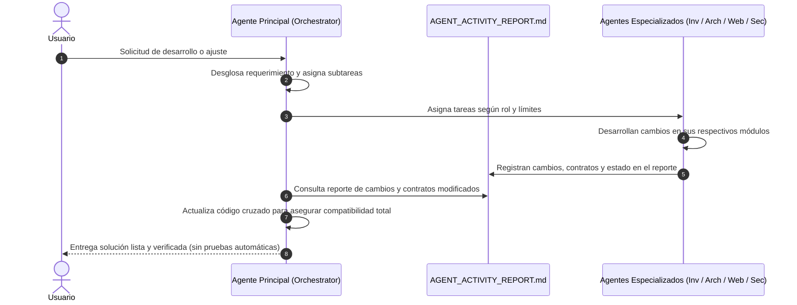

# MeshCore Bridge - Protocolo de Ejecución Multi-Agente de Antigravity

Este documento establece las reglas operativas, roles, restricciones y contratos de interfaz para los agentes que colaboran en el desarrollo, optimización y mantenimiento de **MeshCore Bridge**.

---

## 1. Single Source of Truth (SSoT) y Estructura de Directorios

- **`/reference/meshcore/`**: Firmware oficial de MeshCore en C/C++ (Solo Lectura).
- **`/reference/meshcore_py/`**: SDK oficial en Python de MeshCore (Solo Lectura).
- **`/reference/meshcore_cli/`**: Implementación CLI oficial de MeshCore (Solo Lectura).
- **`CONTEXT.md`**: Lenguaje Ubicuo y Modelo de Dominio canónico del proyecto (Glosario, roles de nodos, principios de Deep Modules).
- **`/docs/`**: Especificaciones formales del protocolo (`PROTOCOL_SPEC.md`), arquitectura (`ARCHITECTURE.md`), Decisiones de Arquitectura (`/docs/adr/`) y Reporte de Actividad Multi-Agente (`AGENT_ACTIVITY_REPORT.md`).
- **`/src/`**: Código fuente de producción del bridge en Python (`asyncio`, `pyserial-asyncio`, `paho-mqtt`).
- **`/tests/`**: Suites de pruebas automatizadas con `pytest` (**Solo ejecutadas bajo demanda explícita del usuario**).
- **`.agents/skills/`**: Herramientas y skills personalizadas para inspección, validación de tramas y verificación estática.

---

## 1.1 Jerarquía de autoridad documental

Para evitar múltiples fuentes de verdad, los documentos tienen la siguiente precedencia:

1. **`/reference/meshcore/`, `/reference/meshcore_py/`, `/reference/meshcore_cli/`**: autoridad externa para protocolo, layouts binarios, opcodes y comportamiento del firmware/SDK.
2. **`CONTEXT.md`**: autoridad del dominio del proyecto: vocabulario, roles e invariantes.
3. **`docs/adr/`**: decisiones arquitectónicas aceptadas que refinan la implementación del dominio. Un ADR no debe redefinir el protocolo externo.
4. **`docs/PROTOCOL_SPEC.md` y `docs/ARCHITECTURE.md`**: especificaciones derivadas del código y de las fuentes anteriores.
5. **`AGENTS.md`**: reglas operativas para agentes; no redefine el dominio ni el protocolo.
6. **Skills**: herramientas y procedimientos. **Nunca pueden contradecir esta jerarquía, el stack del proyecto ni una restricción explícita del usuario.**
7. **README, guías, reportes y ledger de actividad**: documentación descriptiva o histórica; no son SSoT.

Ante una discrepancia, prevalece la fuente de mayor autoridad. La discrepancia debe corregirse en la documentación derivada y, cuando represente una decisión de diseño, registrarse mediante ADR.

---

## 1.2 Invariantes de dominio

Las reglas canónicas de roles, contactos, repetidores, nodo local y protección de airtime se definen **una sola vez** en [`CONTEXT.md`](CONTEXT.md), especialmente en las secciones 2 y 3, y se refinan mediante los ADR aceptados.

Los agentes **no deben copiar ni reinterpretar** esas invariantes dentro de otros documentos. Deben enlazarlas y aplicar los contratos vigentes. Para detalles binarios u opcodes, verificar siempre las fuentes de `/reference/` antes de modificar `docs/PROTOCOL_SPEC.md` o `src/protocol_types.py`.

---

## 2. Orquestación y Definición de Agentes
## 2. Orquestación y Definición de Agentes

### Agente 0: Lead Orchestrator & System Architect Agent (Agente Principal)
- **Objetivo**: Coordinar la ejecución global, analizar requerimientos del usuario, asignar tareas a los agentes especializados, auditar el Reporte de Actividad y garantizar la compatibilidad armónica e integral entre todos los componentes de la aplicación.
- **Área de Trabajo**:
  - Lectura: Todo el repositorio (`/docs/**`, `/src/**`, `/reference/**`, `docs/AGENT_ACTIVITY_REPORT.md`, `CONTEXT.md`).
  - Escritura: Coordinación general, conciliación de compatibilidad cruzada entre backend, frontend y protocolos.
- **Herramientas**:
  - Skill: `domain-adr-keeper` (Gobernanza de CONTEXT.md y ADRs)
  - Skill: `clean-code-solid` (Deep Modules y auditoría de complejidad)
  - Skill: `tgrep-code-search` (Búsqueda indexada por trigramas submilisegundo en monorepo/referencia)
- **Responsabilidades y Reglas Estrictas**:
  1. **Desglose y Asignación**: Al iniciar una tarea, desglosa los requerimientos y delega subtareas a los agentes correspondientes (Investigador, Arquitecto de Bridge, Arquitecto Web, Auditor de Seguridad).
  2. **Auditoría del historial**: Consulta `docs/README.md` y solo las entradas relevantes o recientes de `docs/AGENT_ACTIVITY_REPORT.md`. El ledger es histórico y no debe cargarse completo en cada fase.
  3. **Armonización Cruzada**: Actualiza y refactoriza el código de cualquier subsistema que deba mantenerse compatible con los cambios introducidos (APIs REST, WebSockets, MQTT, persistencia JSON / memoria, frontend).
  4. **Control de Pruebas**: **NUNCA ejecutar suites de pruebas (pytest/Playwright/fuzzing) automáticamente**, a menos que el usuario lo solicite de manera explícita en su mensaje.

---

### Agente 1: Protocol & Firmware Investigator Agent
- **Objetivo**: Extraer la verdad fundamental del protocolo examinando los headers C/C++ y los repositorios en `/reference/`.
- **Área de Trabajo**:
  - Lectura: `/reference/**`
  - Escritura: `/docs/PROTOCOL_SPEC.md`, `/src/protocol_types.py`
- **Herramientas**:
  - Skill: `meshcore-source-inspector` (AST / Struct / Enum Extractor)
  - Skill: `tgrep-code-search` (Búsqueda indexada por trigramas en código firmware C/C++)
- **Reglas y Restricciones Estrictas**:
  1. **NUNCA** escribir código de red (MQTT, Sockets), persistencia de archivos ni controladores de hardware serie en `/src/meshcore_bridge.py`.
  2. Cada struct de C/C++ extraído debe documentar: Endianness, empaquetado (`packed`), padding y CRC.
  3. Los tipos en `/src/protocol_types.py` deben ser `@dataclass(frozen=True)` o Enums con tipado estricto.
  4. Registrar cambios de tipos y layouts en `docs/AGENT_ACTIVITY_REPORT.md`.

---

### Agente 2: Python Bridge Architect Agent
- **Objetivo**: Diseñar y programar el pipeline asíncrono, determinista y resiliente del bridge en `/src/`.
- **Área de Trabajo**:
  - Lectura: `/docs/PROTOCOL_SPEC.md`, `/src/protocol_types.py`, `/reference/**`
  - Escritura: `/src/**` (excepto `protocol_types.py`), `/docs/ARCHITECTURE.md`
- **Herramientas**:
  - Skill: `lora-frame-validator`
  - Skill: `lora-packet-simulator` (Simulación en memoria y virtual mesh replay)
  - Skill: `asyncio-profiler-leak-detector` (Monitoreo de event loop y memoria RAM)
- **Reglas y Restricciones Estrictas**:
  1. Todo código asíncrono debe usar `asyncio` nativo, sin llamadas bloqueantes en el event loop.
  2. Implementar el transporte según la capa correcta: Companion USB/TCP oficial (`0x3C`/`0x3E` + longitud `uint16` little-endian) para Host↔Radio, y `Packet.h` para paquetes LoRa on-air. No inventar ni reutilizar framing sintético como si fuera protocolo MeshCore.
  3. La persistencia en disco de canales y configuraciones debe ser atómica y no bloqueante mediante archivos JSON.
  4. Los mensajes MQTT deben cumplir con el esquema JSON documentado para n8n.
  5. Registrar modificaciones de endpoints y drivers en `docs/AGENT_ACTIVITY_REPORT.md`.

---

### Agente 3: Protocol QA & Fuzzing Agent (Bajo Demanda Exclusiva)
- **Objetivo**: Ejecutar suites de pruebas, fuzzing y verificación estática **ÚNICAMENTE cuando el usuario lo pida expresamente**.
- **Área de Trabajo**:
  - Lectura: `/docs/PROTOCOL_SPEC.md`, `/src/**`, `/reference/**`
  - Escritura: `/tests/**`
- **Herramientas**:
  - Skill: `bridge-test-runner`
  - Skill: `lora-frame-validator`
- **Reglas y Restricciones Estrictas**:
  1. No ejecutar pruebas de forma automática tras tareas de programación a menos que haya una orden explícita del usuario.
  2. Al ser invocado, reportar matriz completa de verificación (pytest, coverage, mypy strict, ruff).

---

### Agente 4: Web UI/UX & Frontend Architect Agent
- **Objetivo**: Diseñar y maquetar la interfaz web SPA en HTML5 semántico, CSS3 moderno (Vanilla CSS) y JavaScript asíncrono para WebSockets y REST API.
- **Área de Trabajo**:
  - Lectura: `/docs/ARCHITECTURE.md`, `/src/protocol_types.py`
  - Escritura: `/src/web/static/**` y módulos web existentes documentados en `docs/ARCHITECTURE.md`
- **Herramientas**:
  - Skill: `contract-openapi-sync` (Verificación de paridad API Python/JS)
  - Skill: `web-browser-inspection` (Inspección Playwright)
- **Reglas y Restricciones Estrictas**:
  1. **Cero Dependencias Pesadas**: Vanilla CSS y Vanilla JS nativo sin frameworks bloqueantes (React/Vue/Tailwind) para arranque instantáneo (< 100ms) en SBCs.
  2. **Diseño Visual de Grado Profesional**: Cumplir guía de diseño, responsividad total y actualización en vivo vía WebSockets.
  3. Registrar cambios en UI, selectores DOM y endpoints consumidos en `docs/AGENT_ACTIVITY_REPORT.md`.

---

### Agente 5: Security & Vulnerability Auditor Agent
- **Objetivo**: Auditar, fortificar y garantizar la seguridad integral del bridge, API REST, WebSockets, persistencia JSON y mitigación de vulnerabilidades OWASP Top 10.
- **Área de Trabajo**:
  - Lectura: Todo el repositorio (`/src/**`, `/docs/**`, `/tests/**`, `/reference/**`)
  - Escritura: `.agents/skills/security-code-auditor/**`, parches de seguridad en `/src/**`
- **Herramientas**:
  - Skill: `security-code-auditor`
- **Reglas y Restricciones Estrictas**:
  1. Validación y sanitización estricta de esquemas JSON y tipos de datos.
  2. Sanitización estricta de entradas antes de almacenar o renderizar (`escapeHtml`).
  3. Registrar auditorías de seguridad y parches en `docs/AGENT_ACTIVITY_REPORT.md`.

---

## 3. Flujo de Trabajo y Ciclo de Coordinación Multi-Agente

```mermaid
sequenceDiagram
    autonumber
    actor Usuario
    participant Principal as Agente Principal (Orchestrator)
    participant Ledger as AGENT_ACTIVITY_REPORT.md
    participant Subagentes as Agentes Especializados (Inv / Arch / Web / Sec)

    Usuario->>Principal: Solicitud de desarrollo o ajuste
    Principal->>Principal: Desglosa requerimiento y asigna subtareas
    Principal->>Subagentes: Asigna tareas según rol y límites
    
    Subagentes->>Subagentes: Desarrollan cambios en sus respectivos módulos
    Subagentes->>Ledger: Registran cambios, contratos y estado en el reporte
    
    Principal->>Ledger: Consulta reporte de cambios y contratos modificados
    Principal->>Principal: Actualiza código cruzado para asegurar compatibilidad total
    Principal-->>Usuario: Entrega solución lista y verificada (sin pruebas automáticas)
```

---

## 4. Checklist de Impacto en la Malla LoRa (Obligatorio)

> **Regla**: Antes de implementar cualquier feature que **envíe paquetes por radio**, **dispare notificaciones** automáticas, **arme un timer** periódico o **modifique parámetros de radio**, el agente DEBE responder estas tres preguntas y documentar las respuestas en el plan de implementación. Los límites e intervalos deben provenir, por orden, de un ADR aceptado, una configuración existente o una instrucción explícita del usuario; si ninguna fuente los define, hay que pedir decisión al usuario antes de fijarlos.

---

### Pregunta 1: ¿Cuánto airtime consume en la malla?

LoRa es un medio **compartido, lento y half-duplex**. Cada paquete que el bridge envía bloquea el canal para todos los nodos de la malla. En un spreading factor alto (SF12 / LongRange), un solo mensaje puede ocupar el canal durante varios segundos. Cada hop adicional multiplica las transmisiones.

Evaluar antes de programar:

- ¿Cuántos paquetes envía esta feature, y con qué frecuencia?
- ¿Se multiplica por el número de nodos activos? (O(n) paquetes = peligro en mallas grandes)
- ¿Es un timer permanente o una acción puntual? Los timers permanentes acumulan coste indefinidamente.
- ¿Se puede sustituir por **datos pasivos** que ya se reciben (adverts, telemetría, ACKs) en vez de paquetes de consulta activa?

**Regla**: Preferir siempre la recepción pasiva sobre la consulta activa. Los traceroutes, pings y solicitudes de telemetría son costosos. Para automatizaciones, usar los límites definidos por los ADR/configuración vigentes; en ausencia de una decisión previa, mantenerlos bajo demanda hasta que el usuario defina el intervalo.

---

### Pregunta 2: ¿Puede esta feature generar spam o bucles de feedback?

Spam no es solo un flood de mensajes de texto. Contar todas las rutas indirectas:

- **Directo**: mensajes de texto, DMs, traceroutes automáticos, comandos admin, pings.
- **Indirecto**: eventos en el bus asyncio (`asyncio.Queue`) que disparan publicación MQTT → n8n → webhook → que puede volver a enviar un mensaje al bridge.
- **Bucle de feedback**: un evento recibido que dispara un envío que genera otro evento. El bridge DEBE tener una **guarda de origen propio** (ignorar paquetes que provienen de la clave pública local).
- **Reintentos**: un envío fallido que reintenta infinitamente equivale a un flood con pasos extra. Implementar backoff exponencial con límite máximo de reintentos.

Si alguna de estas situaciones aplica, la feature necesita un limitador. Usar los mecanismos existentes:

| Necesidad | Mecanismo en el Bridge |
|---|---|
| Limitar envíos por ventana temporal | `rate_limiter.py` (`RateLimiter` por canal/nodo) |
| Deduplicar eventos recibidos | `deduplicator.py` (`MessageDeduplicator`) |
| Cooldown entre operaciones admin | Parámetro `min_interval_s` en `repeater_manager.py` |
| Backoff en reconexión serial | `serial_driver.py` (exponential backoff ya implementado) |

---

### Pregunta 3: ¿Un guardado de configuración rearma un timer de seguridad?

Este es el bug recurrente más difícil de detectar. Si un scheduler o timer vive **solo en memoria**, cada vez que el usuario guarda la configuración desde la WebUI, el timer se reinicia — provocando una ráfaga de paquetes, o que un cooldown de protección nunca expire.

Reglas obligatorias:

1. **Persistir el timestamp del último disparo en la base de datos o en el archivo `.json` de configuración**, nunca solo en una variable de instancia Python.
2. Al reiniciar un scheduler, verificar el tiempo transcurrido desde el último disparo antes de ejecutar la primera iteración.
3. Verificar que el comportamiento es correcto tras reiniciar el proceso bridge (simular con `pkill` + arranque manual).
4. No hardcodear nuevos intervalos sin una fuente de autoridad: ADR aceptado, configuración existente o decisión explícita del usuario.

---

### Cuándo ejecutar este checklist

Ejecutar obligatoriamente cuando la feature a implementar involucre:

- [ ] Envío de mensajes de texto, DMs o comandos por radio (serial driver → SDK).
- [ ] Traceroute, ping o solicitud de telemetría iniciados automáticamente (no por acción del usuario).
- [ ] Timer asyncio (`asyncio.sleep` en loop, `asyncio.create_task` periódico) que produce paquetes.
- [ ] Publicación automática a MQTT que podría retroalimentar el bridge.
- [ ] Modificación de parámetros de radio (frecuencia, TX power, spreading factor).
- [ ] Cualquier mecanismo de reintentos ante fallos de envío.

---

## 5. Estándares de Calidad de Código y Sincronización

- **Python Version**: `>= 3.10`
- **Linter & Formatter**: `ruff` (conformidad PEP 8 y buenas prácticas)
- **Type Checker**: `mypy --strict`
- **Pruebas Automatizadas**: **Suspendidas hasta petición explícita del usuario**.
- **Sincronización con GitHub**: Trabajar por defecto en una rama dedicada y entregar mediante commit + Pull Request. El push directo a `origin/main` solo se realiza cuando el usuario lo solicite explícitamente o exista una política externa del repositorio que lo exija.

