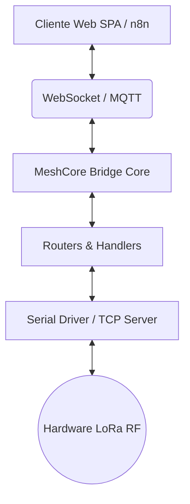

# MeshCore Universal Bridge & Web Station v3.0 Pro

Puente bidireccional asíncrono, resiliente y de grado industrial para conectar transceptores de radio **MeshCore Companion USB / TCP (v1.17+)** (**Heltec v2/v3/v4**, **LilyGO T-Beam/T-Echo**, **RAKwireless WisBlock**, **Seeed Studio**, **Raspberry Pi RP2040**) con **MQTT (Mosquitto)**, flujos de automatización en **n8n**, y una **Estación Web SPA Reactiva Moderna (HTML5, Vanilla CSS, ES6+)** con **Centro de Control de Repetidores**, **Consola CLI Interactiva**, **Autenticación API Key** y **Paleta de Comandos (`Ctrl+K`)**.

---

## 📻 Dispositivos LoRa Compatibles

- **Heltec Automation**: WiFi LoRa 32 (v2/v3/v4), Wireless Stick, Wireless Tracker, Wireless Paper, Capsule.
- **LilyGO (TTGO)**: T-Beam (v1.1/v1.2/Supreme), T-Echo (nRF52840), T3S3, T-Deck, LoRa32.
- **RAKwireless WisBlock**: RAK4631 (nRF52840), RAK11200, RAK11310 (RP2040), WisMesh Hub/Pocket.
- **Seeed Studio**: SenseCAP Indicator / Tracker, Wio-E5, Xiao ESP32-S3 / Xiao nRF52840.
- **Raspberry Pi**: Pico / Pico W con shield LoRa SX1262 / RP2040.
- **Puertos Remotos TCP**: Conexión transparente por red `tcp://host:port` (MeshCore sobre TCP/WiFi/Ethernet).

---

## 🚀 Características Principales (v3.0 Pro)

- **🌐 Cliente Web Station SPA Integrado (`http://<IP>:8080`)**:
  - Interfaz ultraligera sin dependencias pesadas (< 10 MB RAM, arranque instantáneo en < 50ms).
  - Cumplimiento **WCAG 2.2 AA** con navegación 100% por teclado, foco visible `:focus-visible` y `prefers-reduced-motion`.
  - **Paleta de Comandos (`Ctrl+K` / `⌘K`)**: Acceso rápido a cualquier sección, comandos de administración y descubrimiento.
  - **WebSocket Hub RFC 6455 Resiliente**:
    - Reconexión con retroceso exponencial (*exponential backoff*).
    - Soporte automático *Same-Origin* y subredes LAN privadas (`192.168.*`, `10.*`, `172.16-31.*`).
    - *Heartbeat* bidireccional (Ping/Pong cada 15s) para mantener viva la conexión a través de routers y firewalls.
    - Indicador de estado de conexión visual (`⬤ Conectado` / `⬤ Reconectando…`).
  - **Gestión Unificada del Directorio de Nodos**:
    - Deduplicación estricta de la Estación Base local (aparece exactamente una vez con distintivo *Base Station*).
    - Fusión inteligente de alias, nombres y prefijos de claves públicas en $O(1)$.
  - **Mensajería Multi-Canal y DMs Aislados**:
    - Transmisión inmediata en canales públicos (Canales 0..7) con confirmación RF `✓ TX`.
    - Mensajes directos (DMs) punto a punto con seguimiento de ACK por radio (25s) y acuse `✓✓ Entregado`.
  - **Centro de Control de Repetidores LoRa**:
    - 📋 *Telemetría de Hardware*: Batería, voltaje solar, SNR, RSSI y tiempo activo (*uptime*).
    - 📻 *Ajustes de Radio RF*: Frecuencia, potencia TX (dBm), Spreading Factor (SF7..SF12) y ancho de banda.
    - 🌐 *Vecinos y Topología*: Tabla de vecinos directos con sondeo `discover.neighbors` y acceso directo a chat DM.
    - 💻 *Terminal Interactiva*: Consola CLI con historial de comandos (`ArrowUp`/`ArrowDown`), botones rápidos y ejecución de comandos directos.
  - **Mapa GPS Interactivo** (Leaflet) con detección de coordenadas en tiempo real de nodos y routers, con soporte de mapas locales *offline*.
  - **📈 Tablero de Métricas Avanzadas**: Top Nodos por Tráfico, Top Repetidores por Calidad de Enlace y Rendimiento del Puente.
- **🔐 Seguridad y Control de Acceso**:
  - Autenticación opcional mediante cabecera `X-Api-Key` (`BRIDGE_API_KEY`) para proteger endpoints mutantes y transmisión RF.
  - Gestión visual de API Key en **⚙️ Ajustes ➔ 🔐 Seguridad & API**.
  - Servidor TCP Companion con límite de conexiones concurrentes (`MAX_COMPANION_CLIENTS`), lista blanca de IPs y token de autenticación.
  - Políticas de seguridad CORS estrictas y cabeceras CSP (*Content-Security-Policy*).
  - Sanitización HTML contra ataques XSS y validación estricta de esquemas de datos.
- **🩺 Motor de Diagnósticos Preflight (`src/preflight.py`)**:
  - Verificaciones automáticas previas al arranque (Broker Mosquitto TCP, Puerto Serial / TCP, Servidor Companion).
- **Decodificador Nativo CayenneLPP (`src/sensor_decoder.py`)**:
  - Soporte para `pycayennelpp>=2.0.0` (v2.4.0) con deserialización determinista de temperatura, humedad, presión, GPS, acelerómetro, luminosidad y voltaje.
- **LoRa TX Rate Limiter con Cola de Prioridades y Airtime Tracking**:
  - Espaciado adaptativo según el cálculo analítico de tiempo en el aire LoRa de Semtech (`estimate_lora_airtime_ms`).
- **Persistencia Híbrida Atómica (JSON & Memoria Flash)**:
  - Almacenamiento no volátil en la radio LoRa para contactos y persistencia atómica en archivos JSON (`data/channels.json`, `data/node_registry.json`) sin dependencias de motores de bases de datos pesados.
- **Serial Watchdog Activo**:
  - Detección automática de bloqueos silenciosos del puerto USB y reconexión automática con estabilización USB CDC.
- **🗺️ Mapas de Arquitectura Interactivos (Archify)**:
  - Documentación interactiva en HTML + SVG autónomo dentro de [`docs/diagrams/`](docs/diagrams/): arquitectura general del puente, pipeline de tramas LoRa a IP y secuencia operativa de comandos.

---

## 📁 Estructura del Proyecto

```
meshcore-bridge/
├── config.py                         # Carga, tipado y validación estricta de variables de entorno
├── meshcore_bridge.py                # Entrypoint raíz ejecutable
├── requirements.txt                  # Dependencias Python de producción (pycayennelpp, paho-mqtt, pyserial-asyncio)
├── pyproject.toml                    # Configuración estricta de pytest, mypy y ruff
├── .env.example                      # Plantilla completa de configuración de entorno
├── .env                              # Archivo de variables de entorno activo
├── install.sh                        # Script de instalación y despliegue para Linux / Raspberry Pi
├── install.ps1                       # Script de instalación y ejecución para Windows PowerShell
├── meshcore-bridge.service           # Archivo de servicio systemd para Linux
├── n8n_workflow_meshcore.json        # Flujo de automatización exportable para n8n
├── src/                              # Código fuente modular de producción
│   ├── __init__.py                   # Exportaciones públicas del paquete
│   ├── __main__.py                   # Entrypoint 'python -m src'
│   ├── admin/                        # Ejecutores de comandos administrativos
│   │   ├── __init__.py
│   │   ├── cli_command_executor.py
│   │   ├── local_config_executor.py
│   │   ├── repeater_executor.py
│   │   └── traceroute_executor.py
│   ├── admin_handler.py              # Comandos de administración RF y repetidores remotos
│   ├── bridge_core.py                # Orquestador central MeshCoreBridge (facade/composition root)
│   ├── contact_manager.py            # Registro dinámico de nodos, métricas top y libreta
│   ├── deduplicator.py               # Deduplicador de paquetes en RAM con ventana deslizante TTL
│   ├── diagnostics.py                # Sistema extendido de diagnósticos
│   ├── event_utils.py                # Extractor canónico de remitentes y utilidades de eventos
│   ├── health_reporter.py            # Reporte periódico de salud en meshcore/bridge/health
│   ├── lqi_engine.py                 # Motor de cálculo de calidad de enlace LQI (SNR/RSSI/Hops)
│   ├── mqtt_client.py                # Cliente MQTT asíncrono con soporte ReasonCodes v2.x
│   ├── mqtt_dispatcher.py            # Despachador de mensajes MQTT entrantes (TX/Admin)
│   ├── packet_buffer.py              # Buffer de paquetes en tránsito
│   ├── preflight.py                  # Motor de diagnósticos previos al arranque
│   ├── protocol_types.py             # Dataclasses inmutables y tipadas con CRC-16 y PacketType oficial
│   ├── rate_limiter.py               # Rate Limiter con PriorityQueue y LoRa Airtime Tracker
│   ├── repeater_manager.py           # Gestor de repetidores remotos y telemetría
│   ├── routers/                      # Manejadores de enrutamiento por tipo de paquete
│   │   ├── __init__.py
│   │   ├── advert_handler.py
│   │   ├── base.py
│   │   ├── channel_handler.py
│   │   ├── direct_handler.py
│   │   ├── repeater_handler.py
│   │   ├── system_handler.py
│   │   └── telemetry_handler.py
│   ├── rx_router.py                  # Enrutador de eventos LoRa/RF → MQTT + WebSocket
│   ├── sensor_decoder.py             # Decodificador CayenneLPP para sensores ambientales
│   ├── serial_driver.py              # Adaptadores de comunicación serial, TCP y Watchdog
│   ├── shared_utils.py               # Utilidades compartidas del proyecto
│   ├── target_resolver.py            # Resolución de destinatarios y alias
│   ├── tcp_companion_server.py       # Servidor TCP para Companion Apps oficiales (Android/iOS/CLI)
│   ├── virtual_mesh_adapter.py       # Emulador de hardware Heltec v4 y topología de nodos
│   └── web/                          # Subsistema del Servidor Web y Cliente SPA
│       ├── __init__.py               # Exportaciones de MeshCoreWebServer y WebAPIRouter
│       ├── api_router.py             # Enrutador REST API para contactos, canales y repetidores
│       ├── controllers/              # Controladores de la API REST
│       │   ├── __init__.py
│       │   ├── base.py
│       │   ├── channels_controller.py
│       │   ├── config_controller.py
│       │   ├── contacts_controller.py
│       │   ├── logs_controller.py
│       │   ├── nodes_controller.py
│       │   ├── packets_controller.py
│       │   ├── repeater_controller.py
│       │   ├── system_controller.py
│       │   └── tx_controller.py
│       ├── http_server.py            # Servidor HTTP 1.1 y WebSocket Hub asíncrono
│       ├── map_tile_service.py       # Servicio local de teselas de mapas offline
│       ├── security_inspector.py     # Inspector de seguridad de peticiones
│       └── static/                   # Archivos estáticos del frontend SPA
│           ├── index.html            # Maquetación semántica SPA accesible (WCAG 2.2)
│           ├── css/app.css           # Sistema de diseño Cyberpunk Slate en Vanilla CSS
│           └── js/                   # Lógica reactiva Vanilla JS modularizada
│               ├── app.js            # Entrypoint y orquestador de la SPA
│               ├── i18n.js           # Soporte multilingüe (ES/EN/PT/FR/DE/IT/ZH/JA)
│               ├── icons.js          # Biblioteca de iconos SVG inline
│               ├── qrcode.js         # Generador de códigos QR para canales y contactos
│               ├── core/             # Infraestructura compartida del frontend
│               │   ├── eventbus.js   # Bus de eventos pub/sub desacoplado
│               │   ├── storage.js    # Persistencia IndexedDB / localStorage reactiva
│               │   ├── utils.js      # Utilidades: escapeHtml, formateo, sanitización
│               │   └── websocket.js  # Cliente WebSocket con auto-reconnect y heartbeat
│               └── modules/          # Módulos especializados por dominio
│                   ├── analytics.js  # Métricas RF, LQI, Duty Cycle y gráficos
│                   ├── chat.js       # Mensajería en canales públicos y DMs con ACK
│                   ├── map.js        # Mapa GPS Leaflet con teselas offline
│                   ├── nodes.js      # Directorio unificado de nodos (Filtros/Búsqueda)
│                   ├── repeater.js   # Centro de control y consola CLI de repetidores
│                   ├── settings.js   # Paridad 100% de parámetros del nodo local MeshCore
│                   └── sniffer.js    # Monitor de paquetes RF en tiempo real
├── scripts/                          # Herramientas de despliegue, auditoría y simuladores
│   ├── sync_deploy.py                # Generador del paquete de distribución autónomo (/deploy/)
│   ├── validate_all_node_parameters.py # Validador exhaustivo de parámetros por tipo de nodo (137/137)
│   ├── verify_all_components.py      # Verificación integral de todos los componentes del bridge
│   ├── audit_codebase_integrity.py   # Auditoría de importaciones y referencias de producción
│   ├── audit_frontend_browser.py     # Auditoría automatizada del frontend con Playwright
│   ├── test_search_filters.py        # Validación automatizada de filtros y búsqueda reactiva
│   ├── test_ip_and_security_logging.py # Verificación de logging de seguridad IP
│   ├── simulate_tcp_mesh_network.py  # Simulación integral TCP multi-nodo con repetidores
│   ├── simulate_full_mesh_validation.py # Validación exhaustiva de malla completa
│   ├── simulate_concurrent_network.py # Simulación de red concurrente bajo carga
│   ├── simulate_extreme_scenarios.py # Simulación de escenarios extremos y edge cases
│   ├── simulate_mesh_network.py      # Simulación determinista multi-nodo de red LoRa
│   ├── simulate_heltec_v4_mesh.py    # Simulador en vivo de hardware Heltec v4
│   ├── run_all_test_categories.py    # Ejecutor de todas las categorías de pruebas
│   ├── inspect_web.py                # Capturas Playwright Desktop/Mobile
│   ├── inspect_all_views.py          # Inspector automatizado de todas las vistas SPA
│   ├── export_logs.py                # Exportador de logs estructurados
│   ├── build_diagrams.py             # Generador de diagramas de arquitectura
│   └── generate_sample_mbtiles.py    # Generador de teselas de muestra para mapas offline
├── docs/                             # Documentación técnica completa
│   ├── ARCHITECTURE.md               # Diagramas de arquitectura v3.0, clases y flujos
│   ├── AUDIT_REPORT_2026-08-17.md    # Reporte de auditoría de seguridad
│   ├── CODE_EXPLANATION.md           # Explicación detallada de módulos y patrones
│   ├── DEPLOYMENT_GUIDE.md           # Guía paso a paso de instalación en Linux/Raspberry Pi
│   ├── FINAL_PROJECT_REPORT.md       # Reporte final del proyecto
│   ├── PROTOCOL_SPEC.md              # Especificación de tramas binarias y contratos JSON
│   └── AGENT_ACTIVITY_REPORT.md      # Registro de actividad y cambios multi-agente
├── deploy/                           # Paquete autónomo de instalación en producción
└── tests/                            # Suites de pruebas automatizadas (bajo demanda)
```

### Arquitectura Simplificada



---

## 📡 Mapa de Tópicos MQTT para n8n

| Tópico | Tipo | Dirección | Descripción |
| :--- | :--- | :--- | :--- |
| `meshcore/bridge/state` | Estado | Bridge ➔ Broker | Estado `online`/`offline` (Retained LWT). |
| `meshcore/bridge/health`| Salud | Bridge ➔ Broker | Métricas periódicas de salud, memoria y contadores. |
| `meshcore/rx/all` | Stream | Bridge ➔ Broker | **Tópico unificado**: Todos los eventos RX normalizados en JSON. |
| `meshcore/rx/public` | RX | Bridge ➔ Broker | Mensajes recibidos en el canal público (Canal 0). |
| `meshcore/rx/channel/ch_<idx>` | RX | Bridge ➔ Broker | Mensajes recibidos en canal secundario `<idx>`. |
| `meshcore/rx/direct/<sender_id>`| RX | Bridge ➔ Broker | Mensajes directos (DMs) recibidos. |
| `meshcore/rx/telemetry` | Telemetría | Bridge ➔ Broker | Batería, voltaje, CayenneLPP (temp, hum, baro, GPS). |
| `meshcore/rx/nodes` | Anuncios | Bridge ➔ Broker | Nodos descubiertos y presencia en la malla. |
| `meshcore/tx` | TX | n8n ➔ Bridge | Petición para transmitir mensaje por RF. |
| `meshcore/tx/status` | ACK | Bridge ➔ n8n | Confirmación de transmisión RF (`sent`/`error`). |
| `meshcore/admin/cmd` | Admin | n8n ➔ Bridge | Comandos locales (`get_config`, `set_name`, `list_nodes`). |
| `meshcore/admin/status`| Admin | Bridge ➔ n8n | Resultado de comandos administrativos locales. |
| `meshcore/admin/repeater/<id>/cmd` | Admin | n8n ➔ Bridge | Comandos remotos a repetidores (`stats-radio`, `neighbors`). |
| `meshcore/admin/repeater/<id>/status`| Admin | Bridge ➔ n8n | Acuse y resultado del comando remoto a repetidor. |

---

## ⚡ Instalación y Despliegue en 1 Comando

### En Linux (Orange Pi / Raspberry Pi / Ubuntu / Debian):
```bash
sudo bash install.sh
# Para actualizar una instalación existente conservando .env y base de datos:
sudo bash install.sh --update
```

### En Windows (PowerShell):
```powershell
.\install.ps1 -InstallDeps -Run
```

### Iniciar el Bridge Manualmente:
```bash
python -m src
# O usando el archivo raíz:
python meshcore_bridge.py
```

### Ejecutar Simulación Interactiva en Vivo (Heltec v4 + 8 Nodos LoRa):
```bash
# Servidor web simulado en http://localhost:8085:
python scripts/simulate_heltec_v4_mesh.py --live
```

---

## ⚙️ Variables de Entorno Principales (`.env`)

| Variable | Por Defecto | Descripción |
| :--- | :--- | :--- |
| `SERIAL_PORT` | `AUTO` | Puerto serie USB (`/dev/ttyACM0`, `COM3` o `AUTO`). |
| `BAUD_RATE` | `115200` | Velocidad de comunicación en baudios. |
| `SERIAL_TIMEOUT` | `30.0` | Timeout de lectura serial en segundos. |
| `MQTT_BROKER` | `127.0.0.1` | Dirección IP o host del broker Mosquitto. |
| `MQTT_PORT` | `1883` | Puerto TCP del broker MQTT. |
| `MQTT_KEEPALIVE` | `60` | Intervalo de keepalive MQTT en segundos. |
| `MQTT_MAX_PAYLOAD_BYTES` | `131072` | Tamaño máximo de payload MQTT (128 KB). |
| `TOPIC_PREFIX`| `meshcore` | Prefijo raíz de tópicos MQTT. |
| `WEB_ENABLED` | `true` | Habilitar/Deshabilitar servidor web SPA integrado. |
| `WEB_PORT` | `8080` | Puerto HTTP para la interfaz web y API REST. |
| `BRIDGE_API_KEY` | *(vacía)* | Clave de autenticación API para el frontend/REST. |
| `BRIDGE_ALLOWED_ORIGINS` | `http://localhost:8080,http://127.0.0.1:8080` | Orígenes CORS (LAN autorizada automáticamente). |
| `WS_IDLE_TIMEOUT_SEC` | `30.0` | Timeout de inactividad WebSocket antes de ping. |
| `TCP_SERVER_ENABLED` | `true` | Habilitar servidor TCP Companion. |
| `TCP_SERVER_PORT` | `5000` | Puerto TCP para Companion Apps (Android/iOS). |
| `MAX_COMPANION_CLIENTS` | `8` | Límite de conexiones simultáneas TCP companion. |
| `COMPANION_ALLOWED_IPS` | *(vacía)* | IPs permitidas para Companion (vacía = todas). |
| `COMPANION_TOKEN` | *(vacía)* | Token de autenticación para conexiones TCP. |
| `LORA_DEFAULT_SF` | `11` | Spreading Factor por defecto (SF7 a SF12). |
| `LORA_DEFAULT_BW_KHZ` | `250.0` | Ancho de banda LoRa en kHz. |
| `LORA_DEFAULT_CR` | `5` | Coding Rate LoRa (5 = 4/5, 6 = 4/6, etc.). |
| `LORA_PREAMBLE_LEN` | `8` | Longitud del preámbulo LoRa en símbolos. |
| `TX_INTERVAL_SEC` | `1.0` | Espaciado mínimo entre paquetes RF (Rate Limiter). |
| `MAX_TX_QUEUE_SIZE` | `500` | Tamaño máximo de la cola de transmisión TX. |
| `MAX_RX_CONCURRENCY` | `20` | Concurrencia máxima de procesamiento RX. |
| `DEDUPLICATION_WINDOW_SEC` | `60.0` | Ventana de deduplicación de ecos RF en segundos. |
| `WATCHDOG_INTERVAL_SEC` | `60.0` | Intervalo del watchdog de supervisión serial. |
| `HEALTH_METRICS_INTERVAL_SEC` | `60.0` | Intervalo de publicación de métricas de salud. |
| `MAX_RECONNECT_ATTEMPTS` | `0` | Reintentos de reconexión serial (0 = infinito). |
| `DATA_DIR` | `data` | Directorio raíz para almacenamiento JSON y persistencia. |
| `LOG_LEVEL` | `INFO` | Nivel de registro (`DEBUG`, `INFO`, `WARNING`, `ERROR`). |


