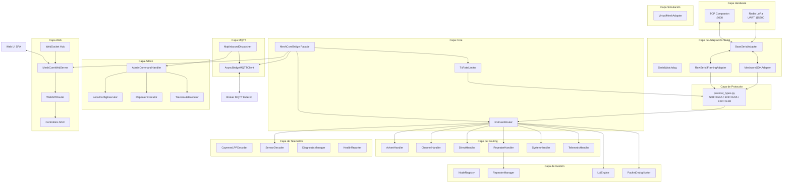
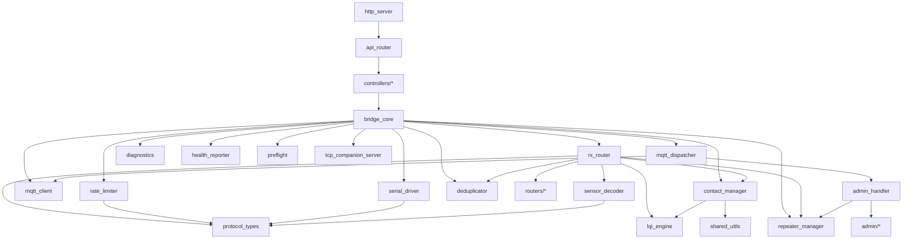
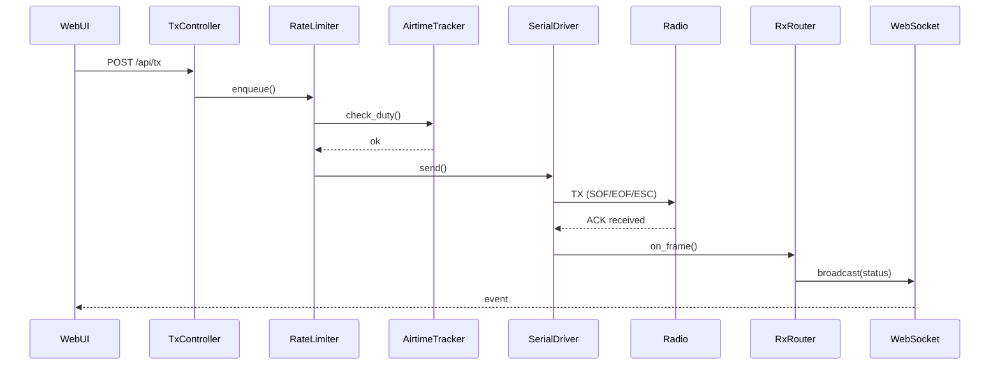
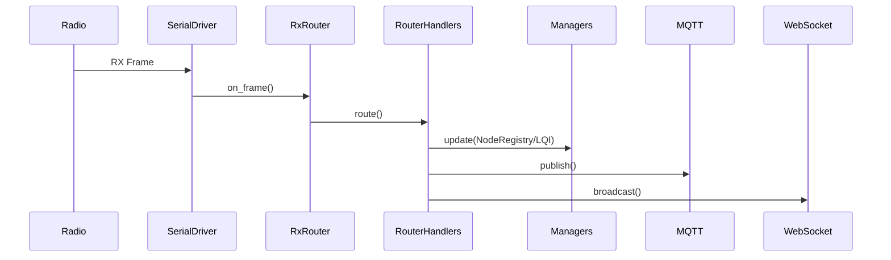
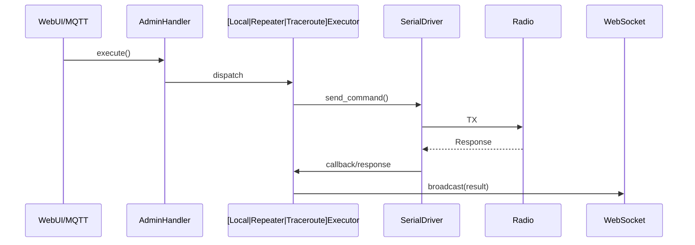
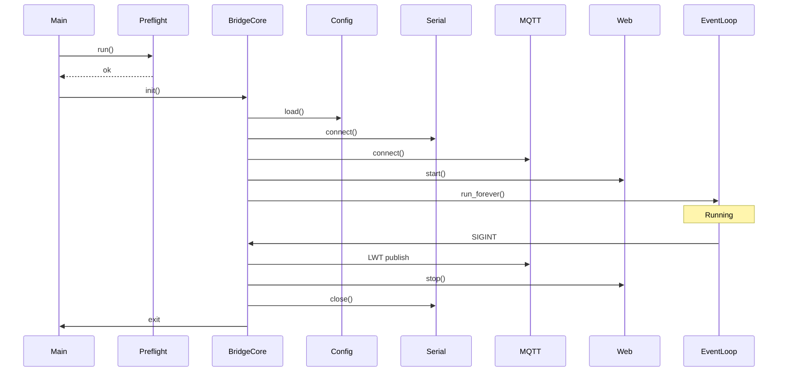

# Arquitectura de MeshCore Bridge v3.0

## 1. Resumen Ejecutivo
MeshCore Bridge v3.0 es una pasarela asíncrona avanzada que interconecta redes de radio LoRa (mediante protocolo serial en formato HDLC derivado con SOF/EOF) con infraestructuras IP a través de MQTT y una interfaz de usuario Web moderna (SPA). Construida sobre Python 3.10+ y la biblioteca `asyncio`, ofrece un puente bidireccional transparente, concurrente y resiliente entre mallas de radiofrecuencia (RF) y redes IP, todo sin depender de frameworks web pesados.

## 1.1 Mapas Interactivos de Arquitectura (Generados con Archify)
El sistema cuenta con mapas interactivos de alta fidelidad compilados determinísticamente con el motor [**Archify** (`tt-a1i/archify`)](https://github.com/tt-a1i/archify). Estos artefactos son completamente autónomos en **HTML + SVG**, no requieren conexión a internet y cuentan con soporte para tema Claro/Oscuro, modos visuales (*classic*, *signal-flow*, *blueprint*), zoom, paneo, búsqueda y capítulos guiados:

- 🗺️ [**Arquitectura General del Sistema (`meshcore_architecture.html`)**](diagrams/meshcore_architecture.html): Mapeo completo de subsistemas, capas de aislamiento, drivers serie, núcleo asyncio, persistencia y clientes IP.
- ⚡ [**Pipeline de Tramas LoRa a IP (`meshcore_packet_pipeline.html`)**](diagrams/meshcore_packet_pipeline.html): Flujo determinista paso a paso desde el paquete RF, framing HDLC, chequeo CRC-16, deduplicador, hasta el WebSocket Hub y broker MQTT.
- ⏱️ [**Secuencia Operativa Bidireccional (`meshcore_rx_tx_sequence.html`)**](diagrams/meshcore_rx_tx_sequence.html): Diagrama de secuencia temporal que ilustra la recepción reactiva de tramas y la ejecución de comandos administrativos Hop 0 con rate limiter.

> **Regeneración de diagramas**:
> Para compilar o validar los diagramas tras cualquier modificación arquitectónica, ejecute:
> ```bash
> python scripts/build_diagrams.py
> ```

## 2. Diagrama de Arquitectura General



## 3. Diagrama de Dependencias entre Módulos



## 4. Diagramas de Secuencia (Flujos Principales)

### 4.1 TX Completo (Transmisión a la red de Radio)



### 4.2 RX Completo (Recepción desde la red de Radio)



### 4.3 Comando de Administración (Local o Remoto)



### 4.4 Ciclo de Vida (Startup → Shutdown)



## 5. Catálogo de Clases Principales

| Nombre de clase | Módulo | Responsabilidad | Patrón | Dependencias |
| --- | --- | --- | --- | --- |
| `MeshCoreBridge` | `bridge_core.py` | Orquesta la aplicación uniendo MQTT, Web, Serial y Routers. | Facade | `serial_driver`, `rx_router`, `mqtt_client`, etc. |
| `BaseSerialAdapter` | `serial_driver.py` | Define la interfaz para interactuar con puertos serie o TCP. | Adapter | Ninguna explícita |
| `MeshcoreSDKAdapter` | `serial_driver.py` | Adapta la comunicación serie usando el SDK propietario. | Adapter | `protocol_types` |
| `RawSerialFramingAdapter` | `serial_driver.py` | Implementa el enmarcado serie crudo (SOF=0xAA, EOF=0x55, ESC=0x1B). | Adapter / Decorator | `protocol_types` |
| `SerialWatchdog` | `serial_driver.py` | Monitoriza el puerto serie y reinicia en caso de bloqueo. | Observer / Watchdog | `BaseSerialAdapter` |
| `RxEventRouter` | `rx_router.py` | Enruta mensajes recibidos de la radio a los handlers correctos. | Strategy / Router | `routers/*`, `contact_manager`, etc. |
| `TxRateLimiter` | `rate_limiter.py` | Controla la tasa de envío (Duty Cycle) a la red de radio. | Rate Limiter | `protocol_types` |
| `CustomTxQueue` | `rate_limiter.py` | Cola de prioridad asíncrona para la transmisión de paquetes. | Priority Queue | Ninguna |
| `AirtimeTracker` | `rate_limiter.py` | Rastrea el tiempo en el aire para limitar transmisiones. | Tracker | Ninguna |
| `NodeRegistry` | `contact_manager.py` | Gestiona el estado y directorio de nodos en memoria / disco. | Repository / Singleton | `lqi_engine` |
| `NodeContactInfo` | `contact_manager.py` | Estructura que almacena la información y métricas de un contacto en la malla. | DTO | Ninguna |
| `RepeaterManager` | `repeater_manager.py` | Controla repetidores, rutas, jerarquías y tablas de salto de la red. | Manager | Ninguna |
| `AsyncBridgeMQTTClient` | `mqtt_client.py` | Cliente asíncrono para publicar e interactuar con brokers MQTT. | Proxy / Client | Ninguna |
| `MqttInboundDispatcher` | `mqtt_dispatcher.py` | Escucha suscripciones MQTT y despacha a módulos u operaciones. | Dispatcher | `mqtt_client`, `admin_handler` |
| `PacketDeduplicator` | `deduplicator.py` | Evita la re-evaluación y retransmisión de paquetes duplicados vía Hash. | Cache | Ninguna |
| `AdminCommandHandler` | `admin_handler.py` | Interpreta, mapea y delega la ejecución de comandos de administración por Web/MQTT. | Command Invoker | `admin/*`, `repeater_manager` |
| `LocalConfigExecutor` | `admin/local_config_executor.py` | Ejecuta comandos de configuración en el nodo base local. | Command | `serial_driver` |
| `RepeaterExecutor` | `admin/repeater_executor.py` | Envía comandos remotos a repetidores vía RF. | Command | `serial_driver` |
| `TracerouteExecutor` | `admin/traceroute_executor.py` | Realiza pings progresivos e inspecciona rutas (Saltos L3). | Command | `serial_driver` |
| `CayenneLPPDecoder` | `sensor_decoder.py` | Convierte flujos de bytes Cayenne LPP a valores decimales estructurados. | Decoder | `protocol_types` |
| `LinkQualityEngine` | `lqi_engine.py` | Evalúa las condiciones SNR, RSSI y califica enlaces bidireccionales en la malla. | Engine | Ninguna |
| `DiagnosticManager` | `diagnostics.py` | Colecta métricas de OS, proceso y logs para reportes de salud avanzados. | Manager | Ninguna |
| `HealthReporter` | `health_reporter.py` | Monitorea la RAM, estado del hardware y publica un pulso periódico en MQTT. | Worker | `mqtt_client` |
| `MeshCoreWebServer` | `web/http_server.py` | Servidor HTTP nativo de asyncio para servir SPA, UI y WebSockets. | Server | `WebAPIRouter` |
| `WebAPIRouter` | `web/api_router.py` | Enrutador HTTP que dirige el tráfico a módulos tipo API de dominio. | Router / Dispatcher | `controllers/*` |
| `VirtualMeshAdapter` | `virtual_mesh.py` | Simula la interfaz de radio completa para pruebas de integración continua. | Mock / Adapter | Ninguna |
| `MeshCoreCompanionServer` | `tcp_companion_server.py`| Permite conectar radios remotamente mediante un túnel TCP (Proxy). | Server | Ninguna |
| `PacketBuffer` | `shared_utils.py` | Búfer rotatorio (Ring Buffer) que registra temporalmente los paquetes TX/RX. | Buffer | Ninguna |
| `TargetResolver` | `admin/target_resolver.py` | Convierte nombres lógicos, alias o strings cortos de ID en las pubkeys verdaderas de la malla. | Resolver | `NodeRegistry` |

## 6. Subpaquetes y Patrones de Diseño

- **`src/routers/`**: Utiliza el **Strategy Pattern** para enrutar los diferentes tipos de paquetes RF (`AdvertHandler`, `ChannelHandler`, `DirectHandler`, `RepeaterHandler`, `SystemHandler`, `TelemetryHandler`). Al desacoplar la lógica, simplifica la expansión del formato de los mensajes.
- **`src/admin/`**: Implementa un esquema de comandos basado en **Command Pattern** y **Strategy Pattern** para separar la lógica de parseo, de la ejecución en RF: (`LocalConfigExecutor`, `RepeaterExecutor`, `TracerouteExecutor`).
- **`src/web/controllers/`**: Sigue el patrón **MVC / Modular Controllers**. Organiza unívocamente las rutas REST por dominios funcionales (Contactos, Nodos, Sistema, Transmisiones).

## 7. Mapa de Endpoints REST API

| Método HTTP | Ruta | Controller | Descripción |
| --- | --- | --- | --- |
| GET | `/api/status` | `ConfigController` | Obtiene el estado físico y variables lógicas del nodo local. |
| GET | `/api/health` | `SystemController` | Reporta el estado de uso de memoria, disco, y CPU del servidor puente. |
| GET | `/api/diagnostics` | `SystemController` | Idéntico a `/api/health`. |
| GET | `/api/diagnostics/report.md` | `SystemController` | Genera un volcado completo de diagnósticos exportable en formato Markdown. |
| GET | `/api/preflight` | `SystemController` | Analiza disponibilidad de sistema de archivos, hardware y dependencias. |
| GET | `/api/system/logs/level` | `SystemController` | Obtiene el nivel de severidad de logs actual del módulo principal. |
| POST | `/api/system/logs/level` | `SystemController` | Altera en caliente la verbosidad global de logs del sistema (`INFO`, `DEBUG`, etc.). |
| DELETE | `/api/system/logs` | `SystemController` | Depura el historial de logs del sistema residentes en la memoria RAM del bridge. |
| GET | `/api/system/logs` | `SystemController` | Interfaz paginable para visualizar logs del sistema filtrables. |
| GET | `/api/packets/export` | `PacketsController` | Exportación JSON de todos los paquetes (TX/RX) capturados localmente. |
| DELETE | `/api/packets` | `PacketsController` | Purgado de historial en disco de la base de datos de paquetes LoRa. |
| GET | `/api/packets` | `PacketsController` | Interfaz de análisis paginada para la depuración forense RF del tráfico en aire. |
| GET | `/api/nodes` | `NodesController` | Devuelve el catálogo y lista maestra de nodos almacenados. |
| GET | `/api/lqi` | `NodesController` | Informe del índice Link Quality (LQI) entre vecinos en la malla local. |
| GET | `/api/analytics` | `NodesController` | Calcula KPIs agregados sobre topología, baterías promedio, etc. |
| GET | `/api/rf/heatmap` | `NodesController` | Datos tabulares de interconexión para generar el grafo L2. |
| GET | `/api/airtime/stats` | `NodesController` | Reporta los tiempos en el aire (Airtime) y métricas de Duty-Cycle. |
| GET | `/api/rf/noise` | `NodesController` | Procesa datos de ruido de fondo (SNR/RSSI de base) de nodos para el mapa en vivo. |
| GET | `/api/contacts/discovered` | `ContactsController` | Lista los nodos observados de manera anónima y pasiva, pero no añadidos a la agenda. |
| POST | `/api/contacts/accept` | `ContactsController` | Añade un nodo de la lista "Descubiertos" directamente al archivo permanente. |
| GET, POST... | `/api/contacts/*` | `ContactsController` | Manejo CRUD base para la agenda telefónica del nodo. |
| GET, POST... | `/api/channels/*` | `ChannelsController` | Manejo CRUD para perfiles o bandas de criptografía precompartida y frecuencia de canal de red. |
| POST | `/api/tx` | `TxController` | Comando de inyección directa de un mensaje de texto para salida al aire. |
| GET | `/api/messages/recent` | `TxController` | Lee y devuelve los mensajes textuales en memoria no consumidos en la base de datos local. |
| POST | `/api/admin/command` | `RepeaterController` | API universal de ingreso libre de cadenas de terminal CLI (Ej: `/help`, `/reboot`). |
| POST | `/api/admin/repeater` | `RepeaterController` | Invocador base que interactúa con la lógica central de repetición remota en el aire. |
| POST | `/api/repeater/remote/login` | `RepeaterController` | Generador de tokens de credenciales e inicialización de sesión remota de repetidor. |
| POST | `/api/repeater/remote/logout` | `RepeaterController` | Libera recursos y anula el inicio de sesión remoto. |
| POST | `/api/repeater/remote/config` | `RepeaterController` | Envía paquete de reconfiguración remota con comprobación criptográfica L3. |
| POST | `/api/repeater/remote/action` | `RepeaterController` | Ejecución de una acción instantánea en el dispositivo objetivo (e.g., LED Toggle). |
| POST | `/api/repeater/ping_zero` | `RepeaterController` | Lanza una petición ICMP análoga en L2 (Zero Ping) pura, descartando paquetes asimétricos. |
| POST | `/api/traceroute` | `RepeaterController` | Herramienta de medición y exploración de saltos entre el servidor y un destino remoto. |
| GET | `/api/config` | `ConfigController` | Provee en JSON las settings base grabadas en el firmware base local del puente. |
| POST | `/api/config` | `ConfigController` | Aplica una configuración estructural de manera unificada a variables de sistema y hardware. |
| POST | `/api/config/radio` | `ConfigController` | Refuerza cambios a las portadoras (BW, Frecuencia, Spreading Factor). |
| POST | `/api/config/identity` | `ConfigController` | Edita el pseudónimo del puente y propiedades de visualización pública. |
| POST | `/api/node/advert` | `ConfigController` | Desencadena una transmisión obligatoria a todos los nodos con los detalles de presencia y métricas. |
| POST | `/api/node/reboot` | `ConfigController` | Ordena apagado y encendido de MCU del módem RF adjunto al puente local. |
| GET | `/api/map/status` | `MapTileService` | Valida si el módulo local dispone de cartografía sin conexión funcional en el dispositivo base. |
| GET | `/api/map/tiles/...` | `MapTileService` | Despacho binario nativo (blob) para teselas OSM/Slippy pre-cachadas. |
| GET | `/api/telemetry` | `WebAPIRouter` | Recupera el buffer histórico (RAM) de variables métricas medioambientales procesadas. |
| GET | `/api/logs/download` | `WebAPIRouter` | Inicia una descarga física de los archivos de registro brutos del framework. |

## 8. Mapa de Eventos WebSocket

| Nombre del Evento | Dirección | Payload | Módulo Emisor / Responsable |
| --- | --- | --- | --- |
| `ping` / `pong` | Bidireccional | `{ type, timestamp }` | Servidor Python `MeshCoreWebServer` y Cliente Javascript para KeepAlive. |
| `metrics_update` | Server→Client | `node_count`, `rx_count`, `tx_count`, `error_rate`, `queue_depth`, `serial_connected` | Emitido por el ciclo interno periódico de `MeshCoreWebServer` (~cada 2 seg). |
| `system_log` | Server→Client | `level`, `message`, `source`, `timestamp` | Re-despachado por el registro en vivo desde `WebAPIRouter` y subsistema `DiagnosticManager`. |
| `rf_packet` | Server→Client | Headers crudos L2 interceptados, metadata LQI. | Enrutado nativo a través del hub originado en `RxEventRouter` post-parseo. |
| `ws_connected` | Server→Client | `message`, `timestamp` | Evento de handshake inicial en apertura confirmando vinculación con SPA local de UI. |
| Otros (ej: mensajes de chat) | Server→Client | Payload RF completo decodificado L3. | Capturados genéricamente y retransmitidos al `EventBus` (`EVENTS.RX_PACKET`) en la SPA UI. |

## 9. Tópicos MQTT Principales

| Tópico (`topic_prefix/...`) | Puente Publica | Puente Suscribe | Descripción |
| --- | --- | --- | --- |
| `{prefix}/bridge/state` | Sí | No | Estado Last Will Testament del servidor local (Online / Offline). |
| `{prefix}/bridge/health` | Sí | No | Telemetría periódica L7: Uso RAM OS local, Uptime y carga CPU. |
| `{prefix}/tx` | No | Sí | Inyección externa. Escucha strings para que el Puente enrute hacia un paquete LoRa a los nodos en la banda. |
| `{prefix}/tx/status` | Sí | No | Notificación de éxito o falla (ACK/NAK de capa L2/L3) al enviar el paquete a los nodos aéreos. |
| `{prefix}/admin/cmd` | No | Sí | Interfaz de administración remota; acepta comandos CLI puros. |
| `{prefix}/admin/status` | Sí | No | Proporciona una salida JSON formateada y serializada confirmando los comandos remotos al broker MQTT. |
| `{prefix}/admin/repeater/{node_id}/status` | Sí | No | Reportes específicos dirigidos que confirman latencias y estados de repetidores tras comandos remotos por RF. |
| `{prefix}/admin/repeater/{node_id}/ping_zero` | Sí | No | Información en tiempo real que documenta el nivel L2 (Zero Ping) y RF métricas hacia nodos concretos. |
| `{prefix}/admin/repeater/{node_id}/trace` | Sí | No | Rutas punto-a-punto decodificadas y saltos en formato Traceroute dirigidos al hub MQTT externo. |
| `{prefix}/{channel}/public` | Sí | No | Salidas del chat global encriptado a canales MQTT si la función de Forwarder está activa. |
