# Arquitectura del Sistema MeshCore Universal Bridge & Web Station (v3.0)

> **Documentación Técnica de Diseño, Módulos, Métodos y Flujos Asíncronos**  
> **Versión**: 3.0.0 (Arquitectura Modular de Alto Rendimiento con Servidor Web SPA, RF Packet Sniffer, Analytics y CayenneLPP)  
> **Patrón de Diseño**: Reactor Asíncrono Concurrente / Servidor Web Ligero Asíncrono / WebSocket Hub / Adaptador Serial Híbrido / Store & Forward Transaccional con TTL / Rate Limiter LoRa con Cola de Prioridades / Descodificador de Sensores IPSO / Registro Dinámico de Nodos con Analítica

---

## 1. Visión General y Diagrama de Arquitectura Modular

MeshCore Bridge opera como un middleware industrial sin bloqueo entre el hardware LoRa (USB-CDC / UART), la plataforma de automatización n8n (mediante MQTT) y los usuarios de campo a través de una **Interfaz Web SPA Moderna en Tiempo Real**.

```mermaid
flowchart TB
    subgraph HardwareLayer["Capa Hardware Embebido LoRa"]
        DEV["Dispositivo MeshCore (Heltec V3 / LilyGO T-Beam / RAK4631 / RP2040)"]
    end

    subgraph SerialSubsystem["Sub-sistema Serial (/src/serial_driver.py)"]
        WATCH["SerialWatchdog (Supervisión Activa & Keep-alive)"]
        ADAPTER{"BaseSerialAdapter (Patrón Adaptador)"}
        SDK_ADAPT["MeshcoreSDKAdapter (SDK meshcore_py Oficial)"]
        RAW_ADAPT["RawSerialFramingAdapter (pyserial-asyncio + De-framer)"]
        
        DEV <==>|UART 115200 8N1| ADAPTER
        ADAPTER -.->|Principal| SDK_ADAPT
        ADAPTER -.->|Fallback| RAW_ADAPT
        WATCH -.->|Monitorea inactividad| ADAPTER
    end

    subgraph CoreSubsystem["Orquestador Central (/src/bridge_core.py + componentes desacoplados)"]
        BRIDGE["MeshCoreBridge (Facade / Composition Root v3.0)"]
        RX_ROUTER["RxEventRouter (/src/rx_router.py)"]
        HEALTH["HealthReporter (/src/health_reporter.py)"]
        ADMIN["AdminCommandHandler (/src/admin_handler.py)"]
        MQTT_IN["MqttInboundDispatcher (/src/mqtt_dispatcher.py)"]
        HA_DISC["HomeAssistantDiscovery (/src/ha_discovery.py)"]
        PREFLIGHT["PreflightChecker (/src/preflight.py)"]
        REGISTRY["NodeRegistry (/src/contact_manager.py)"]
        REPEATER["RepeaterManager (/src/repeater_manager.py)"]
        LPP_DEC["CayenneLPPDecoder (/src/sensor_decoder.py)"]
        TYPES["Protocol Types Dataclasses (/src/protocol_types.py)"]
    end

    subgraph WebSubsystem["Capa de Servidor Web & Cliente SPA (/src/web/)"]
        HTTP_SRV["MeshCoreWebServer (Async HTTP 1.1 + WebSocket Hub)"]
        ROUTER["WebAPIRouter (REST API: /api/*)"]
        SPA["Cliente SPA (HTML5 Semántico + Vanilla CSS + ES6+)"]
        
        HTTP_SRV --> ROUTER
        SPA <==>|WebSocket /ws/live & REST| HTTP_SRV
    end

    subgraph TCPSubsystem["Capa TCP Companion Server (/src/tcp_companion_server.py)"]
        TCP_SRV["MeshCoreCompanionServer (Async TCP Socket :5000)"]
        APP_CLI["App Móvil Oficial MeshCore / CLI (Android, iOS, CLI)"]
        
        APP_CLI <==>|Framing 0x3C / 0x3E| TCP_SRV
    end

    subgraph StorageSubsystem["Capa de Resiliencia y Persistencia (/src/store_forward.py)"]
        DEDUP["PacketDeduplicator (RAM Sliding Window)"]
        SF_DB[("SQLiteStoreAndForward (Modo WAL + TTL Purge)")]
    end

    subgraph TransmissionSubsystem["Capa de Transmisión RF (/src/rate_limiter.py)"]
        PRIO_QUEUE["TxRateLimiter (asyncio.PriorityQueue)"]
        AIRTIME["Semtech Airtime Estimator (SF, BW, CR)"]
    end

    subgraph MQTTSubsystem["Capa de Comunicación MQTT (/src/mqtt_client.py)"]
        MQTT_CLIENT["AsyncBridgeMQTTClient (Paho-MQTT v2.x Bridged)"]
    end

    subgraph Consumers["Capa de Consumo y Automatización"]
        BROKER["Mosquitto MQTT Broker"]
        HA["Home Assistant Core"]
        N8N["Flujos de Automatización n8n"]
        BROWSER["Navegador Web / Smartphone"]
    end

    ADAPTER <==>|Eventos RX / TX Raw / Sniffer 0x88| BRIDGE
    BRIDGE <==> RX_ROUTER
    RX_ROUTER <==> REGISTRY
    RX_ROUTER <==> REPEATER
    RX_ROUTER <==> LPP_DEC
    BRIDGE <==> HEALTH
    BRIDGE <==> ADMIN
    BRIDGE <==> MQTT_IN
    BRIDGE <==> HA_DISC
    BRIDGE <==> PREFLIGHT
    BRIDGE <==> TYPES
    BRIDGE <==> DEDUP
    BRIDGE <==> SF_DB
    BRIDGE <==> PRIO_QUEUE
    PRIO_QUEUE <==> AIRTIME
    BRIDGE <==> MQTT_CLIENT
    BRIDGE <==> HTTP_SRV
    BRIDGE <==> TCP_SRV

    MQTT_CLIENT <==>|TCP 1883 / TLS| BROKER
    BROKER <==> N8N
    BROKER <==> HA
    HTTP_SRV <==>|HTTP :8080 / WS| BROWSER
```

---

## 2. Descripción de Componentes Principales (v3.0)

### 2.1 Servidor TCP Companion para Apps Oficiales (`src/tcp_companion_server.py`)
- **Servidor Socket TCP Asíncrono en Puerto 5000** (configurable y desactivable vía `TCP_SERVER_ENABLED`).
- **Framing Binario Nativo MeshCore**:
  - `0x3C` (`<`): Recepción de comandos de la aplicación hacia la radio (`CMD_APP_START`, `CMD_GET_CONTACTS`, `CMD_SEND_TXT_MSG`, `CMD_SEND_CHANNEL_TXT_MSG`, etc.).
  - `0x3E` (`>`): Emisión de respuestas y eventos hacia la aplicación (`SELF_INFO`, `CONTACT_START/END`, `CHANNEL_MSG_RECV`, `BATTERY`, etc.).
- **Compatibilidad**: Permite conectar la App Móvil oficial de MeshCore (Android/iOS) y el CLI oficial (`meshcore-cli -t <ip> -p 5000`) de forma transparente.

### 2.2 Servidor Web Asíncrono y WebSocket Hub (`src/web/http_server.py`)
- **Servidor HTTP 1.1 Nativo**: Despacha la aplicación SPA y los endpoints de la API REST sin dependencias pesadas.
- **WebSocket RFC 6455 Hub**: Canal bidireccional en `/ws/live` para streaming continuo de mensajes entrantes, telemetría y tramas capturadas en el aire.
- **CORS Preflight**: Soporte completo para peticiones `OPTIONS` retornando `204 No Content`.
- **Endurecimiento de Seguridad**: Aislamiento canónico contra Directory Traversal (`.resolve().is_relative_to()`), cabeceras `X-Content-Type-Options: nosniff`, `X-Frame-Options: DENY` y límite de cuerpo `MAX_BODY_SIZE` de 1 MB contra DoS.

### 2.3 Enrutador REST API (`src/web/api_router.py`)
Centraliza las operaciones del cliente web y herramientas externas:
- `/api/status`: Diagnóstico de salud, uptime, estado de enlaces y colas.
- `/api/nodes`: Directorio en vivo de nodos en la malla.
- `/api/analytics`: Resumen analítico con Top Nodos por Tráfico y Calidad SNR.
- `/api/sniffer/control` y `/api/sniffer/packets`: Control y consulta del interceptor de paquetes RF.
- `/api/system/logs`: Historial de registros del puente con filtrado de severidad.
- `/api/contacts` & `/api/channels`: Gestión de libreta de contactos y configuración de canales.
- `/api/tx`: Transmisión RF directa a canales públicos, privados o DMs.
- `/api/trace`: Lanzamiento de trazado de ruta de radio (Traceroute multi-hop).
- `/api/admin/command` & `/api/admin/repeater`: Ejecución de comandos administrativos locales y remotos.
- `/api/ha/status` & `/api/ha/publish`: Estado y publicación de Home Assistant Discovery.
- `/api/preflight`: Diagnósticos de infraestructura (Mosquitto, SQLite WAL, puerto serial/TCP).

### 2.3 Motor Home Assistant Discovery (`src/ha_discovery.py`)
- Genera metadatos JSON estándar en `homeassistant/sensor/#` y `homeassistant/binary_sensor/#`.
- Anuncia automáticamente sensores de Batería, Voltaje Solar, SNR, RSSI, Saltos para cada nodo descubierto y métricas de salud del puente.

### 2.4 Motor de Diagnósticos Preflight (`src/preflight.py`)
- Valida la disponibilidad del broker Mosquitto, la base de datos SQLite y el puerto serial o conexión TCP antes de arrancar.

### 2.5 Decodificador CayenneLPP (`src/sensor_decoder.py`)
Decodifica paquetes ambientales binarios (`GRP_DATA`, `TELEMETRY_RESPONSE`) convirtiendo los canales IPSO estándar en valores de ingeniería con unidades (Temperatura, Humedad, Presión, Voltaje, GPS, Acelerómetro).

### 2.6 Registro Dinámico de Nodos (`src/contact_manager.py`)
Mantiene una tabla en memoria con los nodos activos detectados en la malla con resolución $O(1)$ y cálculo de métricas en tiempo real.

### 2.7 Cliente MQTT Resiliente (`src/mqtt_client.py`)
- Conexión asíncrona con reconexión indefinida de 1s a 30s.
- Last Will & Testament (LWT) en `meshcore/bridge/state`.
- Store & Forward automático con transacciones WAL SQLite durante caídas de red.

---

## 3. Matriz de Tópicos MQTT para n8n y Home Assistant

| Tópico MQTT | Dirección | QoS | Retenido | Contenido / Payload |
| :--- | :--- | :--- | :--- | :--- |
| `meshcore/bridge/state` | Bridge $\to$ MQTT | 1 | Sí (LWT) | `{"status": "online" \| "offline", "timestamp": ...}` |
| `meshcore/bridge/health` | Bridge $\to$ MQTT | 0 | No | Métricas: uptime, serial, mqtt, known_mesh_nodes, queue_depth, tx/rx counts |
| `meshcore/rx/all` | Bridge $\to$ MQTT | 0 | No | Tópico unificado con todos los eventos de la malla en JSON |
| `meshcore/rx/telemetry` | Bridge $\to$ MQTT | 0 | No | Telemetría (batería, solar, temp, hum, presión, GPS, CayenneLPP) |
| `meshcore/rx/public` | Bridge $\to$ MQTT | 0 | No | Mensajes de texto en canal público / broadcast (Canal 0) |
| `meshcore/rx/channel/ch_{id}` | Bridge $\to$ MQTT | 0 | No | Mensajes de texto en canales secundarios cifrados |
| `meshcore/rx/direct/{node_id}` | Bridge $\to$ MQTT | 0 | No | Mensajes directos punto a punto dirigidos al nodo o reenviados |
| `meshcore/rx/nodes` | Bridge $\to$ MQTT | 0 | No | Anuncios de presencia, coordenadas GPS y versión de firmware |
| `meshcore/rx/log` | Bridge $\to$ MQTT | 0 | No | Streaming de tramas capturadas en el aire (Packet Sniffer 0x88) |
| `meshcore/tx` | n8n $\to$ Bridge | 1 | No | Solicitudes de emisión LoRa: `{"text": "...", "to": "...", "channel_idx": 0}` |
| `meshcore/tx/status` | Bridge $\to$ n8n | 1 | No | Confirmación de encolado/emisión y estado del rate limiter |
| `meshcore/admin/cmd` | n8n $\to$ Bridge | 1 | No | Comandos de administración local (`reboot`, `set_tx_power`, `list_nodes`) |
| `meshcore/admin/status` | Bridge $\to$ n8n | 1 | No | Resultado del comando administrativo local |
| `meshcore/admin/repeater/{id}/cmd` | n8n $\to$ Bridge | 1 | No | Comandos remotos a repetidores (`stats-radio`, `neighbors`, `log start`) |
| `meshcore/admin/repeater/{id}/status`| Bridge $\to$ n8n| 1 | No | Acuse y resultado del comando remoto a repetidor |
| `homeassistant/sensor/#` | Bridge $\to$ HA | 0 | Sí | Auto-Discovery para sensores de batería, voltaje, SNR, RSSI |
| `homeassistant/binary_sensor/#` | Bridge $\to$ HA | 0 | Sí | Auto-Discovery para sensor de estado Online/Offline del puente |
