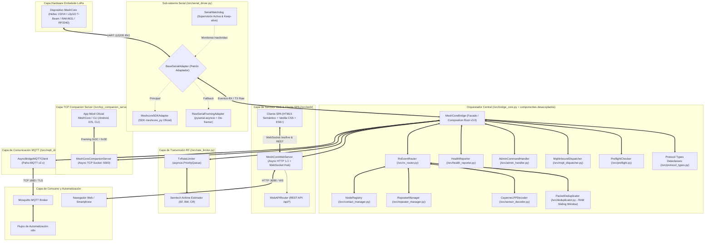

# Arquitectura del Sistema MeshCore Universal Bridge & Web Station (v3.0)

> **Documentación Técnica de Diseño, Módulos, Métodos y Flujos Asíncronos**  
> **Versión**: 3.0.0 (Arquitectura Modular Stateless de Alto Rendimiento con Servidor Web SPA, Analytics y CayenneLPP)  
> **Patrón de Diseño**: Reactor Asíncrono Concurrente / Servidor Web Ligero Asíncrono / WebSocket Hub / Adaptador Serial Híbrido / Deduplicación en RAM de Alta Velocidad (Sliding Window TTL) / Rate Limiter LoRa con Cola de Prioridades / Descodificador de Sensores IPSO / Registro Dinámico de Nodos con Analítica

---

## 1. Visión General y Diagrama de Arquitectura Modular

MeshCore Bridge opera como un middleware industrial sin bloqueo entre el hardware LoRa (USB-CDC / UART), la plataforma de automatización n8n (mediante MQTT) y los usuarios de campo a través de una **Interfaz Web SPA Moderna en Tiempo Real**.

---

## 2. Descripción de Componentes Principales (v3.0)

### 2.1 Servidor TCP Companion para Apps Oficiales (`src/tcp_companion_server.py`)
- **Servidor Socket TCP Asíncrono en Puerto 5000** (configurable y desactivable vía `TCP_SERVER_ENABLED`).
- **Framing Binario Nativo MeshCore**:
  - `0x3C` (`<`): Recepción de comandos de la aplicación hacia la radio (`CMD_APP_START`, `CMD_GET_CONTACTS`, `CMD_SEND_TXT_MSG`, `CMD_SEND_CHANNEL_TXT_MSG`, etc.).
  - `0x3E` (`>`): Emisión de respuestas y eventos hacia la aplicación (`SELF_INFO`, `CONTACT_START/END`, `CHANNEL_MSG_RECV`, `BATTERY`, etc.).
- **Compatibilidad**: Permite conectar la App Móvil oficial de MeshCore (Android/iOS) y el CLI oficial (`meshcore-cli -t <ip> -p 5000`) de forma transparente.

### 2.2 Servidor Web Asíncrono y WebSocket Hub (`src/web/http_server.py`)
- **Servidor HTTP 1.1 Nativo**: Despacha la aplicación SPA y los endpoints de la API REST sin dependencias pesadas ni frameworks bloqueantes.
- **WebSocket RFC 6455 Hub**: Canal bidireccional en `/ws` para streaming continuo de mensajes entrantes, telemetría y estado de la malla.
  - **Soporte Same-Origin & Red Local**: Validación automática de orígenes LAN (`192.168.*`, `10.*`, `172.16-31.*`) y Same-Origin contra `Host`.
  - **Heartbeat Keepalive**: Ping/Pong activo cada 15s y tramas WebSocket Ping (`0x89`) ante inactividad.
- **CORS Preflight**: Soporte completo para peticiones `OPTIONS` retornando `204 No Content`.
- **Autenticación API Key**: Middleware de validación para cabecera `X-Api-Key` contra `BRIDGE_API_KEY` protegiendo `/api/tx`, `/api/node/reboot`, `/api/admin/*` y `/api/repeater/*`.
- **Endurecimiento de Seguridad**: Aislamiento canónico contra Directory Traversal (`.resolve().is_relative_to()`), cabeceras `Content-Security-Policy`, `X-Content-Type-Options: nosniff`, `X-Frame-Options: DENY` y límite de cuerpo `MAX_BODY_SIZE` de 1 MB contra DoS.

### 2.3 Enrutador REST API (`src/web/api_router.py`)
Centraliza las operaciones del cliente web y herramientas externas con soporte de paginación (`limit`, `offset`):
- `/api/status`: Diagnóstico de salud, uptime, estado de enlaces y colas.
- `/api/nodes`: Directorio en vivo de nodos en la malla con deduplicación estricta de la estación local.
- `/api/analytics`: Resumen analítico con Top Nodos por Tráfico y Calidad SNR.
- `/api/system/logs`: Historial de registros del puente con filtrado de severidad y paginación.
- `/api/contacts` & `/api/channels`: Gestión de libreta de contactos y configuración de canales.
- `/api/tx`: Transmisión RF directa a canales públicos, privados o DMs.
- `/api/trace`: Lanzamiento de trazado de ruta de radio (Traceroute multi-hop).
- `/api/admin/command` & `/api/admin/repeater`: Ejecución de comandos administrativos locales y remotos.
- `/api/preflight`: Diagnósticos de infraestructura (Mosquitto, puerto serial/TCP, servidor Companion).

### 2.4 Deduplicador de Paquetes en Memoria RAM (`src/deduplicator.py`)
- Estructura `PacketDeduplicator` protegida con `asyncio.Lock` y `threading.Lock` para concurrencia thread-safe.
- Elimina ecos RF y retransmisiones duplicadas en tiempo constante $O(1)$ sin incurrir en I/O de disco.

### 2.5 Motor de Diagnósticos Preflight (`src/preflight.py`)
- Valida la disponibilidad del broker Mosquitto, el puerto serial o conexión TCP y el servidor TCP Companion antes de arrancar.

### 2.6 Decodificador CayenneLPP (`src/sensor_decoder.py`)
- Decodifica paquetes ambientales binarios (`GRP_DATA`, `TELEMETRY_RESPONSE`) utilizando `pycayennelpp>=2.0.0` (v2.4.0) y un fallback determinista. Convierte canales IPSO estándar en valores de ingeniería con unidades (Temperatura, Humedad, Presión, Voltaje, GPS, Acelerómetro, Luminosidad).

### 2.7 Registro Dinámico de Nodos (`src/contact_manager.py`)
- Mantiene una tabla en memoria con los nodos activos detectados en la malla con resolución $O(1)$, deduplicación unificada de la estación base local y cálculo de métricas LQI (Link Quality Index).

#### 2.7.1 Invariante de Unicidad y Conteo de Nodos (Anti-Duplicación de Nodo Local)
Para garantizar que el conteo de nodos en la malla refleje con fidelidad absoluta los nodos físicos sin duplicar la estación base local:
1. **Unicidad de Clave Canónica**: `NodeRegistry` mantiene un único registro para la estación local bajo `_local_pubkey`. Cuando se actualiza la clave pública local (`set_local_pubkey`) o se reciben tramas con prefijos del propio hardware (`is_local_key`), cualquier entrada previa se fusiona de inmediato y las claves residuales se purgan de `_nodes_by_key`.
2. **Conteo SSoT**: El método `get_count()` delega obligatoriamente en `len(list_nodes())`, aplicando las mismas reglas de deduplicación de prefijos ($\ge 6$ caracteres) y unicidad local que la API REST y el streaming WebSocket.
3. **Persistencia Limpia**: Al guardar en disco (`save_to_file`), únicamente se serializan los nodos devueltos por `list_nodes()`, evitando que duplicados efímeros queden fijados en `data/node_registry.json`.
4. **Deduplicación Reactiva en Frontend**: `app.js` (`renderNodesDirectory`) centraliza en `this.knownNodes` únicamente claves canónicas resueltas, fusiona la estación local contra `localNodePubkey` / `localNodeName` y sincroniza el chip `#headerNodeCount` y los filtros de cuadrícula con el conteo deduplicado real.

#### 2.7.2 Fronteras de Rol y Restricciones Inmutables de Contactos y Mensajería
1. **Aislamiento de Repetidores de la Libreta de Contactos**:
   - Los repetidores son infraestructura de transporte y **nunca se registran en la libreta cliente de Contactos (`#tab-contacts`)**.
   - **Prohibición de Chat**: Queda prohibido el envío de mensajes de texto / chat (DM o Canales) hacia repetidores. Su interacción está limitada a gestión administrativa (`🎛️ Administrar`), sondeo de enlace (`🎯 Ping`), trazado multi-salto (`🗺️ Ruta`) y telemetría.
2. **Aislamiento del Nodo Local**:
   - La estación base local nunca aparece en la libreta de Contactos ni admite el envío de mensajería hacia su propia clave pública.
3. **Mapeo Canónico con la Pila Oficial MeshCore**:
   - Todo dispositivo se clasifica de acuerdo con `FirmwareAdvertType` (`NONE/CHAT` = `CLIENT`, `REPEATER` = `REPEATER`, `ROOM` = `ROOM`, `SENSOR` = `SENSOR`), garantizando que la telemetría periódica no degrade el rol de repetidores de infraestructura.

### 2.8 Cliente MQTT Resiliente (`src/mqtt_client.py`)
- Conexión asíncrona compatible con `paho-mqtt` 2.x y `ReasonCode`.
- Reconexión indefinida de 1s a 30s.
- Last Will & Testament (LWT) en `meshcore/bridge/state`.

---

## 3. Matriz de Tópicos MQTT para n8n

| Tópico MQTT | Dirección | QoS | Retenido | Contenido / Payload |
| :--- | :--- | :--- | :--- | :--- |
| `meshcore/bridge/state` | Bridge $\to$ MQTT | 1 | Sí (LWT) | `{"status": "online" \| "offline", "timestamp": ...}` |
| `meshcore/bridge/health` | Bridge $\to$ MQTT | 0 | No | Métricas: uptime, serial, mqtt, known_mesh_nodes, queue_depth, tx/rx counts |
| `meshcore/rx/all` | Bridge $\to$ MQTT | 0 | No | Tópico unificado con todos los eventos de la malla en JSON |
| `meshcore/rx/telemetry` | Bridge $\to$ MQTT | 0 | No | Telemetría (batería, solar, temp, hum, presión, GPS, CayenneLPP) |
| `meshcore/rx/public` | Bridge $\to$ MQTT | 0 | No | Mensajes de texto en canal público / broadcast (Canal 0) |
| `meshcore/rx/channel/ch_{id}` | Bridge $\to$ MQTT | 0 | No | Mensajes de texto en canales secundarios cifrados |
| `meshcore/rx/direct/{node_id}` | Bridge $\to$ MQTT | 0 | No | Mensajes directos punto a punto dirigidos al nodo o reenviados |
| `meshcore/rx/nodes` | Bridge $\to$ MQTT | 0 | No | Anuncios de presencia, coordenadas GPS y versión de firmware |
| `meshcore/tx` | n8n $\to$ Bridge | 1 | No | Solicitudes de emisión LoRa: `{"text": "...", "to": "...", "channel_idx": 0}` |
| `meshcore/tx/status` | Bridge $\to$ n8n | 1 | No | Confirmación de encolado/emisión y estado del rate limiter |
| `meshcore/admin/cmd` | n8n $\to$ Bridge | 1 | No | Comandos de administración local (`reboot`, `set_tx_power`, `list_nodes`) |
| `meshcore/admin/status` | Bridge $\to$ n8n | 1 | No | Resultado del comando administrativo local |
| `meshcore/admin/repeater/{id}/cmd` | n8n $\to$ Bridge | 1 | No | Comandos remotos a repetidores (`stats-radio`, `neighbors`) |
| `meshcore/admin/repeater/{id}/status`| Bridge $\to$ n8n| 1 | No | Acuse y resultado del comando remoto a repetidor |
