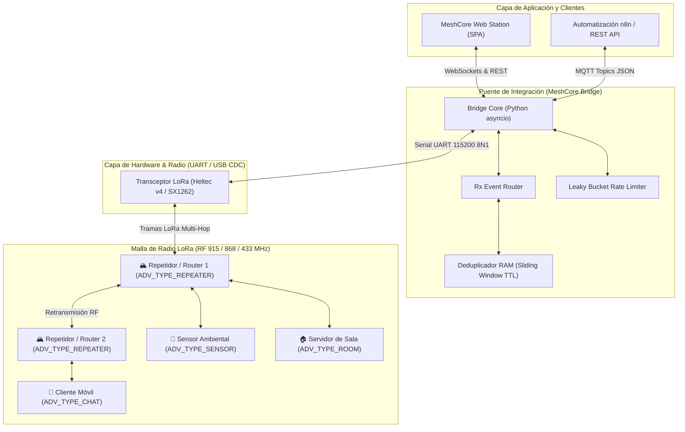

# Especificación Formal del Protocolo MeshCore (UART / LoRa / MQTT)

> **Documento Oficial de Contrato de Interfaz**  
> **Single Source of Truth (SSoT) de Protocolo para Agentes de Antigravity**  
> **Versión**: 3.0.0 (Actualización Integral)  
> **Fuentes Oficiales**:
> - Documentación Oficial: [docs.meshcore.io](https://docs.meshcore.io/) | [meshcore.io](https://meshcore.io)
> - Repositorio Oficial en GitHub: [github.com/meshcore-dev/MeshCore](https://github.com/meshcore-dev/MeshCore)
> - SDK Oficial en Python: [github.com/meshcore-dev/meshcore_py](https://github.com/meshcore-dev/meshcore_py)
> - CLI Oficial: [github.com/meshcore-dev/meshcore_cli](https://github.com/meshcore-dev/meshcore_cli)
> **Firmware Target**: MeshCore Firmware v1.17+ / Companion USB  
> **Microcontroladores Soportados**: ESP32-S3, ESP32-C3, nRF52840, RP2040, STM32 (ARM Cortex-M / RISC-V)  
> **Módulos de Radio LoRa**: Semtech SX1262, SX1268, SX1276, LR1121  

---

## 1. Arquitectura del Ecosistema MeshCore

MeshCore es un protocolo y firmware de código abierto para redes de malla (*mesh networking*) descentralizadas y de bajo consumo mediante modulación LoRa. Permite la comunicación resiliente fuera de red (*off-grid*) entre estaciones base, clientes móviles y repetidores de infraestructura.



---

## 2. Capa Física y Transporte Serial (Host $\leftrightarrow$ Radio)

| Parámetro | Configuración Estándar | Notas Técnicas de Implementación |
| :--- | :--- | :--- |
| **Baud Rate** | `115200` bps | Configuración estándar en bridges USB-CDC, UART hardware y CP2102/CH340/CH9102 |
| **Data Bits** | `8` | Byte estándar sin paridad |
| **Parity** | `None` (N) | Sin comprobación de paridad |
| **Stop Bits** | `1` | Formato 8N1 |
| **Flow Control** | `None` | Control por software con watchdog y heartbeats activos |
| **Inter-byte Timeout** | `20 ms` | Tiempo límite para delimitar tramas en flujos continuos |
| **Endianness** | `Little-Endian` (LE) | Todos los valores enteros (`uint16_t`, `uint32_t`, `int32_t`, coordenadas GPS) |

---

## 3. Delimitación de Tramas Seriales y Byte Stuffing

Para asegurar que los flujos seriales continuos no interpreten datos arbitrarios como inicio/fin de trama, se aplica **Byte Stuffing (Escaping)** determinista:

```text
+------+--------+--------+------------+----------+-------+------------+--------------------+-------+------+
| SOF  | OpCode | SeqNum | Src NodeID | Dst Node | Flags | Length (L) | Payload (0..256 B) | CRC16 | EOF  |
| 1 B  |  1 B   |  1 B   |    2 B     |   2 B    |  1 B  |    2 B     |      L Bytes       |  2 B  | 1 B  |
+------+--------+--------+------------+----------+-------+------------+--------------------+-------+------+
```

### Constantes de Framing
```c
#define MESHCORE_SOF          0xAA   // Start of Frame
#define MESHCORE_EOF          0x55   // End of Frame
#define MESHCORE_ESC          0x1B   // Escape Byte
#define MESHCORE_ESC_MASK     0x20   // XOR Mask aplicada a bytes escapados
#define MESHCORE_BROADCAST_ID 0xFFFF // Dirección de difusión pública (Canal 0)
#define MESHCORE_MAX_PAYLOAD  256    // Tamaño máximo de payload
```

### Reglas de Escapado:
- **Serialización**: Si un byte en el flujo (Payload o CRC) equivale a `0xAA`, `0x55` o `0x1B`, se reemplaza por `[0x1B, Byte ^ 0x20]`.
- **Deserialización**: Al recibir `0x1B`, el siguiente byte se decodifica como `Byte ^ 0x20`.

---

## 3.1 Protocolo Companion Oficial (WiFi / TCP Socket en Puerto 5000)

Para la interacción directa con la **App Móvil oficial de MeshCore (Android/iOS)**, el SDK Python (`meshcore_py`) y el CLI (`meshcore_cli`), el firmware y el bridge exponen un servidor de sockets TCP en el puerto `5000` con el siguiente formato de trama binaria:

### Trama de Aplicación a Radio (Comandos TX: Cliente $\rightarrow$ Bridge/Radio)
```text
+-------------------+----------------------------+------------------------+
| Start Byte (0x3C) | Length (uint16_le, 2 B)    | Command Payload        |
| '<' (1 Byte)      | Len = len(Payload)         | (Len Bytes)            |
+-------------------+----------------------------+------------------------+
```

### Trama de Radio a Aplicación (Eventos/Respuestas RX: Bridge/Radio $\rightarrow$ Cliente)
```text
+-------------------+----------------------------+------------------------+
| Start Byte (0x3E) | Length (uint16_le, 2 B)    | Event/Response Payload |
| '>' (1 Byte)      | Len = len(Payload)         | (Len Bytes)            |
+-------------------+----------------------------+------------------------+
```

* **Límite de seguridad**: `MAX_FRAME_SIZE = 512` bytes.
* **Comandos Principales**: `0x01` (`CMD_APP_START`), `0x02` (`CMD_SEND_TXT_MSG`), `0x03` (`CMD_SEND_CHANNEL_TXT_MSG`), `0x04` (`CMD_GET_CONTACTS`), `0x14` (`CMD_GET_BATT_AND_STORAGE`), `0x1F` (`CMD_GET_CHANNEL`).
* **Eventos/Respuestas Principales**: `0x00` (`PACKET_OK`), `0x02` (`CONTACT_START`), `0x03` (`CONTACT`), `0x04` (`CONTACT_END`), `0x05` (`SELF_INFO`), `0x06` (`MSG_SENT`), `0x08` (`CHANNEL_MSG_RECV`), `0x0C` (`BATTERY`), `0x80` (`ADVERTISEMENT`), `0x88` (`LOG_DATA`).

---

## 4. Algoritmo de Integridad (CRC-16 CCITT)

El CRC protege los bytes desde `OpCode` hasta el final del `Payload` (antes de aplicar escaping):
- **Polinomio**: $0x1021$ ($x^{16} + x^{12} + x^5 + 1$)
- **Valor Inicial**: $0xFFFF$
- **XOR Salida**: $0x0000$

```c
uint16_t meshcore_crc16_ccitt(const uint8_t *data, size_t length) {
    uint16_t crc = 0xFFFF;
    for (size_t i = 0; i < length; ++i) {
        crc ^= ((uint16_t)data[i] << 8);
        for (int b = 0; b < 8; ++b) {
            if (crc & 0x8000) {
                crc = (crc << 1) ^ 0x1021;
            } else {
                crc = (crc << 1);
            }
        }
    }
    return crc;
}
```

---

## 5. Roles y Tipos de Nodo en MeshCore (`AdvertDataHelpers.h`)

En el firmware oficial de MeshCore, los nodos anuncian explícitamente su rol mediante el campo binario `type` (1 byte):

```c
#define ADV_TYPE_NONE         0   // 0x00: Nodo anónimo o no configurado
#define ADV_TYPE_CHAT         1   // 0x01: Cliente interactivo / Companion de Chat
#define ADV_TYPE_REPEATER     2   // 0x02: Repetidor / Router de Malla (Infraestructura)
#define ADV_TYPE_ROOM         3   // 0x03: Servidor de Sala / BBS Compartido
#define ADV_TYPE_SENSOR       4   // 0x04: Nodo Sensor de Telemetría Ambiental
```

### Diferencias Clave entre Roles:
1. **`ADV_TYPE_CHAT (1)`**: Estación cliente o app móvil con usuario humano. Puede recibir mensajes directos (DMs) y participar en canales abiertos o cifrados.
2. **`ADV_TYPE_REPEATER (2)`**: Nodo de infraestructura instalado en torres, montañas o techos. Reenvía paquetes multi-hop basándose en el conteo de saltos (`hops`), calcula rutas de retorno y responde a comandos remotos de administración (`admin/repeater`).
3. **`ADV_TYPE_ROOM (3)`**: Servidor de canal grupal persistente que almacena mensajes para clientes que se conectan intermitentemente.
4. **`ADV_TYPE_SENSOR (4)`**: Dispositivo autónomo de telemetría que transmite datos meteorológicos o de estado mediante paquetes CayenneLPP.

---

## 6. Enrutamiento y Capa de Paquete LoRa (`Packet.h`)

### Tipos de Enrutamiento de Transporte:
```c
#define ROUTE_TYPE_TRANSPORT_FLOOD   0x00  // Inundación en capa de transporte
#define ROUTE_TYPE_FLOOD             0x01  // Inundación estándar (Broadcast)
#define ROUTE_TYPE_DIRECT            0x02  // Enrutamiento directo por tabla de saltos
#define ROUTE_TYPE_TRANSPORT_DIRECT  0x03  // Transporte directo punto a punto
```

### Tipos de Payload Wire:
```c
#define PAYLOAD_TYPE_REQ             0x00  // Solicitud general
#define PAYLOAD_TYPE_RESPONSE        0x01  // Respuesta a solicitud
#define PAYLOAD_TYPE_TXT_MSG         0x02  // Mensaje de texto directo o canal
#define PAYLOAD_TYPE_ACK             0x03  // Confirmación de entrega
#define PAYLOAD_TYPE_ADVERT          0x04  // Anuncio de nodo / presencia
#define PAYLOAD_TYPE_GRP_TXT         0x05  // Mensaje de texto grupal
#define PAYLOAD_TYPE_GRP_DATA        0x06  // Datos binarios grupales
#define PAYLOAD_TYPE_ANON_REQ        0x07  // Solicitud anónima
#define PAYLOAD_TYPE_PATH            0x08  // Información de ruta / saltos
#define PAYLOAD_TYPE_TRACE           0x09  // Rastreo de ruta RF (Traceroute)
#define PAYLOAD_TYPE_MULTIPART       0x0A  // Paquete fragmentado
#define PAYLOAD_TYPE_CONTROL         0x0B  // Control de radio / red
#define PAYLOAD_TYPE_RAW_CUSTOM      0x0F  // Datos en bruto personalizados / Sniffer
```

---

## 7. Estructura Binaria de la Libreta de Contactos (`Contact Data`)

Cada registro de contacto en el firmware de MeshCore y el SDK en Python tiene un layout de **147 bytes**:

| Offset (Bytes) | Campo | Tipo de Dato | Descripción |
| :--- | :--- | :--- | :--- |
| `+00 .. +31` | `public_key` | `uint8_t[32]` | Clave pública hexadecimal única de 32 bytes (Ed25519) |
| `+32` | `type` | `uint8_t` | Rol del nodo (`ADV_TYPE_CHAT=1`, `REPEATER=2`, etc.) |
| `+33` | `flags` | `uint8_t` | Banderas de estado (favorito, mute, auto-add) |
| `+34` | `out_path_len` | `uint8_t` | Longitud de la ruta de salida y modo de hash (6 bits LSB: len, 2 bits MSB: hash mode) |
| `+35 .. +98` | `out_path` | `uint8_t[64]` | Secuencia fija de hashes de salto de salida (NUL-padded) |
| `+99 .. +130` | `adv_name` | `char[32]` | Nombre o alias descriptivo del nodo (UTF-8, NUL-padded) |
| `+131 .. +134`| `last_advert` | `uint32_t` (LE) | Timestamp UNIX del último anuncio recibido |
| `+135 .. +138`| `adv_lat` | `int32_t` (LE) | Latitud GPS en microgrados ($\text{lat} \times 10^6$) |
| `+139 .. +142`| `adv_lon` | `int32_t` (LE) | Longitud GPS en microgrados ($\text{lon} \times 10^6$) |
| `+143 .. +146`| `lastmod` | `uint32_t` (LE) | Timestamp de última modificación local |

---

## 8. Estructura Binaria de Canales LoRa

MeshCore soporta hasta **8 canales concurrentes** (Canales 0 al 7):

| Canal | Tipo | Descripción | Cifrado |
| :--- | :--- | :--- | :--- |
| **Ch 0** | `PUBLIC_BROADCAST` | Canal público por defecto (`Public / Broadcast`) | Sin cifrado (Abierto) |
| **Ch 1 .. 7** | `SECONDARY_PRIVATE` | Canales secundarios tácticos, de sensores o emergencias | Cifrado simétrico AES-128 con clave PSK |

### Formato de Canal:
- **`index`** (`uint8_t`): 0 a 7.
- **`name`** (`char[32]`): Nombre UTF-8 del canal.
- **`psk`** (`uint8_t[16]` o hex string de 32 caracteres): Clave precompartida AES-128.

---

## 9. Comandos Seriales Host $\leftrightarrow$ Radio (`CommandType` y `PushCode`)

### Comandos del Host hacia la Radio (`packets.py`):
| Código | OpCode | Descripción |
| :--- | :--- | :--- |
| `0x01` | `APP_START` | Inicializa la sesión y consulta capabilities del hardware |
| `0x02` | `SET_RADIO` | Configura frecuencia (Hz), BW (kHz), SF y CR |
| `0x03` | `SET_PARAMS` | Modifica potencia TX (dBm), Hop Limit y timeouts |
| `0x04` | `GET_CONTACTS` | Solicita la descarga de la libreta de contactos almacenada |
| `0x05` | `SEND_TXT_MSG` | Transmite mensaje de texto directo hacia una clave pública |
| `0x06` | `SEND_CHAN_MSG` | Transmite mensaje de texto hacia un índice de canal |
| `0x07` | `SET_CHANNEL` | Guarda o actualiza un canal (índice, nombre, clave PSK) |
| `0x08` | `SEND_DEVICE_QUERY` | Consulta telemetría de hardware, versión y voltaje |
| `0x09` | `UPDATE_CONTACT` | Añade o actualiza un contacto en la memoria flash |
| `0x0D` | `RESET_PATH` | Reinicia la ruta de saltos guardada para un nodo |
| `0x0F` | `REMOVE_CONTACT` | Elimina un contacto de la memoria flash del nodo |
| `0x10` | `SHARE_CONTACT` | Comparte una tarjeta de contacto por radio |
| `0x11` | `EXPORT_CONTACT` | Genera URI `meshcore://contact?...` del nodo o contacto |
| `0x12` | `IMPORT_CONTACT` | Importa una tarjeta de contacto desde datos binarios o URI |
| `0x1E` | `GET_CONTACT_BY_KEY` | Consulta un contacto específico por su clave pública |
| `0x3A` | `SET_AUTOADD_CONFIG` | Configura la máscara de auto-adición de nodos |

### Códigos de Notificación Push (Radio $\to$ Host):
| Código | Mnemónico | Descripción |
| :--- | :--- | :--- |
| `0x80` | `PUSH_CODE_ADVERT` | Anuncio de nodo recibido por RF |
| `0x81` | `PUSH_CODE_MSG` | Mensaje directo entrante recibido |
| `0x82` | `PUSH_CODE_ANON_REQ` | Solicitud anónima de descubrimiento |
| `0x86` | `PUSH_CODE_NEW_ADVERT` | Nuevo nodo descubierto que no estaba en libreta |
| `0x88` | `PUSH_CODE_RAW_CUSTOM` | Trama RF en bruto interceptada (Sniffer / Logs) |
| `0x89` | `PUSH_CODE_TRACE` | Respuesta de trazado de ruta de radio |
| `0x8A` | `PUSH_CODE_CHANNEL_MSG`| Mensaje recibido en canal público o privado |

---

## 10. Telemetría Ambiental (Formato CayenneLPP)

MeshCore empaqueta lecturas de sensores ambientales utilizando el estándar binario **CayenneLPP**:

| Sensor | Tipo de Canal | Tamaño (Bytes) | Resolución | Fórmula de Decodificación |
| :--- | :--- | :--- | :--- | :--- |
| **Temperatura** | `0x67` | 2 Bytes (`int16_t` BE) | $0.1\,^\circ\text{C}$ | $\text{Temp}(^\circ\text{C}) = \frac{\text{raw}}{10.0}$ |
| **Humedad Relativa** | `0x68` | 1 Byte (`uint8_t`) | $0.5\,\%$ | $\text{Hum}(\%) = \text{raw} \times 0.5$ |
| **Presión Barométrica** | `0x73` | 2 Bytes (`uint16_t` BE) | $0.1\,\text{hPa}$ | $\text{Presión}(\text{hPa}) = \frac{\text{raw}}{10.0}$ |
| **Voltaje de Batería** | `0x02` | 2 Bytes (`uint16_t` BE) | $0.01\,\text{V}$ | $\text{Voltaje}(\text{V}) = \frac{\text{raw}}{100.0}$ |
| **GPS / Posición** | `0x88` | 9 Bytes (Lat: 3B, Lon: 3B, Alt: 3B) | $0.0001^\circ$ | $\text{Lat} = \frac{\text{raw}}{10000.0},\, \text{Lon} = \frac{\text{raw}}{10000.0}$ |

---

## 11. Esquema de Tópicos MQTT para Integración con n8n

| Tópico MQTT | Dirección | Formato de Payload JSON |
| :--- | :--- | :--- |
| `meshcore/rx/all` | Bridge $\to$ MQTT | Payload unificado con métricas RF (`rssi`, `snr`), `event_type`, `sender` y `timestamp` |
| `meshcore/rx/public` | Bridge $\to$ MQTT | Mensajes del Canal 0 público |
| `meshcore/rx/channel/ch_{idx}`| Bridge $\to$ MQTT | Mensajes filtrados por índice de canal (`ch_1`, `ch_2`, etc.) |
| `meshcore/rx/direct/{pubkey}` | Bridge $\to$ MQTT | Mensajes directos punto a punto dirigidos al nodo |
| `meshcore/rx/telemetry` | Bridge $\to$ MQTT | Lecturas de sensores decodificadas (`temperature_c`, `humidity_pct`, `pressure_hpa`, `battery`) |
| `meshcore/tx` | n8n $\to$ Bridge | Solicitud de transmisión: `{"text": "hola", "target": "broadcast", "channel_idx": 0}` |
| `meshcore/tx/status` | Bridge $\to$ MQTT | ACK de envío: `{"status": "sent", "request_id": "req-1", "timestamp": "..."}` |
| `meshcore/admin/cmd` | n8n $\to$ Bridge | Comando de administración: `{"action": "stats-radio", "target_node": "a1b2c3..."}` |
