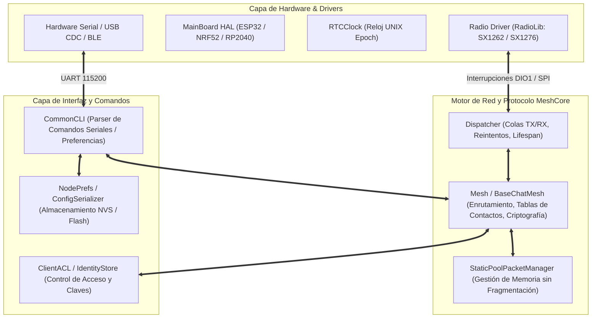

# MeshCore Firmware C/C++ — Análisis Técnico y Estructura Interna

> **Documento de Referencia para Agentes de Antigravity**  
> **Repositorio de Origen**: [`/reference/meshcore`](file:///c:/Users/Ruby/Desktop/meshcore-bridge/reference/meshcore)  
> **Área de Responsabilidad**: Protocol & Firmware Investigator Agent  
> **Estándar**: C++11 / Arduino / PlatformIO / FreeRTOS (ESP32, NRF52840, RP2040, STM32)

---

## 1. Visión General del Firmware

MeshCore es un firmware embebido de alto rendimiento para redes malladas (Mesh) sobre radio LoRa (SX1262, SX1268, SX1276, SX1278, LR1121). Proporciona routing dinámico de paquetes por inundación (Flood Routing) y rutas directas deterministas con compresión de saltos (Path Routing).



---

## 2. Estructura Wire y Layout del Paquete LoRa (`Packet.h`)

El paquete fundamental de transmisión en el aire consta de un encabezado de 1 byte con campos de bits, seguido de códigos de transporte opcionales, secuencia de ruta (path) y la carga útil cifrada o en texto plano.

### 2.1 Desglose de Bits del Byte de Encabezado (`header`)

| Bits | Máscara | Desplazamiento | Nombre | Descripción y Valores |
| :---: | :---: | :---: | :--- | :--- |
| `0..1` | `0x03` | `0` | `RouteType` | `0x00`: `TRANSPORT_FLOOD` (Inundación con códigos de transporte)<br>`0x01`: `FLOOD` (Inundación estándar, construye la ruta al vuelo)<br>`0x02`: `DIRECT` (Ruta directa con ruta predefinida)<br>`0x03`: `TRANSPORT_DIRECT` (Ruta directa + códigos) |
| `2..5` | `0x3C` (`0x0F`) | `2` | `PayloadType` | `0x00`: `REQ` (Petición directa con hash y MAC)<br>`0x01`: `RESPONSE` (Respuesta a REQ o ANON_REQ)<br>`0x02`: `TXT_MSG` (Mensaje de texto directo)<br>`0x03`: `ACK` (Confirmación simple de recepción)<br>`0x04`: `ADVERT` (Anuncio de presencia e identidad de nodo)<br>`0x05`: `GRP_TXT` (Mensaje de canal grupal con hash de canal)<br>`0x06`: `GRP_DATA` (Datagrama de canal para telemetría binaria)<br>`0x07`: `ANON_REQ` (Petición anónima con clave efímera)<br>`0x08`: `PATH` (Ruta descubierta devuelta al emisor)<br>`0x09`: `TRACE` (Trazador de ruta con recopilación de SNR por salto)<br>`0x0A`: `MULTIPART` (Segmento de paquete fragmentado)<br>`0x0B`: `CONTROL` (Descubrimiento y control de red)<br>`0x0F`: `RAW_CUSTOM` (Carga cruda para aplicaciones externas) |
| `6..7` | `0xC0` (`0x03`) | `6` | `PayloadVer` | `0x00`: `PAYLOAD_VER_1` (Hashes de 1 byte, MAC de 2 bytes)<br>`0x01..0x03`: Reservado para versiones futuras |

### 2.2 Layout de Memoria de la Clase `Packet`

```
+------------------+-------------------+--------------------+------------------------+--------------------------+
|  header (1 Byte) | transport_codes   | path_len (1-2 B)   | path[MAX_PATH_SIZE]    | payload[MAX_PAYLOAD_LEN] |
|  [Ver|Type|Route]| (4 Bytes opcional)| [Size:2b | Count:6b| (Secuencia de Hashes) | (Datos de Aplicación)    |
+------------------+-------------------+--------------------+------------------------+--------------------------+
```

- **`MAX_PACKET_PAYLOAD`**: `184 Bytes`.
- **`MAX_PATH_SIZE`**: `64 Bytes`.
- **`MAX_TRANS_UNIT` (MTU Total)**: `255 Bytes` (límite físico del buffer FIFO del chip LoRa SX1262).
- **Endianness**: Little-Endian (`<`) en todas las arquitecturas soportadas.

---

## 3. Algoritmo de Enrutamiento y Deduplicación (`Mesh.cpp`)

### 3.1 Flood Routing (Enrutamiento por Inundación)
1. Cuando un nodo emite un paquete con tipo `ROUTE_TYPE_FLOOD`, el nodo destino añade el hash de su identidad al campo `path`.
2. Cada nodo intermedio que retransmite el paquete añade su propio hash de salto (`path_hash`) y decrementa el número de saltos restantes (`hop_limit`).
3. Al llegar al destino final, el paquete contiene la ruta inversa exacta recorrida, la cual el destinatario almacena en su tabla de contactos para futuras transmisiones en modo `ROUTE_TYPE_DIRECT`.

### 3.2 Tabla de Prevención de Bucles y Hash de Paquetes
Para evitar la retransmisión infinita de tramas en la malla:
- Cada paquete calcula un hash criptográfico de 8 bytes sobre su contenido:
  $$\text{PacketHash} = \text{SHA256}(\text{payload} \parallel \text{header})[0..7]$$
- El firmware mantiene una tabla circular en RAM (`recent_packet_hashes[64]`). Si un hash ya existe en la tabla, el paquete se descarta de forma silenciosa e instantánea.

---

## 4. Criptografía y Gestión de Identidad (`Identity.h`, `Identity.cpp`)

- **Curva Elíptica**: Curve25519 (X25519 para intercambio de claves Diffie-Hellman) y Ed25519 para firmas digitales de anuncios.
- **Tamaño de Claves**:
  - Clave Pública (`PUB_KEY_SIZE`): `32 Bytes`.
  - Clave Privada (`PRV_KEY_SIZE`): `64 Bytes`.
  - Firma Digital (`SIGNATURE_SIZE`): `64 Bytes`.
  - Bloque de Cifrado (`CIPHER_BLOCK_SIZE`): `16 Bytes` (AES-128 / Speck-128).
  - Código de Autenticación de Mensaje (`CIPHER_MAC_SIZE`): `2 Bytes` (V1).

---

## 5. Parser CLI y Configuración en Memoria (`CommonCLI.cpp`, `NodePrefs`)

El archivo `CommonCLI.cpp` implementa el parser de comandos de texto y binarios sobre el puerto serial.

### Parámetros Configurables de Radio (`NodePrefs`):
- `freq`: Frecuencia RF en MHz (ej. `915.0`, `868.0`, `433.0`).
- `bw`: Ancho de banda en kHz (`62.5`, `125.0`, `250.0`, `500.0`).
- `sf`: Spreading Factor (`7` a `12`).
- `cr`: Coding Rate (`5` a `8`, que representan $4/5$ a $4/8$).
- `tx`: Potencia de transmisión en dBm (`2` a `22` dBm).
- `cad`: Channel Activity Detection (`1` habilitado, `0` deshabilitado).
- `rxgain`: Ganancia de recepción LNA / FEM boosted (`1` o `0`).
- `hash_mode`: Modo de tamaño de hash de saltos en ruta (`1`, `2` o `3` bytes).
