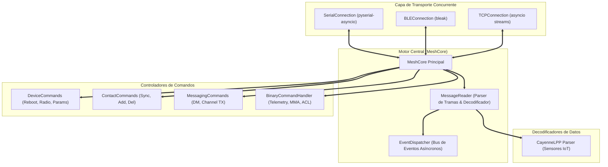

# MeshCore Python SDK (`meshcore_py`) — Análisis y Contratos de Integración

> **Documento de Referencia para Agentes de Antigravity**  
> **Repositorio de Origen**: [`/reference/meshcore_py`](file:///c:/Users/Ruby/Desktop/meshcore-bridge/reference/meshcore_py)  
> **Área de Responsabilidad**: Protocol & Firmware Investigator Agent / Python Bridge Architect  
> **Estándar**: Python 3.10+ / Asyncio / Paho-MQTT / CayenneLPP

---

## 1. Arquitectura General del SDK

El SDK oficial `meshcore_py` proporciona una abstracción orientada a eventos para interactuar con cualquier hardware MeshCore mediante múltiples capas de transporte (Serial USB, Bluetooth Low Energy BLE, Sockets TCP/IP).

---

## 2. Catálogo de Comandos Host $\to$ Radio (`CommandType`)

Comandos transmitidos desde la aplicación Python hacia el microcontrolador a través del enlace serial (`0x01` a `0x40`):

| OpCode | Identificador | Parámetros / Propósito |
| :---: | :--- | :--- |
| `1` | `APP_START` | Inicializa la sesión con el firmware y solicita la versión |
| `2` | `SEND_TXT_MSG` | Envía un mensaje directo a un contacto específico por clave pública |
| `3` | `SEND_CHANNEL_TXT_MSG` | Emite un mensaje de texto en un canal público o secundario (`channel_idx`) |
| `4` | `GET_CONTACTS` | Solicita la libreta de contactos (soporta timestamp `since` para sincronización delta) |
| `5` | `GET_DEVICE_TIME` | Obtiene la hora actual del reloj RTC del microcontrolador |
| `6` | `SET_DEVICE_TIME` | Establece la hora UNIX epoch en el RTC |
| `7` | `SEND_SELF_ADVERT` | Fuerza la emisión inmediata de un paquete de anuncio (Identity Advertisement) |
| `8` | `SET_ADVERT_NAME` | Modifica el nombre público del nodo |
| `9` | `ADD_UPDATE_CONTACT` | Añade o actualiza un contacto en la memoria no volátil del dispositivo |
| `11` | `SET_RADIO_PARAMS` | Configura parámetros LoRa: frecuencia, ancho de banda, SF y CR |
| `12` | `SET_RADIO_TX_POWER` | Ajusta la potencia de salida RF (en dBm) |
| `14` | `SET_ADVERT_LATLON` | Configura coordenadas GPS fijas para el nodo |
| `15` | `REMOVE_CONTACT` | Elimina un contacto de la base de datos local |
| `19` | `REBOOT` | Reinicia por software el microcontrolador |
| `20` | `GET_BATT_AND_STORAGE`| Consulta el voltaje de la batería (mV) y espacio de almacenamiento libre |
| `25` | `SEND_RAW_DATA` | Envía un payload de bytes crudos sin procesar |
| `36` | `SEND_TRACE_PATH` | Traza una ruta de saltos recopilando valores de SNR de cada repetidor |
| `39` | `SEND_TELEMETRY_REQ` | Solicita el envío de paquete de telemetría a un nodo remoto |
| `50` | `BINARY_REQ` | Petición binaria tipada (`STATUS`, `TELEMETRY`, `MMA`, `ACL`, `NEIGHBOURS`) |
| `56` | `GET_STATS` | Consulta contadores de rendimiento: `stats-core`, `stats-radio`, `stats-packets` |

---

## 3. Catálogo de Respuestas y Notificaciones Push (`PacketType`)

Respuestas sincrónicas y eventos asíncronos emitidos por el microcontrolador hacia la aplicación:

### 3.1 Respuestas a Comandos (`0x00` a `0x1C`)
- `0x00` (`OK`): Ejecución exitosa de comando (puede incluir valor entero de 4 bytes en Little-Endian).
- `0x01` (`ERROR`): Error de ejecución con código numérico (`ERR_BUSY`, `ERR_INVALID_PARAM`, `ERR_TIMEOUT`).
- `0x02` (`CONTACT_START`): Indica inicio de transferencia de la libreta de contactos (incluye conteo total).
- `0x03` (`CONTACT`): Datos de un contacto individual (clave pública de 32 bytes, nombre, saltos, métricas).
- `0x04` (`CONTACT_END`): Finalización del volcado de contactos.
- `0x05` (`SELF_INFO`): Información propia del nodo (nombre, clave pública, frecuencia, modelo de hardware).
- `0x06` (`MSG_SENT`): Acuse de emisión de mensaje de texto hacia la radio.
- `0x07` (`CONTACT_MSG_RECV`): Mensaje directo recibido de un contacto.
- `0x08` (`CHANNEL_MSG_RECV`): Mensaje recibido en un canal grupal o público.
- `0x09` (`CURRENT_TIME`): Hora UNIX epoch actual devuelta por el RTC.
- `0x0C` (`BATTERY`): Voltaje actual de la celda de batería en milivoltios.

### 3.2 Notificaciones Push Asíncronas (`0x80` a `0x90`)
- `0x80` (`ADVERTISEMENT`): Notificación de un nuevo nodo anunciado en la red LoRa.
- `0x81` (`PATH_UPDATE`): Actualización de la ruta de saltos hacia un nodo conocido.
- `0x82` (`ACK`): Acuse de recibo confirmado por el destinatario final en la malla.
- `0x87` (`STATUS_RESPONSE`): Respuesta de estado y métricas operativas de un nodo.
- `0x88` (`LOG_DATA`): Transmisión en tiempo real de tramas capturadas en el aire (Packet Sniffer).
- `0x8B` (`TELEMETRY_RESPONSE`): Respuesta con telemetría ambiental decodificable con CayenneLPP.
- `0x8C` (`BINARY_RESPONSE`): Respuesta a solicitud binaria (con correlación por etiqueta temporal).
- `0x8F` (`CONTACT_DELETED`): Notificación de eliminación de contacto.
- `0x90` (`CONTACTS_FULL`): Notificación de que la memoria de contactos del nodo está llena.

---

## 4. Parser de Telemetría y Formato CayenneLPP (`parsing.py`)

MeshCore empaqueta los sensores ambientales utilizando el estándar Cayenne Low Power Payload (LPP):
- **Canal 1**: Temperatura ($0.1^\circ\text{C}$, signed int16).
- **Canal 2**: Humedad ($0.5\%$, unsigned uint8).
- **Canal 3**: Presión Barométrica ($0.1\text{ hPa}$, unsigned uint16).
- **Canal 4**: Voltaje de Batería ($0.01\text{ V}$, unsigned uint16).
- **Canal 5**: Posición GPS (Latitud/Longitud con resolución de $0.0001^\circ$ y Altitud en metros).

El módulo `lpp_json_encoder.py` convierte estas estructuras binarias directamente en objetos JSON nativos listos para su envío a MQTT y su consumo en plataformas de automatización como n8n.
