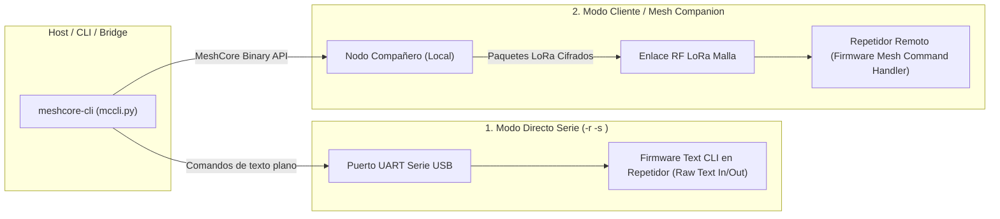

# MeshCore CLI y Gestión de Repetidores — Análisis y Comandos

> **Documento de Referencia para Agentes de Antigravity**  
> **Repositorio de Origen**: [`/reference/meshcore_cli`](file:///c:/Users/Ruby/Desktop/meshcore-bridge/reference/meshcore_cli)  
> **Área de Responsabilidad**: Protocol & Firmware Investigator Agent / QA & Fuzzing Agent  
> **Estándar**: Python 3.10+ / Prompt-Toolkit / Rich TUI / CLI Automation

---

## 1. Modos de Conexión del CLI (`meshcore-cli`)

La herramienta de línea de comandos oficial expone dos rutas de interacción fundamentales con los dispositivos MeshCore:



1. **Modo Directo Serie (`-r -s <port>`)**:
   - Conexión USB directa al repetidor o router.
   - Envío y recepción de comandos en texto plano directamente al parser `CommonCLI` del firmware.
   - Proporciona acceso sin restricciones a todos los parámetros de configuración y logs crudos.
2. **Modo Cliente / Mesh Companion (`to <repeater>`)**:
   - Conexión al nodo local compañero (vía BLE, Serial o TCP).
   - Los comandos se encapsulan en tramas binarias de tipo `PAYLOAD_TYPE_REQ` / `CommandType.SEND_TXT_MSG` cifradas punto a punto hacia el repetidor remoto.
   - El repetidor procesa los comandos mediante su manejador de red y devuelve los resultados en paquetes `PAYLOAD_TYPE_RESPONSE`.

---

## 2. Catálogo de Comandos de Administración de Repetidores

Comandos estandarizados documentados en `REPEATER_COMMANDS.md` que pueden ser enviados a través de MQTT desde n8n:

### 2.1 Información del Sistema y Diagnóstico
- `ver`: Devuelve la versión de firmware instalada (ej. `v1.17.0`).
- `board`: Retorna el identificador del hardware (ej. `Heltec V3`, `LilyGO T-Beam SX1262`, `RAK4631`).
- `clock`: Consulta la hora actual del reloj RTC en formato ISO 8601.
- `stats-core`: Muestra métricas de CPU, tiempo de actividad (uptime), nivel de batería y profundidad de la cola de paquetes.
- `stats-radio`: Informa métricas RF del transceptor: RSSI medio, SNR de los últimos paquetes recibidos y piso de ruido del canal.
- `stats-packets`: Contadores totales de paquetes transmitidos, recibidos, retransmitidos y descartados por CRC inválido o colisión.
- `clear stats`: Reinicia a cero todos los contadores de estadísticas.

### 2.2 Descubrimiento de Red y Vecindad
- `neighbors`: Lista los nodos repetidores detectados a 0 saltos (vecinos directos RF con su SNR y última actividad).
- `discover.neighbors`: Inicia un sondeo activo de descubrimiento de vecinos en el canal de control.
- `advert`: Fuerza la emisión inmediata de un paquete de anuncio (Identity Advertisement) con la clave pública y nombre del nodo.

### 2.3 Streaming de Tráfico LoRa (Packet Sniffer)
- `log start`: Habilita el volcado continuo de paquetes recibidos en el aire.
  - En modo cliente, el firmware emite eventos push `0x88` (`LOG_DATA`), los cuales contienen la cabecera, ruta, saltos y potencia de cada trama capturada.
- `log stop`: Desactiva el streaming de paquetes para ahorrar ancho de banda y batería.

### 2.4 Configuración de Parámetros (`get` / `set`)
- `get/set name <name>`: Consulta o asigna el nombre del nodo.
- `get/set radio f,bw,sf,cr`: Configura los parámetros de modulación LoRa (requiere reboot para aplicar).
- `get/set freq <mhz>`: Establece la frecuencia de operación (ej. `915.0`).
- `get/set tx <power>`: Ajusta la potencia de emisión RF en dBm (ej. `20`).
- `get/set af <value>`: Factor de antena / ganancia pasiva.
- `get/set repeat on|off`: Activa o desactiva la función de retransmisión de paquetes (modo repetidor).
- `get/set lat <val>` / `get/set lon <val>`: Coordenadas geográficas estáticas para localización en mapas.
- `get/set advert.interval <min>`: Intervalo de emisión periódica de anuncios.
- `get/set flood.max <hops>`: Número máximo de saltos permitidos para paquetes de inundación (límite de TTL de red).

---

## 3. Integración con el Módulo Admin del Bridge

MeshCore Bridge expone estos comandos en el tópico MQTT `meshcore/admin/cmd`. Al recibir un payload JSON de n8n:
```json
{
  "request_id": "n8n_req_diag_01",
  "action": "stats-radio"
}
```
El bridge lo despacha hacia la radio o repetidor, procesa la respuesta y publica el resultado en `meshcore/admin/status`:
```json
{
  "status": "ok",
  "request_id": "n8n_req_diag_01",
  "action": "stats-radio",
  "data": {
    "rssi_avg": -78.4,
    "snr_avg": 9.2,
    "noise_floor": -118
  },
  "timestamp": "2026-08-17T17:15:00Z"
}
```
Esto permite crear paneles de monitoreo en tiempo real y flujos automatizados de resolución de incidentes en n8n.
