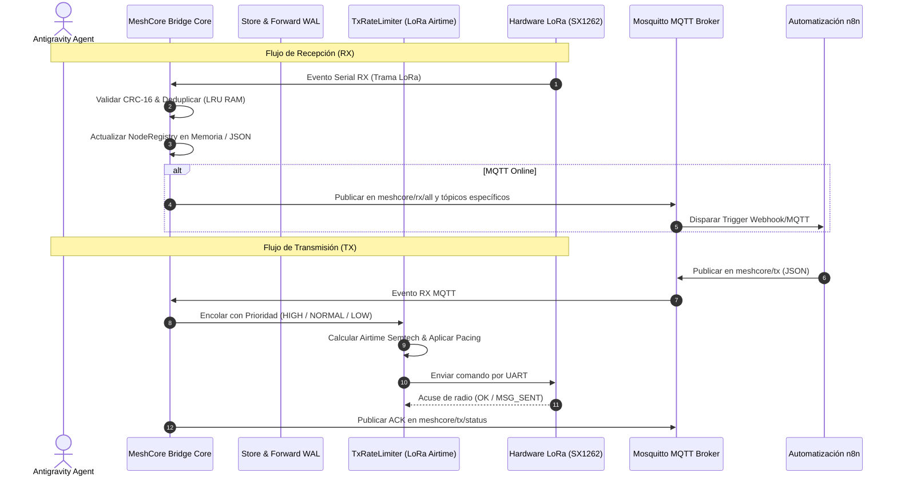

# Guía de Integración y Manual para Agentes de Antigravity

> **Manual Operativo y Cookbook de Referencia para Subagentes**  
> **Área de Responsabilidad**: Protocol Investigator, Bridge Architect, QA & Fuzzing Agent  
> **Ubicación**: `/docs/reference_analysis/04_INTEGRATION_GUIDE_FOR_AGENTS.md`

---

## 1. Guía de Interacción para Agentes

Este documento establece las directrices prácticas para que cualquier agente de Antigravity (existente o futuro) interactúe con el ecosistema **MeshCore Bridge**.



---

## 2. Pautas por Rol de Agente

### 2.1 Para el Protocol & Firmware Investigator Agent
1. **Regla de Oro**: La única fuente de verdad binaria reside en [`/reference/`](file:///c:/Users/Ruby/Desktop/meshcore-bridge/reference/).
2. **Procedimiento ante nuevos tipos**:
   - Usar la skill `meshcore-source-inspector` para extraer los campos, tipos C/C++ y modificadores `#pragma pack`.
   - Calcular offsets en bytes y documentar Little-Endianness.
   - Definir los nuevos tipos en [`src/protocol_types.py`](file:///c:/Users/Ruby/Desktop/meshcore-bridge/src/protocol_types.py) utilizando estrictamente `@dataclass(frozen=True)` o `IntEnum`.
   - Actualizar [`docs/PROTOCOL_SPEC.md`](file:///c:/Users/Ruby/Desktop/meshcore-bridge/docs/PROTOCOL_SPEC.md).

### 2.2 Para el Python Bridge Architect Agent
1. **Regla de Oro**: Ninguna operación I/O puede bloquear el bucle de `asyncio`.
2. **Procedimiento de Implementación**:
   - Utilizar el patrón adaptador híbrido: el bridge debe funcionar con el SDK oficial `meshcore_py` cuando esté instalado, y conmutar a `RawSerialFramingAdapter` en entornos sin dependencias externas.
   - Las operaciones de persistencia en disco deben ser atómicas mediante archivos JSON.
   - Asegurar que el espaciado de transmisión LoRa respete el tiempo en el aire calculado por `estimate_lora_airtime_ms()`.

### 2.3 Para el QA & Fuzzing Agent
1. **Regla de Oro**: Cero regresiones y 100% de aprobación en `bridge_test_runner`.
2. **Procedimiento de Verificación**:
   - Ejecutar siempre:
     ```powershell
     python .agents/skills/bridge-test-runner/scripts/run_checks.py
     ```
   - Diseñar pruebas deterministas usando mocks asíncronos (`AsyncMock`, `MagicMock`).
   - Incluir casos límite: tramas truncadas, desconexiones intempestivas de sockets, timeouts en puertos seriales y desbordamiento de colas.

---

## 3. Matriz de Códigos de Error Frecuentes

| Código / Excepción | Causa Probable | Acción de Mitigación del Bridge |
| :--- | :--- | :--- |
| `ERR_BUSY` (`0x01`) | El canal LoRa está ocupado por otra transmisión (CAD detectó portadora) | El `TxRateLimiter` reintenta con backoff exponencial y jitter aleatorio |
| `ERR_TIMEOUT` | La radio no respondió al comando serial en el tiempo límite | El `SerialWatchdog` detecta inactividad y ejecuta reconexión suave |
| `CRC_MISMATCH` | Interferencia RF o ruido en la línea UART corrompió bytes de la trama | El `RawSerialFramingAdapter` descarta la trama e incrementa `rx_error_count` |
| `MQTT_DISCONNECTED` | Pérdida de conectividad con el broker Mosquitto | Reintento en segundo plano con reconexión exponencial asíncrona |
