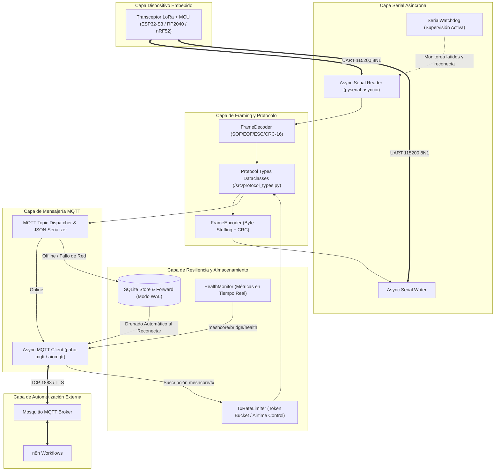
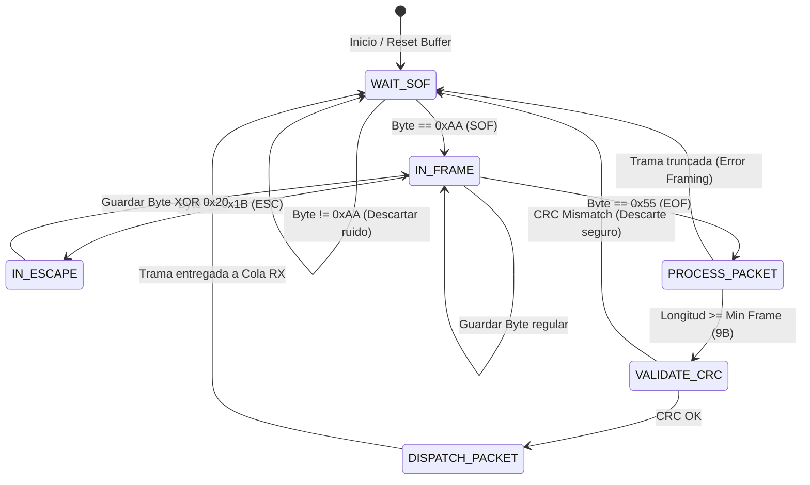
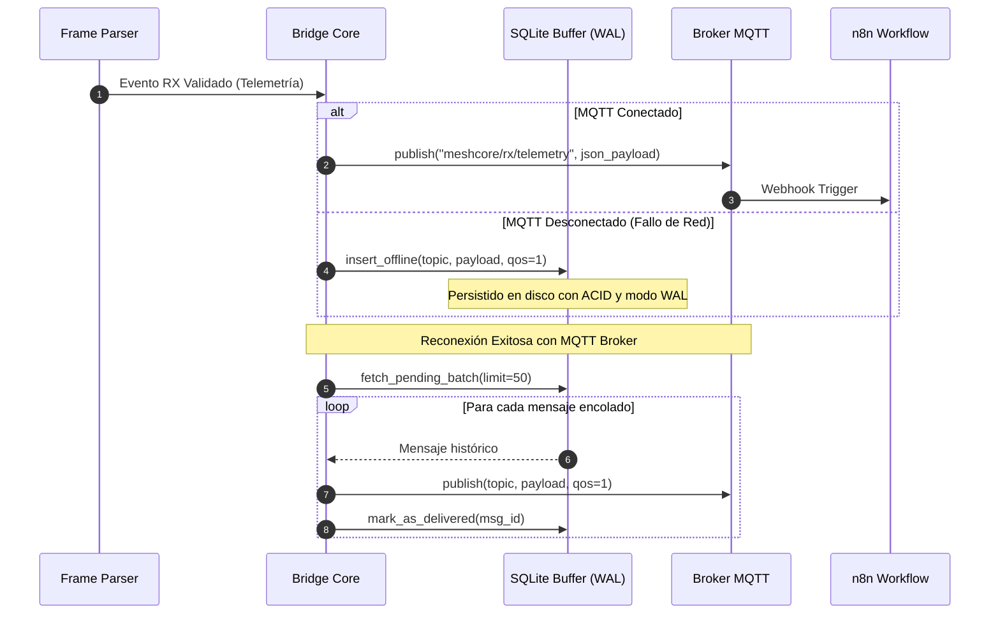
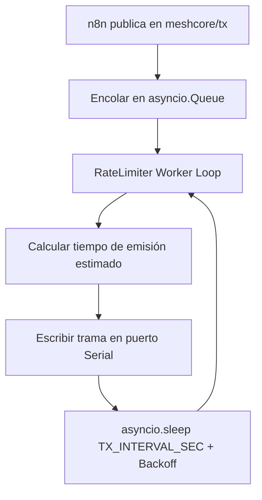

# Arquitectura del Sistema MeshCore Universal Bridge

> **Documentación Técnica de Diseño, Métodos y Flujos Asíncronos**  
> **Versión**: 2.0.0  
> **Patrón de Diseño**: Reactor Asíncrono Concurrente / Store & Forward Transaccional / Framing Determinista

---

## 1. Visión General y Diagrama de Bloques

MeshCore Bridge opera como una pasarela bidireccional, sin bloqueo y tolerante a fallos entre el hardware LoRa (vía USB-CDC / UART) y el ecosistema MQTT/n8n.

---

## 2. Explicación Detallada de Componentes y Métodos

### 2.1 Módulo Serial Asíncrono y Framing (`SerialAsyncProtocol`)

El driver serial procesa un flujo continuo de bytes (`stream-oriented`) y lo convierte en tramas discretas e íntegras mediante delimitadores `SOF (0xAA)`, `EOF (0x55)`, caracteres de escape `ESC (0x1B)` y validación `CRC-16-CCITT`.

#### Métodos Clave:
1. **`data_received(data: bytes) -> None`**:
   - Invocado por el bucle de eventos de `asyncio` cuando entran bytes por el puerto serie.
   - Itera byte a byte a través de la máquina de estados de framing.
   - Protege contra desbordamiento de búfer (`max_frame_size = 512 bytes`).
2. **`encode_frame(opcode: int, seq: int, src: int, dst: int, payload: bytes) -> bytes`**:
   - Construye la cabecera binaria, calcula el CRC-16 CCITT sobre `[OpCode .. Payload]` y aplica byte stuffing para emitir una trama delimitada por `SOF` y `EOF`.

---

### 2.2 Buffer Persistente Store & Forward (`SQLiteStoreAndForward`)

Garantiza **Cero Pérdida de Datos** cuando la conexión con el broker MQTT se interrumpe (cortes de fibra, caída del contenedor Mosquitto, reinicios de red).

#### Métodos Clave:
1. **`enqueue(topic: str, payload: str, qos: int, retain: bool) -> int`**:
   - Inserta de forma síncrona/atómica el mensaje en la tabla `offline_queue`.
   - Si la cola excede `OFFLINE_BUFFER_MAX_SIZE`, descarta los mensajes más antiguos (estrategia FIFO circular de seguridad).
2. **`flush_pending(client: mqtt.Client) -> int`**:
   - Se ejecuta inmediatamente después del evento `on_connect` de MQTT.
   - Lee en lotes de 50 registros para no saturar el socket y los publica secuencialmente en el broker, eliminándolos de SQLite tras confirmación.

---

### 2.3 Rate Limiter de Transmisión LoRa (`TxRateLimiter`)

Las redes LoRa están sujetas a restricciones de ciclo de trabajo (**Duty Cycle**) y tiempos en el aire (**Airtime**). Emitir ráfagas continuas desde n8n saturaría el buffer FIFO del chip RF (SX1262/SX1276) o provocaría colisiones en la malla.

#### Métodos Clave:
1. **`submit_tx(command: TxCommand) -> asyncio.Future`**:
   - Encola un mensaje saliente devolviendo un `Future` que se resuelve cuando el transceptor confirma la emisión.
2. **`_worker_loop() -> None`**:
   - Extrae solicitudes una a una, aplica el intervalo reglamentario `TX_INTERVAL_SEC` (por defecto 1.0s) e introduce jitter pseudo-aleatorio para evitar colisiones periódicas con otros nodos.

---

### 2.4 Vigilante Activo de Puerto Serial (`SerialWatchdog`)

Los adaptadores USB-CDC (CH340, CP2102, FTDI o USB nativo de ESP32-S3/RP2040) pueden sufrir bloqueos silenciosos (*silent stalls*) por descargas electrostáticas o desbordamiento de búfer USB del kernel del sistema operativo.

#### Métodos Clave:
1. **`heartbeat() -> None`**:
   - Se llama cada vez que se recibe al menos 1 byte válido del puerto serie.
2. **`_supervision_loop() -> None`**:
   - Evalúa cada `WATCHDOG_INTERVAL_SEC` (60s). Si han transcurrido más de `SERIAL_TIMEOUT` segundos sin actividad y el hardware soporta ping activo, emite un comando de sondeo (`0x07 PING`).
   - Si el dispositivo no responde en 5 segundos, cierra limpiamente el descriptor de archivo serial, libera recursos y reinicia la conexión UART.

---

## 3. Formato y Esquema de Datos de Protocolo (`/src/protocol_types.py`)

Todos los paquetes que circulan por el puente se tipan mediante clases inmutables:

| Tipo de Paquete | Clase Python | OpCode | Campos Principales |
| :--- | :--- | :--- | :--- |
| **Cabecera Genérica** | `FrameHeader` | N/A | `opcode`, `seq_num`, `src_node_id`, `dst_node_id`, `hop_limit`, `payload_len` |
| **Telemetría** | `TelemetryPayload` | `0x01` | `battery_mv`, `solar_mv`, `temp_c`, `humidity_pct`, `pressure_hpa`, `snr_db`, `rssi_dbm` |
| **Mensaje de Texto** | `TextMessagePayload` | `0x02` | `channel_idx`, `sender_alias`, `text` |
| **Anuncio de Nodo** | `NodeAdvertisement` | `0x03` | `node_id`, `short_name`, `long_name`, `hw_model`, `fw_version`, `lat`, `lon`, `alt_m` |
| **Comando Admin** | `AdminCommand` | `0x05` | `command_id`, `parameter_key`, `parameter_value` |
| **Respuesta Admin** | `AdminResponse` | `0x06` | `command_id`, `status_code`, `response_payload` |
| **Confirmación (ACK)** | `AckPayload` | `0x07` | `ack_seq_num`, `status` |
