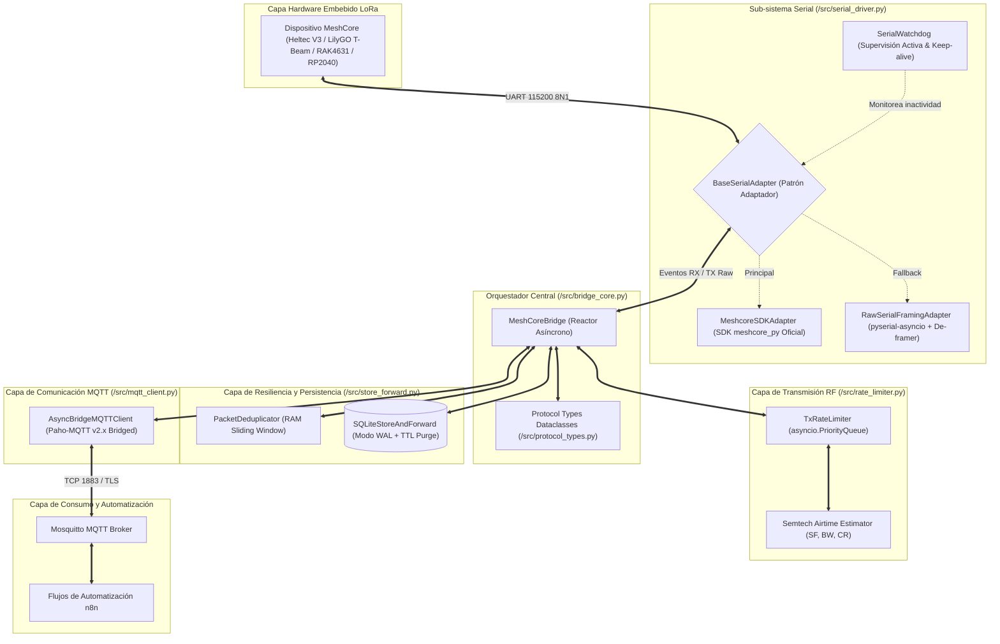
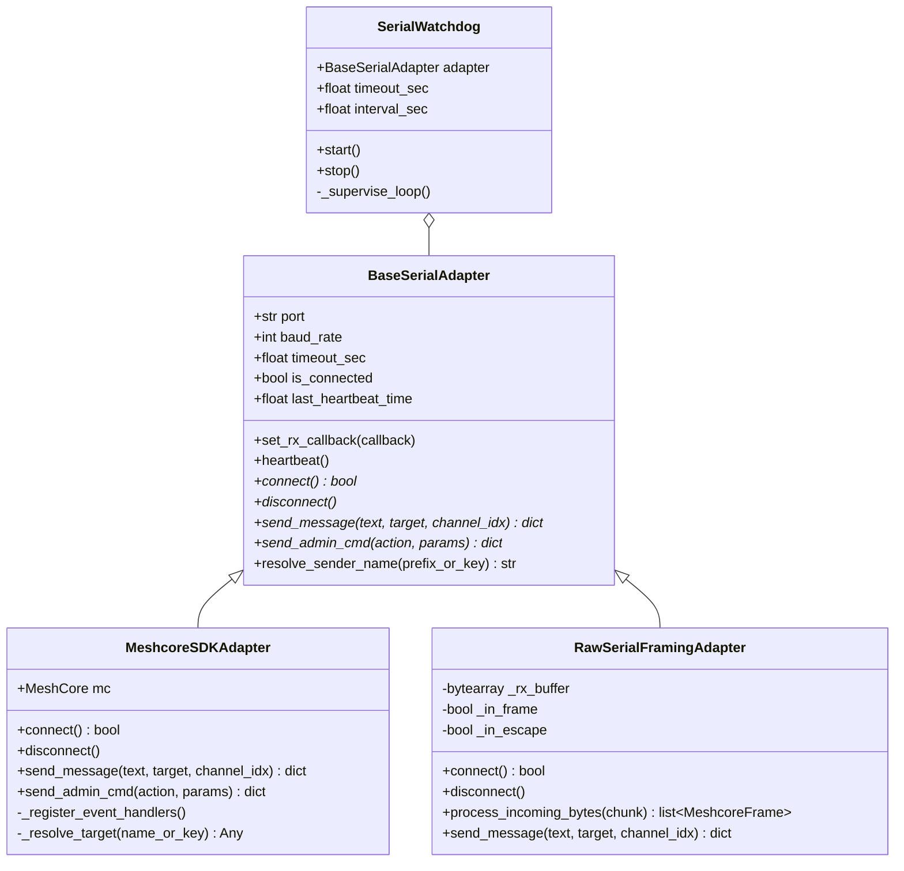
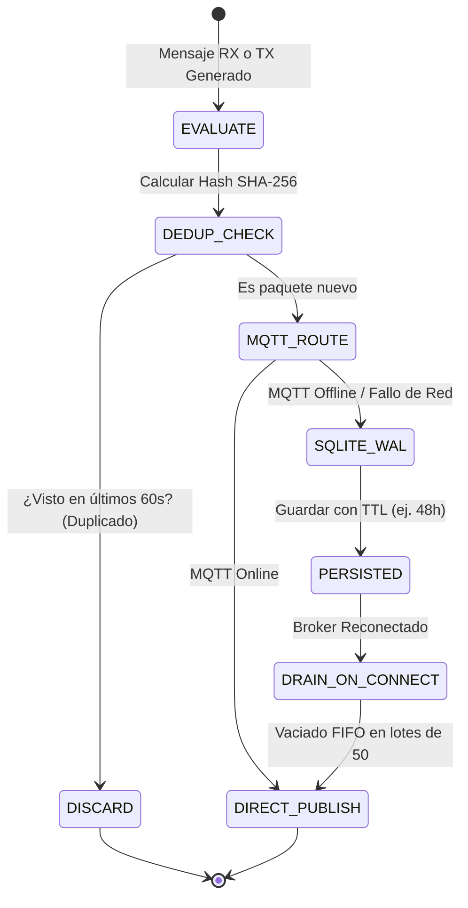
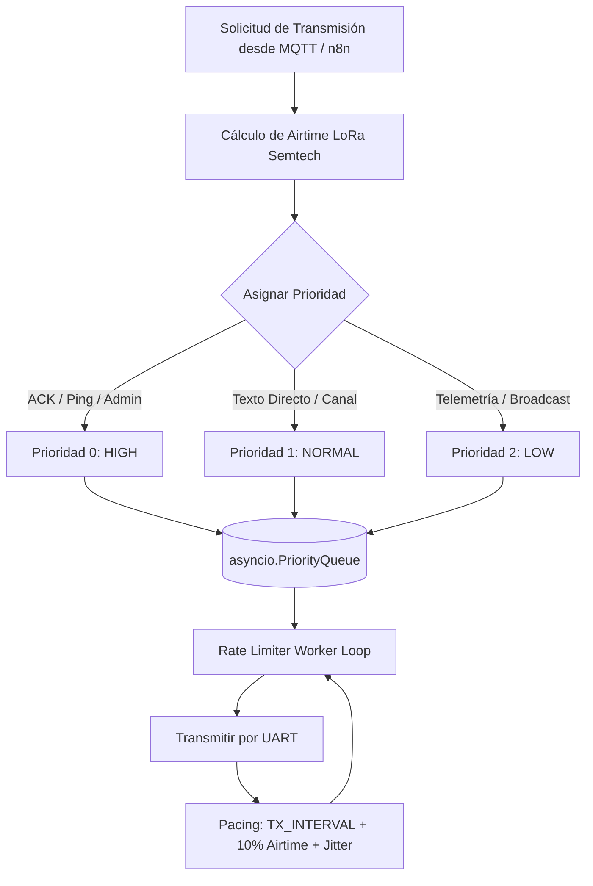

# Arquitectura del Sistema MeshCore Universal Bridge (v2.0)

> **Documentación Técnica de Diseño, Módulos, Métodos y Flujos Asíncronos**  
> **Versión**: 2.0.0 (Arquitectura Modular de Alto Rendimiento)  
> **Patrón de Diseño**: Reactor Asíncrono Concurrente / Adaptador Serial Híbrido / Store & Forward Transaccional con TTL / Rate Limiter LoRa con Cola de Prioridades

---

## 1. Visión General y Diagrama de Arquitectura Modular

MeshCore Bridge opera como un middleware industrial sin bloqueo entre el hardware LoRa (USB-CDC / UART) y la plataforma de automatización n8n mediante MQTT.

---

## 2. Descripción de Módulos y Métodos Principales

### 2.1 Módulo Serial Híbrido (`src/serial_driver.py`)

Provee abstracción transparente sobre el hardware serial. Si el SDK oficial `meshcore_py` está instalado y disponible, utiliza su capa de sesión y libreta de contactos; si no, conmuta deterministamente al driver de tramas binarias directas.

#### Métodos Clave:
1. **`process_incoming_bytes(chunk: bytes) -> list[MeshcoreFrame]`**:
   - Máquina de estados para framing determinista: localiza delimitadores `SOF (0xAA)`, `EOF (0x55)`, desempaqueta caracteres escapados `ESC (0x1B) ^ 0x20` y valida la integridad mediante `CRC-16-CCITT`.
2. **`SerialWatchdog._supervise_loop() -> None`**:
   - Evalúa periódicamente la diferencia `time.time() - last_heartbeat_time`. Si excede `SERIAL_TIMEOUT` segundos, gatilla una reconexión segura del puerto serie sin detener el servicio.

---

### 2.2 Módulo de Persistencia y Deduplicación (`src/store_forward.py`)

Garantiza **Cero Pérdida de Datos** durante desconexiones del broker MQTT o inestabilidad de red, evitando a su vez la saturación de n8n por eventos repetidos.

#### Métodos Clave:
1. **`enqueue(topic, payload, qos, retain, msg_hash, ttl_seconds) -> bool`**:
   - Inserta atómicamente el paquete en la base de datos SQLite configurada en modo `WAL` (`Write-Ahead Logging`).
   - Aplica política circular si se alcanza `OFFLINE_BUFFER_MAX_SIZE` y calcula la fecha de expiración `expires_at = now + ttl`.
2. **`purge_expired() -> int`**:
   - Purga de forma eficiente todos los registros cuya vigencia haya caducado, previniendo el despacho de telemetría obsoleta hacia n8n tras cortes prolongados.
3. **`PacketDeduplicator.is_duplicate(key: str) -> bool`**:
   - Filtro LRU en memoria RAM de $O(1)$ con ventana de tiempo deslizante (`DEDUPLICATION_WINDOW_SEC`).

---

### 2.3 Módulo de Transmisión y Rate Limiting (`src/rate_limiter.py`)

Controla el flujo de paquetes salientes hacia la red LoRa para evitar sobrecalentamiento del chip RF (SX1262/SX1276), cumplir las regulaciones de tiempo en el aire (Airtime / Duty Cycle) y dar paso prioritario a comandos críticos.

#### Ecuación de Tiempo en el Aire (Semtech LoRa Airtime):
$$T_{\text{packet}} = T_{\text{preamble}} + T_{\text{payload}}$$
$$T_{\text{sym}} = \frac{2^{\text{SF}}}{\text{BW}_{\text{Hz}}}$$
$$T_{\text{preamble}} = (N_{\text{preamble}} + 4.25) \times T_{\text{sym}}$$
$$N_{\text{payload}} = 8 + \max\left(\left\lceil \frac{8 \cdot \text{PL} - 4 \cdot \text{SF} + 28 + 16 \cdot \text{CRC} - 20 \cdot \text{IH}}{4 \cdot (\text{SF} - 2 \cdot \text{DE})} \right\rceil \cdot \text{CR},\, 0\right)$$

---

### 2.4 Módulo Cliente MQTT Puenteado (`src/mqtt_client.py`)

Proporciona integración segura entre la librería síncrona `paho-mqtt` y el reactor asíncrono de `asyncio`.

#### Métodos Clave:
1. **`publish_safe(topic, payload_str, qos, retain, ttl_seconds) -> bool`**:
   - Intenta la publicación directa en el socket MQTT. En caso de fallo o desconexión, delega automáticamente en `SQLiteStoreAndForward`.
2. **`flush_offline_buffer() -> int`**:
   - Tras el evento `on_connect`, drena secuencialmente los mensajes almacenados en disco sin bloquear el hilo de red ni el loop de `asyncio`.

---

## 3. Matriz de Mapeo de Tópicos MQTT para n8n

| Tópico MQTT | Dirección | QoS | Retenido | Contenido / Payload |
| :--- | :--- | :--- | :--- | :--- |
| `meshcore/bridge/state` | Bridge $\to$ MQTT | 1 | Sí (LWT) | `{"status": "online" \| "offline", "timestamp": ...}` |
| `meshcore/bridge/health` | Bridge $\to$ MQTT | 0 | No | Métricas periódicas: uptime, estado serial, buffer pending, contadores TX/RX |
| `meshcore/rx/all` | Bridge $\to$ MQTT | 0 | No | Tópico unificado con todos los eventos de la malla en formato JSON estandarizado |
| `meshcore/rx/telemetry` | Bridge $\to$ MQTT | 0 | No | Telemetría (batería mV, solar, temperatura, humedad, presión, SNR, RSSI) |
| `meshcore/rx/public` | Bridge $\to$ MQTT | 0 | No | Mensajes de texto en canal público / broadcast (Canal 0) |
| `meshcore/rx/channel/ch_{id}` | Bridge $\to$ MQTT | 0 | No | Mensajes de texto en canales secundarios cifrados o grupales |
| `meshcore/rx/direct/{node_id}` | Bridge $\to$ MQTT | 0 | No | Mensajes directos punto a punto dirigidos al nodo o reenviados |
| `meshcore/rx/nodes` | Bridge $\to$ MQTT | 0 | No | Anuncios de presencia de nodos, coordenadas GPS y versión de firmware |
| `meshcore/tx` | n8n $\to$ Bridge | 1 | No | Solicitudes de emisión LoRa: `{"text": "...", "dest_node_id": "...", "channel_idx": 0}` |
| `meshcore/tx/status` | Bridge $\to$ n8n | 1 | No | Confirmación de encolado/emisión y estado del rate limiter |
| `meshcore/admin/cmd` | n8n $\to$ Bridge | 1 | No | Comandos de administración (`reboot`, `set_tx_power`, `ping`) |
| `meshcore/admin/status` | Bridge $\to$ n8n | 1 | No | Resultado y status code del comando administrativo ejecutado |
