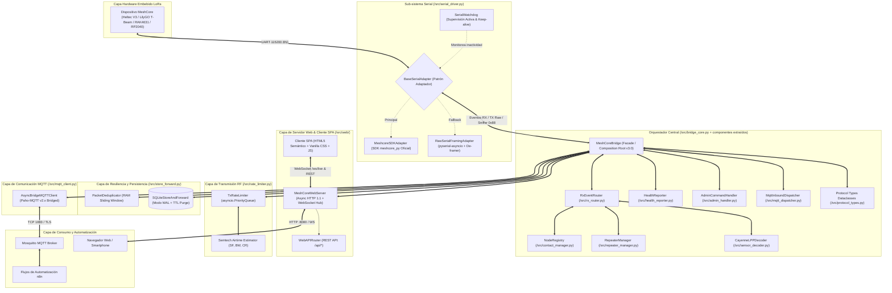

# Arquitectura del Sistema MeshCore Universal Bridge & Web Station (v3.0)

> **Documentación Técnica de Diseño, Módulos, Métodos y Flujos Asíncronos**  
> **Versión**: 3.0.0 (Arquitectura Modular de Alto Rendimiento con Servidor Web SPA, RF Packet Sniffer, Analytics y CayenneLPP)  
> **Patrón de Diseño**: Reactor Asíncrono Concurrente / Servidor Web Ligero Asíncrono / WebSocket Hub / Adaptador Serial Híbrido / Store & Forward Transaccional con TTL / Rate Limiter LoRa con Cola de Prioridades / Descodificador de Sensores IPSO / Registro Dinámico de Nodos con Analítica

---

## 1. Visión General y Diagrama de Arquitectura Modular

MeshCore Bridge opera como un middleware industrial sin bloqueo entre el hardware LoRa (USB-CDC / UART), la plataforma de automatización n8n (mediante MQTT) y los usuarios de campo a través de una **Interfaz Web SPA Moderna en Tiempo Real**.

---

## 2. Descripción de Componentes Principales (v3.0)

### 2.1 Servidor Web Asíncrono y WebSocket Hub (`src/web/http_server.py`)
- **Servidor HTTP 1.1 Nativo**: Despacha la aplicación de una sola página (SPA) y los endpoints de la API REST sin requerir frameworks pesados.
- **WebSocket RFC 6455 Hub**: Canal bidireccional en `/ws/live` para streaming continuo de mensajes entrantes, telemetría y tramas capturadas en el aire.
- **CORS Preflight**: Soporte completo para peticiones `OPTIONS` retornando `204 No Content`.
- **Endurecimiento anti Directory Traversal**: Rechazo explícito con `403 Forbidden` de rutas con segmentos `..`, barras inversas `\`, marcadores URL-encoded (`%2e`, `%2f`) o patrones `....`, más verificación canónica de defensa en profundidad con `.resolve().is_relative_to()`; cualquier intento de escape del directorio estático se rechaza en lugar de enmascararse con `index.html`.
- **Cabeceras de Seguridad Obligatorias**: `X-Content-Type-Options: nosniff`, `X-Frame-Options: DENY`, `Referrer-Policy: strict-origin-when-cross-origin` y límite de cuerpo `MAX_BODY_SIZE` de 1 MB contra DoS (`413 Payload Too Large`).

### 2.2 Enrutador REST API (`src/web/api_router.py`)
Centraliza las operaciones del cliente web y herramientas externas:
- `/api/status`: Diagnóstico de salud, uptime, estado de enlaces y colas.
- `/api/nodes`: Directorio en vivo de nodos en la malla.
- `/api/analytics`: Resumen analítico con Top 10 Nodos por Tráfico, Top Repetidores por Clientes Conectados, Ranking de Señal y Desglose de Errores.
- `/api/sniffer/control` y `/api/logs`: Control y consulta del interceptor de paquetes RF.
- `/api/system/logs`: Historial de registros del puente con filtrado de severidad.
- `/api/contacts` & `/api/channels`: Gestión de libreta de contactos y configuración de canales cifrados AES.
- `/api/tx`: Transmisión RF directa a canales públicos, privados o DMs.

### 2.3 Decodificador CayenneLPP (`src/sensor_decoder.py`)
Decodifica paquetes ambientales binarios (`GRP_DATA`, `TELEMETRY_RESPONSE`) convirtiendo los canales IPSO estándar en valores de ingeniería con unidades:
- **Temperatura**: Canales con identificador `103` (resolución $0.1^\circ\text{C}$).
- **Humedad Relativa**: Canales con identificador `104` (resolución $0.5\%$).
- **Presión Barométrica**: Canales con identificador `115` (resolución $0.1\text{ hPa}$).
- **Voltaje**: Canales con identificador `116` (resolución $0.01\text{ V}$).
- **Posición GPS**: Canales con identificador `136` (Latitud, Longitud $0.0001^\circ$ y Altitud).
- **Acelerómetro (MMA)**: Canales con identificador `113` (Ejes $X, Y, Z$ en $0.001\text{ G}$).

### 2.4 Registro Dinámico de Nodos con Analítica (`src/contact_manager.py`)
Mantiene una tabla en memoria con los nodos activos detectados en la malla:
- Resolución de alias y claves públicas en $O(1)$.
- Métricas RF asociadas: último SNR, RSSI, número de saltos (`hops`), porcentaje de batería y contadores acumulados de paquetes RX/TX y errores.
- Cálculo de rankings analíticos en tiempo real (`get_analytics_summary`).

### 2.5 Cliente MQTT Resiliente (`src/mqtt_client.py`)
- **Reconexión Determinista**: El cliente usa `connect_async()` + `loop_start()` con `reconnect_delay_set(1s..30s)`. El bucle de red de Paho (con `retry_first_connection=True`) reintenta la conexión en segundo plano de forma indefinida, de modo que el bridge se conecta automáticamente aunque el broker estuviera caído en el arranque (sin necesidad de reiniciar el proceso).
- **Last Will & Testament (LWT)**: Publicación retenida de estado `offline` en `meshcore/bridge/state` al desconectarse; al reconectar publica `online` retenido.
- **Store & Forward automático**: Si el broker no está disponible, `publish_safe` persiste los mensajes en SQLite (`SQLiteStoreAndForward`) y, al restablecerse la conexión, `flush_offline_buffer` drena la cola en lotes de 50 con backoff. Verificado en producción simulada: 1000 mensajes encolados durante una caída fueron drenados automáticamente al reaparecer el broker.
- **Modo offline comprobado end-to-end**: Round-trip MQTT real verificado (estado retenido, `meshcore/tx` → RF → `meshcore/tx/status` ACK, y eventos `meshcore/rx/*`).

### 2.6 Componentes Extraídos del Orquestador (Clean Code / SRP)
La clase `MeshCoreBridge` actuaba como *God Class* (46 métodos). Tras el refactor quedó como un **facade/composition root** delgado que delega en cuatro componentes desacoplados (cada uno con su `*Context` dataclass para evitar constructores largos):

- **`RxEventRouter` (`src/rx_router.py`)**: Enruta eventos LoRa/RF hacia MQTT y WebSocket (`handle_event`, `_handle_mesh_channel_msg`, `_handle_mesh_direct_msg`, `_handle_mesh_telemetry_msg`, `_dispatch_parsed_frame`). Incluye `MeshMessageEvent` (agrupa 6 argumentos) y el Protocol `BridgeCounters` para compartir contadores con el bridge.
- **`HealthReporter` (`src/health_reporter.py`)**: Publica métricas periódicas en `meshcore/bridge/health` con su propio ciclo `start()/stop()` y `build_payload()`.
- **`AdminCommandHandler` (`src/admin_handler.py`)**: Ejecuta comandos de administración sobre la radio local y repetidores remotos (antes `handle_admin`).
- **`MqttInboundDispatcher` (`src/mqtt_dispatcher.py`)**: Procesa mensajes MQTT entrantes de los tópicos `meshcore/tx` y `meshcore/admin/*` (TX request, comandos admin y repetidores remotos).

El bridge conserva delegadores y propiedades de compatibilidad (`on_mesh_event`, `handle_admin`, `mqtt_connected`, `tx_queue`, `mc`, contadores) que preservan la API pública para n8n, WebSocket y las 106 pruebas.

---

## 3. Matriz de Tópicos MQTT para n8n

| Tópico MQTT | Dirección | QoS | Retenido | Contenido / Payload |
| :--- | :--- | :--- | :--- | :--- |
| `meshcore/bridge/state` | Bridge $\to$ MQTT | 1 | Sí (LWT) | `{"status": "online" \| "offline", "timestamp": ...}` |
| `meshcore/bridge/health` | Bridge $\to$ MQTT | 0 | No | Métricas: uptime, serial, mqtt, known_mesh_nodes, queue_depth, tx/rx counts |
| `meshcore/rx/all` | Bridge $\to$ MQTT | 0 | No | Tópico unificado con todos los eventos de la malla en JSON |
| `meshcore/rx/telemetry` | Bridge $\to$ MQTT | 0 | No | Telemetría (batería, solar, temp, hum, presión, GPS, CayenneLPP) |
| `meshcore/rx/public` | Bridge $\to$ MQTT | 0 | No | Mensajes de texto en canal público / broadcast (Canal 0) |
| `meshcore/rx/channel/ch_{id}` | Bridge $\to$ MQTT | 0 | No | Mensajes de texto en canales secundarios cifrados |
| `meshcore/rx/direct/{node_id}` | Bridge $\to$ MQTT | 0 | No | Mensajes directos punto a punto dirigidos al nodo o reenviados |
| `meshcore/rx/nodes` | Bridge $\to$ MQTT | 0 | No | Anuncios de presencia, coordenadas GPS y versión de firmware |
| `meshcore/rx/log` | Bridge $\to$ MQTT | 0 | No | Streaming de tramas capturadas en el aire (Packet Sniffer 0x88) |
| `meshcore/tx` | n8n $\to$ Bridge | 1 | No | Solicitudes de emisión LoRa: `{"text": "...", "to": "...", "channel_idx": 0}` |
| `meshcore/tx/status` | Bridge $\to$ n8n | 1 | No | Confirmación de encolado/emisión y estado del rate limiter |
| `meshcore/admin/cmd` | n8n $\to$ Bridge | 1 | No | Comandos de administración local (`reboot`, `set_tx_power`, `list_nodes`) |
| `meshcore/admin/status` | Bridge $\to$ n8n | 1 | No | Resultado del comando administrativo local |
| `meshcore/admin/repeater/{id}/cmd` | n8n $\to$ Bridge | 1 | No | Comandos remotos a repetidores (`stats-radio`, `neighbors`, `log start`) |
| `meshcore/admin/repeater/{id}/status`| Bridge $\to$ n8n| 1 | No | Acuse y resultado del comando remoto a repetidor |
