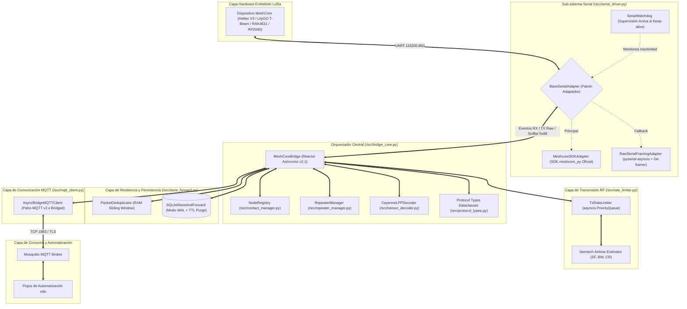

# Arquitectura del Sistema MeshCore Universal Bridge (v2.1)

> **Documentación Técnica de Diseño, Módulos, Métodos y Flujos Asíncronos**  
> **Versión**: 2.1.0 (Arquitectura Modular de Alto Rendimiento con CayenneLPP, NodeRegistry & Repeater Remote Management)  
> **Patrón de Diseño**: Reactor Asíncrono Concurrente / Adaptador Serial Híbrido / Store & Forward Transaccional con TTL / Rate Limiter LoRa con Cola de Prioridades / Descodificador de Sensores IPSO / Registro Dinámico de Nodos

---

## 1. Visión General y Diagrama de Arquitectura Modular

MeshCore Bridge opera como un middleware industrial sin bloqueo entre el hardware LoRa (USB-CDC / UART) y la plataforma de automatización n8n mediante MQTT.

---

## 2. Descripción de Componentes Principales (v2.1)

### 2.1 Decodificador CayenneLPP (`src/sensor_decoder.py`)
Decodifica paquetes ambientales binarios (`GRP_DATA`, `TELEMETRY_RESPONSE`) convirtiendo los canales IPSO estándar en valores de ingeniería con unidades:
- **Temperatura**: Canales con identificador `103` (resolución $0.1^\circ\text{C}$).
- **Humedad Relativa**: Canales con identificador `104` (resolución $0.5\%$).
- **Presión Barométrica**: Canales con identificador `115` (resolución $0.1\text{ hPa}$).
- **Voltaje**: Canales con identificador `116` (resolución $0.01\text{ V}$).
- **Posición GPS**: Canales con identificador `136` (Latitud, Longitud $0.0001^\circ$ y Altitud).
- **Acelerómetro (MMA)**: Canales con identificador `113` (Ejes $X, Y, Z$ en $0.001\text{ G}$).

### 2.2 Registro Dinámico de Nodos (`src/contact_manager.py`)
Mantiene una tabla en memoria con los nodos activos detectados en la malla:
- Resolución de alias y claves públicas en $O(1)$.
- Métricas RF asociadas: último SNR, RSSI, número de saltos (`hops`) y porcentaje de batería.
- Limpieza automática (`cleanup_inactive`) para evitar saturación de memoria ante despliegues masivos.

### 2.3 Gestor de Repetidores y Packet Sniffer (`src/repeater_manager.py`)
- **Gestión Remota**: Enruta comandos de diagnóstico (`stats-core`, `stats-radio`, `neighbors`, `log start`, `set tx`) hacia repetidores distantes mediante tramas `cmd` cifradas sobre el tópico `meshcore/admin/repeater/{node_id}/cmd`.
- **Packet Sniffer RF**: Procesa eventos push `0x88` (`LOG_DATA`), desglosando la ruta de saltos y calidad de señal en `meshcore/rx/log`.

---

## 3. Matriz de Tópicos MQTT para n8n

| Tópico MQTT | Dirección | QoS | Retenido | Contenido / Payload |
| :--- | :--- | :--- | :--- | :--- |
| `meshcore/bridge/state` | Bridge $\to$ MQTT | 1 | Sí (LWT) | `{"status": "online" \| "offline", "timestamp": ...}` |
| `meshcore/bridge/health` | Bridge $\to$ MQTT | 0 | No | Métricas: uptime, serial, mqtt, known_mesh_nodes, queue_depth, tx/rx counts |
| `meshcore/rx/all` | Bridge $\to$ MQTT | 0 | No | Tópico unificado con todos los eventos de la malla en JSON |
| `meshcore/rx/telemetry` | Bridge $\to$ MQTT | 0 | No | Telemetría (batería, solar, temp, hum, presión, GPS, CayenneLPP) |
| `meshcore/rx/public` | Bridge $\to$ MQTT | 0 | No | Mensajes de texto en canal público / broadcast (Canal 0) |
| `meshcore/rx/channel/ch_{id}` | Bridge $\to$ MQTT | 0 | No | Mensajes de texto en canales secundarios cifrados |
| `meshcore/rx/direct/{node_id}` | Bridge $\to$ MQTT | 0 | No | Mensajes directos punto a punto dirigidos al nodo o reenviados |
| `meshcore/rx/nodes` | Bridge $\to$ MQTT | 0 | No | Anuncios de presencia, coordenadas GPS y versión de firmware |
| `meshcore/rx/log` | Bridge $\to$ MQTT | 0 | No | Streaming de tramas capturadas en el aire (Packet Sniffer 0x88) |
| `meshcore/tx` | n8n $\to$ Bridge | 1 | No | Solicitudes de emisión LoRa: `{"text": "...", "to": "...", "channel_idx": 0}` |
| `meshcore/tx/status` | Bridge $\to$ n8n | 1 | No | Confirmación de encolado/emisión y estado del rate limiter |
| `meshcore/admin/cmd` | n8n $\to$ Bridge | 1 | No | Comandos de administración local (`reboot`, `set_tx_power`, `list_nodes`) |
| `meshcore/admin/status` | Bridge $\to$ n8n | 1 | No | Resultado del comando administrativo local |
| `meshcore/admin/repeater/{id}/cmd` | n8n $\to$ Bridge | 1 | No | Comandos remotos a repetidores (`stats-radio`, `neighbors`, `log start`) |
| `meshcore/admin/repeater/{id}/status`| Bridge $\to$ n8n| 1 | No | Acuse y resultado del comando remoto a repetidor |
