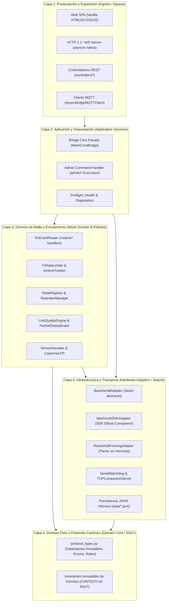
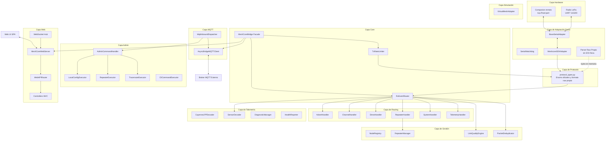
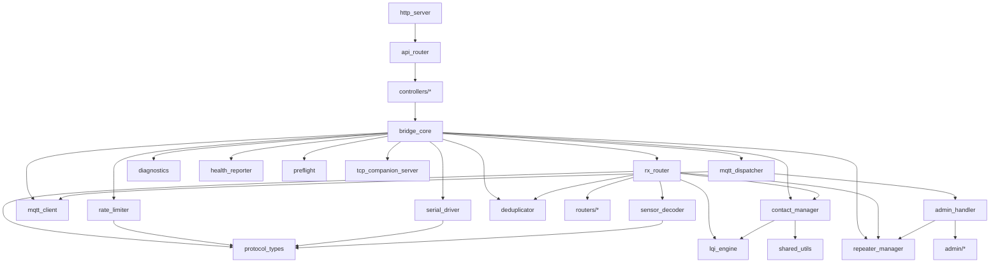
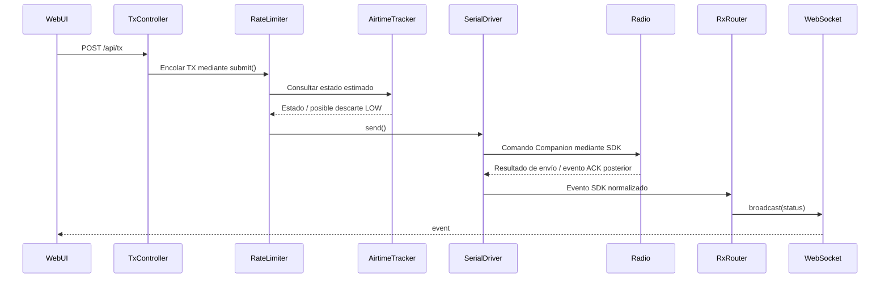
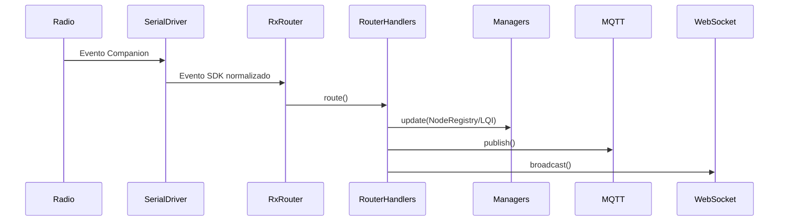
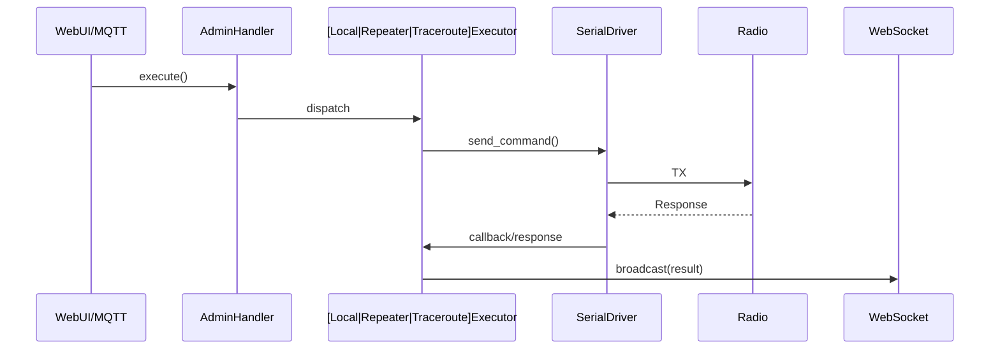

# Arquitectura de MeshCore Bridge v3.0

## 1. Resumen Ejecutivo
MeshCore Bridge v3.0 conecta una radio MeshCore Companion con MQTT, REST y una SPA mediante Python 3.10+ y `asyncio`. El camino de hardware habitual utiliza el SDK `meshcore`; el servidor Web implementa HTTP 1.1 y WebSocket con `asyncio.start_server`, sin ASGI.

Documento vigente revisado el 2026-09-29 por inspección de código. Los modelos/clases describen la implementación, no medidas de rendimiento o certificaciones. El [índice documental](README.md) distingue guías vigentes, contratos e informes históricos.

Actualización de preparación del 2026-10-09: existe un adaptador ASGI opcional e
inactivo en `src/web/asgi_server.py`, con estado prestado y controles de ingreso
HTTP/WS. La fábrica del bridge conserva `MeshCoreWebServer`; los diagramas
siguientes representan ese camino activo. La [fase 1](fastapi/PHASE_1_REPORT.md)
y su [seguridad](fastapi/PHASE_1_SECURITY_REPORT.md), junto con los
[DTO/errores de fase 2](fastapi/PHASE_2_REPORT.md), separan código preparatorio,
contratos pendientes y evidencia estática de aceptación operativa. La
[fase 3](fastapi/PHASE_3_REPORT.md) añade seis lotes REST y alias a la fábrica
inactiva, reutilizando dispatcher y contexto; no crea hardware o servicios.
Los DTO son metadata y no reserializan entrada ni cambian la validación de
controladores. El candidato redacta selectivamente errores retornados; el catch
global REST y errores de enteros compartidos omiten excepciones/valores tanto
en servidor actual como candidato. La [fase 4](fastapi/PHASE_4_REPORT.md) prepara
WS, SPA y teselas: presta los mapas, registra historial una vez y limita el
apagado con un deadline común del propietario. Los timers heredados de métricas
y ping idle son exclusivamente web, sin consultas RF/MQTT. El backend admite
fragmentación y su flow control difiere de `drain`. La [fase 5](fastapi/PHASE_5_REPORT.md)
prepara la especificación OpenAPI 3.1.0 diferida y el visor local offline en
`/docs`, `/redoc` y `/openapi.json` con autenticación estricta `X-Api-Key`, rechazo de
claves en URL, CSP restrictivo y política de solo lectura sin emisión RF. El servidor
predeterminado del bridge conserva `MeshCoreWebServer` y las puertas de aceptación siguen pendientes.

El framing Companion oficial (`<`/`>`, longitud `uint16` little-endian y payload) es distinto del formato raw propio `0xAA/0x55/0x1B` con CRC-16 de `MeshcoreFrame`. El adaptador raw actual es un parser en memoria sin E/S física; no es una etapa obligatoria del RX/TX SDK ni del paquete RF oficial.

## 1.1 Mapas Interactivos de Arquitectura (Generados con Archify)
El sistema cuenta con mapas interactivos de alta fidelidad compilados determinísticamente con el motor [**Archify** (`tt-a1i/archify`)](https://github.com/tt-a1i/archify). Estos artefactos son completamente autónomos en **HTML + SVG**, no requieren conexión a internet y cuentan con soporte para tema Claro/Oscuro, modos visuales (*classic*, *signal-flow*, *blueprint*), zoom, paneo, búsqueda y capítulos guiados:

- 🗺️ [**Arquitectura General del Sistema (`meshcore_architecture.html`)**](diagrams/meshcore_architecture.html): Mapeo completo de subsistemas, capas de aislamiento, drivers serie, núcleo asyncio, persistencia y clientes IP.
- ⚡ [**Pipeline Raw Propio a IP (`meshcore_packet_pipeline.html`)**](diagrams/meshcore_packet_pipeline.html): Camino del parser raw propio, validación CRC de ese formato, deduplicación y consumo IP. El camino SDK entrega eventos Companion sin pasar por ese parser.
- ⏱️ [**Secuencia Operativa Bidireccional (`meshcore_rx_tx_sequence.html`)**](diagrams/meshcore_rx_tx_sequence.html): Diagrama de secuencia temporal que ilustra la recepción reactiva de tramas y la ejecución de comandos administrativos Hop 0 con rate limiter.

> **Regeneración de diagramas**:
> Para compilar o validar los diagramas tras cualquier modificación arquitectónica, ejecute:
> ```bash
> python scripts/build_diagrams.py
> ```

## 2. Modelo Canónico de Arquitectura en 5 Capas

El sistema se estructura bajo una arquitectura limpia y desacoplada (*Clean Architecture* / *Ports & Adapters*) complementada con la filosofía de **Deep Modules** (John Ousterhout). Esta distribución organiza el código en cinco capas concéntricas con responsabilidades unívocas e invariantes de dominio:


```mermaid
flowchart TB
    subgraph L1 ["Capa 1: Presentación y Exposición (Ingress / Egress)"]
        direction LR
        UI["Web SPA (Vanilla HTML5/CSS3/JS)"]
        HTTP["HTTP 1.1 / WS Server (asyncio nativo)"]
        Controllers["Controladores REST (controllers/*)"]
        MQTT_Ext["Cliente MQTT (AsyncBridgeMQTTClient)"]
    end

    subgraph L2 ["Capa 2: Aplicación y Orquestación (Application Services)"]
        direction LR
        Facade["Bridge Core Facade (MeshCoreBridge)"]
        AdminHandler["Admin Command Handler (admin/* Executors)"]
        Lifecycle["Preflight, Health & Diagnostics"]
    end

    subgraph L3 ["Capa 3: Dominio de Malla y Enrutamiento (Mesh Domain & Policies)"]
        direction LR
        Router["RxEventRouter (routers/* handlers)"]
        RateLimiter["TxRateLimiter & AirtimeTracker"]
        Managers["NodeRegistry & RepeaterManager"]
        Engines["LinkQualityEngine & PacketDeduplicator"]
        Decoders["SensorDecoder & CayenneLPP"]
    end

    subgraph L4 ["Capa 4: Dominio Puro y Protocolo Canónico (Domain Core / SSoT)"]
        direction LR
        ProtTypes["protocol_types.py (Dataclasses inmutables, Enums, Roles)"]
        Invariants["Invariantes Inmutables de Dominio (CONTEXT.md SSoT)"]
    end

    subgraph L5 ["Capa 5: Infraestructura y Transporte (Hardware Adapters / Seams)"]
        direction LR
        BaseAdapter["BaseSerialAdapter (Seam abstracto)"]
        SDKAdapter["MeshcoreSDKAdapter (SDK Oficial Companion)"]
        RawAdapter["RawSerialFramingAdapter (Parser en memoria)"]
        Drivers["SerialWatchdog & TCPCompanionServer"]
        Storage["Persistencia JSON Atómica (data/*.json)"]
    end

    L1 --> L2
    L2 --> L3
    L3 --> L4
    L2 --> L5
    L3 --> L5
    L5 --> L4
```

### 2.1 Especificación y Mapeo Canónico de Capas

| Capa | Nombre Canónico | Responsabilidad Principal | Módulos y Rutas del Código |
|---|---|---|---|
| **Capa 1** | **Presentación y Exposición** | Frontera exterior con redes IP y usuarios humanos. Servidor HTTP/WS, controladores REST, cliente SPA y broker MQTT. Sin lógica RF directa. | [`src/web/`](file:///c:/Users/Ruby/Desktop/meshcore-bridge/src/web/) (SPA, `http_server.py`, `api_router.py`, `controllers/*`), [`src/mqtt_client.py`](file:///c:/Users/Ruby/Desktop/meshcore-bridge/src/mqtt_client.py), [`src/mqtt_dispatcher.py`](file:///c:/Users/Ruby/Desktop/meshcore-bridge/src/mqtt_dispatcher.py) |
| **Capa 2** | **Aplicación y Orquestación** | Orquestación de casos de uso de alto nivel, coordinación de ciclo de vida, apagado ordenado y despacho de comandos administrativos. | [`src/bridge_core.py`](file:///c:/Users/Ruby/Desktop/meshcore-bridge/src/bridge_core.py) (`MeshCoreBridge`), [`src/admin_handler.py`](file:///c:/Users/Ruby/Desktop/meshcore-bridge/src/admin_handler.py), [`src/admin/`](file:///c:/Users/Ruby/Desktop/meshcore-bridge/src/admin/) (`local_config`, `repeater`, `traceroute`, `cli`), [`src/preflight.py`](file:///c:/Users/Ruby/Desktop/meshcore-bridge/src/preflight.py), [`src/health_reporter.py`](file:///c:/Users/Ruby/Desktop/meshcore-bridge/src/health_reporter.py) |
| **Capa 3** | **Dominio de Malla y Enrutamiento** | Lógica de red LoRa: enrutamiento de eventos entrantes, priorización TX, estimación de airtime, deduplicación de ecos, LQI y gestión de nodos. | [`src/rx_router.py`](file:///c:/Users/Ruby/Desktop/meshcore-bridge/src/rx_router.py), [`src/routers/`](file:///c:/Users/Ruby/Desktop/meshcore-bridge/src/routers/), [`src/rate_limiter.py`](file:///c:/Users/Ruby/Desktop/meshcore-bridge/src/rate_limiter.py) (`TxRateLimiter`, `AirtimeTracker`), [`src/contact_manager.py`](file:///c:/Users/Ruby/Desktop/meshcore-bridge/src/contact_manager.py) (`NodeRegistry`), [`src/repeater_manager.py`](file:///c:/Users/Ruby/Desktop/meshcore-bridge/src/repeater_manager.py), [`src/lqi_engine.py`](file:///c:/Users/Ruby/Desktop/meshcore-bridge/src/lqi_engine.py), [`src/deduplicator.py`](file:///c:/Users/Ruby/Desktop/meshcore-bridge/src/deduplicator.py), [`src/sensor_decoder.py`](file:///c:/Users/Ruby/Desktop/meshcore-bridge/src/sensor_decoder.py) |
| **Capa 4** | **Dominio Puro y Protocolo Canónico** | Definiciones fundamentales del protocolo y tipos estrictos alineados con el firmware C/C++ oficial. Invariantes inmutables de dominio de [`CONTEXT.md`](file:///c:/Users/Ruby/Desktop/meshcore-bridge/CONTEXT.md). Libre de dependencias externas. | [`src/protocol_types.py`](file:///c:/Users/Ruby/Desktop/meshcore-bridge/src/protocol_types.py) (`FirmwareAdvertType`, roles, opcodes, eventos `@dataclass(frozen=True)`), invariantes canónicas de [`CONTEXT.md`](file:///c:/Users/Ruby/Desktop/meshcore-bridge/CONTEXT.md) |
| **Capa 5** | **Infraestructura y Transporte** | Abstracción de hardware (*Seams*), drivers de comunicación serie (UART/USB), sockets TCP, parser binario raw y persistencia atómica en disco. | [`src/serial/`](file:///c:/Users/Ruby/Desktop/meshcore-bridge/src/serial/) (`BaseSerialAdapter`, `MeshcoreSDKAdapter`, `RawSerialFramingAdapter`, `watchdog.py`), [`src/serial_driver.py`](file:///c:/Users/Ruby/Desktop/meshcore-bridge/src/serial_driver.py), [`src/tcp_companion_server.py`](file:///c:/Users/Ruby/Desktop/meshcore-bridge/src/tcp_companion_server.py), [`src/virtual_mesh_adapter.py`](file:///c:/Users/Ruby/Desktop/meshcore-bridge/src/virtual_mesh_adapter.py), repositorios JSON en disco |

### 2.2 Invariantes de Dependencia entre Capas

1. **Regla de Dependencia Unidireccional (DIP)**: El flujo de dependencias apunta siempre hacia adentro (hacia el Dominio). La Capa 4 no conoce a ninguna capa exterior.
2. **Desacoplamiento de Hardware mediante Seams**: Las capas de Aplicación y Dominio interactúan con la radio a través del contrato abstracto `BaseSerialAdapter` (Capa 5), permitiendo alternar entre el SDK oficial (`MeshcoreSDKAdapter`), simulación (`VirtualMeshAdapter`) o túnel TCP (`TCPCompanionServer`) sin alterar el código de enrutamiento ni los controladores.
3. **Invariantes Inmutables de Dominio en Capa 4**:
   - Dispositivos con rol `REPEATER` (`FirmwareAdvertType.REPEATER`) pertenecen exclusivamente a la infraestructura de red: nunca entran en la libreta de Contactos de chat (`#tab-contacts`) ni reciben mensajería directa/canales.
   - La estación base local (`LOCAL`) nunca se duplica como vecino ni puede ser destinataria de bucles locales de mensajería.
   - Todo paquete saliente (TX) en Capa 3 debe atravesar el control de airtime y cola de prioridades (`TxRateLimiter`) para proteger el medio compartido LoRa.

---

## 3. Diagrama de Arquitectura General


```mermaid
flowchart TB
    subgraph Capa Hardware
        Radio[Radio LoRa\nUART 115200]
        TCP[Companion remoto\ntcp://host:port]
    end

    subgraph Capa de Adaptación Serial
        WD[SerialWatchdog]
        Base[BaseSerialAdapter]
        SDK[MeshcoreSDKAdapter]
        Raw[Parser Raw Propio\nsin E/S física]
    end

    subgraph Capa de Protocolo
        PT[protocol_types.py\nEnums oficiales y formato raw propio]
    end

    subgraph Capa Core
        Bridge[MeshCoreBridge Facade]
        RxR[RxEventRouter]
        TxL[TxRateLimiter]
    end

    subgraph Capa de Routing
        R_ADV[AdvertHandler]
        R_CH[ChannelHandler]
        R_DIR[DirectHandler]
        R_REP[RepeaterHandler]
        R_SYS[SystemHandler]
        R_TEL[TelemetryHandler]
    end

    subgraph Capa Admin
        Admin[AdminCommandHandler]
        LocConf[LocalConfigExecutor]
        RepConf[RepeaterExecutor]
        Trace[TracerouteExecutor]
        CliExec[CliCommandExecutor]
    end

    subgraph Capa de Gestión
        NR[NodeRegistry]
        RM[RepeaterManager]
        LQI[LinkQualityEngine]
        DED[PacketDeduplicator]
    end

    subgraph Capa de Telemetría
        Cayenne[CayenneLPPDecoder]
        Sens[SensorDecoder]
        Diag[DiagnosticManager]
        Health[HealthReporter]
    end

    subgraph Capa MQTT
        MQTT[AsyncBridgeMQTTClient]
        MDisp[MqttInboundDispatcher]
    end

    subgraph Capa Web
        Web[MeshCoreWebServer]
        API[WebAPIRouter]
        CTRL[Controllers MVC]
        WSH[WebSocket Hub]
    end

    subgraph Capa Simulación
        Sim[VirtualMeshAdapter]
    end

    Radio <--> Base
    TCP <--> Base
    Base <--> SDK
    Raw -. bytes en memoria .-> PT
    SDK --> PT

    PT --> RxR
    TxL --> PT

    RxR --> R_ADV & R_CH & R_DIR & R_REP & R_SYS & R_TEL
    R_REP --> RM
    RxR --> LQI & DED & Sens

    Admin --> LocConf & RepConf & Trace

    Bridge --> RxR & TxL & MQTT & Web
    MDisp --> MQTT & Admin
    MQTT <--> ExternalBroker[Broker MQTT Externo]

    API --> CTRL
    Web --> API
    WSH --> Web
    WebUI[Web UI SPA] <--> Web
```

## 4. Diagrama de Dependencias entre Módulos


```mermaid
graph TD
    bridge_core --> serial_driver
    bridge_core --> rx_router
    bridge_core --> mqtt_client
    bridge_core --> mqtt_dispatcher
    bridge_core --> rate_limiter
    bridge_core --> contact_manager
    bridge_core --> diagnostics
    bridge_core --> deduplicator
    bridge_core --> health_reporter
    bridge_core --> preflight
    bridge_core --> repeater_manager
    bridge_core --> tcp_companion_server

    rx_router --> routers_star[routers/*]
    rx_router --> contact_manager
    rx_router --> protocol_types
    rx_router --> lqi_engine
    rx_router --> sensor_decoder
    rx_router --> deduplicator
    rx_router --> repeater_manager

    mqtt_dispatcher --> mqtt_client
    mqtt_dispatcher --> admin_handler

    admin_handler --> admin_star[admin/*]
    admin_handler --> repeater_manager

    contact_manager --> lqi_engine
    contact_manager --> shared_utils

    rate_limiter --> protocol_types
    serial_driver --> protocol_types
    sensor_decoder --> protocol_types

    http_server --> api_router
    api_router --> controllers_star[controllers/*]
    controllers_star --> bridge_core

    protocol_types
```

## 5. Diagramas de Secuencia (Flujos Principales)

### 5.1 TX Completo (Transmisión a la red de Radio)


```mermaid
sequenceDiagram
    participant WebUI
    participant TxController
    participant RateLimiter
    participant AirtimeTracker
    participant SerialDriver
    participant Radio
    participant RxRouter
    participant WebSocket

    WebUI->>TxController: POST /api/tx
    TxController->>RateLimiter: Encolar TX mediante submit()
    RateLimiter->>AirtimeTracker: Consultar estado estimado
    AirtimeTracker-->>RateLimiter: Estado / posible descarte LOW
    RateLimiter->>SerialDriver: send()
    SerialDriver->>Radio: Comando Companion mediante SDK
    Radio-->>SerialDriver: Resultado de envío / evento ACK posterior
    SerialDriver->>RxRouter: Evento SDK normalizado
    RxRouter->>WebSocket: broadcast(status)
    WebSocket-->>WebUI: event
```

### 5.2 RX Completo (Recepción desde la red de Radio)


```mermaid
sequenceDiagram
    participant Radio
    participant SerialDriver
    participant RxRouter
    participant RouterHandlers
    participant Managers
    participant MQTT
    participant WebSocket

    Radio->>SerialDriver: Evento Companion
    SerialDriver->>RxRouter: Evento SDK normalizado
    RxRouter->>RouterHandlers: route()
    RouterHandlers->>Managers: update(NodeRegistry/LQI)
    RouterHandlers->>MQTT: publish()
    RouterHandlers->>WebSocket: broadcast()
```

### 5.3 Comando de Administración (Local o Remoto)


```mermaid
sequenceDiagram
    participant Source as WebUI/MQTT
    participant AdminHandler
    participant Executors as [Local|Repeater|Traceroute]Executor
    participant SerialDriver
    participant Radio
    participant WebSocket

    Source->>AdminHandler: execute()
    AdminHandler->>Executors: dispatch
    Executors->>SerialDriver: send_command()
    SerialDriver->>Radio: TX
    Radio-->>SerialDriver: Response
    SerialDriver->>Executors: callback/response
    Executors->>WebSocket: broadcast(result)
```

### 5.4 Ciclo de Vida (Startup → Shutdown)

```mermaid
sequenceDiagram
    participant Main
    participant Preflight
    participant BridgeCore
    participant Config
    participant Serial
    participant MQTT
    participant Web
    participant EventLoop

    Main->>Preflight: run()
    Preflight-->>Main: ok
    Main->>BridgeCore: init()
    BridgeCore->>Config: load()
    BridgeCore->>Serial: connect()
    BridgeCore->>MQTT: connect()
    BridgeCore->>Web: start()
    BridgeCore->>EventLoop: run_forever()
    note over EventLoop: Running
    EventLoop->>BridgeCore: SIGINT
    BridgeCore->>MQTT: Publicar offline (graceful_shutdown); LWT para caída inesperada
    BridgeCore->>Web: stop()
    BridgeCore->>Serial: close()
    BridgeCore->>Main: exit
```

## 6. Catálogo de Clases Principales

| Nombre de clase | Módulo | Responsabilidad | Patrón | Dependencias |
| --- | --- | --- | --- | --- |
| `MeshCoreBridge` | `bridge_core.py` | Orquesta la aplicación uniendo MQTT, Web, Serial y Routers. | Facade | `serial_driver`, `rx_router`, `mqtt_client`, etc. |
| `BaseSerialAdapter` | `serial/serial_base.py` | Interfaz para adaptadores. | Adapter | Ninguna explícita |
| `MeshcoreSDKAdapter` | `serial/sdk_adapter.py` | Comunicación USB/TCP con SDK MeshCore. | Adapter | `protocol_types`, `meshcore` |
| `RawSerialFramingAdapter` | `serial/raw_framing.py` | Parser en memoria del formato propio SOF=0xAA, EOF=0x55, ESC=0x1B y CRC; sin E/S física actual. | Adapter | `protocol_types` |
| `SerialWatchdog` | `serial/watchdog.py` | Supervisa vivacidad local y reconecta el adaptador. | Watchdog | `BaseSerialAdapter` |
| `RxEventRouter` | `rx_router.py` | Enruta mensajes recibidos de la radio a los handlers correctos. | Strategy / Router | `routers/*`, `contact_manager`, etc. |
| `TxRateLimiter` | `rate_limiter.py` | Controla la tasa de envío (Duty Cycle) a la red de radio. | Rate Limiter | `protocol_types` |
| `CustomTxQueue` | `rate_limiter.py` | Cola de prioridad asíncrona para la transmisión de paquetes. | Priority Queue | Ninguna |
| `AirtimeTracker` | `rate_limiter.py` | Rastrea el tiempo en el aire para limitar transmisiones. | Tracker | Ninguna |
| `NodeRegistry` | `contact_manager.py` | Directorio en RAM con persistencia JSON atómica. | Repository | `lqi_engine` |
| `NodeContactInfo` | `contact_manager.py` | Estructura que almacena la información y métricas de un contacto en la malla. | DTO | Ninguna |
| `RepeaterManager` | `repeater_manager.py` | Controla repetidores, rutas, jerarquías y tablas de salto de la red. | Manager | Ninguna |
| `AsyncBridgeMQTTClient` | `mqtt_client.py` | Cliente asíncrono para publicar e interactuar con brokers MQTT. | Proxy / Client | Ninguna |
| `MqttInboundDispatcher` | `mqtt_dispatcher.py` | Escucha suscripciones MQTT y despacha a módulos u operaciones. | Dispatcher | `mqtt_client`, `admin_handler` |
| `PacketDeduplicator` | `deduplicator.py` | Evita la re-evaluación y retransmisión de paquetes duplicados vía Hash. | Cache | Ninguna |
| `AdminCommandHandler` | `admin_handler.py` | Interpreta, mapea y delega la ejecución de comandos de administración por Web/MQTT. | Command Invoker | `admin/*`, `repeater_manager` |
| `LocalConfigExecutor` | `admin/local_config_executor.py` | Ejecuta comandos de configuración en el nodo base local. | Command | `serial_driver` |
| `RepeaterAdminExecutor` | `admin/repeater_executor.py` | Autentica y ejecuta administración remota de repetidores vía SDK. | Command | `serial_driver` |
| `TracerouteExecutor` | `admin/traceroute_executor.py` | Envía `send_trace` y espera `TRACE_DATA` para inspeccionar la ruta; no ejecuta pings progresivos. | Command | `serial_driver` |
| `CliCommandExecutor` | `admin/cli_command_executor.py` | Ejecuta comandos de terminal CLI de radio local (ver, bat, stats_core, etc.). | Command / Executor | `serial_driver` |
| Decodificador CayenneLPP | `sensor_decoder.py` | Funciones nativas de decodificación y `SensorReading`, sin `pycayennelpp`. | Decoder | `shared_utils`, biblioteca estándar |
| `LinkQualityEngine` | `lqi_engine.py` | Calcula LQI con SNR, RSSI y saltos, EMA y decaimiento temporal; no acredita enlaces bidireccionales. | Engine | Ninguna |
| `DiagnosticManager` | `diagnostics.py` | Colecta métricas de OS, proceso y logs para reportes de salud avanzados. | Manager | Ninguna |
| `HealthReporter` | `health_reporter.py` | Publica conectividad, uptime, nodos, cola TX y contadores en MQTT; sin métricas RAM/CPU del OS. | Worker | `mqtt_client` |
| `MeshCoreWebServer` | `web/http_server.py` | Servidor HTTP nativo de asyncio para servir SPA, UI y WebSockets. | Server | `WebAPIRouter` |
| `WebAPIRouter` | `web/api_router.py` | Enrutador HTTP que dirige el tráfico a módulos tipo API de dominio. | Router / Dispatcher | `controllers/*` |
| `LogsController` | `web/controllers/logs_controller.py` | Controlador REST dedicado para mensajes, telemetría y logs del sistema. | Controller (MVC) | `diagnostics`, `PacketBuffer` |
| `VirtualMeshAdapter` | `virtual_mesh_adapter.py` | Simula la interfaz de radio completa para pruebas de integración continua. | Mock / Adapter | Ninguna |
| `MeshCoreCompanionServer` | `tcp_companion_server.py`| Permite conectar radios remotamente mediante un túnel TCP (Proxy). | Server | Ninguna |
| `PacketBuffer` | `packet_buffer.py` | Búfer rotatorio (Ring Buffer) que registra temporalmente los paquetes TX/RX. | Buffer | Ninguna |
| `TargetResolver` | `target_resolver.py` | Convierte nombres lógicos, alias o strings cortos de ID en las pubkeys verdaderas de la malla. | Resolver | `NodeRegistry` |

## 7. Subpaquetes y Patrones de Diseño

- **`src/routers/`**: Utiliza el **Strategy Pattern** para enrutar los diferentes tipos de paquetes RF (`AdvertHandler`, `ChannelHandler`, `DirectHandler`, `RepeaterHandler`, `SystemHandler`, `TelemetryHandler`). Al desacoplar la lógica, simplifica la expansión del formato de los mensajes.
- **`src/admin/`**: Implementa un esquema de comandos basado en **Command Pattern** y **Strategy Pattern** para separar la lógica de parseo, de la ejecución en RF: (`LocalConfigExecutor`, `RepeaterAdminExecutor`, `TracerouteExecutor`).

  El executor remoto convierte `NodeContactInfo` obtenido por nombre/alias a su representación dict antes de aplicar guards de identidad/rol. Los comandos unitarios se construyen y validan antes de autenticación, consumo de cooldown y envío: un resultado no compilable devuelve error administrativo con `code: 422`. La preparación local de contactos SDK del dispatcher permanece previa. Los resultados de lote usan `redact_sensitive_mapping` con salida dict; el redactor general conserva soporte de estructuras arbitrarias. PIN y potencia TX nulos se rechazan en prevalidación del lote local. Ver [corrección y evidencia del 2026-10-04](BACKEND_DOCUMENTED_ERRORS_FIX_2026-10-04.md).

- **`src/web/controllers/`**: Sigue el patrón **MVC / Modular Controllers**. Organiza unívocamente las rutas REST por dominios funcionales (Contactos, Nodos, Sistema, Transmisiones).

## 8. Mapa de Endpoints REST API

| Método HTTP | Ruta | Controller | Descripción |
| --- | --- | --- | --- |
| GET | `/api/status` | `SystemController` | Estado físico y lógico del nodo local y del bridge. |
| GET | `/api/health` | `SystemController` | Reporta subsistemas, contadores, uptime y último error mediante DiagnosticManager; sin métricas RAM/disco/CPU del OS. |
| GET | `/api/diagnostics` | `SystemController` | Idéntico a `/api/health`. |
| GET | `/api/diagnostics/report.md` | `WebAPIRouter` / `DiagnosticManager` | Reporte Markdown, con respuesta JSON que contiene el texto. |
| GET | `/api/preflight` | `SystemController` | Analiza disponibilidad de sistema de archivos, hardware y dependencias. |
| GET | `/api/system/logs/level` | `LogsController` | Obtiene el nivel de severidad de logs actual del módulo principal. |
| POST | `/api/system/logs/level` | `LogsController` | Altera en caliente la verbosidad global de logs del sistema (`INFO`, `DEBUG`, etc.). |
| DELETE | `/api/system/logs` | `LogsController` | Depura el historial de logs del sistema residentes en la memoria RAM del bridge. |
| GET | `/api/system/logs` | `LogsController` | Interfaz paginable para visualizar logs del sistema filtrables. |
| GET | `/api/packets/export` | `PacketsController` | Exportación JSON de todos los paquetes (TX/RX) capturados localmente. |
| DELETE | `/api/packets` | `PacketsController` | Vacía las capturas del buffer RAM; no elimina una base de datos en disco. |
| GET | `/api/packets` | `PacketsController` | Interfaz de análisis paginada para la depuración forense RF del tráfico en aire. |
| GET | `/api/nodes` | `NodesController` | Devuelve el catálogo y lista maestra de nodos almacenados. |
| GET | `/api/lqi` | `NodesController` | Informe del índice Link Quality (LQI) entre vecinos en la malla local. |
| GET | `/api/analytics` | `NodesController` | Calcula KPIs agregados sobre topología, baterías promedio, etc. |
| GET | `/api/rf/heatmap` | `NodesController` | Puntos GPS de nodos con RSSI/SNR y rol; no devuelve aristas de un grafo L2. |
| GET | `/api/airtime/stats` | `NodesController` | Reporta los tiempos en el aire (Airtime) y métricas de Duty-Cycle. |
| GET | `/api/rf/noise` | `NodesController` | Procesa datos de ruido de fondo (SNR/RSSI de base) de nodos para el mapa en vivo. |
| GET | `/api/contacts/discovered` | `ContactsController` | Lista los nodos observados de manera anónima y pasiva, pero no añadidos a la agenda. |
| POST | `/api/contacts/accept` | `ContactsController` | Añade un nodo de la lista "Descubiertos" directamente al archivo permanente. |
| GET, POST... | `/api/contacts/*` | `ContactsController` | Manejo CRUD base para la agenda telefónica del nodo. |
| GET, POST... | `/api/channels/*` | `ChannelsController` | CRUD/sincronización de índices, nombres y PSK de canales lógicos; no configuran una frecuencia RF distinta por canal. |
| POST | `/api/tx` | `TxController` | Comando de inyección directa de un mensaje de texto para salida al aire. |
| GET | `/api/messages` | `LogsController` | Consulta paginada y filtrada de mensajes textuales almacenados. |
| GET | `/api/messages/recent` | `TxController` | Consulta mensajes recientes en RAM. |
| POST | `/api/admin` | `RepeaterController` | Entrada de administración; `/api/admin/command` es alias. |
| POST | `/api/admin/repeater` | `RepeaterController` | Invocador base que interactúa con la lógica central de repetición remota en el aire. |
| POST | `/api/repeater/remote/login` | `RepeaterController` | Solicita autenticación administrativa al repetidor remoto. |
| POST | `/api/repeater/remote/logout` | `RepeaterController` | Libera recursos y anula el inicio de sesión remoto. |
| POST | `/api/repeater/remote/config` | `RepeaterController` | Envía comandos CLI autenticados y correlacionados; distingue aplicado, preferencias guardadas y despacho no confirmado. |
| POST | `/api/repeater/remote/action` | `RepeaterController` | Ejecución de una acción instantánea en el dispositivo objetivo (e.g., LED Toggle). |
| POST | `/api/repeater/ping_zero` | `RepeaterController` | Operación de diagnóstico Hop 0; también `/api/node/ping_zero`. No es ICMP IP. |
| POST | `/api/traceroute` | `RepeaterController` | Herramienta de medición y exploración de saltos entre el servidor y un destino remoto. |
| GET | `/api/config` | `ConfigController` | Devuelve caché/defaults de configuración y métricas runtime; `refresh` solicita consulta al hardware con fallback. |
| POST | `/api/config` | `ConfigController` | Aplica una configuración estructural de manera unificada a variables de sistema y hardware. |
| POST | `/api/config/radio` | `ConfigController` | Refuerza cambios a las portadoras (BW, Frecuencia, Spreading Factor). |
| POST | `/api/config/identity` | `ConfigController` | Edita el pseudónimo del puente y propiedades de visualización pública. |
| POST | `/api/node/advert` | `ConfigController` | Desencadena una transmisión obligatoria a todos los nodos con los detalles de presencia y métricas. |
| POST | `/api/node/reboot` | `ConfigController` | Ordena apagado y encendido de MCU del módem RF adjunto al puente local. |
| GET | `/api/map/status` | `MapTileService` | Valida si el módulo local dispone de cartografía sin conexión funcional en el dispositivo base. |
| GET | `/api/map/tiles/...` | `MapTileService` | Despacho binario nativo (blob) para teselas OSM/Slippy pre-cachadas. |
| GET | `/api/telemetry` | `LogsController` | Recupera el buffer histórico (RAM) de variables métricas medioambientales procesadas. |
| GET | `/api/logs/download` | `LogsController` | Inicia una descarga física de los archivos de registro brutos del framework. |

## 9. Mapa de Eventos WebSocket

| Nombre del Evento | Dirección | Payload | Módulo Emisor / Responsable |
| --- | --- | --- | --- |
| `ping` / `pong` | Bidireccional | `{ type, timestamp }` | Servidor Python `MeshCoreWebServer` y Cliente Javascript para KeepAlive. |
| `metrics_update` | Server→Client | `node_count`, `rx_count`, `tx_count`, `error_rate`, `queue_depth`, `serial_connected` | Periodicidad `WS_METRICS_INTERVAL_SEC` (default de config: 5 s). |
| `system_log` | Server→Client | `level`, `message`, `source`, `timestamp` | Re-despachado por el registro en vivo desde `WebAPIRouter` y subsistema `DiagnosticManager`. |
| `rf_packet` | Server→Client | Headers crudos L2 interceptados, metadata LQI. | Enrutado nativo a través del hub originado en `RxEventRouter` post-parseo. |
| `ws_connected` | Server→Client | `message`, `timestamp` | Evento de handshake inicial en apertura confirmando vinculación con SPA local de UI. |
| Otros (ej: mensajes de chat) | Server→Client | Payload RF completo decodificado L3. | Capturados genéricamente y retransmitidos al `EventBus` (`EVENTS.RX_PACKET`) en la SPA UI. |

## 10. Tópicos MQTT Principales

| Tópico (`topic_prefix/...`) | Puente Publica | Puente Suscribe | Descripción |
| --- | --- | --- | --- |
| `{prefix}/bridge/state` | Sí | No | Estado Last Will Testament del servidor local (Online / Offline). |
| `{prefix}/bridge/health` | Sí | No | Salud periódica del bridge: conectividad, uptime, nodos, cola y contadores; sin RAM/CPU del OS. |
| `{prefix}/rx/all` | Sí | No | Stream unificado de eventos normalizados. |
| `{prefix}/rx/public`, `{prefix}/rx/channel/ch_<idx>` | Sí | No | Mensajería de canales lógicos. |
| `{prefix}/rx/direct/<sender_id>` | Sí | No | Mensajes directos recibidos. |
| `{prefix}/rx/telemetry`, `{prefix}/rx/nodes`, `{prefix}/rx/log` | Sí | No | Telemetría, anuncios/nodos y registros RF. |
| `{prefix}/tx` | No | Sí | Inyección externa. Escucha strings para que el Puente enrute hacia un paquete LoRa a los nodos en la banda. |
| `{prefix}/tx/status` | Sí | No | Resultado del envío o error; la confirmación de entrega DM/ACK se procesa como evento separado. |
| `{prefix}/admin/cmd` | No | Sí | Administración JSON con `action` en el dict entregado al handler. El fallback textual/escalar pierde la acción en el checkout actual; divergencia pendiente, véase PROJECT_KNOWLEDGE.md. |
| `{prefix}/admin/status` | Sí | No | Proporciona una salida JSON formateada y serializada confirmando los comandos remotos al broker MQTT. |
| `{prefix}/admin/repeater/{node_id}/cmd` | No | Sí | Comandos remotos específicos para repetidores suscritos vía wildcard (`{prefix}/admin/repeater/+/cmd`). |
| `{prefix}/admin/repeater/{node_id}/status` | Sí | No | Reportes específicos dirigidos que confirman latencias y estados de repetidores tras comandos remotos por RF. |
| `{prefix}/admin/repeater/{node_id}/ping_zero` | Sí | No | Información en tiempo real que documenta el nivel L2 (Zero Ping) y RF métricas hacia nodos concretos. |
| `{prefix}/admin/repeater/{node_id}/trace` | Sí | No | Rutas punto-a-punto decodificadas y saltos en formato Traceroute dirigidos al hub MQTT externo. |
| `{prefix}/{channel}/public` | Sí | No | Salidas del chat global encriptado a canales MQTT si la función de Forwarder está activa. |

## 11. Seguridad y Resiliencia Perimetral

- **Autenticación API (`BRIDGE_API_KEY`)**: Cuando está configurada, se exige la cabecera `X-Api-Key` o parámetro `?api_key=` en todas las mutaciones (`POST`, `PUT`, `DELETE`, `PATCH`), endpoints de administración, inyección RF (`/api/tx`), descargas de logs (`/api/logs/download`, `/api/logs/raw`), listado/exportación de capturas (`/api/packets`, `/api/packets/export`, también HEAD) y handshakes de WebSocket. REST/WS usan el mismo parser URL/UTF-8; una cabecera no vacía tiene prioridad, y las claves duplicadas en query se rechazan. Comparación constante por bytes UTF-8. Modo permisivo por defecto para desarrollo local si la variable no está definida.
- **Límite de Conexiones WebSocket**: Máximo 32 conexiones simultáneas concurrentes para prevenir agotamiento de descriptores de sockets y memoria en SBCs.
- **Protección de Teselas Cartográficas**: Validación estricta de coordenadas y zoom ($0 \le z \le 22$, $0 \le x < 2^z$, $0 \le y < 2^z$) para evitar desbordamientos de enteros o caídas por desplazamiento negativo de bits.
- **Autoridad de Roles**: La clasificación canónica deriva de `FirmwareAdvertType` (0/1 CLIENT, 2 REPEATER, 3 ROOM, 4 SENSOR), no del nombre. Las restricciones de `CONTEXT.md` excluyen repetidores y nodo local de Contactos/chat. Las heurísticas de normalización que aún existan deben revisarse frente a esa autoridad; la documentación no certifica cada ruta.

## 12. Persistencia y límites del modelo

| Estado | Almacenamiento actual |
| --- | --- |
| Nodos | Registro RAM y JSON atómico (`NODE_REGISTRY_STORAGE_PATH`), serializado desde campos crudos del dominio, preservando None; independiente del DTO visual. |
| Canales | JSON atómico (`CHANNELS_JSON_PATH`) y sincronización con firmware. |
| Contactos | SDK/memoria de radio y registro local; sólo clientes en la agenda de chat. |
| Airtime | Estimación con historial JSON (`AIRTIME_HISTORY_FILE`). |
| Capturas de paquetes, deduplicación, buffers Web y ACKs | RAM; no garantizan supervivencia a reinicios. |
| Mensajes del navegador | IndexedDB del cliente. |
| Logs | Archivos rotados y buffer de visualización en RAM. |
| Cartografía | Archivos XYZ o lectura de SQLite MBTiles, independiente de nodos/mensajes. |

No hay base SQLite de nodos/mensajes ni cola MQTT durable en disco. El código separa el parser raw propio del transporte SDK; los diagramas raw no deben leerse como un pipeline obligatorio del Companion. `TxRateLimiter` estima airtime, espacia TX y puede descartar prioridad `LOW` en estado crítico, pero no aplica un bloqueo absoluto a toda transmisión.

El mapa REST es una selección de rutas: `ROUTE_ALIASES` y los dispatchers de `src/web/api_router.py` son la autoridad de implementación, con métodos/validación en los controladores. El estado `sent` de TX describe el resultado del envío; entrega DM/ACK y recepción en otros nodos son hechos distintos. Configuración de firmware, temporizadores, sondeos y reintentos pueden consumir RF: aplicar el checklist de `AGENTS.md` antes de introducir cambios y acordar umbrales/intervalos con el usuario.

### Guardado de configuración local Companion

La SPA envía únicamente campos editados y exige `applied` por campo para confirmar
un guardado. El executor serializa guardados y refrescos con el mismo lock,
sincroniza snapshots SDK/serial después de un ACK y conserva baselines de
parámetros agrupados; rechaza el lote antes de escribir si falta alguno. Los
lotes pueden quedar parcialmente aplicados y se reportan como tales.

`GET /api/config` expone `data.capabilities`: los intervalos periódicos de
telemetría/anuncios, propietario, límite de saltos, altitud y posición fija no
tienen setter local Companion; sus escrituras se rechazan con 422. Los modos de
telemetría son permisos para responder solicitudes, sin scheduler de envíos.
La UI no presenta los valores históricos RAM como ajustes aplicables. Evidencia
y aceptación: [LOCAL_CONFIGURATION_SAVE_FIX_2026-10-04.md](LOCAL_CONFIGURATION_SAVE_FIX_2026-10-04.md).

### Parámetros avanzados y configuración remota

Autoadd local conserva flags observados y usa el byte opcional de max hops sólo
cuando el firmware lo reporta. Flood scope se serializa por bytes UTF-8 con
nombre canónico y clave; reset consiste en un opcode. Path hash exige un campo
DEVICE_INFO real, sin sustituir una lectura fallida por 0. Variables de sensor
son configuraciones predefinidas; la API no simula borrado de claves.

El executor remoto serializa solicitudes por objetivo y asocia respuestas CLI
por tag y emisor. `MSG_SENT` es despacho; los SET esperan respuesta del firmware
y reportan `applied`, `saved`, `unconfirmed` y errores parciales. Las rutas
conservan HTTP 200 para despacho válido: el consumidor debe examinar también
`data.status`. Un fallo incluye detalles parciales redactados, sin éxito global.

`set radio` remoto guarda preferencias que requieren reinicio. `get radio`
también lee preferencias: ambas rutas separan `saved` del registro RF observado
y no actualizan frecuencia/BW/SF/CR activos a partir de ellas. Los GET escalares
se interpretan por comando; owner/status/ACL utilizan los payloads binarios SDK.
La consola no deriva estado del dispositivo desde ecos TX o líneas arbitrarias.
Las respuestas privadas necesarias para confirmar contraseñas se redactan
antes de publicarse por REST, MQTT y WebSocket.

La SPA envía sólo campos editados, conserva borradores pendientes y restringe
datos recibidos al objetivo abierto. Los controles sin setter oficial se
deshabilitan; presets de región no se envían como parámetros del dispositivo.
No se añadieron sondeos RF, reintentos, timers ni intervalos nuevos.
Matriz, evidencia y aceptación física pendiente:
[CONFIGURATION_PARAMETERS_AUDIT_2026-10-04.md](CONFIGURATION_PARAMETERS_AUDIT_2026-10-04.md).

### Fronteras de recepción y estado observado

Las respuestas CLI conservan su entrega privada al waiter administrativo.
La captura pública protege todo contenido administrativo antes de almacenar:
conserva metadatos/tamaño, marca `content_redacted` y elimina bytes/payload
arbitrarios para JSON, CSV, hex y PCAP. Una respuesta CLI sin correlación
no se interpreta como batería ni se publica como texto administrativo arbitrario.
Las salidas de AdminHandler/CLI y la publicación MQTT administrativa usan
el redactor canónico; PIN devuelve 0 con `has_pin`, sin modificar la caché privada.

PATH_UPDATE y logs RF tienen operación específica en su estrategia propietaria.
El primero usa GET_CONTACT_BY_KEY local por el lock compartido Companion,
admite sólo la respuesta del objetivo y no cuenta como recepción RF.
RX_LOG_DATA preserva la observación pasiva de path y su trust declarado.
No hay sondeos periódicos nuevos. SELF_INFO normaliza TX int8 en una frontera
común, sin clamp hardware ni modificación del payload privado SDK.

La analítica no inventa potencia ni conectividad desde defaults de un editor.
`connected_clients_count_source` distingue vecinos, contador reportado y
ausencia de evidencia. Archivos históricos que ya contienen defaults no
permiten inferir su origen; no se migran automáticamente. El DTO visual conserva
límites observados y None en ausencia de lectura; la SPA distingue medida/capacidad
en el slider. Evidencia y seguimiento:
[AUDIT_REMEDIATION_2026-10-05.md](AUDIT_REMEDIATION_2026-10-05.md).

### Admisión, confirmaciones y aislamiento de QA

Recepción limita a 256 trabajos pendientes y usa workers con concurrencia
existente. Despacho/broadcast/rutas comparten ownership; las estrategias no
crean otra cola de tareas. Snapshots de igual identidad se agrupan. Saturación
crítica registra RX-OVERFLOW/error, sin prometer entrega pública ilimitada.
ACK retiene hasta 200 correlaciones, expira a 3600 s monotónicos y se consume
una vez. TX válido sin slot retorna sent con delivery_tracking explícito.
Límites aprobados, sin timer/reintento RF nuevo.

El bridge también entrega al pool las factorías de notificación/log/TCP iniciadas
en su loop, evitando tareas desacopladas por recepción. Overflow evita broadcast
de su propio log. MQTT reserva capacidad con lock antes de publicar callbacks
entre hilos, libera cada token al completar/cancelar y cierra sus propios handles.
Se mantiene el presupuesto existente que ya contaba tareas externas.

RepeaterManager persiste cinco categorías de timestamps UTC en
DATA_DIR/repeater_cooldowns.json. Carga/escritura usan to_thread y reemplazo
atómico; la reserva se guarda antes del paquete. El reloj monotónico se
reconstruye al reiniciar, conservando cooldown completo si UTC retrocede.
Guardar configuración no rearma timers; no hay sondeo RF nuevo. Cierre intenta
flush bajo el límite existente y hace visible un fallo, sin prometer durabilidad
ante pérdida de energía o bloqueo de disco. Detalles:
[admisión y política](audits/fixes-2026-10-05/policy-remaining.md).

El chat conserva ACK concurrente, recupera borrador al fallar y descarta historial
obsoleto al cambiar de feed. Capturas usan sesión/ID, desc antes de paginar y
merge HTTP/WS por generación. Lectores/reportes de logs comparten rutas reales;
un LogRecord manual se entrega una vez al handler. Recarga cartográfica exige
POST autorizado. Métricas distinguen sesión e intervalo actual parcial.

La demo usa proceso/directorio temporal, MQTT en memoria y adaptador virtual
desde construcción; mapas respetan DATA_DIR. MQTT ofrece TLS opcional con
certificado/hostname verificados, CA del sistema o explícita y mTLS; un fallo
de confianza no degrada a plaintext. Detalles:
[core](audits/fixes-2026-10-05/core-remaining.md),
[web](audits/fixes-2026-10-05/web-remaining.md) y
[calidad](audits/fixes-2026-10-05/quality-remaining.md).
