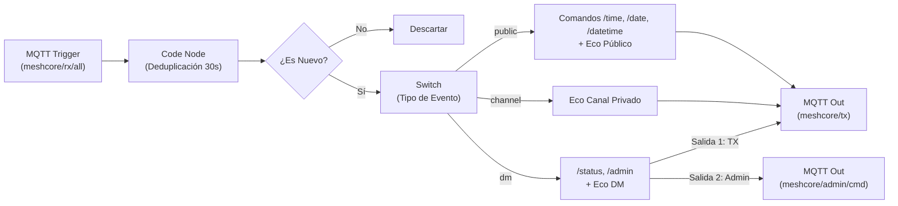

# Explicación Técnica del Código: MeshCore Universal Bridge

Este documento detalla la arquitectura, decisiones de diseño, flujo de concurrencia, mecanismos de resiliencia de grado industrial (**Store & Forward SQLite WAL**, **LoRa Rate Limiter**, **Serial Watchdog**, **Health Metrics**) y el funcionamiento del puente **`meshcore_bridge.py`** con cualquier placa compatible (Heltec, LilyGO, RAKwireless, Seeed, RP2040) y el workflow de **n8n**.

---

## 1. Arquitectura de Concurrencia (Asyncio + Threading)

Uno de los aspectos más críticos al integrar la librería `meshcore` (basada en `asyncio`) con `paho-mqtt` (basada en hilos del sistema operativo) es garantizar la seguridad entre hilos (*thread safety*) y evitar bloqueos del bucle de eventos.

```mermaid
sequenceDiagram
    participant OS as Sistema Operativo
    participant MQTT_Th as Hilo de Red Paho MQTT
    participant Loop as Event Loop Asyncio (Python)
    participant MC as Placa MeshCore (Heltec / LilyGO / RAK / Seeed)
    participant n8n as Motor n8n

    Note over MQTT_Th,Loop: 1. Ingesta de Comando desde MQTT
    n8n->>MQTT_Th: Publica en meshcore/tx
    MQTT_Th->>Loop: asyncio.run_coroutine_threadsafe(handle_tx)
    Loop->>MC: await mc.commands.send_chan_msg()
    MC-->>Loop: Confirmación RF
    Loop->>MQTT_Th: mqtt_client.publish(meshcore/tx/status)
    MQTT_Th->>n8n: ACK de Transmisión

    Note over MC,Loop: 2. Evento RF Recibido de la Malla
    MC->>Loop: Dispara on_mesh_event(CHANNEL_MSG_RECV)
    Loop->>Loop: Normalizar Payload + Extraer Métricas
    Loop->>MQTT_Th: mqtt_client.publish(meshcore/rx/all & topic)
    MQTT_Th->>n8n: Evento JSON Ingerido
```

### Componentes de Sincronización:
1. **Hilo de Red MQTT (`self.mqtt_client.loop_start()`)**:
   - Paho MQTT corre en un hilo dedicado en segundo plano gestionando los paquetes TCP, pings de keepalive y recepción de mensajes.
2. **Puente Seguro hacia Asyncio (`asyncio.run_coroutine_threadsafe`)**:
   - Cuando el callback `on_mqtt_message` recibe datos desde el hilo de red MQTT, agenda la corrutina (`handle_tx` o `handle_admin`) en el `event_loop` principal de asyncio sin causar condiciones de carrera.
3. **Emisiones desde Asyncio hacia MQTT (`self.mqtt_client.publish`)**:
   - La función `publish()` de Paho MQTT es segura para hilos (*thread-safe*) y encola el paquete saliente inmediatamente en el buffer de transmisión del cliente.

---

## 2. Desglose de Módulos y Funciones

### A. Módulo de Configuración (`config.py`)
- Utiliza `python-dotenv` para cargar variables desde `.env`.
- Define valores por defecto seguros para puerto serial (`/dev/ttyACM0`), baudrate (`115200`) y broker MQTT (`127.0.0.1:1883`).
- Estandariza las constantes de tópicos bajo un prefijo común (`meshcore/...`), facilitando el cambio de namespace si conviven múltiples bridges.

---

### B. Inicialización y Gestión de Conexión (`MeshCoreBridge.run`)
- Establece la conexión serial con `MeshCore.create_serial(...)` pasando `auto_reconnect=True`.
- Invoca `ensure_contacts()` para cargar en memoria la libreta de contactos (nombres, alias y claves públicas asociadas a los nodos).
- Se suscribe a los eventos de la enumeración `EventType` de MeshCore v1.17 mediante `self.mc.subscribe(ev, self.on_mesh_event)`.
- Llama a `start_auto_message_fetching()` para vaciar automáticamente el buffer de mensajes de la radio cuando esta notifique `MESSAGES_WAITING`.

---

### C. Normalizador de Eventos (`MeshCoreBridge.on_mesh_event`)

#### 1. Corrección del Bug de Dos Puntos (`:`)
En la versión original, cualquier mensaje con `:` era cortado, asignando erróneamente la primera parte como `sender_name`.
**Solución implementada**:
- Primero se consulta la metadata nativa del evento (`payload.get('sender_name')`, `sender_id`, `pubkey_prefix`).
- Si no hay metadata, solo se intenta extraer el nombre si la primera parte es corta ($\le 20$ caracteres) y no es una URL (`http...`).
- Se preservan siempre los campos `text` (texto procesado) y `raw_text` (texto original íntegro).

#### 2. Extracción de Métricas de Radio (RF)
Se extraen métricas clave cuando el paquete LoRa las contiene:
- `rssi`: Nivel de intensidad de señal recibida en dBm.
- `snr`: Relación señal-ruido en dB.
- `hop_count`: Cantidad de saltos / repetidores por los que pasó el paquete.

#### 3. Modo Híbrido de Publicación MQTT
Cada mensaje procesado se publica simultáneamente en:
- **Tópico Específico**: `meshcore/rx/public`, `meshcore/rx/channel/ch_<idx>`, `meshcore/rx/direct/<id>`, `meshcore/rx/telemetry` o `meshcore/rx/nodes`.
- **Tópico Unificado**: `meshcore/rx/all` (ideal para que n8n no requiera múltiples nodos trigger).

---

### D. Manejador de Transmisión (`MeshCoreBridge.handle_tx`)
- **Tolerancia a Formatos**: Acepta objetos JSON estructurados y texto plano como fallback (convirtiéndolo automáticamente en broadcast canal 0).
- **Resolución de Nombres**: Si el campo `to` es un nombre (ej. `"Heltec_Router"`), `resolve_recipient_key` lo busca en la libreta de contactos y obtiene su clave pública real.
- **Acuse de Recibo (ACK)**: Publica en `meshcore/tx/status` un JSON con `status: "sent"` o `status: "error"` y el `request_id` enviado por n8n.

---

### E. Suite de Administración (`MeshCoreBridge.handle_admin`)
Permite invocar comandos de configuración del nodo Heltec desde MQTT:
- `get_config` / `status`: Información de radio, frecuencia, potencia y nombre local.
- `get_contacts`: Lista estructurada de contactos conocidos y último tiempo visto (`last_heard`).
- `set_name`: Modifica el nombre del nodo en el firmware.
- `set_tx_power`: Ajusta la potencia de salida en dBm.
- `req_telemetry`: Solicita telemetría a un nodo remoto.
- `reboot`: Reinicia el dispositivo Heltec.

---

### F. Apagado Limpio y Last Will & Testament (LWT)
- **LWT**: Al conectar, el cliente MQTT registra `meshcore/bridge/state = {"status": "offline"}` (retained). Si el proceso se interrumpe de forma anormal o se apaga la máquina, Mosquitto publica inmediatamente este estado.
- **Señales `SIGINT` / `SIGTERM`**: El manejador de señales llama a `bridge.shutdown()`, que:
  1. Cierra la sesión asíncrona de MeshCore y libera el puerto USB.
  2. Publica `{"status": "offline"}` explícito.
  3. Detiene el hilo de MQTT con `loop_stop()` y cierra la conexión TCP.

---

## 3. Lógica del Workflow n8n (`n8n_workflow_meshcore.json`)



### 1. Mecanismo de Deduplicación Anti-Relays
En redes LoRa Mesh, cuando un nodo emite un paquete, este puede ser recibido directamente por el bridge y, segundos más tarde, retransmitido por un nodo repetidor.
- En n8n, el nodo **"Deduplicar y Validar"** utiliza la memoria persistente del workflow (`$getWorkflowStaticData('global')`).
- Construye una clave única: `${event_type}_${sender_id}_${channel_index}_${text}`.
- Si la clave fue vista en los últimos 30 segundos, marca `is_duplicate = true`.
- Realiza limpieza automática de claves con más de 60 segundos de antigüedad para evitar fugas de memoria.

### 2. Procesamiento de Comandos
- **/time, /date, /datetime**: Genera respuestas formateadas en tiempo real.
- **/status**: Responde con métricas de salud y RSSI recibidas.
- **Eco de Confirmación**: Devuelve el texto recibido prefijado con `[Eco...]` para verificación inmediata del enlace bidireccional.
- **Lista Blanca de Administradores**: Verifica que el `sender_id` pertenezca a `ADMIN_WHITELIST` antes de reenviar comandos administrativos al Heltec, rechazando intentos no autorizados.

---

## 4. Mecanismos de Alta Disponibilidad y Resiliencia

### A. Store & Forward Persistente en SQLite (Anti-Caídas y Cortes Eléctricos)
- Si la conexión TCP con Mosquitto se interrumpe, `publish_mqtt_safe()` encola los paquetes recibidos en la base de datos SQLite local (`meshcore_buffer.db`) configurada en modo **WAL (Write-Ahead Logging)** para alta velocidad y concurrencia.
- Los mensajes **sobreviven a reinicios o cortes de energía** de la máquina anfitriona (Raspberry Pi / Servidor).
- En cuanto se restablece la conexión MQTT, `_flush_offline_buffer()` despacha en lotes todos los paquetes retenidos en orden cronológico estricto FIFO hacia Mosquitto y n8n, garantizando **cero pérdida de datos**.

### B. Control de Congestión LoRa (TX Rate Limiter)
- Las transmisiones RF están reguladas por `_tx_worker()`, que procesa los elementos de `self.tx_queue` espaciando cada emisión por `TX_INTERVAL_SEC` (por defecto 1.0s).
- Esto protege el *duty cycle* de la banda ISM y evita que ráfagas de n8n saturen el chip transceptor SX1262.

### C. Watchdog Serial Activo (Anti-Bloqueos)
- La corrutina `_watchdog_loop()` verifica periódicamente si han transcurrido más de `WATCHDOG_INTERVAL_SEC` segundos sin actividad en el puerto.
- Si no hay tráfico, emite una consulta de baja intrusión (`get_contacts`). Si el puerto no responde dentro de la ventana de tiempo, cancela la sesión serial y fuerza la autoreconexión.

### D. Métricas en Tiempo Real (`meshcore/bridge/health`)
- La tarea `_health_reporter_loop()` emite periódicamente un reporte JSON con:
  - Uptime en segundos.
  - Conteo total de paquetes RX y TX.
  - Tasa de errores y tamaño de colas pendientes en SQLite (`offline_buffer_size`).
  - Estado de conexión serial y MQTT.
  - Frecuencia y nombre del nodo Heltec.

---

## 5. Suite de Pruebas Automatizadas

El proyecto incluye 14 pruebas automatizadas organizadas en:
1. **`test_bridge_logic.py`**: Parsing de caracteres `:`, fallback de texto plano en TX y deduplicación.
2. **`test_store_and_forward.py`**: Retención persistente en SQLite durante caídas de red, supervivencia a reinicios del proceso y vaciado ordenado FIFO.
3. **`test_tx_rate_limiter.py`**: Espaciado temporal de paquetes LoRa y emisión de ACKs en `meshcore/tx/status`.
4. **`test_serial_watchdog.py`**: Detección de bloqueos de hardware y reconexión automática.
5. **`test_e2e_simulation.py`**: Simulación completa End-to-End de nodo, MQTT y flujos n8n.
6. **`test_stress_flood.py`**: Pruebas de estrés inyectando 500 paquetes RX y 50 órdenes TX en ráfaga.

Para ejecutar toda la suite:
```bash
python -m unittest discover -s tests -p "test_*.py" -v
```

