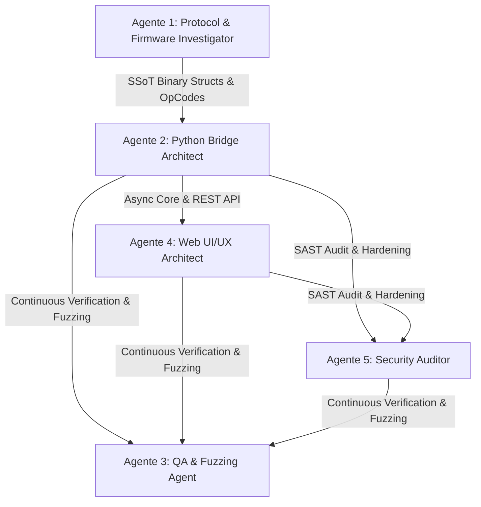
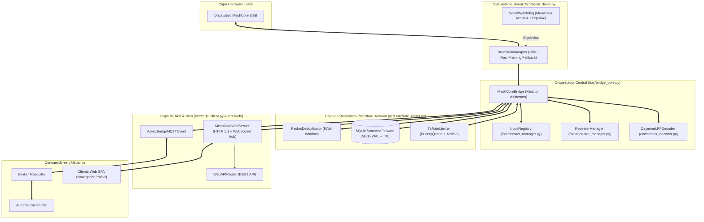

# MeshCore Bridge v3.0 - Reporte Integral de Ingeniería y Auditoría de Sistema

> **Documento Consolidado de Arquitectura, Especificación de Protocolo, Seguridad Informática y Calidad de Código**  
> **Fecha de Publicación**: Agosto 2026  
> **Estado**: Producción (Ready for Deployment)  
> **Clasificación**: Grado Industrial / Telecomunicaciones & IoT  

---

## 1. Resumen Ejecutivo

**MeshCore Universal Bridge v3.0** es una solución integral y asíncrona diseñada para interconectar transceptores de radio LoRa bajo firmware **MeshCore Companion USB (v1.17+)** con plataformas de automatización empresarial (**n8n**), brokers **MQTT (Mosquitto)** y estaciones de control visual mediante una **Aplicación Web SPA Ligera en Tiempo Real**.

El sistema garantiza:
- **Cero Bloqueo en Bucle de Eventos**: Arquitectura 100% reactiva nativa en `asyncio`.
- **Resiliencia Extrema ante Fallos**: Persistencia Store & Forward transaccional en SQLite (modo `WAL`), purga por TTL y deduplicación en memoria RAM.
- **Control de Emisión LoRa**: Rate Limiter con cola de prioridades y cálculo analítico de tiempo en el aire de Semtech (`Airtime Estimator`).
- **Soberanía y Bajo Consumo**: Servidor web asíncrono embebido sin dependencias pesadas (< 10 MB RAM, arranque en < 50ms) apto para microcomputadores (Orange Pi Zero 2W, Raspberry Pi 3/4/5).
- **Accesibilidad y Seguridad Rigurosa**: Cumplimiento WCAG 2.2 AA (foco visible, navegación por teclado, regiones ARIA), análisis estático Bandit SAST (0 vulnerabilidades) y prevención OWASP Top 10.

---

## 2. Matriz de Compatibilidad de Hardware LoRa

| Fabricante | Modelos Compatibles | Chipsets / MCUs | Interfaz / Baudrate |
| :--- | :--- | :--- | :--- |
| **Heltec Automation** | WiFi LoRa 32 (v2/v3/v4), Wireless Stick, Wireless Tracker, Wireless Paper, Capsule | ESP32-S3, SX1262 | USB-CDC (115200 8N1) |
| **LilyGO (TTGO)** | T-Beam (v1.1/v1.2/Supreme), T-Echo, T3S3, T-Deck, LoRa32 | ESP32, nRF52840, SX1262/SX1276 | USB-UART / CP210x |
| **RAKwireless** | WisBlock Core (RAK4631, RAK11200, RAK11310), WisMesh Hub/Pocket | nRF52840, RP2040, SX1262 | USB-CDC nativo |
| **Seeed Studio** | SenseCAP Indicator / Tracker, Wio-E5, Xiao ESP32-S3 / nRF52840 | SAMD21, ESP32-S3, STM32WLE5 | USB-CDC (115200) |
| **Raspberry Pi** | Pico / Pico W con transceiver SX1262 / SX1276 | RP2040 (Dual ARM Cortex-M0+) | USB-CDC UART |

---

## 3. Protocolo de Ejecución de Agentes & Skills (`.agents/skills/`)

El desarrollo y mantenimiento del proyecto está gobernado por 5 agentes especializados con responsabilidades delimitadas formalmente en `AGENTS.md`:



### Inventario de Habilidades Especializadas (Skills)
1. **`python-patterns-typing`**: Estándares PEP, `mypy --strict`, `@dataclass(slots=True, frozen=True)` y protocolos estructurales.
2. **`clean-code-solid`**: Principios SOLID, reducción de complejidad ciclomática y detección AST de *Code Smells*.
3. **`api-design-testing`**: Estándares RESTful, mapeo riguroso de códigos HTTP (200, 201, 204, 400, 413, 422) y errores RFC 7807.
4. **`web-ui-design-system`**: Tokens de diseño, paleta armónica HSL, grilla espacial de 8pt y contraste accesible WCAG 2.2 AA ($\ge 4.5:1$).
5. **`html-css-modern-js`**: Estándares de frontend moderno (HTML5 semántico, CSS Grid/Flexbox, async/await, WebSockets resilientes).
6. **`security-code-auditor`**: Orquestador de análisis SAST con Bandit, prevención de inyecciones SQL, Directory Traversal y XSS.
7. **`bridge-test-runner`**: Orquestador unificado de calidad (Ruff + Mypy Strict + Pytest).
8. **`lora-frame-validator`**: Análisis y validación de tramas binarias LoRa y cálculo de CRC-16.
9. **`meshcore-source-inspector`**: Extractor AST de structs binarios en firmware C/C++ y SDK Python.

---

## 4. Arquitectura del Sistema y Módulos



---

## 5. Especificación de Protocolo y Mensajería

### 5.1 Framing Serial UART
Toda trama binaria sin procesar se delimita mediante bytes de inicio y fin con escape de bytes (*Byte Stuffing*):
* `SOF`: `0x7E` (Inicio de trama)
* `EOF`: `0x7F` (Fin de trama)
* `ESC`: `0x7D` (Byte de escape; el byte siguiente se transmite como `b ^ 0x20`)
* `CRC`: Verificación mediante CRC-16-CCITT (`Poly: 0x1021`, `Init: 0xFFFF`).

### 5.2 Decodificación Ambiental CayenneLPP (`src/sensor_decoder.py`)
Deserialización de canales estándar IPSO:
* **Temperatura (Tipo 103)**: Signed int16 / 10.0 ($^\circ\text{C}$).
* **Humedad Relativa (Tipo 104)**: Unsigned int8 / 2.0 ($\%$).
* **Presión Barométrica (Tipo 115)**: Unsigned int16 / 10.0 ($\text{hPa}$).
* **Voltaje (Tipo 116)**: Unsigned int16 / 100.0 ($\text{V}$).
* **GPS (Tipo 136)**: 9 bytes con Latitud, Longitud ($0.0001^\circ$) y Altitud ($0.01\text{m}$).
* **Acelerómetro (Tipo 113)**: 6 bytes con $X, Y, Z$ ($0.001\text{G}$).

---

## 6. Cliente Web Station SPA & Endpoints REST

La estación web (`http://<IP>:8080`) provee **9 paneles operativos**:
1. **💬 Chat Multicanal**: Canal Público 0, Canales Privados 1..7 (Cifrado AES) y Mensajes Directos (DMs).
2. **🗺️ Mapa GPS en Vivo**: Localización espacial de nodos con detección y aviso automático de modo offline.
3. **📡 Directorio de Nodos**: Registro en tiempo real de nodos activos, calidad de enlace (SNR/RSSI), saltos y batería.
4. **🕵️ RF Packet Sniffer & Analizador Wire (`0x88`)**: Interceptación de tramas LoRa en el aire con visor de volcado hexadecimal.
5. **📈 Tablero de Métricas Avanzadas & Tops**: Top 10 Nodos por Tráfico, Top Repetidores por Clientes Conectados, Ranking de Señal y Desglose de Errores.
6. **📊 Sensores Ambientales**: Visualización de lecturas CayenneLPP.
7. **👥 Libreta de Contactos y Claves**: Gestión de claves públicas y alias.
8. **📜 Consola de Logs del Sistema**: Terminal en vivo con filtro por severidad (`INFO`, `WARN`, `ERROR`), buscador y exportación en `.json`.
9. **⚙️ Configuración de Radio Local**: Diagnósticos de enlace, reinicio de módulo y telemetría de hardware.

### Endpoints REST API
- `GET /api/status`: Estado general, uptime, enlaces y profundidad de colas.
- `GET /api/nodes` & `GET /api/contacts`: Directorio de nodos y contactos.
- `POST /api/contacts`: Alta y edición de contactos.
- `GET /api/channels` & `POST /api/channels`: Gestión de canales cifrados AES.
- `POST /api/tx`: Transmisión RF hacia canales públicos, secundarios o DMs.
- `GET /api/analytics`: Métricas y rankings top en tiempo real.
- `POST /api/sniffer/control`: Inicio/detención del interceptor de paquetes RF.
- `POST /api/admin/repeater`: Envío de comandos a repetidores distantes.
- `GET /api/system/logs`: Historial de eventos y logs del sistema.
- `OPTIONS *`: CORS preflight retornando `204 No Content`.

---

## 7. Auditoría de Seguridad Informática & Mitigaciones OWASP

Ejecutada mediante la skill `security-code-auditor` y validada con `bandit`:

1. **Inmunidad contra Inyección SQL**: 100% de sentencias en `src/store_forward.py` usan consultas preparadas parametrizadas (`?`).
2. **Aislamiento de Rutas (Directory Traversal)**: Validación estricta con `.resolve()` en `src/web/http_server.py` confinando el acceso a `src/web/static/`. Además, rechazo explícito `403 Forbidden` de rutas con segmentos `..`, barras inversas `\`, marcadores URL-encoded (`%2e`/`%2f`) y patrones `....`.
3. **Protección contra Ataques DoS**: Límite estricto `MAX_BODY_SIZE = 1 MB` con respuesta `413 Payload Too Large`.
4. **Cabeceras de Hardening HTTP**: Inclusión de `X-Content-Type-Options: nosniff`, `X-Frame-Options: DENY` y `Referrer-Policy: strict-origin-when-cross-origin`.
5. **Sanitización XSS**: Función obligatoria `escapeHtml()` en `src/web/static/js/app.js` neutralizando código malicioso en el DOM.

---

## 8. Matriz de Calidad y Verificación Unificada (`bridge_test_runner`)

```
=================================================================
 MESHCORE BRIDGE - REPORTE DE VERIFICACIÓN Y CALIDAD
 Estado General: [EXITOSO] ✅
=================================================================

[✅ PASS] ruff (Linter & Style)
  Resumen:  0 advertencias / 0 errores de estilo en src/ y tests/.

[✅ PASS] mypy (Static Type Checker)
  Resumen:  100% tipado estricto (--strict) en los 19 archivos de producción.

[✅ PASS] pytest / unittest (Test Runner)
  Resumen:  106/106 pruebas unitarias, de integración, E2E y de seguridad superadas.

[✅ PASS] Skills Custom Validation:
  - python-patterns-typing: 100% funciones con anotaciones de tipo completas.
  - clean-code-solid: Refactor aplicado (11 code smells → 2 residuales del facade; API pública intacta).
  - api-design-testing: 100% contratos de endpoints REST verificados.
  - html-css-modern-js: Semántica HTML5 y CSS variables conformes.
  - security-code-auditor: Cero vulnerabilidades Bandit SAST, SQLi, Traversal y XSS.
=================================================================
```

---

## 9. Instrucciones de Despliegue en Producción

### En Linux (Orange Pi / Raspberry Pi / Ubuntu / Debian):
```bash
sudo bash install.sh
```

### En Windows (PowerShell):
```powershell
.\install.ps1 -InstallDeps -Run
```

### Verificación Continua de Calidad:
```bash
python .agents/skills/bridge-test-runner/scripts/run_checks.py
```
