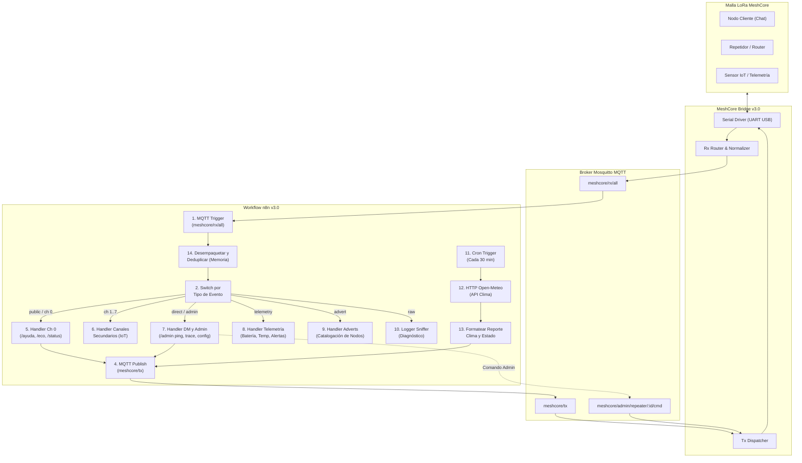

# Guía de Arquitectura, Integración y Mantenimiento del Workflow n8n para MeshCore Bridge v3.0

Esta guía técnica describe el diseño, la configuración, el funcionamiento y el procedimiento de mantenimiento y extensión del workflow de **n8n** (`n8n_workflow_meshcore.json`) integrado con **MeshCore Bridge v3.0**.

---

## 1. Visión General y Propósito

El workflow `n8n_workflow_meshcore.json` (denominado *"MeshCore Universal Bridge v3.0 - Complete IoT, LoRa Bot & Periodic Weather Status"*) actúa como el motor de automatización, lógica de negocio e integración externa para la malla de radio LoRa. 

Permite:
1. **Recepción Unificada y Deduplicación**: Procesar todos los eventos de la red LoRa provenientes de Mosquitto MQTT (`meshcore/rx/all`) descartando ecos locales y ráfagas duplicadas.
2. **Bot Interactivo de Radio (Canal 0)**: Responder automáticamente a comandos de usuario (`/ayuda`, `/hora`, `/eco`, `/status`) cumpliendo con las políticas de airtime de LoRa.
3. **Control Administrativo y Diagnóstico de Red (DM)**: Ejecutar comandos privilegiados con lista blanca (`/admin ping <node>`, `/admin trace <node>`, `/admin get_config`), interactuando de forma nativa con los repetidores de infraestructura.
4. **Procesamiento de Telemetría y Monitoreo IoT**: Recibir métricas de nodos de campo (batería, voltaje, temperatura, humedad, presión) y emitir alertas.
5. **Descubrimiento de Nodos (Adverts)**: Catalogar dispositivos según su rol canónico MeshCore (`CLIENT`, `REPEATER`, `ROOM`, `SENSOR`).
6. **Reporte Meteorológico Periódico**: Consultar la API de Open-Meteo cada 30 minutos y transmitir un resumen formateado del clima y estado de la red por broadcast en el canal público.

---

## 2. Reglas Inmutables y SSoT del Protocolo

Todo cambio que se introduzca en este workflow debe respetar las invariantes de dominio de [CONTEXT.md](../CONTEXT.md). [AGENTS.md](../AGENTS.md) define el procedimiento operativo de los agentes, pero no duplica ni redefine esas invariantes:

| Regla SSoT | Descripción y Restricción Inmutable |
|---|---|
| **Regla 1.1: Restricción de Repetidores (`REPEATER` / `ROUTER`)** | **NUNCA enviar respuestas de chat (ni por broadcast ni por DM) hacia un repetidor.** Los repetidores son infraestructura de red sin interfaz de chat ni usuario humano. Cualquier interacción con ellos debe ser exclusivamente de gestión administrativa (`meshcore/admin/repeater/{node}/cmd`). |
| **Regla 1.2: Restricción del Nodo Local (`LOCAL`)** | **NUNCA procesar mensajes emitidos por el propio transceptor local** (`is_outgoing === true`, `is_local === true`, `role === 'LOCAL'`, `sender === 'local'`). Se deben descartar en el nodo inicial de deduplicación para evitar bucles de retroalimentación infinitos. |
| **Compatibilidad Dual de Campos TX** | El dispatcher del bridge admite tanto `target` como `to`, y tanto `channel_index` como `channel_idx`. n8n genera siempre ambas claves en los payloads hacia `meshcore/tx` para garantizar compatibilidad retroactiva total. |

---

## 3. Diagrama de Arquitectura y Flujo de Datos



---

## 4. Matriz de Tópicos MQTT y Esquemas de Payloads

### 4.1. Entrada desde el Bridge hacia n8n

* **Tópico suscrito**: `meshcore/rx/all` (o tópicos específicos `meshcore/rx/public`, `meshcore/rx/direct`, `meshcore/rx/telemetry`, `meshcore/rx/advert`).
* **Ejemplo de Payload JSON recibido**:
```json
{
  "event_type": "public",
  "sender_id": "9b12a8ef",
  "sender_name": "Estacion_Norte",
  "role": "CLIENT",
  "channel_index": 0,
  "text": "/status",
  "rssi": -85,
  "snr": 9.5,
  "timestamp": 1727553600.0,
  "is_outgoing": false,
  "is_local": false
}
```

### 4.2. Salida desde n8n hacia el Bridge

* **Tópico de publicación para texto y chat**: `meshcore/tx`
* **Esquema de Payload JSON emitido**:
```json
{
  "request_id": "n8n_tx_1727553600000_1234",
  "target": "broadcast",
  "to": "broadcast",
  "channel_index": 0,
  "channel_idx": 0,
  "text": "[Status MeshCore v3.0]\nBridge: Online\nNodo: Activo"
}
```

* **Tópico de publicación para comandos a Repetidores**: `meshcore/admin/repeater/{target_node}/cmd`
* **Esquema de Payload JSON emitido**:
```json
{
  "action": "ping_zero",
  "target_node": "4a12bc88",
  "timeout": 15
}
```

---

## 5. Anatomía Detallada de los Nodos del Workflow

El archivo [n8n_workflow_meshcore.json](../n8n_workflow_meshcore.json) contiene 14 nodos organizados jerárquicamente:

### Nodo 1: `MQTT Trigger - MeshCore RX`
- **Tipo**: `n8n-nodes-base.mqttTrigger`
- **Configuración**: Se suscribe al tópico `meshcore/rx/all` en modo QoS 0.
- **Función**: Despierta el pipeline cada vez que un paquete LoRa es procesado y publicado por el bridge.

### Nodo 14: `Desempaquetar y Deduplicar Eventos` (JavaScript)
- **Tipo**: `n8n-nodes-base.code`
- **Funciones Críticas**:
  1. **Tolerancia a Formatos**: Si el mensaje viene en `item.json.message` como un string JSON, lo parsea; si ya es un objeto, lo toma directamente; si es texto plano, construye la estructura básica.
  2. **Normalización de Identidad y Roles**: Extrae `sender_id`, `sender_name`, y asigna roles canónicos (`CLIENT`, `REPEATER`, `ROOM`, `SENSOR`, `LOCAL`).
  3. **Guarda Anti-Bucle Local (Regla SSoT 1.2)**: Si el mensaje tiene `is_outgoing: true`, `is_local: true`, `role: 'LOCAL'` o proviene de la propia dirección local, es descartado inmediatamente devolviendo `[]`.
  4. **Filtro Anti-Eco de Bots**: Descarta mensajes generados por n8n u otros bots que comiencen con `[Eco `, `[Status `, `[ACK`, `📡 `, `⛔ `, `📖 `, `⏰ `, `📅 `, `🏓 `.
  5. **Deduplicación en Memoria Estática**: Mantiene un mapa `staticCache` de firmas `[evento]_[remitente]_[canal]_[texto]` con un TTL de 30 segundos. Si un paquete llega repetido dentro de ese lapso, se etiqueta con `is_duplicate: true` para evitar spam en la malla.

### Nodo 2: `Switch por Tipo de Evento`
- **Tipo**: `n8n-nodes-base.switch`
- **Rutas de Salida**:
  - Salida 0 (`public_ch0`): Mensajes públicos dirigidos al canal 0 (`event_type == 'public' && channel_index == 0`).
  - Salida 1 (`secondary_channels`): Mensajes en canales secundarios 1 a 7.
  - Salida 2 (`dm_and_admin`): Mensajes directos o comandos administrativos (`event_type == 'direct' || event_type == 'admin'`).
  - Salida 3 (`telemetry`): Paquetes con métricas de sensores o eventos de telemetría.
  - Salida 4 (`advert_discovery`): Anuncios de presencia de nodos (`event_type == 'advert'`).
  - Salida 5 (`sniffer_raw`): Tramas sin procesar, binarias o paquetes de diagnóstico.

### Nodo 5: `Handler Canal Público (Ch 0)` (JavaScript)
- **Lógica de Chat y Comandos Públicos**:
  - Comandos disponibles: `/ayuda` (o `/help`), `/hora` (o `/time`), `/eco <mensaje>`, `/status`.
  - **Protección SSoT 1.1**: Si `role === 'REPEATER'`, descarta la ejecución y no emite respuesta alguna.
  - Respuestas formateadas y firmadas con prefijo de bot para evitar reingresos.

### Nodo 6: `Handler Canales Secundarios (Ch 1-7)` (JavaScript)
- Diseñado para canales temáticos, grupos de rescate o telemetría IoT privada.
- Evita responder a repetidores y prepara métricas para almacenamiento en base de datos.

### Nodo 7: `Handler Mensajería Directa (DM) y Admin` (JavaScript)
- **Seguridad**: Dispone de una constante `ADMIN_WHITELIST` con las claves públicas de nodos autorizados.
- **Comandos Administrativos**:
  - `/admin ping <node_id>`: Dispara un `ping_zero` (Hop 0) hacia el repetidor indicado mediante el tópico `meshcore/admin/repeater/{node_id}/cmd`.
  - `/admin trace <node_id>`: Ejecuta un `traceroute` hacia el repetidor indicado.
  - `/admin get_config`: Solicita la configuración operativa actual del bridge.
- **Control de Acceso**: Si un nodo no autorizado intenta ejecutar `/admin`, se emite una advertencia de rechazo en canal privado (DM) **únicamente si no es un repetidor**.

### Nodo 8: `Handler Telemetría IoT` (JavaScript)
- Normaliza lecturas de sensores: Batería (`%` y `V`), Temperatura (`°C`), Humedad (`%`), Presión (`hPa`), Altitud (`m`), Coordenadas GPS (`lat`, `lon`).
- Dispara alarmas de batería baja si el nivel es `<= 20%`.

### Nodo 9: `Handler Advert / Descubrimiento` (JavaScript)
- Interpreta el campo `adv_type` conforme a la especificación oficial de MeshCore (`FirmwareAdvertType`):
  - `0` / `1` $\to$ `CLIENT`
  - `2` $\to$ `REPEATER`
  - `3` $\to$ `ROOM`
  - `4` $\to$ `SENSOR`
- Extrae capacidades del hardware (`has_gps`, `has_screen`, `listen_only`).

### Nodo 10: `Logger Sniffer / Raw Packets` (JavaScript)
- Inspección profunda de tramas LoRa: RSSI, SNR, Bytes totales, análisis de payload hexadecimal.

### Nodos 11, 12 y 13: `Clima y Estado Periódico`
- **Nodo 11 (`Cron Trigger`)**: Se activa cada 30 minutos (ajustable).
- **Nodo 12 (`HTTP Request Open-Meteo`)**: Consulta sin costo ni API key las condiciones meteorológicas actuales para las coordenadas configuradas.
- **Nodo 13 (`Formatear Reporte Estado y Clima`)**: Mapea los códigos meteorológicos WMO a emojis descriptivos (☀️, 🌧️, ⛈️, ❄️) y genera un broadcast compacto para el canal 0.

### Nodo 4: `MQTT Publish - MeshCore TX`
- **Tipo**: `n8n-nodes-base.mqtt`
- **Función**: Publica en `meshcore/tx` el mensaje procesado por los nodos anteriores para que el transceptor LoRa lo emita al aire.

---

## 6. Guía Rápida de Modificación y Extensión

### 6.1. ¿Cómo agregar un nuevo comando público al Bot (Canal 0)?

Edita el código del **Nodo 5** (`Handler Canal Público (Ch 0)`):

```javascript
// Localiza el bloque switch (command) e inserta tu nuevo caso:
case '/mi_comando':
  replyText = `🤖 Respuesta personalizada para ${senderName}!`;
  break;
```

> **Importante**: Mantén las respuestas por debajo de 160 caracteres para evitar fragmentación de paquetes LoRa y reducir el airtime en la red.

### 6.2. ¿Cómo autorizar un nuevo Administrador?

Edita el código del **Nodo 7** (`Handler Mensajería Directa (DM) y Admin`):

```javascript
// Agrega el ID hexadecimal o nombre público a la lista blanca:
const ADMIN_WHITELIST = [
  'admin_master',
  '4a12bc88',
  '9b3f01ca', // <- Nuevo administrador agregado
];
```

### 6.3. ¿Cómo cambiar las coordenadas del reporte meteorológico?

1. Abre el **Nodo 12** (`HTTP Request Open-Meteo`).
2. Modifica los parámetros URL de `latitude` y `longitude`.
3. Abre el **Nodo 13** (`Formatear Reporte Estado y Clima`) y actualiza la constante de ubicación:
```javascript
const LOCATION_NAME = 'Tu Ciudad, País'; // E.g., 'Miami, FL' o 'Santiago, CL'
```

### 6.4. ¿Cómo ajustar la frecuencia del reporte meteorológico?

Abre el **Nodo 11** (`Cron Trigger - Cada 30 Minutos`) y selecciona el intervalo deseado (se recomiendan **30 a 60 minutos** para no saturar la malla LoRa).

---

## 7. Despliegue e Importación en n8n

1. Accede a tu instancia de **n8n** en el navegador web (por defecto `http://localhost:5678`).
2. En el panel izquierdo, haz clic en **Workflows** $\to$ **Import from File**.
3. Selecciona el archivo [n8n_workflow_meshcore.json](../n8n_workflow_meshcore.json).
4. Configura las credenciales MQTT de tu broker Mosquitto:
   - **Host**: IP o hostname del broker (ej. `127.0.0.1` o `mosquitto`).
   - **Port**: `1883` (o `8883` si usas TLS).
   - **User / Password**: Credenciales de acceso MQTT configuradas en el bridge.
5. Haz clic en **Save** y luego activa el switch **Active** en la esquina superior derecha.

---

## 8. Verificación y Pruebas Automatizadas

El comportamiento y los contratos de este workflow están validados por la suite de pruebas unitarias en Python:

- Archivo de prueba: [tests/test_n8n_parser_matrix.py](../tests/test_n8n_parser_matrix.py)
- Para ejecutar la validación local:
  ```powershell
  python tests/test_n8n_parser_matrix.py
  ```
- **Casos de prueba cubiertos**:
  - Deserialización de payloads envueltos en strings JSON y texto plano.
  - Deduplicación temporal exacta con expiración de ventana de 30 segundos.
  - Control de acceso estricto mediante whitelist para comandos `/admin`.
  - Formateo de clima Open-Meteo con códigos WMO y conversión dual métrica/imperial.
  - **SSoT Regla 1.1**: Verificación de bloqueo absoluto de respuestas de chat/DM a repetidores (`REPEATER` y `ROUTER`).
  - **SSoT Regla 1.2**: Verificación de descarte inmediato de mensajes locales y salientes para evitar loops de retroalimentación.
  - Comandos administrativos de repetidor (`/admin ping` y `/admin trace`) hacia tópicos `meshcore/admin/repeater/{node}/cmd`.
