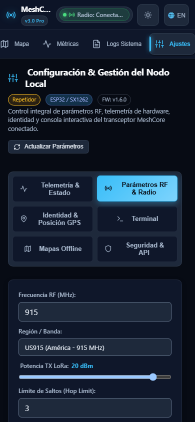
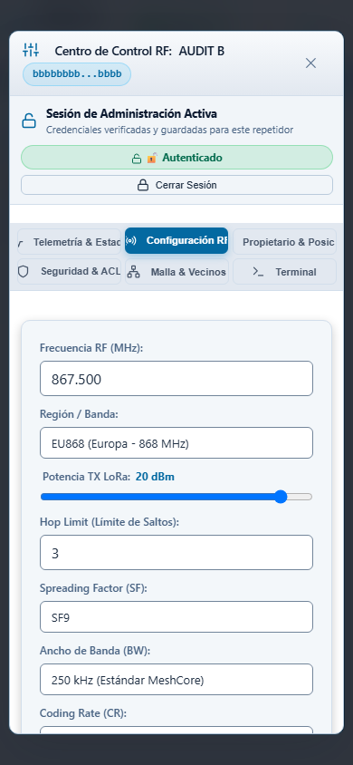

# Auditoría y plan de configuración de nodos locales y remotos

Fecha: 2026-10-03. Base auditada: `81f4260eccf9bdec6c6f7ba9caca5322997f6eeb`. Estado: **análisis, reproducciones aisladas y propuesta de implementación**. No se corrigió código de producción ni se configuró hardware.

## 1. Objetivos y conclusión

La configuración debe mostrar qué dispositivo se está editando, qué funciones soporta, qué permisos tiene el usuario y cuándo un cambio se ha aplicado realmente. El nodo local es el Companion conectado al bridge; el remoto se administra a través de la malla y tiene firmware/capacidades propias. Compartir estilos no implica compartir comandos o tiempos de aplicación.

La app actual tiene formularios y endpoints para ambas operaciones, pero mezcla datos observados, cambios pendientes y valores por defecto. Se reprodujeron pérdida de borradores, éxitos no confirmados, pérdida de resultados parciales, credenciales en respuestas/publicaciones simuladas y modificaciones de radio incompletas. Los constructores remotos también generan varios comandos incompatibles con el firmware de referencia.

Objetivos de aceptación:

- Guardar sólo campos editados y válidos, sin sustituir parámetros desconocidos por defaults.
- Separar configuración del Companion, políticas del bridge y administración RF del remoto.
- Habilitar controles según conexión, firmware, hardware, permisos y capacidades acreditadas.
- Conservar borradores ante eventos en vivo; mostrar conflictos y resultados parciales.
- Distinguir enviado, aceptado, aplicado, verificado y pendiente de reinicio.
- Mantener responsive, temas claro/oscuro, teclado y traducción de todos los estados.
- No publicar credenciales en telemetría, terminales, logs, MQTT o eventos compartidos.
- Mantener las invariantes LOCAL/REPEATER y controlar el coste RF de cada operación remota.

## 2. Organización dirigente y agentes especializados

| Rol | Responsabilidad y propiedad | Skills |
|---|---|---|
| Dirigente/integrador | Delimitar alcance, contrastar cliente oficial, revisar evidencia y redactar este informe/índice. Reproducción de integración separada. | `domain-adr-keeper`, `project-reference-audit`, `security-code-auditor` |
| Frontend/UI/UX | HTML/CSS/JS, formularios, capacidades, idiomas, responsive y capturas de navegador; carpeta `frontend/`. | `html-css-modern-js`, `web-ui-design-system`, `web-browser-inspection` |
| Backend/contratos | API, executors, validación, cachés, permisos, resultados y reproducciones con mocks; carpeta `backend/`. | `contract-openapi-sync`, `python-patterns-typing` |
| Protocolo/firmware | Comandos, layouts, rangos, unidades, roles y contraste SDK/CLI; carpeta `protocol/`. | `meshcore-source-inspector`, `project-reference-audit` |

La solicitud de replicar errores autorizó diagnósticos dirigidos. No se ejecutó la suite general. Se bloquearon lecturas de `.env` en los procesos de reproducción y se emplearon datos temporales, mocks de SDK/MQTT y una estación virtual propia en loopback. Ningún comando llegó a radio física o broker operativo. Las referencias fueron sólo lectura; los agentes no editaron producción y el dirigente publica únicamente los documentos y su evidencia.

## 3. Referencias y comparación con el cliente MeshCore

| Fuente | Revisión y autoridad |
|---|---|
| Firmware oficial `reference/meshcore` | `d92964352441e53b93e8667b802e04f6e072b39e`, tag `companion-v1.17.1` |
| SDK oficial `reference/meshcore_py` | `c487efbe187f4b000020afdfc0349c4cdf503c5a`; referencia y SDK instalado 2.3.8 |
| CLI oficial `reference/meshcore_cli` | `0856c723cdea3438811c62c190bbec3059e2dc48` |
| Cliente oficial y configurador | El README del firmware enlaza [app.meshcore.nz](https://app.meshcore.nz/) y [config.meshcore.io](https://config.meshcore.io/): [README:67](../reference/meshcore/README.md#L67), [77](../reference/meshcore/README.md#L77). |
| Clientes de terceros en `reference/` | Remote Terminal, meshmonitor y openHop sirven de comparación; no son autoridad del protocolo ni código del cliente oficial. |

Se verificó Git propio antes de atribuir las revisiones. La versión de firmware de una estación operativa no fue consultada. Nivel de protocolo, versión SDK y versión firmware son datos distintos.

### Qué se pudo verificar de la app oficial

La [guía oficial de inicio](https://files.liamcottle.net/MeshCore/Documentation/MeshCore_Quick_Start_Guide.pdf), páginas 2–3, explica editar el nombre o seleccionar un preset de radio y después guardar. Es una referencia para distinguir selección de valores y aplicación. La sección de administración remota sigue marcada TODO en la página 11: no permite inferir su implementación interna.

En el navegador se observó `app.meshcore.nz` desconectada: muestra Connect, Contacts, Channels y Map, y exige conectar un dispositivo para continuar. No se conectó radio ni se concedieron permisos de hardware. No hay checkout del frontend oficial en las referencias. El changelog público no pudo leerse por las herramientas usadas; no se empleó para atribuir capacidades.

El [configurador oficial USB](https://config.meshcore.io/) se presenta para Repeater/Room y agrupa identidad, acceso, radio y opciones avanzadas. Muestra cambios sin guardar y funciones condicionadas por firmware. Ese configurador usa una conexión directa al dispositivo: **no equivale al Companion local ni a administración por RF**. Su separación visual orienta el diseño; comandos y rangos se contrastaron con código local oficial.

La propuesta de UI de este informe es una adaptación al bridge, no una afirmación de haber inspeccionado las pantallas oficiales conectadas. La [documentación Companion](https://docs.meshcore.io/companion_protocol/) describe comandos/respuestas y su secuenciación; sus detalles se subordinan a los serializadores de la revisión identificada.

## 4. Arquitectura y superficie actual

```text
LOCAL
settings.js → /api/config/* → ConfigController → LocalConfigExecutor
  → gateway SDK → Companion por USB/UART o TCP → respuesta local
  → caché/registro → JSON REST y eventos self_info → formulario

REMOTO
repeater.js → /api/repeater/remote/* → RepeaterController → RepeaterExecutor
  → RepeaterManager / gateway SDK → Companion → malla RF → remoto
  → respuesta remota CLI/binary/login → correlación → REST/WS → modal
```

El bridge usa Vanilla JS/CSS y servidor asyncio propio; no React, ASGI ni protobuf en este flujo. Companion es binario SDK, REST/WS es JSON de la app. El framing raw propio no es el transporte Companion. La administración remota usa su canal administrativo, sin fallback a chat.

### Endpoints y consumidores

| Operación | API actual | Consumidor/servidor |
|---|---|---|
| Leer/guardar local | GET/POST `/api/config`; aliases `/api/node/config`, `/api/node/settings` | [settings.js:1317](../src/web/static/js/modules/settings.js#L1317), [api_router.py:652](../src/web/api_router.py#L652) |
| Radio/identidad local | GET/POST `/api/config/radio`, `/api/config/identity` | [api_router.py:690](../src/web/api_router.py#L690); ambos terminan en configuración local |
| AutoAdd, hash, scope, custom vars | `/api/config/autoadd`, `/path_hash_mode`, `/flood_scope`, `/custom_vars` | [config_controller.py:289](../src/web/controllers/config_controller.py#L289), [362](../src/web/controllers/config_controller.py#L362), [393](../src/web/controllers/config_controller.py#L393) |
| Refrescar, reloj, estadísticas, reconectar | `/api/config/refresh`, `/sync-clock`, `/clear-stats`, `/reconnect` | [api_router.py:716](../src/web/api_router.py#L716) |
| Advert/reboot local | POST `/api/node/advert`, `/api/node/reboot` | [config_controller.py:182](../src/web/controllers/config_controller.py#L182), [279](../src/web/controllers/config_controller.py#L279) |
| Login/logout remoto | POST `/api/repeater/remote/login`, `/logout` | [repeater_controller.py:56](../src/web/controllers/repeater_controller.py#L56), [80](../src/web/controllers/repeater_controller.py#L80) |
| Guardar/acción remota | POST `/api/repeater/remote/config`, `/action` | [repeater_controller.py:97](../src/web/controllers/repeater_controller.py#L97), [124](../src/web/controllers/repeater_controller.py#L124) |
| Consultas remotas | POST `/api/repeater/remote/neighbours`, `/owner`, `/regions`, `/clock`, `/acl` | [api_router.py:606](../src/web/api_router.py#L606) |

La protección HTTP con API key, cuando se configura, es distinta del login RF: [http_server.py:585](../src/web/http_server.py#L585). Sin key el servidor permite el modo de desarrollo. No se inspeccionó `.env` ni se concluyó cuál es la política de una instalación operativa. La API debe conservar autorización y errores al añadir los nuevos contratos.

### Inventario de capacidades y diferencias fundamentales

La [matriz completa de protocolo](audits/node-config-2026-10-03/protocol/PROTOCOL_FINDINGS.md) detalla comandos/opcodes, límites y líneas para cada campo. Resumen:

| Campo/acción | LOCAL Companion | REMOTO de referencia |
|---|---|---|
| Nombre | `SET_ADVERT_NAME` 8; confirmar respuesta local; límite 31 bytes UTF-8 del campo Companion | `set name`; validar presupuesto y respuesta del remoto |
| Coordenadas | `SET_ADVERT_LATLON` 14, i32 LE microgrados; altitud reservada, no aplicada en esa rama | `set lat` y `set lon`; `set pos ...` no es equivalente |
| Radio F/BW/SF/CR | `SET_RADIO_PARAMS` 11; **aplica inmediatamente** | `set radio F,BW,SF,CR`; guarda y requiere reboot para aplicar |
| Potencia | CMD12; rango por placa/build y discrepancia SDK para negativos | `set tx`; comprobar hardware remoto, no asumir placa local |
| Repeat | Capacidad Companion y rangos anunciados, según protocolo/build | `set repeat on/off`; no es la misma capacidad ni restricción de bandas |
| Telemetría local | `OTHER_PARAMS` 38 controla permisos de respuesta | Solicitudes STATUS/TELEMETRY por RF según permisos; no son timers de broadcast local |
| RX delay / AF | GET43/SET21, enteros wire ×1000; RX adimensional | `get/set rxdelay`, `af`, otros factores; unidades explícitas |
| AutoAdd | GET59/SET58; 0 ilimitado, 1 directo, N hasta N−1 intermediarios | Política local de libreta, no parámetro global del remoto |
| Path hash mode | SET61, modo 0/1/2 | `get/set path.hash.mode`; preferencia del remoto |
| Seguridad | PIN BLE CMD37; 0 o seis dígitos 100000–999999 | Contraseña admin/guest, ACL `setperm`, permisos de sesión |
| Owner/altitud/intervalos | No son setters hardware Companion acreditados por el flujo actual | Owner CLI; intervalos de adverts en minutos/horas; altitud/fixed sólo si capacidad concreta |
| Refrescar | Consultas locales sin RF | Leer valores remotos implica requests/respuestas RF |

Los rangos de parser de radio oficial son 150–2500 MHz, BW 7–500 kHz, SF 5–12, CR 5–8; **no acreditan soporte de cualquier placa, ancho arbitrario o permiso de uso de una banda**. La app debe mostrar los límites efectivos obtenidos del hardware/build, con fuente y disponibilidad, sin convertir un preset en una garantía universal.

### Roles y permisos

REPEATER y ROOM ofrecen CLI administrativa bajo permisos admin. El SENSOR oficial de esta copia también tiene CLI, con capacidades y permisos propios; no todos los sensores deben recibir todos los controles de repetidor. El Companion/CLIENT de esta referencia no ejecuta CommonCLI como servidor remoto. Soporte de otro firmware debe acreditarse explícitamente, no inferirse por nombre o por un cambio publicado para otra versión.

Resolver alias/prefijos a clave pública completa **antes** de comprobar rol, LOCAL y permisos. Login exitoso puede ser guest/read-only; no equivale a admin. PIN BLE, contraseña RF, API key del bridge y permisos ACL son dominios distintos. LOCAL nunca se duplica como vecino/contacto ni recibe mensajes a su propia identidad; REPEATER no se incorpora a chat/contactos del bridge. La libreta interna del Companion puede contener infraestructura necesaria para administración sin habilitarla como contacto de chat de la SPA.

## 5. Método y evidencia de reproducción

| Área | Ejecución y evidencia | Qué demuestra |
|---|---|---|
| Backend | [test_reproductions.py](audits/node-config-2026-10-03/backend/test_reproductions.py), [pytest-report.json](audits/node-config-2026-10-03/backend/pytest-report.json), [junit.xml](audits/node-config-2026-10-03/backend/junit.xml) | 19 casos: 16 reproducciones/variantes y 3 controles; mocks SDK/MQTT, router real y almacenamiento temporal |
| Protocolo | [reproduce_protocol.py](audits/node-config-2026-10-03/protocol/reproduce_protocol.py), [reproduction.json](audits/node-config-2026-10-03/protocol/reproduction.json) | Constructor real: 4 valores TX SDK, 3 tuning y 17 casos de builder; no ejecuta firmware |
| Frontend | [reproduce_ui.py](audits/node-config-2026-10-03/frontend/reproduce_ui.py), [reproduction-results.json](audits/node-config-2026-10-03/frontend/reproduction-results.json) | Métodos y formularios reales en Chromium; respuestas y capacidades simuladas; POST interceptado antes del backend |
| Integración | [reproduce_advert_failure.py](audits/node-config-2026-10-03/integration/reproduce_advert_failure.py), [reproduction.json](audits/node-config-2026-10-03/integration/reproduction.json) | Llamada real al handler con registro mock; `NameError`, cero llamadas a descubrimiento |

**Los 19 diagnósticos que pasan confirman las observaciones del checkout, incluidos sus errores; no significan 19 correcciones ni aceptación de producción.** Están fuera de `tests/` y no convierten el bug en contrato mantenido. Python utilizado: 3.12.14. No se midió cobertura, rendimiento RF ni interoperabilidad física; no se ejecutaron mypy/ruff generales como auditoría completa.

Dos variantes backend inyectan respuestas defensivas `False`/`DISABLED`: demuestran la debilidad del reconocimiento de éxito, no que el firmware oficial produzca esas respuestas al cambiar nombre. El [detalle backend](audits/node-config-2026-10-03/backend/README.md) documenta cada fixture y los tres controles negativos. El [detalle frontend](audits/node-config-2026-10-03/frontend/FINDINGS.md) conserva fuentes, mediciones y límites de cada reproducción.

Se preservaron los intentos iniciales de backend con ACL de TEMP ([informe](audits/node-config-2026-10-03/backend/initial-environment-failure.json)) y la expectativa intermedia que descubrió campos `None` ([informe](audits/node-config-2026-10-03/backend/intermediate-observed-output.json)). Son incidencias de entorno/harness, no fallos adicionales del producto. Los intentos iniciales de lanzamiento Chromium/import se describen en [FINDINGS.md](audits/node-config-2026-10-03/frontend/FINDINGS.md); sus trazas fueron sobrescritas. [run-output.txt](audits/node-config-2026-10-03/frontend/run-output.txt) conserva la ejecución final con las rutas servidas reales. No se modificó producción para hacer pasar las reproducciones.

Comandos reproducibles, desde raíz Windows y con `.venv` disponible:

```powershell
.venv/Scripts/python.exe -m pytest docs/audits/node-config-2026-10-03/backend/test_reproductions.py -q -o addopts= -p no:cacheprovider --basetemp=docs/audits/node-config-2026-10-03/backend/tmp-run-new-audit
.venv/Scripts/python.exe docs/audits/node-config-2026-10-03/protocol/reproduce_protocol.py
.venv/Scripts/python.exe docs/audits/node-config-2026-10-03/integration/reproduce_advert_failure.py
.venv/Scripts/python.exe docs/audits/node-config-2026-10-03/frontend/reproduce_ui.py
```

La carpeta `--basetemp` debe ser nueva/exclusiva: pytest la administra como temporal. El navegador puede necesitar permiso del entorno para crear procesos. El harness bloquea recursos externos y todas las mutaciones HTTP. Las capturas no representan una sesión remota auténtica: el desbloqueo del modal se realiza sólo en la fixture para inspeccionar su UI.

## 6. Errores backend reproducidos y posibles soluciones

Prioridad P1: riesgo de credenciales, cambios incorrectos o estado engañoso. P2: errores de edición/presentación y cobertura de capacidades. Los IDs agrupan variantes de un mismo problema, no equivalen al número de tests.

| ID / prioridad | Entrada → resultado observado | Causa / archivo y línea | Posible solución y evidencia |
|---|---|---|---|
| B01 P1 | `tx_power=22`: SDK recibe 22; POST/GET sigue mostrando 20. | La lectura `self_info` antigua pisa la caché actualizada. [local_config_executor.py:111](../src/admin/local_config_executor.py#L111), [525](../src/admin/local_config_executor.py#L525). | Actualizar estado confirmado, hacer readback explícito y separar valor observado de solicitado. [JSON](audits/node-config-2026-10-03/backend/local_tx_readback_stale.json). |
| B02 P1 | Sólo `bandwidth=500` con dispositivo 868/SF7/CR6 produce `set_radio(915,500,11,5,0)`. | Campos omitidos se toman de caché/defaults host. [local_config_executor.py:514](../src/admin/local_config_executor.py#L514). | Leer baseline vigente antes del setter compuesto; si falta, rechazar/solicitar completar, nunca inventar. [JSON](audits/node-config-2026-10-03/backend/local_radio_patch_defaults.json). |
| B03 P1 | Owner, altitud, advert/telemetry interval y hop limit figuran `applied`, sin ninguna llamada SDK; nuevo handler pierde políticas. | Sólo memoria; [local_config_executor.py:498](../src/admin/local_config_executor.py#L498), [509](../src/admin/local_config_executor.py#L509), [650](../src/admin/local_config_executor.py#L650). | Clasificar metadatos/política host separadamente; persistir lo soportado y ocultar/rechazar hardware no soportado. No crear timers por esta corrección. [JSON](audits/node-config-2026-10-03/backend/local_memory_only_applied.json). |
| B04 P2 | Enviar únicamente `latitude=41` devuelve 200 y `applied={}`; no cambia coordenadas. | Se procesa sólo pareja completa. [local_config_executor.py:480](../src/admin/local_config_executor.py#L480). | Validar pareja completa antes de mutar, o completar desde baseline conocido. Informar campo rechazado/omitido. [JSON](audits/node-config-2026-10-03/backend/local_coordinate_ignored.json). |
| B05 P1 | Nombre válido seguido de modo hash 3: nombre ya cambia, HTTP503 no incluye `applied`; internamente hay resultado parcial. | Validación tardía y traducción que pierde detalle. [local_config_executor.py:421](../src/admin/local_config_executor.py#L421), [base.py:61](../src/web/controllers/base.py#L61). | Prevalidar el plan entero; conservar efectos irreversibles/parciales en respuesta, sin prometer rollback hardware. [JSON](audits/node-config-2026-10-03/backend/local_partial_hidden.json). |
| B06 P1 | Mock devuelve `False` o evento `DISABLED` al guardar nombre: HTTP200 y `applied`. | `require_success` no rechaza esas respuestas. [sdk_commands.py:24](../src/admin/sdk_commands.py#L24). | Contrato positivo de confirmación por comando; no tratar cualquier objeto como éxito. ERROR explícito sí se rechaza en control. [False](audits/node-config-2026-10-03/backend/local_false_success_false.json), [DISABLED](audits/node-config-2026-10-03/backend/local_false_success_disabled.json). |
| B07 P1 | PIN ficticio de configuración aparece sin redactar en `applied/config` del status MQTT mock. | Publica resultado completo del executor. [local_config_executor.py:435](../src/admin/local_config_executor.py#L435), [463](../src/admin/local_config_executor.py#L463). | DTO público sin PIN; indicador de credencial configurada y redacción común antes de todas las salidas. [JSON sintético](audits/node-config-2026-10-03/backend/local_pin_status_secret.json). |
| B08 P1 | Nueva contraseña ficticia remota aparece en `dispatched_commands` HTTP y MQTT mock. | Se publica comando textual completo. [repeater_executor.py:257](../src/admin/repeater_executor.py#L257), [263](../src/admin/repeater_executor.py#L263). | Guardar acción/campo/resultado sin valor secreto; redactar también replies: la respuesta oficial de cambio de contraseña la incluye literalmente ([CommonCLI.cpp:256](../reference/meshcore/src/helpers/CommonCLI.cpp#L256)). La sintaxis además es incorrecta, ver P03. [JSON sintético](audits/node-config-2026-10-03/backend/remote_batch_secret.json). |
| B09 P1 | Parámetro `bogus_setting=42` despacha `set_bogus_setting`; HTTP200. | Fallback libre y ausencia de esquema de batch. [repeater_executor.py:250](../src/admin/repeater_executor.py#L250), [repeater_manager.py:179](../src/repeater_manager.py#L179). | Allowlist por capacidad, rechazar claves desconocidas y validar todo antes de enviar RF. [JSON](audits/node-config-2026-10-03/backend/remote_unknown_dispatched.json). |
| B10 P1 | Nombre válido + potencia inválida: ya envió nombre; HTTP400 pierde lista de comandos enviados. | Batch secuencial sin prevalidación ni ledger parcial. [repeater_executor.py:200](../src/admin/repeater_executor.py#L200). | Plan validado antes de TX y resultados por operación aun si falla una posterior. [JSON](audits/node-config-2026-10-03/backend/remote_partial_hidden.json). |
| B11 P1 | Patch remoto sólo BW: con registro sin métricas produce `set radio None,500,None,5`; sin registro, defaults 915/11/5. | `dict.get` no sustituye `None`; tampoco hay lectura remota de baseline. [repeater_executor.py:233](../src/admin/repeater_executor.py#L233). | Baseline remoto confirmado/fechado o tuple completo obligatorio; nunca `None`/defaults silenciosos. [Null](audits/node-config-2026-10-03/backend/remote_radio_patch_null_fields.json), [defaults](audits/node-config-2026-10-03/backend/remote_radio_patch_defaults.json). |
| B12 P1 | CLIENT por clave se rechaza; el mismo CLIENT por nombre recibe `send_cmd` al endpoint de repetidor. | Se comprueba rol antes de resolver nombre canónico. [repeater_executor.py:163](../src/admin/repeater_executor.py#L163), [190](../src/admin/repeater_executor.py#L190). | Resolver identidad una vez y validar rol/capacidad/LOCAL sobre ella en todos los ingresos. [JSON](audits/node-config-2026-10-03/backend/remote_client_alias_guard.json). |
| B13 P2 | Contraseña `' synthetic '` llega al SDK como `'synthetic'`. | `trim/strip` modifica credenciales. [repeater_controller.py:59](../src/web/controllers/repeater_controller.py#L59); también gate JS. | Validar vacío sin cambiar bytes del secreto; no normalizar como nombre. [JSON](audits/node-config-2026-10-03/backend/remote_login_password_trimmed.json). |
| B14 P2 | `refresh=true` desconectado retorna caché con 200, sin estado de fallo/antigüedad de refresh. | Executor desconectado devuelve caché sin consultas ([local_config_executor.py:242](../src/admin/local_config_executor.py#L242)); el controller también tiene fallback silencioso ([config_controller.py:24](../src/web/controllers/config_controller.py#L24)), pero su excepción no se provoca en este caso. | Devolver cached/stale, observed_at y refresh_error; lectura de caché puede ser 200, pero no representar actualización efectiva. [JSON](audits/node-config-2026-10-03/backend/local_refresh_offline_cached.json). |

Controles que sí funcionaron en este alcance: ERROR SDK impide mutación del nombre; CLIENT por clave completa se rechaza; LOGIN_SUCCESS de otro prefijo se rechaza. Evidencia: [ERROR](audits/node-config-2026-10-03/backend/control_sdk_error_rejected.json), [CLIENT](audits/node-config-2026-10-03/backend/control_client_key_rejected.json), [destino login](audits/node-config-2026-10-03/backend/control_login_wrong_sender.json). No extrapolar estos controles a todas las rutas o permisos.

## 7. Errores de protocolo y procesamiento

Las siguientes construcciones se ejecutaron en el host; la aceptación/rechazo del firmware se contrastó **por lectura**, no sobre una radio. Ver matriz y [salida completa](audits/node-config-2026-10-03/protocol/reproduction.json).

| ID / prioridad | Reproducción o contraste | Posible solución |
|---|---|---|
| P01 P1 — tuning | Entrada 10→wire10000→10; 11→wire11→0,011; 20→wire20→0,020. Heurística por magnitud en [local_config_executor.py:739](../src/admin/local_config_executor.py#L739). UI dice µs, pero RX es base adimensional de fórmula firmware. | Unidad de dominio explícita y conversión ×1000 una sola vez en borde SDK; validar valores/rango y readback. Eliminar µs de la etiqueta. |
| P02 P2 — potencia negativa | SDK2.3.8 `set_tx_power(-9/-1)` lanza OverflowError antes de construir frame; el firmware consume i8 y admite negativos según build. | Adaptación/verificación de serializer firmado o versión SDK concretamente corregida; capability efectiva del stack y del board. No editar `reference/` ni `.venv` como arreglo. |
| P03 P1 — comandos incompatibles | Builder genera `set freq/sf/bw/cr`, `set hop_limit`, `set pos...`, `set pos.alt`, `set admin.password`, `acl add/remove/list`. No equivalen a ramas administrativas RF oficiales. [repeater_manager.py:316](../src/repeater_manager.py#L316), [391](../src/repeater_manager.py#L391), [417](../src/repeater_manager.py#L417). | Radio tuple; lat/lon; `flood.max` sólo según semántica elegida; `password NUEVA`; ACL `setperm` con permisos numéricos y clave completa. Rechazar altitud/fixed si no se acredita setter. |
| P04 P1 — intervalos | Advert0 produce2min y 300s produce5min. Firmware actual permite0=off o60–240min, cuantiza2min; flood0 o3–168h. [CommonCLI.cpp:486](../reference/meshcore/src/helpers/CommonCLI.cpp#L486), [496](../reference/meshcore/src/helpers/CommonCLI.cpp#L496). | Conservar cero y unidades; mostrar el valor efectivo cuantizado; pedir al usuario valor válido, sin sustituirlo por un intervalo arbitrario. Guardar puede rearmar timer remoto. |
| P05 P2 — aliases/texto | Owner queda entre comillas literales; `discover.neighbors` se convierte en consulta `neighbors`; alias `radio` con parámetros devuelve `get radio`. | Catálogo tipado de lectura/escritura/acción; no inferir operación por cadenas ambiguas ni añadir quoting que el firmware no interpreta. |
| P06 P2 — consulta incorrecta | `stats-core/radio/packets` y `get acl` textual son serial-only; bootmv no es batería actual genérica. Contraste de ramas en [matriz](audits/node-config-2026-10-03/protocol/PROTOCOL_FINDINGS.md). | STATUS/TELEMETRY/ACL binarios según capability/permisos; separar consola USB de consola RF. Indicar unknown cuando no existe lectura. |
| I01 P1 — anuncios bloqueados | Llamada al handler con clave válida produce `NameError: _safe_float is not defined` antes de actualizar registro. [advert_handler.py:104](../src/routers/advert_handler.py#L104). También apareció en estación virtual. | Definir/importar helper numérico seguro conforme al resto de parsers y añadir regresión de ADVERTISEMENT/NEXT_CONTACT con/ sin timestamp. [Reproducción](audits/node-config-2026-10-03/integration/reproduction.json). |

Cambiar radio **local** puede perder la conexión con la malla inmediatamente; cambiar radio **remota** puede quedar pendiente de reboot. El mensaje CLI de guardado no acredita que el remoto ya esté operando con la frecuencia nueva. Estas diferencias deben aparecer en el flujo de edición antes de enviar y en el resultado posterior.

## 8. Frontend: reproducciones y revisión visual

Los resultados siguientes usan controles/métodos de producción con respuestas simuladas; no prueban autorización real ni aplicación de firmware. Las capturas se generan con recursos externos bloqueados, por lo que no acreditan la carga de iconos/CDN en producción.

| ID / prioridad | Resultado observado | Corrección propuesta |
|---|---|---|
| F01 P1 — borradores locales | Tras editar frecuencia916,5/nombre nuevo, evento sólo batería devuelve915/ORIGINAL. `populateLocalConfig` reescribe campos desde caché: [settings.js:1324](../src/web/static/js/modules/settings.js#L1324). | Stores separados observed/draft, dirty por campo; eventos sólo actualizan observado; resolver conflicto al guardar. |
| F02 P2 — campos/cero | `altitude_m=123` se muestra50; AutoAdd config0/max_hops0 se transforma en chat activado/max_hops3. [settings.js:1526](../src/web/static/js/modules/settings.js#L1526), [1626](../src/web/static/js/modules/settings.js#L1626), [2081](../src/web/static/js/modules/settings.js#L2081). | Normalizar aliases una vez; usar `??` y disponibilidad explícita. 0 es valor válido, no fallback. Altitud host debe etiquetarse como tal. |
| F03 P1 — controles sin gating | Con `radio_connected:false` local siguen activos guardar radio, repeat, PIN, hashes, advert y reboot. [settings.js:1023](../src/web/static/js/modules/settings.js#L1023), [1733](../src/web/static/js/modules/settings.js#L1733). El ensayo de `capabilities:false` remoto es prospectivo: esa matriz aún no existe en el contrato. | Capability contract real servidor→UI; disable con explicación traducida; permisos/conexión validados también en backend. No atribuir incumplimiento de un contrato todavía propuesto. |
| F04 P2 — respuesta canónica ignorada | Envelope simulado realista `{status:ok,data:{config:{frequency:433.125}}}` deja UI/cache915 y toast de éxito. [settings.js:1805](../src/web/static/js/modules/settings.js#L1805), [1841](../src/web/static/js/modules/settings.js#L1841). | Consumir DTO confirmado del servidor; dejar pending para datos no verificados y conservar valores editados/rechazados. Un evento WS posterior no garantiza el orden con la actualización HTTP optimista. |
| F05 P2 — detalle de errores perdido | Problem Details con `detail` termina en “unknown” local y “undefined” remoto. [settings.js:1844](../src/web/static/js/modules/settings.js#L1844), [repeater.js:361](../src/web/static/js/modules/repeater.js#L361). | Helper único para detail/message/error, HTTPstatus, código y resultados por campo; traducción sin perder detalle técnico útil. |
| F06 P1 — remoto mezcla valores | TX0 con límites0–14 se muestra14; una actualización parcial sin límites muestra20 y pisa frecuencia editada. [repeater.js:1333](../src/web/static/js/modules/repeater.js#L1333), [utils.js:204](../src/web/static/js/core/utils.js#L204). | Estado por clave pública y dirty fields; conservar cero y límites conocidos. Gating por rol/capacidad no sólo mostrar gate de login. |
| F07 P1 — doble envío pendiente | Respuesta demorada400ms: botón sigue habilitado tras primer submit radio; segundo submit produce dos POST. [repeater.js:302](../src/web/static/js/modules/repeater.js#L302), [325](../src/web/static/js/modules/repeater.js#L325). | In-flight guard por nodo/formulario, botón deshabilitado y progreso; evitar duplicados por clic/Enter sin añadir reintentos automáticos. |
| F08 P1 — cambio de destino | Abrir B sin datos completos conserva RF867,5/SF9 de A; owner/coords sí se vacían. Se ejecutaron ambos `openRepeaterAdminModal`. [repeater.js:1133](../src/web/static/js/modules/repeater.js#L1133), [1313](../src/web/static/js/modules/repeater.js#L1313). | Inicializar todos los campos en unknown al cambiar public key; cargar estado de B y no rellenarlo con el de A. |
| F09 P2 — pestañas recortadas | En móvil y desktop las pestañas remotas cortan etiquetas. [admin.css:390](../src/web/static/css/admin.css#L390), [components.css:1328](../src/web/static/css/components.css#L1328). | Texto completo con wrap o navegación accesible; dimensionar por contenido y mantener objetivo táctil suficiente. |
| F10 P2 — decimales truncados | Inyectar0,5/1,5 y llamar `saveRadio` serializa RX0/AF1. [settings.js:1761](../src/web/static/js/modules/settings.js#L1761), [1763](../src/web/static/js/modules/settings.js#L1763). HTML tiene step implícito1: el ensayo por método no demuestra aceptación nativa de decimales. | Definir dominio/unidades junto con P01; `parseFloat` y step/rangos acordes si el contrato es decimal. Corregir también etiqueta µs. |
| F11 P2 — seguridad sin cambios | Sin editar contraseña, clave ni selector, submit envía `{acl_mode:"public"}`. [repeater.js:464](../src/web/static/js/modules/repeater.js#L464), [477](../src/web/static/js/modules/repeater.js#L477), [index.html:2050](../src/web/static/index.html#L2050). No se probó efecto firmware. | Baseline ACL confirmado/desconocido, dirty por campo y envío sólo de diferencias; deshabilitar guardar sin cambios. |

No se confirmó el candidato de login doble por click+submit: el botón actual es `type=button`. No se registra como error. Tampoco se considera error que un formulario sea más alto que la pantalla si su contenido y acciones siguen accesibles mediante scroll.

La ruta normal de Nodos muestra Administrar sólo para REPEATER/ROUTER ([nodes.js:452](../src/web/static/js/modules/nodes.js#L452), [682](../src/web/static/js/modules/nodes.js#L682), [728](../src/web/static/js/modules/nodes.js#L728)); ROOM/SENSOR requieren una extensión consciente de capacidades, no habilitación indiscriminada. Invocar el modal público con CLIENT muestra la puerta de autenticación: no demuestra bypass. Añadir una guarda defensiva en el método y mantener validación canónica backend.

La ejecución final usó Playwright1.62.0/Chromium151.0.7922.34, exit0. Hay26 capturas:24 móviles390×844 (dos temas, dos idiomas, seis subpaneles) y dos desktop1920×1080. En todas `root.scrollWidth == root.clientWidth`: no se detectó overflow horizontal de página. El modal remoto móvil tiene468px visibles y796px de contenido con scroll accesible. Las pestañas sí truncan texto en ambos tamaños: en desktop etiquetas de163/155px dentro de botones148px.

Se resolvieron373 claves DOM distintas por idioma ES/EN de estas vistas, sin ausencias. **No acredita todas las ramas dinámicas ni todos los textos de la app.** Quedan literales “Duty Cycle” ([settings.js:1066](../src/web/static/js/modules/settings.js#L1066), [1715](../src/web/static/js/modules/settings.js#L1715), [repeater.js:1235](../src/web/static/js/modules/repeater.js#L1235)) y hora basada en locale del navegador ([repeater.js:1443](../src/web/static/js/modules/repeater.js#L1443)). La etiqueta PIN del acceso remoto debe distinguirse de contraseña administrativa RF. Subpestañas requieren tablist/aria-selected/teclado coherentes; no se ejecutó auditoría completa de lector de pantalla o contraste WCAG. No hay evidencia que justifique sustituir todo el tema para reparar estos errores.

Los IDs F de este informe agrupan y priorizan hallazgos de integración; el anexo frontend usa su numeración propia de diez defectos reproducidos. F03 documenta además una carencia de contrato/gating y una simulación prospectiva.

Ejemplos de captura móvil en el entorno simulado:





## 9. Diseño propuesto de la experiencia

### Estado y propiedad de los datos

Proponer `NodeConfigSnapshot` con public key canónica, rol, firmware, protocolo, board, transporte, conexión, fecha/fuente, versión de estado, valores disponibles y capabilities por campo. Separar `HostPolicySnapshot` para políticas bridge. Un valor desconocido es null/estado unknown, no una frecuencia o batería inventada.

Cada campo editable debe indicar: lectura/escritura soportada, unidad de dominio, encoder wire, rango por capability, permiso necesario, sensibilidad, efecto RF y necesidad de reboot. Calcular capacidades desde evidencia de DEVICE_INFO/build/SDK y respuestas soportadas; no inventar un bitmap universal que el firmware no entregue. Una capacidad desconocida debe expresarse como desconocida y limitar la edición hasta verificarla.

En frontend mantener `observedByNode`, `draftByNode`, `dirtyFields`, `pendingOperations` y errores por campo. Public key completa identifica el estado; alias sólo presenta. Nuevos eventos cambian observado y métricas, sin pisar dirty. Cerrar/cambiar nodo conserva o descarta borrador explícitamente; respuestas tardías de A no modifican B. Añadir revisión/conflicto si el baseline cambió, sin creer que existe una transacción atómica en firmware.

DTO de operación propuesto: `operation_id`, destino, estado general, operaciones por campo, accepted/dispatched/applied/verified, error por campo, snapshot posterior, pending_reboot y antigüedad. Secretos se omiten; registrar únicamente qué credencial se cambió. Correlacionar respuestas por destino/canal/request cuando el protocolo lo permita; serializar operaciones de un mismo remoto cuando no haya identificador wire inequívoco.

### Wireframe LOCAL

```text
Nodo local — Estación Base          [USB/TCP] [Conectado]
Clave pública · placa · firmware · última lectura
[Estado] [Radio] [Identidad y ubicación] [Permisos] [Avanzado]

Radio: frecuencia · BW · SF · CR · potencia
Campos soportados / no soportados, unidades y límites efectivos
Cambios pendientes: 2        Efecto: radio aplica inmediatamente
[Descartar borrador] [Aplicar cambios]

Políticas del bridge                  sección separada
Metadatos host                        no marcados como hardware
Advert / reinicio                    acciones manuales separadas
```

### Wireframe REMOTO

```text
Nodo remoto — Torre Norte           REPEATER
Clave pública completa · ruta · firmware conocido/desconocido
Sesión: admin / lectura / no autenticado    [Cerrar sesión]
[Estado] [Radio] [Identidad] [Acceso] [Red] [Consola RF]

Observado: hace ...                   [Consultar bajo demanda · RF]
Radio: valores completos o desconocido; borrar datos de otro nodo
Cambios pendientes: ...               RF previsto: operaciones seleccionadas
[Descartar] [Enviar cambios]

Resultado: enviado → respuesta → guardado → pendiente de reinicio
[Reiniciar remoto]                    acción independiente
```

No autoejecutar consulta de todos los campos cada vez que llega una telemetría o cambia una pestaña. Mostrar la antigüedad de la última lectura. Si hace falta leer un baseline remoto para guardar una modificación parcial, incluirlo en el plan visible de esa acción.

### Responsive, accesibilidad e idiomas

- Mantener Vanilla CSS/JS y tokens existentes; `<form>`, `<fieldset>`, `<legend>` y etiquetas explícitas. Grids adaptativos: una columna en móvil y agrupaciones claras en desktop.
- Mantener header/destino y acciones accesibles; body del modal con scroll, sin footer fuera del alcance. Tabs legibles con teclado y nombres accesibles completos.
- Foco visible, contraste de textos/controles, errores junto al campo y `aria-live` para progreso; no depender sólo del color. Validar temas, no declarar WCAG completa por capturas.
- Traducir títulos, hints, capacidades, unidades, estados pendientes, conflictos, confirmaciones, errores, tooltips y labels accesibles. Probar ES/EN actuales y cualquier idioma incorporado después.
- `Intl` para fechas/números y pluralización; valores del dispositivo/nombres del usuario no se traducen. Redactar credenciales antes de formar cadenas o HTML; escapar datos de terminal y atributos según contexto.

## 10. Plan técnico paso a paso

### Paso 1 — Restaurar base de integración y delimitar contratos

Corregir I01 con regresión de eventos aceptados/snapshots. Inventariar campos local/remoto/host y los comandos realmente soportados a partir de la matriz de protocolo. Registrar dependencias/versiones y evitar actualizar referencias o SDK sin corrección concreta verificada. Entrega: catálogo de campos y capabilities; ninguna operación nueva por RF.

### Paso 2 — Cerrar fugas de credenciales y validación de destino

Crear redacción común de solicitudes/resultados/replies y DTO público: PIN, contraseñas, PSK, tokens y claves privadas nunca salen por status/WS/MQTT/log/terminal. Resolver destino canónico antes de validar rol/capacidad/LOCAL; revisar el mismo contrato en REST y MQTT. Separar sesión guest/admin; invalidar estado UI tras logout/reconexión/cambio de nodo, sin afirmar que olvidar un secreto local revoca automáticamente una ACL remota. Entrega: B07/B08/B12 corregidos y regresiones con datos ficticios.

### Paso 3 — Normalización, unidades y validación previa

Normalizar aliases y tipos en un punto; conservar 0/false y rechazar booleanos donde se esperan números, NaN/infinito, claves desconocidas, pares GPS incompletos, nombres fuera del presupuesto UTF-8 y límites de hardware/capability. Convertir tuning sin umbral heurístico y documentar dominio/wire. Diferenciar AutoAdd0/N, flags del contacto y permisos de telemetría. Validar el lote **antes del primer efecto**. Entrega: B04/B09/P01/P02/P04 y casos frontera.

### Paso 4 — Configuración local basada en estado real

Revisar `local_config_executor.py`, `config_controller.py` y SDK gateway. Requerir baseline vigente para setters compuestos; preservar campos no editados. Confirmar respuestas positivas, revisar caché `self_info`, y efectuar lectura posterior sólo mediante comandos locales necesarios. Devolver stale/refresh failure explícito. Clasificar owner/altitud/intervalos/hops host y persistir políticas autorizadas con escritura atómica fuera del event loop. No inventar hardware ni scheduler. Entrega: B01/B02/B03/B06/B14 corregidos.

### Paso 5 — Administración remota compatible y observable

Reemplazar builders incompatibles por comandos del catálogo según firmware/capability. Validar radio completa, identidad, ACL y unidades; preservar cero de intervalos. Diferenciar consultas binarias, CLI RF y CLI USB. Implementar un ledger por operación con comandos redactados, respuestas correlacionadas y efectos parciales. No actualizar registro como configuración aplicada sólo porque llegó MSG_SENT. Reboot separado y pending_reboot explícito; timeout de reinicio no prueba fracaso de la operación. Entrega: B08/B10/B11/P03/P05/P06 y resultados remotos verificables donde el protocolo lo permita.

### Paso 6 — Contratos API/WS aditivos y coherentes

Conservar aliases y consumidores existentes; campos nuevos tipados con estado/fuente/fecha. Respuestas parciales conservan applied/rejected/pending y errores, aunque el HTTP indique fallo. No usar `status:ok` externo para ocultar `dispatched/partial` interno. Separar evento de métricas de evento de configuración y comunicar snapshot final coherente. Versionar cualquier cambio de tipo o semántica necesario; no prometer compatibilidad sólo por mantener la ruta.

### Paso 7 — Estado de edición y formularios

Cambiar `settings.js` y `repeater.js` a observed/draft por nodo, dirty fields y guards in-flight. El formulario envía sólo diferencias, incluida Seguridad; sin cambios no genera POST. Respuestas tardías no actualizan otro destino. Mostrar resultado canónico, conservar campos fallidos y no borrar borrador por batería/telemetría. Deshabilitar controles por conexión/capacidades/permisos con motivo traducido. Revisión de B13/F01–F08/F10/F11 y toggles/valores cero.

### Paso 8 — Diseño visual, traducciones y navegación

Aplicar wireframes a `index.html` y CSS compartido sin frameworks nuevos. Corregir tabs móviles y desktop y separación local/remoto/host, etiquetas PIN/password y tuning. Integrar acciones accesibles de guardar/descartar, errores y pending reboot. Completar traducciones dinámicas y atributos accesibles. Entrega visual desktop/mobile en ambos temas e idiomas; no rediseñar toda la app ni cambiar tema por preferencia sin evidencia.

### Paso 9 — Regresiones de aceptación e interoperabilidad

Al implementar, convertir los diagnósticos en tests que exijan el comportamiento corregido, no el bug. Usar fixtures mantenidas con directorios temporales, SDK mock/virtual y servidor loopback propio. Añadir escenarios de datos parciales, sesiones/permisos, respuestas fuera de orden y fallos después de una mutación. Ejecutar los controles de pytest, tipos/lint y navegador que correspondan al cambio y registrar resultados separados. Validación física posterior sólo con estación/dispositivos y alcance expresamente autorizados.

### Paso 10 — Documentar, revisar y publicar

Actualizar arquitectura/protocolo si cambian contratos; una propuesta no se convierte en ADR aceptado automáticamente. Revisar diff de producción, tests y docs, publicar sólo archivos propios conforme a AGENTS.md y registrar cambios de capabilities/versiones. Criterio de cierre: las métricas observadas, borradores y resultados ya no se contradicen entre UI, API, WS y dispositivo.

## 11. Checklist de impacto RF y decisiones pendientes

1. **Airtime.** Setters/lecturas Companion locales no requieren paquete RF por sí mismos; cambian parámetros que afectan transmisiones futuras. Advert sí transmite. Login, lecturas, escritura/readback remotos requieren RF; por acción contar login L + escrituras W + lecturas R y las respuestas previstas, con retransmisiones/ruta/duplicación según protocolo. No estimar segundos sin payload, configuración LoRa y ruta medidos. Consultar sólo lo necesario; un readback por cada campo puede multiplicar coste.
2. **Spam/feedback.** No crear polling, notificaciones o reintentos automáticos para corregir UI. Guards in-flight y serialización impiden envíos duplicados. Mantener limitadores/cola existentes y guarda de origen propio; eventos de config no deben generar un nuevo envío por MQTT/n8n. Todo secreto se redacta antes de estas salidas.
3. **Timers y guardado.** No añadir intervalos ni timers en esta auditoría. Un cambio de `advert.interval/flood.advert.interval` rearma el timer del firmware; guardar otros parámetros también pasa por `savePrefs`. En una futura política host, persistir último disparo y comprobar reinicio/guardado sin ráfagas. No reiniciar timers por recibir snapshots o renderizar formularios.

Antes de implementar cualquier nueva política RF se deben acordar con el usuario los intervalos, límites y reintentos. Los rangos del firmware son restricciones del protocolo, no valores que el agente deba escoger. No habilitar descubrimiento automático, adverts al guardar o reinicio automático como efecto secundario de este plan.

## 12. Validación y límites de cierre

| Área | Escenario de aceptación futuro |
|---|---|
| Local | Leer/editar un campo sin alterar demás; normalización/readback coherentes; refresh desconectado visible; cero/PIN/GPS/rangos/UTF-8 |
| Remoto | Cliente/sensor/sala/repetidor con permisos distintos; alias/prefijo inequívoco; tuple radio completo; respuestas Error/Timeout/MSG_SENT/CLI_OK distintas |
| Resultados | Fallo posterior conserva efectos previos; respuesta tardía pertenece al nodo correcto; pending reboot no equivale a aplicado |
| Seguridad | Credenciales ficticias no aparecen en HTTP público, WS, MQTT, terminal, logs o capturas; nunca admin por login guest |
| UI | Borrador sobrevive eventos parciales, cambio de idioma/tema y actualizaciones de métricas; cambio de nodo no reutiliza valores ajenos |
| Navegador | Desktop1920×1080 y móvil390×844, claro/oscuro, ES/EN; teclado, foco, errores, tabs, scroll y acciones accesibles |
| RF/persistencia | Sin consultas automáticas nuevas; guardado/reinicio no crea ráfagas; mutaciones remotas bajo demanda, límites acordados y estados persistentes |

La auditoría acredita errores del host y discrepancias con fuentes oficiales de las revisiones citadas. No acredita apariencia oficial conectada, funcionamiento de cualquier build, cobertura WCAG completa, seguridad integral o latencia/airtime físico. Las soluciones y pasos anteriores siguen siendo propuestas; no se presenta el proyecto como ya corregido.

Los mocks backend usan `mc.commands` directamente con `serial_adapter=None`: no acreditan concurrencia/serialización del gateway real, duración de sesiones, revocación/logout efectivo en firmware ni readback físico. Esos comportamientos necesitan validación posterior según los pasos 5 y 9, con alcance y estación expresamente autorizados.
