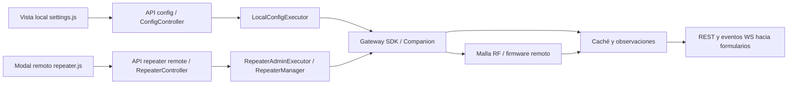

# Verificación actual de la configuración local y remota de MeshCore Bridge

Fecha: **2026-10-03** (America/New_York). Checkout auditado: **`9f561932d648470e8c8bd23fc789a66bdb378d0e`**. Entrega: análisis, reproducciones aisladas y plan de corrección; **no se modifica código de producción ni hardware**.

## 1. Resultado y objetivos

**No se puede afirmar que todos los parámetros se lean y escriban sin errores.** La revisión actual confirma mejoras del último commit y encuentra defectos que siguen impidiendo ese objetivo. Entre ellos: guardar radio local envía un PIN no editado como cero; la API GET conserva el PIN; AutoAdd falla cuando incluye `max_hops`; hay etiquetas de permisos de telemetría invertidas; varias claves remotas aceptadas no producen comandos; y la interfaz llama «aplicado» a un resultado sólo despachado.

Este documento completa la [auditoría anterior](NODE_CONFIGURATION_AUDIT_2026-10-03.md), realizada sobre `81f4260`. No sustituye sus observaciones históricas por resultados nuevos ni da por corregido un defecto porque lo anuncie el mensaje de commit. Los anexos y pruebas de esta entrega pertenecen a `docs/audits/node-config-verification-2026-10-03/`.

Objetivos de aceptación:

1. Leer valores reales con origen, fecha y disponibilidad; distinguir caché, desconocido y error.
2. Escribir únicamente cambios deliberados, con validación completa y comandos compatibles.
3. Comprobar el resultado por campo y conservar efectos parciales, borradores y destino.
4. Diferenciar aceptación local, despacho RF, confirmación remota y reinicio pendiente.
5. Mostrar permisos/capacidades reales y mantener LOCAL/REPEATER fuera del chat/contactos.
6. Preservar secretos, cero, decimales, unidades y límites efectivos de firmware/hardware.
7. Completar la validación física posterior antes de certificar funcionamiento en una placa.

## 2. Agente dirigente, especializaciones y aislamiento

| Responsable | Trabajo y propiedad | Skills aplicadas |
|---|---|---|
| Dirigente | Integra fuentes, revisa diffs/evidencia, cliente oficial, descubrimiento y comprobaciones estáticas; redacta documento, índice y ledger | `domain-adr-keeper`, `project-reference-audit`, `security-code-auditor` |
| Agente frontend | Controles, borradores, endpoints, formularios, idiomas, responsive y Chromium; anexo `frontend/` | `contract-openapi-sync`, `web-browser-inspection`, skills de frontend referenciadas en su informe |
| Agente backend/QA | Router/controladores/ejecutores, lectura/escritura, mocks, permisos y suites dirigidas; anexo `backend/` | `contract-openapi-sync`, `bridge-test-runner`, skills Python referenciadas en su informe |
| Agente protocolo | Firmware, SDK, CLI, builders, unidades, rangos y procedencia; anexo `protocol/` | `meshcore-source-inspector`, `project-reference-audit` |

La solicitud de comprobar y replicar errores autoriza los diagnósticos dirigidos de esta tarea. Las ejecuciones finales bloquearon dotenv/aperturas de `.env` o evitaron importar config, con datos temporales, SDK/MQTT mock, comandos capturados en memoria y servidor propio con puerto de loopback asignado por el SO. No se abrió puerto serie físico, no se utilizó una estación existente y no se contactó un broker operativo. Las referencias permanecen de sólo lectura. Las capturas remotas muestran una sesión administrativa **simulada por la fixture**, no credenciales ni una autenticación real. El harness inicial de protocolo importaba indirectamente config; no permite acreditar ausencia de intento de lectura de `.env`. Se corrigió y repitió: el JSON final registra cero intentos y ningún import de bridge/config; no se imprimieron ni guardaron secretos operativos. La incidencia queda descrita en su informe.

## 3. Fuentes y comparación con la app cliente de MeshCore

Las revisiones, orígenes y superficies binarias exactas se registran en el [informe de protocolo](audits/node-config-verification-2026-10-03/protocol/PROTOCOL_FINDINGS.md). La revisión local instalada del SDK es **2.3.8**; no se debe confundir con números citados por informes anteriores o con el contenido de otra revisión del SDK.

| Fuente | Uso y límite |
|---|---|
| Firmware `reference/meshcore/` | Autoridad de opcodes, parsers, permisos y efecto de los setters en esta revisión |
| SDK `reference/meshcore_py/` e instalado | Separar firmas y bytes de cada copia; comprobar contra el serializer ejecutado |
| CLI `reference/meshcore_cli/` | Composición oficial de operaciones y consultas; no todo comando USB funciona por RF |
| Clientes de terceros en `reference/` | Comparación de flujos, sin atribuirles autoridad del protocolo ni del cliente oficial |
| [Cliente web oficial](https://app.meshcore.nz/) | Inspeccionado desconectado: exige conectar dispositivo; no se verificaron formularios conectados |
| [Configurador oficial](https://config.meshcore.io/) | Flujo USB para Repeater/Room; fuente de agrupación visual, distinto de administrar por LoRa |
| [CLI oficial publicada](https://docs.meshcore.io/cli_commands/) | Consulta actual de comandos y restricciones; el checkout identificado determina la comparación concreta |
| [Presets oficiales](https://docs.meshcore.io/radio_presets/) | Son sugerencias mantenidas en la API del cliente, no una garantía de soporte de todas las placas |
| [Default scope en la app](https://blog.meshcore.io/2026/04/17/default-scope) | Opción documentada en Experimental Settings; sirve para separar scope de política local de contactos |

La [observación del cliente](audits/node-config-verification-2026-10-03/integration/official-client-observation.md) conserva lo visto y lo no accesible. Se observó Connect, Contacts, Channels, Map y el aviso de desconexión. No hay checkout del frontend oficial en las referencias. La apertura actual de Quick Start PDF falló; su consulta anterior permanece como evidencia histórica. No se inventa la implementación interna de las pantallas oficiales conectadas.

**Aplicación al diseño del bridge:** separar identidad/ubicación, acceso, radio y funciones avanzadas; guardar explícitamente; mostrar capacidades y cambios pendientes. Esta propuesta adapta el bridge y no afirma que la app oficial use el mismo modelo interno. USB Companion local, USB configurador de repetidor y administración RF remota son tres flujos distintos.

## 4. Flujo actual y contrato que debe mantenerse



REST y WS transportan JSON propio. El SDK administra el framing Companion; el framing raw del bridge no lo reemplaza. Un `MSG_SENT` local no certifica que un setter remoto haya sido aplicado. El cambio de radio local se aplica inmediatamente según firmware; la tupla remota se guarda y necesita reinicio para su aplicación.

| Superficie | Métodos/rutas | Lectura y escritura |
|---|---|---|
| Configuración local | GET/POST `/api/config`, aliases `/api/node/config`, `/api/node/settings` | Caché/SELF_INFO/queries locales; batch de setters y campos host |
| Secciones locales | GET/POST `/api/config/radio`, `/api/config/identity` | Comparten executor; la ruta de radio no limita por sí sola las claves del payload |
| Opciones avanzadas | `/api/config/autoadd`, `/path_hash_mode`, `/flood_scope`, `/custom_vars` | Operaciones dedicadas; requieren correspondencia exacta con SDK |
| Acciones locales | `/api/config/refresh`, `/sync-clock`, `/clear-stats`, `/reconnect`; `/api/node/advert`, `/reboot` | Separar comandos del dispositivo, acciones del host y acciones que emiten RF |
| Sesión remota | POST `/api/repeater/remote/login`, `/logout` | Login RF distinto de la API key del servidor y del PIN BLE |
| Config/acciones remotas | POST `/api/repeater/remote/config`, `/action` | Batch CLI/canales administrativos; estados dispatched/partial/pending_reboot |
| Consultas remotas | POST `/api/repeater/remote/neighbours`, `/owner`, `/regions`, `/clock`, `/acl` | Requests binarios o CLI según operación/capacidad; tienen coste RF |

La API key HTTP y sus permisos no se deducen de esta auditoría de mocks. El rol se determina por advert oficial y clave canónica, nunca por nombre. ROOM/SENSOR pueden disponer de CLI en el firmware examinado, pero la UI y las capacidades del bridge deben acreditarlo antes de habilitar controles. CLIENT de este Companion no es un servidor CommonCLI remoto.

## 5. Matriz de parámetros y resultado de lectura/escritura

En las matrices, **SDK mock OK** significa que el código del host construyó la llamada esperada y consumió una respuesta simulada. **Despacho OK** significa construcción/captura del comando, sin confirmación del remoto. Ninguna categoría demuestra escritura física, persistencia tras reboot o funcionamiento de todo build.

### 5.1 Nodo local

| Parámetro/control | Lectura y setter esperado | Estado actual y requisito pendiente |
|---|---|---|
| Nombre | SELF_INFO; `set_name`, CMD8 | SDK mock OK; límite 31 bytes UTF-8. Verificar readback del dispositivo |
| Latitud/longitud | SELF_INFO; `set_coords`, CMD14, i32 LE microgrados | SDK mock OK para pareja; patch de un eje usa baseline host, puede estar obsoleto |
| Altitud/fixed/owner | Caché/registro host | No son setters Companion acreditados por este flujo; se anuncian como applied y falta separar/persistir metadatos host |
| Frecuencia MHz | SELF_INFO; `set_radio`, CMD11 | SDK mock OK; patch usa tupla cacheada host; UI step 0,025 rechaza 915,123 válido para serializer |
| BW kHz | SELF_INFO; CMD11 | SDK mock OK; opciones UI incompletas frente al rango/build; no inventar BW al guardar |
| SF | SELF_INFO; CMD11 | SDK mock OK; UI no representa SF5 y lo sustituye por SF11 al guardar |
| CR | SELF_INFO; CMD11 | SDK mock OK con formato válido; validar enum/tupla completa |
| Potencia dBm | SELF_INFO; CMD12 | SDK mock OK positivo y caché actualizada; UI local transforma 0 en mínimo 2; SDK2.3.8 falla con valores negativos |
| Región/preset | Selector de UI | No setter de región Companion en esta vista; genera valores radio, no acredita hardware |
| Repeat | DEVICE_QUERY; byte opcional de SET_RADIO CMD11 | SDK mock OK con radio completa; no confundir Companion repeat con rol de repetidor ni bandas autorizadas |
| Hop limit | Caché host | Campo declarado aplicado sin setter Companion acreditado |
| Telemetry/advert/beacon interval | Caché host | Campo declarado aplicado sin scheduler/setter equivalente acreditado; no equivale a permisos OTHER_PARAMS |
| RX delay / airtime factor | GET43/SET21; factor ×1000 en wire | Conversión corregida 10/11/20; no implica aceptar AF20, fuera del rango persistente de boot0..9; HTML impide decimales por step=1; readback puede quedar pisado por SELF_INFO viejo |
| Telemetry base/loc/env | OTHER_PARAMS | SDK mock OK de valores numéricos; etiquetas base/loc invierten 1=flags y 2=all; env coherente |
| adv_loc_policy / multi_acks / manual_add_contacts | OTHER_PARAMS | SDK mock OK; validar build/protocol-level y estado leído |
| PIN BLE | `set_devicepin`, CMD37 | POST/MQTT redactan; GET aún devuelve PIN; radio full-payload manda 0 si está vacío/no editado |
| Path hash mode 0/1/2 | Caché/SELF_INFO; SET61 | SDK mock OK; GET dedicado sólo lee caché, falta distinguir observado/unknown |
| AutoAdd flags/overwrite/chat/max_hops | GET59/SET58 | Flags sin max_hops SDK mock OK; con max_hops HTTP500; UI siempre lo incluye y también pisa borrador |
| Default flood scope | SDK dedicated get/set/reset | SDK mock OK con scope; comprobar lectura fresca/error por campo |
| Custom vars | SDK get/set/empty-delete | SDK mock OK; capa UI/firmware debe informar soporte, lectura y fallos de cada variable |
| Reloj | get_time/set_time | Acción inspeccionada; no equiparar reloj host y RTC; validación física pendiente |
| Estadísticas/uptime/batería/temperatura | Queries locales y métricas host | Sólo lectura; clear-stats actual borra caché/contadores host, no demuestra reset del firmware |
| API key/host airtime/offline maps | Políticas del host, rutas propias | Fuera de configuración hardware; conservar separación y pruebas específicas de persistencia/autorización |

### 5.2 Nodo remoto

| Parámetro/control | Operación oficial en la revisión | Estado actual y requisito pendiente |
|---|---|---|
| F/BW/SF/CR | `get radio` / `set radio F,BW,SF,CR` | Construcción de tupla y despacho correctos con valores válidos; CR99 pasa a5; falta readback y UI ignora pending_reboot |
| Potencia | `get tx` / `set tx` | Despacho SDK mock OK; UI conserva cero con límites presentes, los pierde con snapshot parcial |
| Región | Preset/selector | Batch acepta `region` y no genera comando; no fingir una escritura de región |
| Repeat | `get repeat` / `set repeat on/off` | `repeat` despacha; alias `repeat_enabled` aceptado no despacha |
| Hop/flood max | `get/set flood.max`, si esa es la semántica requerida | UI manda `hop_limit`, batch no lo permite; no reemplazarlo silenciosamente sin acordar semántica |
| Advert intervalo | `get/set advert.interval` en minutos | `advert_interval` válido despacha; heurística segundos/minutos/clamp ambigua; `beacon_interval` UI aceptado no despacha |
| Flood advert intervalo | `get/set flood.advert.interval` en horas | Despacho válido; normalización silenciosa de inválidos; requiere cero/off y unidades explícitas |
| Nombre | `get/set name` | Despacho mock OK; validar bytes/control characters antes de RF |
| Owner info | `get/set owner.info` | Comillas históricas corregidas; lectura UI sobrescribe borrador y respuesta tardía A rellena nodo B |
| Owner name | No identidad distinta acreditada | No anunciar owner_name/name como dos propiedades físicas independientes |
| Latitud/longitud | `get/set lat`, `get/set lon` | `lat/lon` despachan; aliases `latitude/longitude` aceptados no despachan; no validar ubicación con metadata del local |
| Altitud/fixed | Depende de build, sin setter CommonCLI genérico acreditado | UI conserva controles; batch los rechaza; ocultar/deshabilitar con motivo hasta capability real |
| Admin password | `password NUEVA` | Builder y redacción de despacho corregidos; login sigue strip en AdminHandler |
| Guest password | `set guest.password` | Batch acepta `guest_password`, builder no produce setter en ese contexto |
| Identity key | Serial-only/sensible según firmware | UI no debe prometer rotación RF donde firmware la excluye; no operar identidad en esta auditoría |
| ACL public_key/permission | `setperm KEY PERM`, query ACL binaria por RF | Batch acepta campos sueltos pero no agrupa; builder admin→1 incorrecto, guest→2 incorrecto, remove→1 incorrecto |
| ACL mode | No `set acl.mode` genérico acreditado | Campo UI no debe representar un contrato inexistente; no enviado si no se edita es mejora parcial |
| Path hash mode | `get/set path.hash.mode` | Firmware lo ofrece; falta control/batch tipado completo en esta vista |
| Scope/regiones | Req binario/CLI soportado según build | Mantener endpoint explícito y resultados por destino; no inferir éxito de JSON externo |
| Neighbours/clock/telemetry/status | Requests binarios/CLI según operación | Aliases heredados de status/stats/ACL y discovery siguen incompatibles con canal RF |
| Login/logout/reboot/advert | Acciones administrativas | Login guest no autoriza escritura admin; reboot puede no contestar; advert/discovery sí emiten RF |

Los anexos contienen inventario DOM completo, llamadas capturadas por familia y fuentes de firmware para límites, unidades y permisos. Campos no soportados deben tener estado **no disponible**: el objetivo «cada parámetro» no permite fabricar setters inexistentes.

## 6. Hallazgos reproducidos y posibles soluciones

Prioridad P1: riesgo de secretos/permisos, escritura involuntaria o resultado engañoso; P2: funcionalidad/validación/estado; P3: calidad estática. Los IDs de esta entrega son independientes de los IDs históricos.

| ID | Problema y reproducción actual | Posible solución |
|---|---|---|
| V01 P1 | GET config conserva PIN sintético tras setter, aunque POST/status lo redactan | DTO público único para GET/refresh/WS/MQTT; omitir secreto y exponer sólo has_pin |
| V02 P1 | Cambiar sólo frecuencia en UI envía más de veinte claves y pin0 | Serializar dirty fields; PIN write-only en sección separada; vacío significa sin cambio |
| V03 P1 | Etiquetas telemetría base/loc 1=Todos,2=Contactos contradicen firmware 1=FLAGS,2=ALL | Enum canónico compartido, corregir etiquetas y explicitar permiso por flags; probar valor etiquetado→wire |
| V04 P1 | Admin ACL→1, guest/read→2 y remove sin perm→1 | Mapear firmware 3=admin,0=guest,1=read-only; eliminación con0; validar permisos y agrupar key+perm |
| V05 P1 | HTTP externo ok envuelve dispatched/partial; UI informa aplicado y limpia dirty | Resultado por operación; dispatched/pending_reboot/partial visibles; no promocionar a aplicado |
| V06 P1 | Owner query A tardía rellena B y consulta de A pisa draft propio | Capturar public key/request id/revisión del draft y aplicar sólo al destino correspondiente |
| V07 P1 | Guardado local pendiente: nueva edición se pierde; finally habilita guardar estando desconectado | Snapshot/revisión por campo; limpiar sólo revisión enviada; gating central de conexión/capabilities/in-flight |
| V08 P2 | AutoAdd max_hops en payload devuelve HTTP500 antes de SDK | Usar firma real SDK y validar semántica hops; error 4xx/503 si no soportado; contrato UI↔API coherente |
| V09 P2 | Claves remote allowed producen batch vacío con HTTP200 | Catálogo con normalización alias→operación y prevalidación; rechazar lo no implementado antes de TX |
| V10 P1 | Radio local parcial completa BW/SF/CR desde caché host distinta de SELF_INFO; constructor CR='4/5' produce int() ValueError en patch sólo BW | Baseline observado coherente o tupla completa requerida; CR normalizado una vez; mantener fuente/edad y no rellenar defaults |
| V11 P2 | Campos host se anuncian applied al hardware; consulta fallida puede marcar refresh fresco | Separar metadata host y hardware; persistir metadata autorizada; errores/observed_at por campo |
| V12 P1 | Nombre ya escrito antes de validar TX inválido; parcial remoto tratado HTTP200 ok | Prevalidar lote completo y plan antes de cualquier comando; conservar ledger parcial después de fallos de transporte |
| V13 P2 | Contraseña con espacios llega recortada pese a corrección del controlador | Eliminar strip en AdminHandler y cualquier entrada JS; validar longitud sin alterar bytes |
| V14 P2 | SDK2.3.8 TX negativos lanza OverflowError antes de frame | Capability efectiva de serializer+board; adaptación/version compatible verificada, sin editar referencia ni .venv como solución |
| V15 P2 | SF5 UI→vacío→SF11; TX local0→2; snapshot remoto parcial TX0/límites→20 | Opciones según capability, cero con ??, conservar límites conocidos y unknown explícito |
| V16 P2 | RX0,5/AF1,5 se serializan, pero checkValidity falla; freq915,123 también | step/rango compatibles con precisión wire; validar interacción nativa, no sólo llamar método JS |
| V17 P1 | Intervals ambiguos/invalid→off/clamp; CR99 remoto→5 y local se envía99; aliases serial-only/discovery; builders aceptan lat100/lonNaN/ACL999 | Unidades explícitas, enums estrictos, finite/rangos/clave64hex/u8 y catálogo por canal/capacidad; preservar cero sin elegir intervalos nuevos |
| V18 P2 | Eventos AutoAdd reescriben controles editados; gating local sólo parcial | Incluir todas las familias en stores observed/draft y deshabilitar cada acción por disponibilidad |
| V19 P3 | Ruff F841 y ocho errores mypy en nueve módulos de esta área | Quitar variable sin uso, estrechar Optional/Any y tratar builder None antes de dispatch/redacción |
| V20 P1 | Custom vars: primera OK, segunda ERROR; HTTP500 oculta la primera escritura | Resultado parcial por variable, incluyendo applied/rejected; conservar cambios previos y validar lote antes de setters |
| V21 P2 | Clave local desconocida devuelve200/applied vacío; respuesta SDK de tipo distinto de OK aceptada por setter en inyección defensiva | Allowlist local/capability y tipos de respuesta esperados por operación; esta inyección no demuestra una respuesta inválida del firmware real |

Las entradas del informe de backend/frontend/protocolo detallan las líneas exactas, payloads, salida observada y límites de cada caso. No todas las filas son bugs independientes: V02 y V01 describen rutas distintas del mismo dominio de secretos; V05 y V12 comparten parte del contrato parcial.

## 7. Mejoras actuales que sí se comprobaron

- Eventos de métricas ordinarios conservan borradores locales y de frecuencia remota; queda pendiente AutoAdd y consultas owner.
- Respuesta canónica `data.config` actualiza el formulario local; Problem Details presenta detail real.
- Guard remoto tiene bloqueo in-flight: dos intentos concurrentes generan un POST en el diagnóstico.
- Seguridad remota sin cambios genera cero POST; no prueba agrupación/compatibilidad de ACL cuando hay cambios.
- CLIENT por alias y LOCAL se rechazan en casos dirigidos; el modal también bloquea entrada CLIENT.
- Radio remota sin baseline completo se rechaza, evitando comandos con None/defaults del informe previo.
- ERROR/False/DISABLED SDK se rechazan en controles locales; resultados parciales locales conservan applied.
- POST/status redactan PIN/password en los casos ensayados, sin acreditar todas las rutas públicas.
- Conversión tuning ×1000, sintaxis password y owner corregidas en constructores.
- Descubrimiento ya no lanza el NameError histórico: cuatro variantes ADVERTISEMENT/NEXT_CONTACT pasan con timestamp ausente, inválido y numérico.
- Pestañas remotas ya no recortan etiquetas en las capturas ensayadas; no hay overflow horizontal global en esos tamaños.

## 8. Pasos de implementación y orden de dependencias

### Paso 1 — Definir catálogo y separar dominios

Crear tabla tipada por parámetro con nombre canónico, alias, unidad, lectura, escritura, firmware mínimo/build, permiso, secreto, persistencia, aplicación/reboot y canal. Distinguir Companion, metadata del bridge y servidor remoto. Declarar unknown/unsupported con motivo. Eliminar del formulario las promesas de setter que no existen. Entrega: matrices anteriores conciliadas con código y capacidades anunciadas.

### Paso 2 — Corregir secretos y permisos antes de ampliar funciones

DTO público en cada salida; PIN nunca repoblado ni incluido en radio salvo cambio explícito. Conservar contraseñas exactas. Corregir telemetría base/loc y ACL conforme a enums firmware. Rechazar CLIENT/LOCAL por identidad canónica en todas las entradas; distinguir guest/read-only/admin. Entrega: V01–V04/V13 con regresiones positivas y negativas.

### Paso 3 — Prevalidación y plan completo sin TX

Normalizar aliases; validar tipos, bytes UTF-8, finite/rangos, CR, factores y unidades antes de setters. Agrupar radio completa y key+perm. Resolver cada clave a operación; no permitir batch vacío por clave ignorada. Consultar baseline válido cuando sea necesario y permitido. Entrega: V08–V12/V17; invalid input produce error sin SDK/RF.

### Paso 4 — Estado observado y readback por campo

Mantener value/source/observed_at/availability/error por campo. SELF_INFO y caché no deben deshacerse entre sí. Metadatos host persistidos atómicamente fuera del event loop; no llamarlos configuración hardware. Queries fallidas no actualizan la fecha del valor viejo. Elegir estrategia de readback remoto después de acordar coste RF, sin añadir polling. Entrega: lectura fiable y diferencia applied/verified.

### Paso 5 — Resultado operativo y API/WS

Ledger por request id y clave canónica: validado, enviado, confirmado, parcial, pendiente de reboot y desconocido tras timeout. HTTP200 del envelope no borra estado interno. Preservar applied/dispatched/rejected en todas las rutas; UI consume la misma estructura. Mantener aliases REST y consumidores WS/MQTT compatibles, con secretos redactados antes de publicar. Entrega: V05/V12 sin falsos éxitos.

### Paso 6 — Borradores y formularios resistentes a concurrencia

Store observed/draft por nodo y revisión por campo, incluidos AutoAdd y owner. Capturar identidad al empezar cada fetch/save; respuestas tardías no escriben otro nodo. No borrar edición posterior a la revisión enviada. Serializar sólo cambios y no enviar nada si no hay cambios. Gating único de conexión/capabilities/permiso/in-flight, también en finally. Entrega: V02/V06/V07/V18.

### Paso 7 — Controles y diseño visual

Completar SF5, rangos TX/decimales/BW y estado unknown sin fallback destructivo. Etiquetar PIN BLE separado de password RF/API key. Mostrar radio local «efecto inmediato» y radio remota «guardado/reinicio pendiente». Mantener navegación responsive corregida, teclado, foco, traducciones ES/EN y claro/oscuro; cada acción no disponible muestra razón. No expandir controles ROOM/SENSOR indiscriminadamente. Entrega: V15/V16 y revisión nativa, no sólo DOM.

### Paso 8 — Regresiones mantenidas y limpieza estática

Convertir reproducciones diagnósticas en tests de comportamiento corregido dentro de tests/, evitando fijar el bug como contrato. Actualizar expectativas históricas con evidencia firmware y no relajar pruebas para ocultar fallos. Verificar filtros, secreto, cero, parcial, timeout, snapshot, cambio de nodo, edición durante POST y reset de proceso. Resolver Ruff/mypy manteniendo Python3.10. Entrega: suites dirigidas, cobertura del área y matriz de herramientas real.

### Paso 9 — Interoperabilidad física con alcance acordado

Registrar placa/firmware/transporte/SDK y estado inicial. Primero leer parámetros soportados. Para cada familia autorizada: valor A→B, respuesta, readback, retorno a A y persistencia cuando corresponda. PIN/password/ACL necesitan pruebas con sesión/permisos adecuados; nunca publicar valores. Radio remota requiere plan de recuperación al reiniciar; reboot sin respuesta no equivale a fallo. No efectuar estas operaciones durante la auditoría documental.

### Paso 10 — Documentar y cerrar

Actualizar arquitectura/protocolo/contratos sólo al implementar. Registrar cambios aceptados y restricciones, revisar diff y publicar únicamente archivos propios. Cierre exige UI/API/WS/firmware coherentes, ningún campo ignorado y evidencia por capacidad soportada. Un porcentaje de pytest no reemplaza esta matriz.

## 9. Checklist LoRa y decisiones pendientes

**Airtime:** esta entrega sólo simula y documenta. Setters locales Companion no son por sí solos paquetes RF; advert sí transmite. Login, setters, readback y queries remotos producen tráfico: contabilizar L+W+R y respuestas/retransmisiones según ruta. No fijar segundos sin payload, LoRa y saltos medidos. Reducir escrituras a campos cambiados y priorizar observaciones pasivas.

**Spam y feedback:** no añadir polling, notificaciones ni retries para mejorar el formulario. Una acción no debe duplicarse por clic/Enter, snapshot o MQTT/n8n. Conservar limitadores existentes y guarda de origen propio. Correlacionar por destino/request id y redactar antes de los eventos.

**Timers:** los intervalos de advert del remoto afectan timers del firmware. Un guardado no debe provocar ráfagas de host ni resetear cooldown sólo en memoria. Si posteriormente se crea scheduler host, persistir timestamp del último disparo, comprobar tiempo transcurrido tras reinicio y ensayar en entorno aislado.

Antes de implementar nuevas políticas de RF, acordar con el usuario intervalos mínimos, reintentos, límites, readback y reinicios. Los rangos de parser/build son restricciones existentes; esta auditoría no elige parámetros nuevos. No ejecutar pkill ni reiniciar una estación operativa para probar este plan.

## 10. Evidencia, comandos y límites de verificación

Los diagnósticos que pasan pueden **confirmar un defecto**; no son aceptación de producción ni cambios ya corregidos.

| Verificación actual | Resultado | Evidencia y alcance |
|---|---|---|
| Backend dirigido | **71 passed**, sin skips | [Informe y matriz](audits/node-config-verification-2026-10-03/backend/FINDINGS.md), [JSON pytest](audits/node-config-verification-2026-10-03/backend/pytest-report.json), [JUnit](audits/node-config-verification-2026-10-03/backend/junit.xml); 1,36s pytest, mocks y router real |
| Cuatro módulos de tests mantenidos | **47 passed, 8 failed, 1 warning**, 55 casos | [JSON](audits/node-config-verification-2026-10-03/backend/maintained-pytest-report.json), [JUnit](audits/node-config-verification-2026-10-03/backend/maintained-junit.xml); 5,17s; fallos clasificados abajo |
| Protocolo/constructores | **67 observaciones**: 4 SDK TX +3 tuning +60 builders | [Informe](audits/node-config-verification-2026-10-03/protocol/PROTOCOL_FINDINGS.md), [JSON](audits/node-config-verification-2026-10-03/protocol/reproduction.json); captura bytes/texto, sin ejecutar firmware |
| Chromium/SPA | **19 observaciones**, 65 controles, 26 capturas; exit0 | [Informe](audits/node-config-verification-2026-10-03/frontend/FINDINGS.md), [inventario DOM](audits/node-config-verification-2026-10-03/frontend/CONTROL_INVENTORY.md), [JSON](audits/node-config-verification-2026-10-03/frontend/reproduction-results.json); sin pageerror, WS conectado, dos console422 deliberados |
| Descubrimiento | **4 variantes aprobadas** | [JSON](audits/node-config-verification-2026-10-03/integration/advert-results.json); handler real, registro mock, sin transporte |
| Ruff0.16.3 focalizado | **1 error F841**, exit1 | [JSON](audits/node-config-verification-2026-10-03/integration/static-results.json); nueve módulos de la superficie administrativa |
| mypy2.3.1 --strict focalizado | **8 errores en2 archivos**, nueve módulos comprobados, exit1 | [Mismo JSON](audits/node-config-verification-2026-10-03/integration/static-results.json); Any/Optional y builder None |
| Cobertura y suite general | **No ejecutadas** | Alcance de diagnóstico dirigido y documentación; no hay cifra global de aceptación |
| Navegador oficial conectado/hardware RF | **No verificados** | Cliente observado desconectado; pruebas físicas posteriores separadas |

Entorno actual: Windows, Python3.12.14, Playwright1.62.0, Chromium151.0.7922.34. El mínimo soportado del proyecto sigue siendo Python3.10; esta ejecución no sustituye su CI de compatibilidad. Las capturas son 24 móviles390×844 en ES/EN y claro/oscuro, más dos desktop1920×1080 en español/claro. Sin overflow horizontal global en esas26 capturas; 372 claves DOM por idioma sin ausencias. No acredita textos dinámicos, WCAG completo ni todas las combinaciones desktop/idioma/tema.

Ejemplos visuales de la fixture: [radio local móvil](audits/node-config-verification-2026-10-03/frontend/light-es-local-radio-390.png), [radio remota desktop](audits/node-config-verification-2026-10-03/frontend/light-es-rep-radio-1920.png). Un remoto desconocido ya vacía frecuencia al cambiar destino, pero conserva defaults de SF/TX/intervalos que deben sustituirse por unknown.

### Clasificación de los ocho fallos mantenidos

| Test/área | Resultado y tratamiento |
|---|---|
| node_and_repeater: local get/set y frozen radio config | Dos fixtures AsyncMock sin Event OK explícito; corregir representación de respuesta y comprobar comportamiento, sin atribuir sus efectos a firmware |
| node_and_repeater: login remoto | Espera401 pero recibe400 antes del criterio auth; revisar contactos/resolver del MagicMock y repetir con fixture representativa |
| node_and_repeater: payload builder | Espera set_freq retirado; actualizar hacia tupla oficial set radio |
| admin_executors: local set config | Baseline sólo name/pubkey pese SELF_INFO válido; coincide con V10, no rellenar fixture para ocultar problema de implementación |
| admin_official: repeat false | Baseline sin BW/SF/CR impide set_radio; validar snapshot consolidado y comportamiento de baseline desconocido |
| repeater_manager_unit: radio commands | Espera set_freq obsoleto; tupla oficial |
| repeater_manager_unit: location/security commands | Espera set pos retirado; lat/lon independientes y respuesta verificable |

El warning es una coroutine AsyncMock `is_error` sin await en la fixture de respuesta no tipada. Las pruebas y fixtures existentes no se editaron para hacerlas pasar. JSON/JUnit de la suite mantenida quedaron guardados; el runner falló **después** al imprimir por cp1252 (UnicodeEncodeError). Los conteos corresponden al proceso pytest terminado, no al exit del wrapper. El harness backend inicial/intermedio tuvo incidencias de colección/expectativa: su salida se leyó, algunas trazas se sobrescribieron y no se presentan como evidencia final. La primera ejecución de Chromium falló por spawn EPERM del entorno, conservado en su anexo; la ejecución final autorizada terminó correctamente.

Comandos desde raíz, con `.venv` y directorio basetemp nuevo/exclusivo:

```powershell
.venv/Scripts/python.exe -m pytest docs/audits/node-config-verification-2026-10-03/backend/test_current_backend.py -q -o addopts= -p no:cacheprovider --basetemp=docs/audits/node-config-verification-2026-10-03/backend/tmp-new-run
.venv/Scripts/python.exe docs/audits/node-config-verification-2026-10-03/protocol/reproduce_protocol.py
.venv/Scripts/python.exe docs/audits/node-config-verification-2026-10-03/frontend/reproduce_ui.py
.venv/Scripts/python.exe docs/audits/node-config-verification-2026-10-03/integration/verify_advert.py
.venv/Scripts/python.exe docs/audits/node-config-verification-2026-10-03/integration/check_static.py
.venv/Scripts/python.exe scripts/validate_project_docs.py
```

Los scripts conservan su salida final en los anexos; repetirlos reemplaza esos resultados y requiere registrar nuevo HEAD/fecha. `--basetemp` lo administra pytest y debe ser exclusivo del diagnóstico. Los temporales y caches no forman parte de la entrega. Chromium puede necesitar permisos del entorno para lanzar procesos; su primer error de entorno no es un fallo de la SPA.

**Límites:** sin radio física, broker real, firmware remoto ejecutado, auditoría WCAG completa, latencia/airtime medidos ni código del frontend oficial conectado. Pruebas de mocks acreditan host/constructores, no interoperabilidad de cualquier versión. No se afirma que todos los parámetros estén corregidos; se entrega el camino verificable para conseguirlo.
