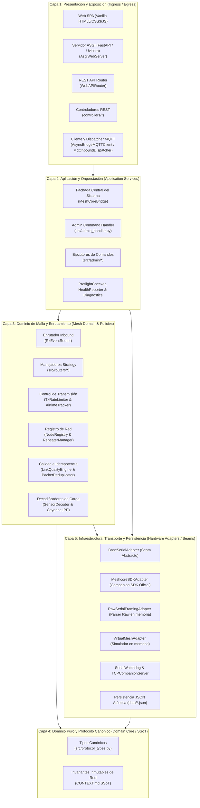
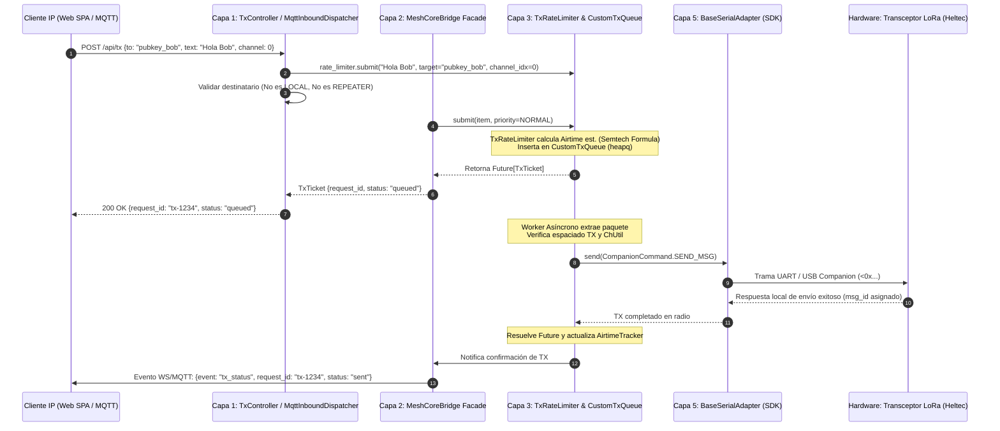
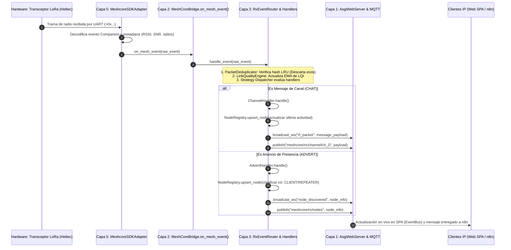

# Manual Técnico de Arquitectura en 5 Capas - MeshCore Bridge v3.0

> **Audiencia**: Ingenieros de software, desarrolladores de sistemas embebidos, arquitectos de integración y técnicos de soporte que requieran comprender en profundidad el diseño modular, contratos de interfaz, clases, métodos y flujos de datos de **MeshCore Bridge**.

Conciliado con el código el 2026-10-09 mediante lectura estática. Las capas organizan responsabilidades; no acreditan aislamiento absoluto, medidas de recursos o paridad operativa. Las suites permanecen suspendidas por instrucción del usuario.

---

## 1. Fundamentos y Filosofía de Diseño

**MeshCore Bridge** es una pasarela asíncrona desarrollada en **Python 3.10+ (`asyncio`)** que interconecta bidireccionalmente redes de malla LoRa (basadas en el protocolo y firmware oficial de MeshCore) con plataformas IP (WebSockets, REST API y mensajería MQTT para automatización con n8n/Node-RED).

El sistema sigue tres principios arquitectónicos fundamentales:

1. **Clean Architecture & Arquitectura Hexagonal (Ports & Adapters)**:
   - **Regla de Dependencia Unidireccional**: Las dependencias entre capas siempre apuntan hacia adentro, hacia el corazón del Dominio y del Protocolo.
   - **Costuras de Abstracción (*Seams*)**: El código de negocio jamás interactúa directamente con puertos serie físicos o sockets crudos; interactúa a través de interfaces abstractas (`BaseSerialAdapter`), lo que permite alternar indistintamente entre el SDK oficial, túneles TCP o simuladores virtuales de radio en memoria.

2. **Módulos Profundos (*Deep Modules*, John Ousterhout)**:
   - Las clases centrales (`MeshCoreBridge`, `NodeRegistry`, `TxRateLimiter`) ofrecen interfaces públicas simples y delgadas (pocos métodos y precondiciones mínimas) pero encapsulan una implementación interna robusta (concurrencia, sincronización de hilos, gestión de timers y descarte de paquetes).

3. **Single Source of Truth (SSoT) e Invariantes Inmutables de Dominio**:
   - La verdad fundamental del protocolo de radio deriva estrictamente de los encabezados C/C++ del firmware oficial MeshCore (`reference/meshcore/`, `AdvertDataHelpers.h`).
   - Las reglas inmutables de red (aislamiento total de repetidores de infraestructura, no auto-mensajería al nodo local, control de *duty cycle*) están protegidas a nivel de tipos y validadores canónicos.

---

## 2. Mapa Arquitectónico de las 5 Capas



---

## 3. Capa 1: Presentación y Exposición (Presentation & Ingress/Egress)

### 3.1 Responsabilidad
Constituye la frontera perimetral del sistema frente a redes IP, operadores humanos y servicios externos (n8n, Node-RED, brokers MQTT). Valida parámetros de entrada, gestiona autenticación API (`BRIDGE_API_KEY`), maneja conexiones HTTP/WebSocket y traduce payloads JSON hacia las llamadas de la Capa 2. **No contiene lógica de radiofrecuencia ni altera el estado de la malla.**

### 3.2 Clases y Métodos Principales

#### `AsgiWebServer` (`src/web/asgi_server.py`)
Servidor web asíncrono de producción basado en FastAPI y Uvicorn (ASGI).
- **`async start() -> None`**: Inicializa el socket Uvicorn en `WEB_HOST:WEB_PORT`, arranca el ciclo de vida ASGI y el hub WebSocket.
- **`async stop() -> None`**: Cierra el servidor Uvicorn de forma limpia y drena tareas y conexiones dentro del presupuesto de apagado.
- **`async broadcast_event(event_data: dict[str, Any]) -> None`**: Registra y difunde eventos en tiempo real a las conexiones listas mediante `WebSocketHub`; el perímetro reserva hasta 32 sesiones concurrentes.

El core crea este servidor cuando `WEB_ENABLED` está activo. El servidor HTTP nativo está retirado y no existe fallback hacia él. Las rutas REST reciben `Request`; los DTO Pydantic con `Any` y campos extra documentan entradas, sin validarlas en ejecución. El esquema se consulta en `/openapi.json` y el visor propio offline en `/docs` o `/redoc`; no se incluyen los paquetes Swagger UI/ReDoc ni se ejecutan acciones desde el visor. La política Origin admite allowlist, Host, loopback y LAN privada.

#### `WebAPIRouter` (`src/web/api_router.py`)
Enrutador de peticiones REST hacia los controladores modulares.
- **`async handle_request(method: str, path: str, body: dict[str, Any] | None = None) -> tuple[int, dict[str, Any]]`**: Normaliza el path, resuelve `ROUTE_ALIASES`, combina query con body y delega por familia. Body conserva precedencia sobre query. La autenticación HTTP se aplica antes en `BridgeSecurityMiddleware`.
- **`record_incoming_event(...) -> None`**: Actualiza historiales en RAM para mensajes, telemetría y eventos. Las rutas dinámicas se declaran en `asgi_route_catalog.py`; el dispatcher conserva sus comprobaciones de negocio.

#### Controladores REST (`src/web/controllers/`)
Cada controlador hereda de `BaseController` y atiende un subdominio específico:
- **`TxController` (`tx_controller.py`)**:
  - `async send_tx(req_body: dict[str, Any]) -> tuple[int, dict[str, Any]]`: Valida texto y destino para `/api/tx`, delega resolución/envío al bridge y conserva estados de admisión, envío y ACK separados.
- **`NodesController` (`nodes_controller.py`)**:
  - `async list_nodes(...)`: Retorna el catálogo unificado de nodos (clientes, repetidores, sensores).
  - `async get_lqi(...)`: Retorna la matriz de calidad de enlace LQI de los nodos observados.
  - `async get_analytics(...)`: Estadísticas globales de la red (nodos activos, ratio de saltos, promedios de batería).
  - `async get_rf_heatmap(...)`: Coordenadas GPS y potencia recibida (RSSI/SNR) para el mapa de cobertura.
- **`ContactsController` (`contacts_controller.py`)**:
  - `async handle_contacts_route(path, method, req_body)`: Despacha lista, descubrimiento, aceptación, creación, sincronización y transferencia. La lista usa `NodeRegistry.list_client_contacts()` y excluye repetidores y nodo local.
- **`RepeaterController` (`repeater_controller.py`)**:
  - `async execute_admin_command(...)`, `async execute_repeater_command(...)`, `async ping_zero(...)`, `async traceroute(...)`: Despacha comandos de gestión remota hacia `AdminCommandHandler` en Capa 2.
- **`ChannelsController` (`channels_controller.py`)**:
  - `async handle_channels_route(path, method, req_body)`: CRUD, sincronización y transferencia de canales; las vistas habituales enmascaran PSK y la exportación autenticada conserva el secreto.
- **`SystemController` (`system_controller.py`)**:
  - `async get_status()`, `async get_health()`, `async run_preflight()`: Diagnóstico y salud; `/api/diagnostics` utiliza `get_health()`.

#### `AsyncBridgeMQTTClient` (`src/mqtt_client.py`)
Cliente MQTT asíncrono con arquitectura thread-safe sobre `paho-mqtt`.
- **`start(loop: asyncio.AbstractEventLoop) -> None`**: Establece la conexión asíncrona (`connect_async`), configura el mensaje de última voluntad (LWT) retained en `{prefix}/bridge/state = "offline"` e inicia el loop de red de Paho en segundo plano (`loop_start`).
- **`publish(topic: str, payload: str | bytes, qos: int = 0, retain: bool = False) -> None`**: Publicación thread-safe hacia el broker externo.
- **`subscribe(topic: str, qos: int = 0) -> None`**: Suscripción a tópicos de comando e inyección.

#### `MqttInboundDispatcher` (`src/mqtt_dispatcher.py`)
Receptor de mensajes MQTT entrantes.
- **`_on_message(client, userdata, msg) -> None`**: Recibe mensajes del hilo de red de Paho y agenda su ejecución de manera determinista en el event loop principal de asyncio mediante `loop.call_soon_threadsafe()`.
- Procesa `{prefix}/tx` (inyección de transmisiones RF) y `{prefix}/admin/cmd` (comandos de gestión remota).

---

## 4. Capa 2: Aplicación y Orquestación (Application Services & Lifecycles)

### 4.1 Responsabilidad
Orquesta los casos de uso principales de la aplicación, coordina el ciclo de vida (*startup* y *graceful shutdown*), coordina la sincronización de estado inicial al conectar el hardware y administra la ejecución de comandos locales y remotos.

### 4.2 Clases y Métodos Principales

#### `MeshCoreBridge` (`src/bridge_core.py`)
Fachada maestra (*System Facade*) que actúa como punto central de integración para todos los componentes.
- **`async start() -> None`**:
  1. Ejecuta verificaciones de entorno (`PreflightChecker`).
  2. Inicia el motor de rate limiting (`TxRateLimiter.start()`).
  3. Arranca el cliente MQTT (`AsyncBridgeMQTTClient.start()`).
  4. Conecta el transceptor serial a través de `BaseSerialAdapter.connect()`.
  5. Inicia el `SerialWatchdog`.
  6. Arranca el servidor web (`AsgiWebServer.start()`) y el proxy TCP (`MeshCoreCompanionServer.start()`).
  7. Ejecuta la sincronización automática de estado con el hardware (`_auto_bootstrap_heltec_state()`).
  8. Lanza el ciclo de reporte periódico de salud (`HealthReporter`).
- **`async stop() -> None`**:
  1. Marca `running = False` y cancela tareas periódicas de background.
  2. Detiene el servidor web y desconecta clientes WebSocket.
  3. Cierra el puerto serie o socket de radio de forma segura.
  4. Publica el estado explícito `offline` en MQTT y desconecta del broker.
  5. Sincroniza y vuelca el estado persistente a disco (archivos JSON atómicos).
- **`on_mesh_event(event: dict[str, Any]) -> None`**: Callback registrado en el adaptador serie. Recibe eventos crudos normalizados y los pasa directamente al `RxEventRouter.handle_event()`.
- **`rate_limiter.submit(payload: str, target: str | None = None, channel_idx: int = 0, priority: TxPriority = TxPriority.NORMAL, request_id: str | None = None) -> asyncio.Future`**:
  - Aplica validaciones de destino (prohíbe envíos de chat a repetidores y a la pubkey del nodo local).
  - Encola la transmisión en `TxRateLimiter.submit()` retornando un future de seguimiento correlacionable con futuros eventos de confirmación (ACK).
- **`register_pending_ack(expected_ack: str, req_id: str, target: str) -> None`** y **`resolve_pending_ack(ack_code: str) -> dict | None`**:
  - Registra y resuelve códigos ACK (de 4 bytes hexadecimales) recibidos por RF para calcular tiempos de ida y vuelta (*Round-Trip Time*, RTT) y correlacionar estados de entrega con mensajes específicos.

#### `AdminCommandHandler` (`src/admin_handler.py`)
Punto de despacho unificado para operaciones administrativas generadas desde REST o MQTT.
- **`async handle(command: dict[str, Any]) -> dict[str, Any]`**: Interpreta la acción solicitada (`set_radio`, `set_identity`, `login`, `repeater_cmd`, `ping_zero`, `traceroute`) y delega al ejecutor específico.

#### Ejecutores Especializados (`src/admin/`)
- **`LocalConfigExecutor` (`local_config_executor.py`)**: Aplica cambios de frecuencia, ancho de banda (BW), spreading factor (SF), potencia de transmisión (TX power) y sincroniza el reloj RTC del microcontrolador con la hora del host.
- **`RepeaterAdminExecutor` (`repeater_executor.py`)**: Gestiona la autenticación administrativa con repetidores remotos (`login`/`logout`), asegurando que ninguna contraseña se envíe en texto plano por chat si falla el método binario del SDK, y ejecuta comandos remotos en el repetidor.
- **`TracerouteExecutor` (`traceroute_executor.py`)**: Dispara tramas `send_trace` y espera asíncronamente el evento `TRACE_DATA` correlacionado para reportar la cadena de repetidores por los que viaja el paquete.
- **`CliCommandExecutor` (`cli_command_executor.py`)**: Interfaz para ejecutar comandos directos de depuración en la consola CLI de la radio (`ver`, `bat`, `stats`).

#### Diagnósticos y Salud
- **`PreflightChecker` (`src/preflight.py`)**: Comprueba antes del arranque permisos del sistema de archivos, accesibilidad de puertos serie, sockets TCP y dependencias críticas.
- **`HealthReporter` (`src/health_reporter.py`)**: Tarea periódica en segundo plano que publica el pulso de salud (`{prefix}/bridge/health`), reportando conectividad serie, uptime, profundidad de cola de transmisión y conteos de eventos.
- **`DiagnosticManager` (`src/diagnostics.py`)**: Recopila registros de errores y métricas operativas del sistema en memoria.

---

## 5. Capa 3: Dominio de Malla y Enrutamiento (Mesh Domain & Policies)

### 5.1 Responsabilidad
Es el cerebro de la pasarela. Implementa toda la lógica de control, topología de la malla LoRa, políticas de tráfico de radiofrecuencia (airtime y *duty cycle*), enrutamiento de eventos entrantes, deduplicación de ecos, evaluación de calidad de enlaces (LQI) y decodificación de payloads de sensores.

### 5.2 Clases y Métodos Principales

#### `RxEventRouter` (`src/rx_router.py`)
Enrutador de eventos de recepción que implementa el **Strategy Pattern**.
- **`async handle_event(raw_event: Any) -> bool`**:
  1. Extrae metadatos normalizados (`RxMeta`: remitente, texto, RSSI, SNR, saltos, si es remitente local).
  2. Evalúa en orden los handlers especializados (`BaseRxHandler`) mediante su método `can_handle(meta, payload)`.
  3. Ejecuta el handler coincidente, actualiza el registro de nodos y difunde hacia WebSocket y MQTT.

#### Estrategias de Recepción (`src/routers/`)
Todos los handlers implementan el protocolo estructural `BaseRxHandler` (`src/routers/base.py`):
- **`ChannelHandler` (`channel_handler.py`)**: Procesa mensajes de canales públicos y cifrados. Actualiza métricas de señal, valida que el remitente no sea el nodo local y publica en `{prefix}/rx/channel/ch_<idx>` y WebSockets.
- **`DirectHandler` (`direct_handler.py`)**: Procesa mensajes directos (DM). Notifica entrega, maneja acuses de recibo (ACK) y actualiza el chat en el cliente web.
- **`AdvertHandler` (`advert_handler.py`)**: Procesa paquetes de presencia de nodos (`ADVERT`). Clasifica el rol según `FirmwareAdvertType`, actualiza o inserta el dispositivo en `NodeRegistry` y emite eventos de descubrimiento.
- **`RepeaterHandler` (`repeater_handler.py`)**: Procesa telemetría de repetidores de infraestructura, estados de batería, respuestas de login y acuses de confirmación `PUSH_CODE_SEND_CONFIRMED`.
- **`TelemetryHandler` (`telemetry_handler.py`)**: Extrae lecturas ambientales de sensores y actualiza los registros del nodo emisor.
- **`SystemHandler` (`system_handler.py`)**: Gestiona eventos del firmware Companion (resets, alertas de enlace, sincronización horaria).

#### `TxRateLimiter` & `AirtimeTracker` (`src/rate_limiter.py`)
Controlador de tráfico saliente para evitar colisiones y cumplir regulaciones de radiofrecuencia LoRa.
- **`TxRateLimiter`**:
  - **`async submit(payload, priority, target, channel_idx, request_id) -> asyncio.Future`**: Encola un elemento `TxItem` en una cola de prioridades `CustomTxQueue` (`HIGH = 0`, `NORMAL = 1`, `LOW = 2`). Retorna un `Future` que se resolverá cuando el paquete sea efectivamente transmitido por la radio física.
  - **`async _worker_loop() -> None`**: Tarea worker continua en segundo plano. Extrae paquetes por orden de prioridad, verifica si el canal está bloqueado por saturación y respeta el espaciado mínimo entre transmisiones (`TX_MIN_INTERVAL_SEC`). Si el consumo de canal alcanza nivel crítico, descarta selectivamente elementos de prioridad `LOW` para proteger el tráfico administrativo y de mensajería interactiva.
- **`AirtimeTracker`**:
  - **`estimate_lora_airtime_ms(payload_len, radio_config) -> float`**: Función determinista basada en la especificación estándar de Semtech (AN1200.13 para SX1262/SX1276). Considera tamaño de preámbulo, Spreading Factor (SF), Ancho de Banda (BW), Coding Rate (CR), encabezado explícito y Low Data Rate Optimization (LDRO).
  - **`record_tx(airtime_ms: float)`**: Almacena el airtime consumido en una ventana rodante de 1 hora y 24 horas.
  - **`update_channel_utilization(ch_util_pct: float) -> bool`**: Evalúa el porcentaje de ocupación del canal (ChUtil). Si supera el umbral de corte (`cutoff_threshold_pct`, por defecto 35%), activa el modo **Airtime Cutoff**, suspendiendo sondeos periódicos no esenciales hasta que el canal se descongestione por debajo del umbral de reanudación (30%).

#### `NodeRegistry` (`src/contact_manager.py`)
Repositorio y directorio en RAM de todos los nodos participantes de la red.
- **`upsert_node(update: NodeContactUpdate) -> bool`**: Inserta o actualiza un nodo en memoria, indexado por su clave pública (`public_key`) de 64 caracteres hex y alias.
- **`list_client_contacts() -> list[NodeContactInfo]`**: Retorna exclusivamente los nodos de tipo `CLIENT`. Excluye categóricamente repetidores (`REPEATER`) y la estación base local (`LOCAL`).
- **`list_nodes() -> list[NodeContactInfo]`**: Retorna la totalidad de nodos (clientes, repetidores, bbs/room, sensores) para la vista unificada de infraestructura.
- **`is_repeater_key(pubkey: str) -> bool`** y **`is_local_key(pubkey: str) -> bool`**: Comprobaciones de seguridad de tiempo constante $O(1)$ utilizadas para rechazar envíos de chat indebidos.
- **`save_to_file()` y `load_from_file()`**: Persistencia determinista en `data/node_registry.json` mediante guardado atómico (escritura en `.tmp` y reemplazo atómico del archivo).

#### `RepeaterManager` (`src/repeater_manager.py`)
Controlador especializado para repetidores LoRa.
- Administra sesiones de login remoto, tablas de ruteo conocidas y gobierna los períodos de *cooldown* (`min_interval_s`) entre comandos para prevenir saturación de la malla.

#### `LinkQualityEngine` (`src/lqi_engine.py`)
Motor de estimación de calidad de enlace de radio.
- **`update_lqi(pubkey: str, rssi: int, snr: float, hops: int) -> float`**: Aplica un filtro de media móvil exponencial (EMA) ponderando la señal recibida (RSSI en dBm), la relación señal/ruido (SNR en dB) y el conteo de saltos. Aplica decaimiento temporal si el nodo deja de emitir paquetes.

#### `PacketDeduplicator` (`src/deduplicator.py`)
Filtro de idempotencia contra ecos de retransmisión.
- **`is_duplicate(packet_hash: str) -> bool`**: Mantiene un búfer circular en memoria (LRU) con caducidad en segundos. Si un repetidor vecino retransmite una trama idéntica que ya fue procesada, el deduplicador la descarta silenciosamente, evitando duplicados en la UI y en MQTT.

#### Decodificadores de Carga (`src/sensor_decoder.py`)
- Decodifica telemetría estándar en formato JSON compacto y lecturas binarias empaquetadas en formato **CayenneLPP** (temperatura, humedad, presión, voltaje de batería, GPS) de manera nativa sin librerías externas.

---

## 6. Capa 4: Dominio Puro y Protocolo Canónico (Domain Core / SSoT)

### 6.1 Responsabilidad
Define las entidades fundamentales, opcodes de firmware, estructuras de datos inmutables y reglas de negocio invariantes del protocolo MeshCore. **No depende de ninguna otra capa ni de librerías externas de I/O**; utiliza exclusivamente la biblioteca estándar de Python (`dataclasses`, `enum`, `typing`).

### 6.2 Clases y Estructuras Principales (`src/protocol_types.py`)

#### Enums Canónicos de Protocolo
- **`FirmwareAdvertType(IntEnum)`**: Opcodes oficiales extraídos de `AdvertDataHelpers.h`:
  - `NONE = 0`: Dispositivo cliente por defecto.
  - `CHAT = 1`: Dispositivo de usuario con mensajería activa.
  - `REPEATER = 2`: Nodo router/repetidor de infraestructura.
  - `ROOM = 3`: Servidor BBS / sala comunitaria.
  - `SENSOR = 4`: Dispositivo autónomo de telemetría.
- **`NodeRole(str, Enum)`**: Clasificación canónica del bridge: `"CLIENT"`, `"REPEATER"`, `"ROOM"`, `"SENSOR"`, `"LOCAL"`.
- **`TxPriority(IntEnum)`**: Prioridades de transmisión de la cola: `HIGH = 0`, `NORMAL = 1`, `LOW = 2`.
- **`PacketType(IntEnum)`**: Tipos de tramas de protocolo (anuncios, mensajes de canal, DMs, ACKs, telemetría, traceroutes).

#### Dataclasses Inmutables (`@dataclass(frozen=True, slots=True)`)
- **`NodeIdentity`**: Entidad inmutable que representa la identidad criptográfica de un nodo:
  - `public_key: str`: Clave pública hex única de 32 bytes (64 caracteres hex).
  - `name: str`, `alias: str`, `role: str`, `is_local: bool`, `hardware_board: str | None`.
- **`NodeRfMetrics`**: Métricas de radiofrecuencia asociadas al último contacto con el nodo:
  - `hops: int | None`, `last_rssi: int | None`, `last_snr: float | None`, `lqi_score: float`, `lqi_status: str`.
- **`MeshcoreFrame`**: Estructura de trama raw propia del bridge:
  - Inicio de trama (`SOF = 0xAA`), fin de trama (`EOF = 0x55`), byte de escape (`ESC = 0x1B`, XOR `0x20`), cabecera little-endian y CRC-16 CCITT.
- **`TxItem`**: Solicitud de transmisión encolada en `CustomTxQueue`:
  - `priority: int`, `counter: int`, `payload: Any`, `target: str | None`, `channel_idx: int`, `future: asyncio.Future`.
- **`SensorReading`**: Medición normalizada de sensor (`sensor_type`, `value`, `unit`, `channel`).

### 6.3 Invariantes Inmutables de Dominio (Gobernadas por `CONTEXT.md`)
1. **Invariante de Aislamiento de Repetidores**: Ningún nodo clasificado con rol `REPEATER` (`FirmwareAdvertType.REPEATER`) puede aparecer en la libreta de Contactos de chat ni recibir mensajes de chat (directos o canales). Su interacción es 100% administrativa.
2. **Invariante del Nodo Local**: La estación base conectada (`LOCAL`) no puede ser añadida como contacto vecino ni ser destinataria de bucles locales de mensajería (prohibido enviarse mensajes a sí mismo).
3. **Invariante de Airtime**: Ninguna funcionalidad puede transmitir ráfagas descontroladas por radio; todo envío debe pasar por el embudo de prioridad y modelado de airtime de la Capa 3.

---

## 7. Capa 5: Infraestructura, Transporte y Persistencia (Hardware Adapters / Seams)

### 7.1 Responsabilidad
Implementa la comunicación física con los transceptores de radio (chips LoRa SX1262/SX1276 sobre microcontroladores Heltec v3, nRF52 o ESP32), conexiones serie UART/USB, túneles TCP y persistencia en disco. Provee las implementaciones concretas para las interfaces de la Capa 4 y Capa 3.

### 7.2 Clases y Métodos Principales

#### `BaseSerialAdapter` (`src/serial/serial_base.py`)
Contrato abstracto (*Seam*) que desacopla el núcleo del bridge del hardware específico.
- **`abstract async connect() -> bool`**: Establece la conexión física o socket.
- **`abstract async disconnect() -> None`**: Libera recursos de conexión.
- **`abstract async send(payload: bytes) -> bool`**: Transmite un buffer binario a la radio.
- **`abstract def is_connected() -> bool`**: Retorna el estado del enlace de transporte.
- **`set_rx_callback(callback: Callable[[dict[str, Any]], None]) -> None`**: Inyecta el callback de recepción hacia Capa 2.

#### `MeshcoreSDKAdapter` (`src/serial/sdk_adapter.py`)
Adaptador de producción oficial que envuelve el SDK oficial de MeshCore en Python.
- Utiliza el framing oficial de Companion: marcador `<` para comandos del host a la radio, `>` para respuestas y eventos de la radio al host, longitud `uint16` little-endian y payload binario.
- Soporta conexión física serie (`SERIAL_PORT = "AUTO"` o `COMx`/`/dev/ttyACM0`) a 115200 baudios y conexiones remotas vía TCP (`tcp://host:port`).
- Normaliza los callbacks de eventos del SDK (`on_packet`, `on_advert`, `on_trace`, etc.) traduciéndolos a diccionarios normalizados consumidos por Capa 2 y Capa 3.

#### `RawSerialFramingAdapter` (`src/serial/raw_framing.py`)
Parser y serializador en memoria para el formato de trama binario raw propio del bridge (`0xAA`/`0x55` con delimitadores, stuffing por escape XOR 0x20 y validación CRC-16 CCITT). Es un procesador en memoria y no maneja directamente descriptores UART.

#### `VirtualMeshAdapter` (`src/virtual_mesh_adapter.py`)
Emulador virtual en memoria de red de radio. Permite simular topologías complejas de múltiples nodos, retardos de propagación LoRa, caídas de señal y retransmisiones de repetidores para pruebas automatizadas y CI sin requerir dispositivos físicos.

#### `SerialWatchdog` (`src/serial/watchdog.py`)
Supervisor de salud y vivacidad local del enlace serie.
- Monitorea periódicamente que la radio responda consultas de vivacidad local (e.g. `get_time`, `get_bat`).
- Si detecta pérdida de comunicación o desconexión USB, dispara automáticamente la rutina `_reconnect_serial` de la Capa 2 con pausas de estabilización de bus (1.5 segundos) y retroceso exponencial (*exponential backoff*).

#### `MeshCoreCompanionServer` (`src/tcp_companion_server.py`)
Servidor socket TCP (puerto 5000 por defecto) que actúa como proxy transparente. Permite que aplicaciones Companion oficiales (MeshCore Mobile App o MeshCore CLI) se conecten al bridge mediante la red IP y compartan el acceso al mismo módem LoRa físico conectado.

#### Persistencia Atómica en Disco
Todos los módulos que persisten estado utilizan operaciones atómicas seguras contra caídas de tensión:
1. `data/node_registry.json`: Registro de nodos y métricas.
2. `data/channels.json`: Configuración y PSK de canales lógicos.
3. `data/airtime_history.json`: Historial de consumo de radio de las últimas 24 horas.
- **Mecanismo Atómico**: La escritura se realiza en un archivo temporal con sufijo `.tmp` mediante `json.dump()`, se asegura la escritura física con `flush()` y `os.fsync()`, y finalmente se realiza un `os.replace()` atómico en el sistema de archivos del sistema operativo.

---

## 8. Flujos de Datos Extremo a Extremo (Walkthroughs Técnicos)

### 8.1 Flujo de Transmisión Saliente (TX Outbound: Chat o Comando)



---

### 8.2 Flujo de Recepción Entrante (RX Inbound: Anuncio o Mensaje)



---

## 9. Matriz de Contratos e Interfaces entre Capas

| Capa Origen | Capa Destino | Punto de Contacto (Clase / Interfaz) | Métodos Principales Utilizados | Tipos de Datos Intercambiados |
|---|---|---|---|---|
| **Capa 1** | **Capa 2** | `MeshCoreBridge` | `send_text_message()`, `reset_counters()`, `start()`, `stop()` | `TxTicket`, `dict`, tipos primitivos |
| **Capa 1** | **Capa 2** | `AdminCommandHandler` | `handle_command()` | `dict` de comando JSON |
| **Capa 1** | **Capa 3** | `NodeRegistry` | `list_client_contacts()`, `list_nodes()`, `get_node()` | `NodeContactInfo` |
| **Capa 2** | **Capa 3** | `RxEventRouter` | `handle_event()` | `dict` de evento normalizado |
| **Capa 2** | **Capa 3** | `TxRateLimiter` | `submit()`, `start()`, `stop()` | `TxItem`, `asyncio.Future`, `TxPriority` |
| **Capa 2** | **Capa 5** | `BaseSerialAdapter` (*Seam*) | `connect()`, `disconnect()`, `send()`, `is_connected()` | `bytes`, `bool` |
| **Capa 3** | **Capa 4** | `protocol_types.py` | Definición de tipos de dominio | `FirmwareAdvertType`, `NodeRole`, `MeshcoreFrame` |
| **Capa 3** | **Capa 1** | Callbacks hacia WS / MQTT | `broadcast_event()`, `publish()` | Diccionarios normalizados JSON |
| **Capa 5** | **Capa 2** | Callback de Recepción | `on_mesh_event()` | Diccionarios crudos de eventos |

---

## 10. Guía Práctica de Extensión para Desarrolladores y Técnicos

### 10.1 Cómo agregar un nuevo endpoint REST (Capas 1 y 2)
1. **Capa 1**: En [`src/web/controllers/`](../src/web/controllers/), define el método en el controlador correspondiente heredando de `BaseController` (o crea un nuevo controlador):
   ```python
   async def get_custom_metric(self) -> tuple[int, dict[str, Any]]:
       data = self.ctx.bridge.get_custom_metric()
       return 200, {"status": "ok", "data": {"metric": data}}
   ```
2. **Capa 1**: En [`src/web/api_router.py`](../src/web/api_router.py), añade la condición al dispatcher de la familia apropiada (por ejemplo `_dispatch_system()`):
   ```python
   if clean_path == "/api/system/custom-metric" and method == "GET":
       return await self.system_ctrl.get_custom_metric()
   ```
3. **Contrato web**: Registra método, ruta, modelo documental y lote en [`asgi_route_catalog.py`](../src/web/asgi_route_catalog.py), y campos/status/efectos en [`asgi_openapi_catalog.py`](../src/web/asgi_openapi_catalog.py). Revisa autorización en [`access_policy.py`](../src/web/access_policy.py), el consumidor SPA y la documentación. No aplicar validación DTO nueva por accidente.
4. **Capa 2**: Expón el método correspondiente en `MeshCoreBridge` ([`src/bridge_core.py`](../src/bridge_core.py)), coordinando los datos desde Capa 3 o Capa 5. Ejecuta regresiones únicamente cuando el usuario las autorice.

### 10.2 Cómo agregar un nuevo decodificador de sensor o tipo de paquete (Capas 3 y 4)
1. **Capa 4**: En [`src/protocol_types.py`](../src/protocol_types.py), declara el opcode o enum correspondiente si deriva del protocolo oficial:
   ```python
   class CustomSensorType(IntEnum):
       PRESSURE_BAR = 0x73
   ```
2. **Capa 3**: En [`src/sensor_decoder.py`](../src/sensor_decoder.py), implementa la función de parsing binario o JSON:
   ```python
   def parse_custom_telemetry(payload: bytes) -> SensorReading:
       # Lógica determinista sin dependencias externas
       return SensorReading(...)
   ```
3. **Capa 3**: En [`src/routers/telemetry_handler.py`](../src/routers/telemetry_handler.py), invoca el nuevo decodificador al procesar paquetes con ese opcode.

### 10.3 Cómo implementar un nuevo transporte de hardware (Capa 5)
1. **Capa 5**: En [`src/serial/`](../src/serial/), crea una nueva clase que herede de `BaseSerialAdapter` e implemente todos sus métodos abstractos:
   ```python
   class BluetoothBLEAdapter(BaseSerialAdapter):
       async def connect(self) -> bool:
           ...
       async def disconnect(self) -> None:
           ...
       async def send(self, payload: bytes) -> bool:
           ...
       def is_connected(self) -> bool:
           ...
   ```
2. **Capa 2**: En [`src/bridge_core.py`](../src/bridge_core.py), en el método factoría `_create_serial_adapter()`, agrega la opción de instanciar el nuevo adaptador según la configuración de entorno (`config.py`). **El resto de las capas (C1, C2, C3, C4) permanecerán 100% inalteradas**.
