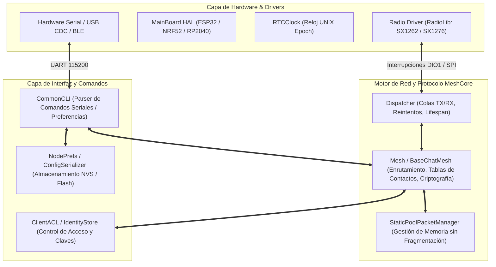

# MeshCore Firmware C/C++ — Análisis Técnico y Estructura Interna

> **Documento de Referencia para Agentes de Antigravity**  
> **Repositorio de Origen**: [`/reference/meshcore`](../../reference/meshcore)\
> **Área de Responsabilidad**: Protocol & Firmware Investigator Agent  
> **Estándar**: C++11 / Arduino / PlatformIO / FreeRTOS (ESP32, NRF52840, RP2040, STM32)

---

## 1. Visión General del Firmware

MeshCore es un firmware embebido de alto rendimiento para redes malladas (Mesh) sobre radio LoRa (SX1262, SX1268, SX1276, SX1278, LR1121). Proporciona routing dinámico de paquetes por inundación (Flood Routing) y rutas directas deterministas con compresión de saltos (Path Routing).



---

## 2. Estructura Wire y Layout del Paquete LoRa (`Packet.h`)

El paquete fundamental de transmisión en el aire consta de un encabezado de 1 byte con campos de bits, seguido de códigos de transporte opcionales, secuencia de ruta (path) y la carga útil cifrada o en texto plano.

### 2.1 Desglose de Bits del Byte de Encabezado (`header`)

| Bits | Máscara | Desplazamiento | Nombre | Descripción y Valores |
| :---: | :---: | :---: | :--- | :--- |
| `0..1` | `0x03` | `0` | `RouteType` | `0x00`: `TRANSPORT_FLOOD` (Inundación con códigos de transporte)<br>`0x01`: `FLOOD` (Inundación estándar, construye la ruta al vuelo)<br>`0x02`: `DIRECT` (Ruta directa con ruta predefinida)<br>`0x03`: `TRANSPORT_DIRECT` (Ruta directa + códigos) |
| `2..5` | `0x3C` (`0x0F`) | `2` | `PayloadType` | `0x00`: `REQ` (Petición directa con hash y MAC)<br>`0x01`: `RESPONSE` (Respuesta a REQ o ANON_REQ)<br>`0x02`: `TXT_MSG` (Mensaje de texto directo)<br>`0x03`: `ACK` (Confirmación simple de recepción)<br>`0x04`: `ADVERT` (Anuncio de presencia e identidad de nodo)<br>`0x05`: `GRP_TXT` (Mensaje de canal grupal con hash de canal)<br>`0x06`: `GRP_DATA` (Datagrama de canal para telemetría binaria)<br>`0x07`: `ANON_REQ` (Petición anónima con clave efímera)<br>`0x08`: `PATH` (Ruta descubierta devuelta al emisor)<br>`0x09`: `TRACE` (Trazador de ruta con recopilación de SNR por salto)<br>`0x0A`: `MULTIPART` (Segmento de paquete fragmentado)<br>`0x0B`: `CONTROL` (Descubrimiento y control de red)<br>`0x0F`: `RAW_CUSTOM` (Carga cruda para aplicaciones externas) |
| `6..7` | `0xC0` (`0x03`) | `6` | `PayloadVer` | `0x00`: `PAYLOAD_VER_1` (Hashes de 1 byte, MAC de 2 bytes)<br>`0x01..0x03`: Reservado para versiones futuras |

### 2.2 Layout Wire y Estructura de Memoria de `Packet`

```
+------------------+-------------------+--------------------+------------------------+--------------------------+
|  header (1 Byte) | transport_codes   | path_len (1 B)     | path (longitud variable)| payload (longitud variable)|
|  [Ver|Type|Route]| (4 Bytes opcional)| [Size:2b | Count:6b| (Secuencia de Hashes) | (Datos de Aplicación)    |
+------------------+-------------------+--------------------+------------------------+--------------------------+
```

- **`MAX_PACKET_PAYLOAD`**: `184 Bytes`.
- **`MAX_PATH_SIZE`**: `64 Bytes`.
- **`MAX_TRANS_UNIT` (MTU Total)**: `255 Bytes` (límite físico del buffer FIFO del chip LoRa SX1262).
- **Serialización wire**: `Packet::writeTo()` escribe header, códigos opcionales de transporte, un byte `path_len`, los bytes de ruta efectivos y payload. `path_len` codifica tamaño de hash en sus dos bits altos y número de hashes en sus seis bits bajos; tamaños válidos de 1, 2 o 3 bytes.
- **Memoria**: `Packet` declara `payload_len` y `path_len` como `uint16_t`, `transport_codes[2]` como `uint16_t`, buffers fijos `path[64]` / `payload[184]` y `_snr`. No es un struct packed que deba enviarse con `memcpy(sizeof(Packet))`: el padding y tamaño de objeto dependen de la ABI, y sus longitudes no coinciden con los campos wire.
- **Endianness**: los enteros de transporte y campos Companion documentados utilizan LE. Los valores multibyte CayenneLPP utilizan BE. El paquete wire descrito aquí no incorpora el CRC-16 del fallback propio `MeshcoreFrame`; la integridad RF corresponde a la capa de radio y a MAC/firmas según payload.

Fuentes: `reference/meshcore/src/Packet.h`, `Packet.cpp` (`getRawLength`, `writeTo`, `readFrom`) y `MeshCore.h` (`MAX_PACKET_PAYLOAD`, `MAX_PATH_SIZE`, `MAX_TRANS_UNIT`).

---

## 3. Algoritmo de Enrutamiento y Deduplicación (`Mesh.cpp`)

### 3.1 Flood Routing (Enrutamiento por Inundación)
1. Un paquete flood permite construir la ruta durante su retransmisión.
2. Los repetidores intermedios añaden su hash al campo `path`, sujetos a capacidad y reglas de retransmisión. El layout wire no define un contador TTL separado que se decremente por salto.
3. La ruta recibida puede usarse para descubrir caminos de retorno y posteriores envíos directos; no garantiza por sí sola una ruta óptima o entrega.

### 3.2 Tabla de Prevención de Bucles y Hash de Paquetes
Para evitar la retransmisión infinita de tramas en la malla:
- `Packet::calculatePacketHash()` calcula un hash de 8 bytes: SHA256 del tipo de payload seguido del payload. Para TRACE incluye también el `path_len` en memoria antes del payload, permitiendo distinguir visitas en la ruta de retorno.
- `SimpleMeshTables` mantiene una tabla circular `_hashes` en RAM. La referencia declara `MAX_PACKET_HASHES = 128 + 32`, no una tabla universal de 64 entradas; registra duplicados directos y flood.

Fuentes: `reference/meshcore/src/Packet.cpp` y `reference/meshcore/src/helpers/SimpleMeshTables.h`.

---

## 4. Criptografía y Gestión de Identidad (`Identity.h`, `Identity.cpp`)

- **Curva Elíptica**: Curve25519 (X25519 para intercambio de claves Diffie-Hellman) y Ed25519 para firmas digitales de anuncios.
- **Tamaño de Claves**:
  - Clave Pública (`PUB_KEY_SIZE`): `32 Bytes`.
  - Clave Privada (`PRV_KEY_SIZE`): `64 Bytes`.
  - Firma Digital (`SIGNATURE_SIZE`): `64 Bytes`.
  - Bloque de Cifrado (`CIPHER_BLOCK_SIZE`): `16 Bytes` (AES-128; `Utils.cpp` usa `AES128`).
  - Código de Autenticación de Mensaje (`CIPHER_MAC_SIZE`): `2 Bytes` (V1).

---

## 5. Parser CLI y Configuración en Memoria (`CommonCLI.cpp`, `NodePrefs`)

El archivo `CommonCLI.cpp` implementa el parser de comandos de texto y binarios sobre el puerto serial.

### Parámetros Configurables de Radio (`NodePrefs`):
- `freq`: Frecuencia RF en MHz (ej. `915.0`, `868.0`, `433.0`).
- `bw`: Ancho de banda en kHz (`62.5`, `125.0`, `250.0`, `500.0`).
- `sf`: El parser `CommonCLI.cpp` de esta revisión admite Spreading Factor `5` a `12`; disponibilidad efectiva según hardware/build.
- `cr`: Coding Rate (`5` a `8`, que representan $4/5$ a $4/8$).
- `tx`: Potencia de transmisión en dBm (`2` a `22` dBm).
- `cad`: Channel Activity Detection (`1` habilitado, `0` deshabilitado).
- `rxgain`: Ganancia de recepción LNA / FEM boosted (`1` o `0`).
- `hash_mode`: Tamaños efectivos de hash de saltos de `1`, `2` o `3` bytes. El comando Companion `SET_PATH_HASH_MODE` usa valores codificados `0`, `1`, `2`, respectivamente (`path_hash_mode + 1` en `examples/companion_radio/MyMesh.cpp`).
