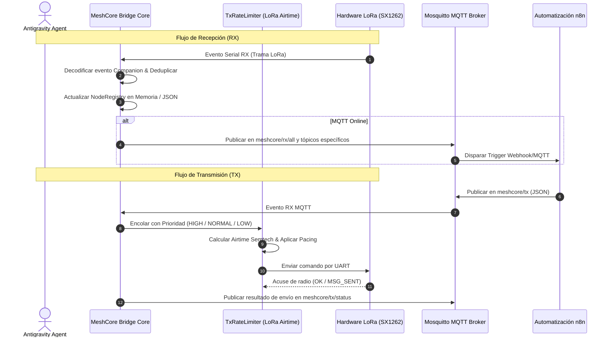

# Guía de Integración y Manual para Agentes de Antigravity

> **Manual Operativo y Cookbook de Referencia para Subagentes**  
> **Área de Responsabilidad**: Protocol Investigator, Bridge Architect, QA & Fuzzing Agent  
> **Ubicación**: `/docs/reference_analysis/04_INTEGRATION_GUIDE_FOR_AGENTS.md`

---

## 1. Guía de Interacción para Agentes

Este documento establece las directrices prácticas para que cualquier agente de Antigravity (existente o futuro) interactúe con el ecosistema **MeshCore Bridge**.



---

## 2. Pautas por Rol de Agente

### 2.1 Para el Protocol & Firmware Investigator Agent
1. **Regla de Oro**: La única fuente de verdad binaria reside en [`/reference/`](../../reference/).
2. **Procedimiento ante nuevos tipos**:
   - Usar la skill `meshcore-source-inspector` para extraer los campos, tipos C/C++ y modificadores `#pragma pack`.
   - Documentar campos y offsets del formato serializado, diferenciándolos de estructuras en memoria, padding/ABI y endianness por campo (Companion LE; CayenneLPP BE).
   - Definir los nuevos tipos en [`src/protocol_types.py`](../../src/protocol_types.py) utilizando estrictamente `@dataclass(frozen=True)` o `IntEnum`.
   - Actualizar [`docs/PROTOCOL_SPEC.md`](../PROTOCOL_SPEC.md).

### 2.2 Para el Python Bridge Architect Agent
1. **Regla de Oro**: Ninguna operación I/O puede bloquear el bucle de `asyncio`.
2. **Procedimiento de Implementación**:
   - Utilizar los adaptadores disponibles según el transporte real. El SDK oficial `meshcore_py` habla Companion; `RawSerialFramingAdapter` utiliza un formato propio del bridge (`0xAA`/`0x55`, escaping y CRC-16) para simulación/enlaces compatibles. No asumir que ausencia del SDK vuelve compatible ese fallback con firmware Companion.
   - Las operaciones de persistencia en disco deben ser atómicas mediante archivos JSON.
   - Asegurar que el espaciado de transmisión LoRa respete el tiempo en el aire calculado por `estimate_lora_airtime_ms()`.

### 2.3 Para el QA & Fuzzing Agent
1. **Regla de Oro**: Ejecutar suites y verificación de QA únicamente bajo petición explícita del usuario, según `AGENTS.md`. Documentar resultados reales y limitaciones; no presentar una verificación pendiente como aprobada.
2. **Procedimiento de Verificación**:
   - Cuando se autorice explícitamente la ejecución de QA, usar:
     ```powershell
     python .agents/skills/bridge-test-runner/scripts/run_checks.py
     ```
   - Diseñar pruebas deterministas usando mocks asíncronos (`AsyncMock`, `MagicMock`).
   - Incluir casos límite: tramas truncadas, desconexiones intempestivas de sockets, timeouts en puertos seriales y desbordamiento de colas.

---

## 3. Matriz de Códigos de Error Frecuentes

| Código / Excepción | Causa Probable | Acción de Mitigación del Bridge |
| :--- | :--- | :--- |
| `ERR_CODE_UNSUPPORTED_CMD` (`0x01`) | Comando no soportado por el firmware Companion; interpretar el código de la respuesta ERROR | El worker TX propaga el fallo al solicitante. El jitter es pacing entre transmisiones, no retry exponencial |
| `ERR_TIMEOUT` | La radio no respondió al comando serial en el tiempo límite | El `SerialWatchdog` detecta inactividad y ejecuta reconexión suave |
| `CRC_MISMATCH` | Corrupción del cuerpo del formato fallback propio; no es una respuesta Companion ni demuestra por sí sola interferencia RF | El `RawSerialFramingAdapter` descarta la trama inválida |
| `MQTT_DISCONNECTED` | Pérdida de conectividad con el broker Mosquitto | Reintento en segundo plano con reconexión exponencial asíncrona |
