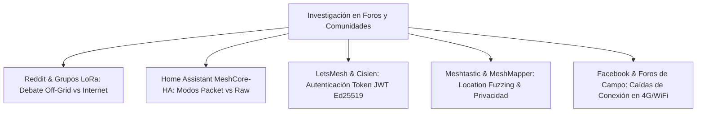
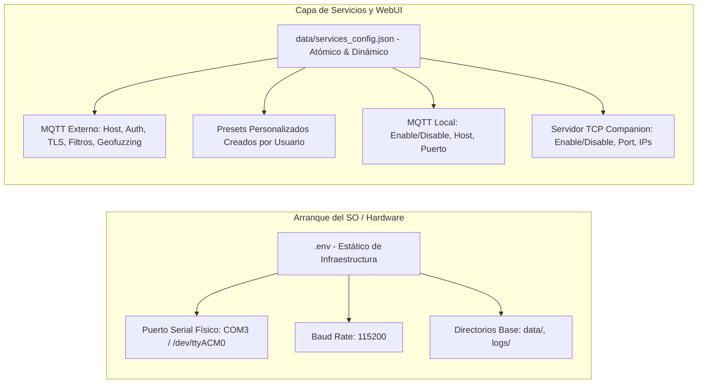
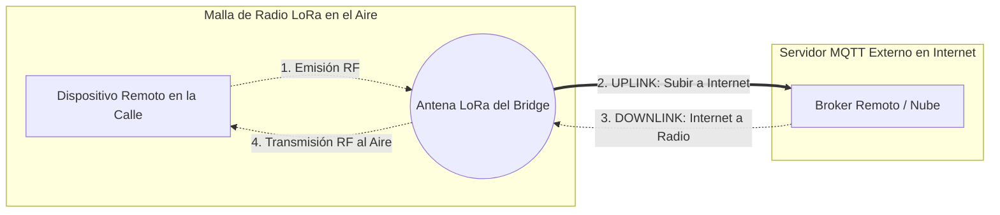
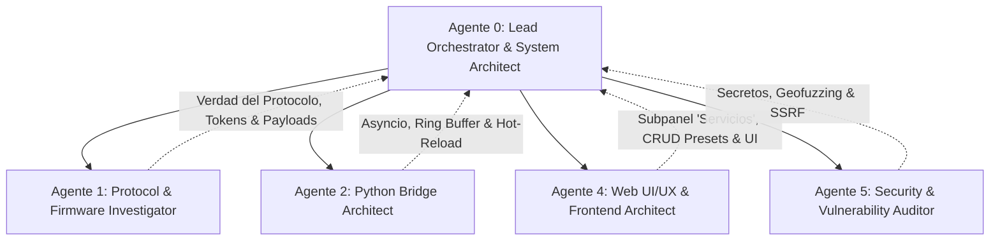

# Plan de Implementación: Integración de Broker MQTT Externo y Gestión Dinámica de Servicios de Red en MeshCore Bridge

> **Documento de Especificación, Investigación Comunitaria y Planificación Paso a Paso**  
> **Fecha:** Octubre 2026  
> **Estado:** Aprobado por el Consejo Multi-Agente con Aportes de la Comunidad de MeshCore & LoRa (Listo para Ejecución)  
> **Referencia de Proyecto:** MeshCore Bridge v3.x  

---

## 1. Resumen Ejecutivo y Objetivos

El propósito de esta iniciativa es dotar a **MeshCore Bridge** de la capacidad de interactuar de forma flexible y segura con **servidores MQTT externos** (tanto públicos/comunitarios como privados), permitiendo el reenvío estructurado de paquetes capturados desde la malla LoRa, con soporte para autenticación anónima, usuario/contraseña o **tokens JWT comunitarios**, y **gestión personalizada de presets de conexión**.

Asimismo, se aborda una reestructuración arquitectónica fundamental solicitada por el usuario: **desacoplar los servicios de red de las variables de entorno estáticas (`.env`) y trasladar su configuración integral a un archivo JSON dinámico y atómico (`data/services_config.json`) gestionable 100% desde la interfaz web (SPA)**. Esto incluye:

1. **Broker MQTT Externo (Upstream / Remoto):** Habilitar/deshabilitar, IP/host, puerto, credenciales (anónimo, usuario/password o token), TLS/SSL, prefijo o plantilla de tópicos, dirección de flujo (solo uplink vs downlink opcional) y filtros de tipos de paquetes a reenviar.
2. **Gestor de Presets Personalizados:** Posibilidad de cargar perfiles estándar (*LetsMesh*, *MeshMapper*, *ChiMesh*, *Home Assistant*) y **crear, guardar, editar y eliminar manualmente nuevos presets personalizados** desde la propia WebUI.
3. **Broker MQTT Propio/Local (n8n & Home Automation):** Habilitar/deshabilitar, host, puerto, credenciales, TLS y prefijo canónico directamente desde la Web.
4. **Servidor TCP Companion (App Móvil Oficial MeshCore / CLI):** Habilitar/deshabilitar, host de enlace (`0.0.0.0` vs `127.0.0.1`), puerto de escucha (5000), límite de clientes simultáneos y lista blanca de IPs.
5. **Segregación Estricta `.env` vs `JSON`:** Definir con precisión qué parámetros pertenecen al archivo `.env` del sistema operativo y cuáles deben migrarse a `data/services_config.json`.

---

## 2. Investigación en Foros, Redes Sociales y Ecosistema Comunitario

Para fundamentar las mejores prácticas y evitar errores recurrentes reportados por usuarios en producción, el Consejo de Agentes investigó discusiones en **Reddit (r/meshtastic, r/LoRa, r/amateurradio)**, repositorios y foros de **Home Assistant (MeshCore-HA / HACS)**, comunidades regionales de **MeshCore (EastMesh, BostonMesh, ChiMesh)** y la plataforma **LetsMesh.net Analyzer**:



### 2.1 Hallazgos y Aportes Clave de la Comunidad

1. **El Debate "Filosofía Off-Grid vs Internet" y el Modo "Observer":**
   - En comunidades de radioaficionados y redes malladas, existe una fuerte controversia respecto a usar MQTT para chatear a través de Internet, ya que desvirtúa la naturaleza autónoma de LoRa y genera congestión.
   - **Consenso de la comunidad:** El uso más valorado y legítimo de MQTT es como **"Nodo Observador" (Observer / Telemetry Node)**: escuchar el espectro pasivamente para generar mapas de cobertura en vivo (MeshMapper, LetsMesh) y métricas de salud (Home Assistant, Grafana), sin espiar conversaciones privadas.
   - **Nuevo Aporte Integrado:** Se incluye un selector de perfil rápido: **"Modo Observer / Analizador"**, que con un clic desactiva el reenvío de mensajes de chat y solo envía balizas de presencia (adverts), telemetría ambiental, niveles de batería y ruido RF.

2. **Privacidad Geográfica y Geofuzzing ("Location Fuzzing"):**
   - En foros se reporta el peligro de publicar coordenadas GPS exactas en brokers MQTT públicos: cualquier persona suscrita a los tópicos puede geolocalizar con precisión milimétrica la casa o azotea del operador.
   - **Nuevo Aporte Integrado:** Control de **Privacidad de Posición GPS en MQTT**:
     - *Exacta:* Envía las coordenadas originales de la estación base.
     - *Aproximada (Fuzzed ~1 km):* Trunca los decimales para indicar solo el vecindario o zona general sin revelar la dirección física exacta.
     - *Oculta (Sin GPS):* Suprime las coordenadas de todos los paquetes enviados al broker externo.

3. **Resiliencia ante Conexiones Flapping (Buffer en Memoria "Store-and-Forward"):**
   - Reportes de gateways alimentados con paneles solares y módems 4G/LTE o WiFi de largo alcance indican que la conexión a Internet sufre caídas intermitentes de 15 a 60 segundos. Si el bridge no tiene memoria intermedia, los paquetes recibidos durante la caída se pierden.
   - Si el bridge reintenta reconectar agresivamente, los brokers públicos bloquean temporalmente la IP por exceso de conexiones concurrentes.
   - **Nuevo Aporte Integrado:**
     - **Ring Buffer en RAM (Búfer Circular de 100 paquetes):** Almacena en memoria las tramas entrantes mientras el broker externo está desconectado y las despacha ordenadamente cuando se restablece el enlace, sin bloquear el event loop.
     - **Reconexión con Backoff Exponencial y Jitter:** Reintentos deterministas (2s, 4s, 8s, 16s... hasta 60s con variación aleatoria) para prevenir ráfagas de reconexión (*reconnection storms*).

4. **Autenticación con Token JWT (LetsMesh / Ed25519):**
   - El ecosistema de *LetsMesh.net Analyzer* utiliza autenticación basada en tokens JWT firmados con clave Ed25519 (`publicKey`, `iat`, `exp`), además del método tradicional de usuario/contraseña.
   - **Nuevo Aporte Integrado:** El selector de autenticación soporta tres modos:
     - `anonymous` (sin credenciales)
     - `user_pass` (usuario y contraseña estándar)
     - `token` (Token de acceso JWT para LetsMesh y brokers comunitarios)

5. **Heartbeat y Last Will & Testament (LWT) con Estado del Gateway:**
   - Los analizadores de red comunitarios esperan que el gateway publique su estado en `meshcore/{IATA}/{PUBLIC_KEY}/status`.
   - Si el gateway se apaga repentinamente, el broker debe publicar el LWT con `{"status": "offline"}` para mantener el mapa actualizado.

---

## 3. Análisis de Segregación: ¿Qué evitar en `.env` y qué migrar al JSON?

### 3.1 Por qué se debe EVITAR modificar o acumular servicios en `.env`
- **Riesgo de Corrupción y Bloqueos:** La modificación concurrente de archivos planos `.env` desde peticiones HTTP puede borrar comentarios, alterar formatos de comillas y dejar el archivo a 0 bytes ante un corte imprevisto de energía.
- **Incompatibilidad con Recarga Dinámica:** Las librerías de entorno (como `python-dotenv`) cargan los valores una sola vez en `os.environ` al iniciar el proceso; cambiar `.env` no aplica cambios en sockets ya abiertos sin reiniciar todo el proceso Python.
- **Mala Práctica de Despliegue (12-Factor App):** `.env` está diseñado exclusivamente para el aprovisionamiento de infraestructura del sistema operativo (rutas físicas de carpetas, puertos de hardware serie del host). La configuración de aplicación y servicios de usuario debe residir en almacenamiento estructurado (JSON).

### 3.2 Matriz de Distribución: `.env` vs `data/services_config.json`



| Parámetro | Dónde Reside | Motivo Técnico / Arquitectónico |
|---|---|---|
| `SERIAL_PORT`, `BAUD_RATE` | **`.env` (Exclusivo)** | Configuración física de hardware USB/UART de la máquina anfitriona. |
| `DATA_DIR`, `LOG_DIR`, `LOG_LEVEL` | **`.env` (Exclusivo)** | Rutas de almacenamiento del sistema operativo y directivas del proceso. |
| `MQTT_BROKER`, `MQTT_PORT` (Local) | **`services_config.json`** | Servicio de red que debe poder cambiarse o apagarse desde la WebUI. |
| `MQTT_USER`, `MQTT_PASSWORD` (Local)| **`services_config.json`** | Credenciales de servicio local editables en caliente sin tocar disco OS. |
| `TCP_SERVER_ENABLED`, `PORT` | **`services_config.json`** | Servicio que debe poder liberarse o reasignarse sin reiniciar la radio. |
| **MQTT Externo (Toda la config)** | **`services_config.json`** | Característica 100% administrable desde la Web. |
| **Presets Creados por el Usuario** | **`services_config.json`** | Colección dinámica de perfiles guardados (`custom_presets: [...]`). |

### 3.3 Mecanismo de Migración Automática y No Destructiva
- En el primer arranque, el bridge comprueba si `data/services_config.json` existe.
- Si **no existe**, lee los valores actuales de `.env` (o los valores por defecto de `config.py`), los toma como estado inicial y genera `data/services_config.json` de forma transparente.
- A partir de ese momento, la WebUI lee y guarda exclusivamente en el archivo JSON mediante escrituras atómicas (`flush`, `fsync` y `os.replace`), garantizando integridad absoluta.

---

## 4. Aclaración Técnica: ¿Qué es Uplink y qué es Downlink?



1. **Uplink (Subida a Internet / Escucha Pasiva):**
   - **Qué hace:** Tu radio escucha los paquetes que viajan por el aire (mensajes, balizas, telemetría) y el bridge los reenvía por tu conexión a Internet hacia el servidor MQTT externo.
   - **Impacto:** **Cero consumo de tiempo en el aire (0 ms airtime)**. Tu antena no transmite nada; solo escucha y sube datos a la red. No consume batería extra de radio ni bloquea a los vecinos.
   
2. **Downlink (Bajada a la Radio / Emisión al Aire):**
   - **Qué hace:** Alguien o un sistema conectado al broker MQTT en Internet envía un mensaje al servidor, y tu bridge toma ese mensaje y **hace que tu antena física lo transmita por radio al aire** para que lo escuchen los dispositivos LoRa de tu ciudad.
   - **Impacto:** **Consume tiempo en el aire de la radio**. Si desde Internet entra mucho tráfico o un bot genera mensajes repetitivos, tu antena se pondrá a transmitir constantemente, consumiendo el límite legal horario de transmisión (*Duty Cycle* de 1%) y saturando la frecuencia para los demás.

### Decisión de Diseño Acordada:
- **Por defecto:** El broker externo funcionará en **Solo Uplink** (solo sube lo que escucha la radio, seguro al 100%).
- **Interruptor Opcional en la Web:** Se incluirá un toggle visible:  
  `[ ] Permitir retransmisión de Internet hacia la Radio (Downlink)`  
  Viene **desactivado por defecto**. Si el usuario decide activarlo, se muestra una advertencia preventiva y el tráfico queda sujeto obligatoriamente al limitador de tasa de transmisión (`TxRateLimiter`) y al corte de seguridad por saturación (`AIRTIME_CUTOFF_ENABLED`).

---

## 5. Marco Multi-Agente y Sesión de Revisión Técnica

De acuerdo con las directrices operativas de `AGENTS.md`, la concepción, revisión y diseño de esta funcionalidad se ha articulado a través de los roles especializados:



### 5.1 Conclusiones del Consejo de Agentes por Especialidad

#### Agente 0 (Lead Orchestrator & System Architect) — *Skills: clean-code-solid, domain-adr-keeper*
- **Principio de Módulos Profundos (Deep Modules):** La lógica de gestión de servicios residirá en un nuevo gestor encapsulado: `ServicesManager` (`src/services_manager.py`).
- **Aislamiento de Ciclo de Vida:** La caída, reconexión o bloqueo del broker externo jamás debe degradar el funcionamiento de la radio física Heltec, ni del broker MQTT local, ni de la interfaz web.

#### Agente 1 (Protocol & Firmware Investigator) — *Skills: meshcore-source-inspector, lora-frame-validator*
- **Estructura de Payloads:** Se implementa soporte dual:
  1. *Formato JSON Canónico de MeshCore Bridge:* Ideal para Home Assistant y n8n (`sender`, `sender_name`, `text`, `rssi`, `snr`, `telemetry`).
  2. *Formato Analyzer / Observer (LetsMesh / Cisien):* Envío del paquete crudo hexadecimal (`raw`) junto con metadatos de antena bajo el tópico `meshcore/{IATA}/{PUBLIC_KEY}/packets`.

#### Agente 2 (Python Bridge Architect) — *Skills: async-concurrency-engineering, python-patterns-typing*
- **Concurrencia Thread-Safe:** Paho-MQTT corre su propio hilo de red (`loop_start()`). Todos los callbacks hacia el bus de eventos deben cruzar mediante `loop.call_soon_threadsafe()`.
- **Cola de Reenvío con Ring Buffer:** Ante caídas de red, se mantiene un búfer circular de 100 elementos en memoria que se vacía ordenadamente al reconectar, evitando pérdidas de telemetría y protegiendo la memoria RAM.
- **Hot-Reload sin Reinicio del Proceso:** La recarga de servicios cerrará únicamente los sockets del servicio modificado, sin reiniciar el proceso principal ni el enlace serial del módem.

#### Agente 4 (Web UI/UX & Frontend Architect) — *Skills: web-ui-design-system, html-css-modern-js, ui-ux-pro-max*
- **Subpestaña "Servicios & Red" (`local-services`):** Ubicada dentro de **Ajustes** (`#tab-settings`), con 3 tarjetas modulares responsivas.
- **Gestión Completa de Presets (CRUD):** Posibilidad de elegir perfiles estándar (*LetsMesh*, *MeshMapper*, *ChiMesh*, *Home Assistant*) y **guardar la configuración actual como un nuevo preset personalizado**, renombrarlo o borrarlo.
- **Acción Inmediata de Diagnóstico:** Botón *"Probar Conexión"* que ejecuta una prueba efímera con timeout de 5s y muestra la latencia en milisegundos.

#### Agente 5 (Security & Vulnerability Auditor) — *Skills: security-code-auditor, api-design-testing*
- **Protección de Secretos Bidireccional:** El endpoint `GET /api/services/config` entrega la contraseña como `"••••••••"`. Si en un guardado se envía la máscara, el backend conserva la clave original en disco sin sobreescribirla.
- **Prevención de SSRF:** Validación estricta del host (solo nombres DNS RFC 1123 válidos o direcciones IP IPv4/IPv6 válidas) y rango de puertos `1..65535`.
- **Privacidad Geográfica (Geofuzzing):** Opción de reducir la precisión GPS antes de publicar a brokers públicos.

---

## 6. Checklist de Impacto en la Malla LoRa (OBLIGATORIO)

Siguiendo la Sección 4 de `AGENTS.md`, se auditan las tres preguntas inmutables:

### Pregunta 1: ¿Cuánto airtime consume en la malla?
- **Modo Uplink (Reenvío LoRa RX $\to$ MQTT Externo):**
  - **Airtime LoRa consumido:** **0 ms (Cero)**. Operación 100% pasiva de radio.
- **Modo Downlink (MQTT Externo $\to$ LoRa TX por Radio):**
  - **Riesgo:** Alto si se deja libre.
  - **Mitigación:** Apagado por defecto; si el usuario lo enciende, pasa forzosamente por la cola con límite de tasa de `rate_limiter.py` y corte de emergencia al 35% de ocupación de canal (`AIRTIME_CUTOFF_ENABLED`).

### Pregunta 2: ¿Puede esta feature generar spam o bucles de feedback?
- **Mecanismos de Protección Implementados:**
  1. **Guarda de Origen Propio:** Ignorar incondicionalmente cualquier paquete cuyo remitente coincida con la clave pública local del dispositivo.
  2. **Deduplicación en Memoria:** `PacketDeduplicator` mantiene en RAM una ventana de 60 segundos de hashes de paquetes ya procesados.
  3. **Echo Suppression (Supresión de Eco):** En el cliente MQTT externo se registra una caché de `(topic, packet_hash)` de 60s para ignorar ráfagas reflejadas.

### Pregunta 3: ¿Un guardado de configuración rearma un timer de seguridad?
- **Regla Inmutable:** Al guardar cambios de configuración en la interfaz web, **ningún temporizador de protección de la radio ni del rate limiter se reinicia**.
- **Solución Técnica:** Las estadísticas de airtime (`hourly_used_ms`, Duty Cycle) se conservan inmutables en `airtime_history.json`. La recarga de servicios de red solo afecta a los sockets de red TCP/IP (MQTT y TCP Companion).

---

## 7. Parámetros a Integrar en la Vista de Configuración (`#tab-settings`)

```
[ Pestaña Ajustes & Parámetros (#tab-settings) ]
├── Telemetría & Estado
├── Parámetros RF & Radio
├── Identidad & Posición GPS
├── Terminal
├── Mapas Offline
├── Seguridad & API
└── 🌐 Servicios & Red (NUEVO SUBPANEL - local-services)
    ├── 1. Servidor MQTT Externo & Gestor de Presets
    ├── 2. Servidor MQTT Propio (Local / n8n / Home Assistant)
    └── 3. Servidor TCP Companion (App Móvil Oficial MeshCore & CLI)
```

### 7.1 Tarjeta 1: Servidor MQTT Externo & Gestor de Presets Personalizados

| Identificador de Campo | Tipo UI | Valores Posibles / Rango | Valor por Defecto | Descripción y Comportamiento |
|---|---|---|---|---|
| `external_mqtt_enabled` | Switch Toggle | `true` / `false` | `false` | Habilita o desactiva la conexión y el reenvío hacia el broker externo. |
| **Gestor de Presets:** | | | | |
| `external_mqtt_preset_select` | Select | Presets del sistema + Presets guardados por el usuario | `"custom"` | Menú desplegable para seleccionar un preset. Autocompleta todos los campos. |
| `btnSaveAsPreset` | Botón | Modal / Prompt | - | Abre diálogo para guardar los valores actuales con un nombre personalizado. |
| `btnDeletePreset` | Botón | Acción API | - | Elimina el preset personalizado seleccionado (los presets del sistema no se pueden borrar). |
| **Parámetros del Broker:** | | | | |
| `external_mqtt_host` | Text Input | Dominio o IP (ej. `mqtt.letsmesh.net`) | `""` | Dirección del broker remoto. |
| `external_mqtt_port` | Number Input | `1` - `65535` | `1883` (o `8883` con TLS) | Puerto de conexión TCP. |
| `external_mqtt_transport` | Select | `tcp`, `websockets` | `tcp` | Tipo de transporte (`tcp` estándar o `websockets` para WSS). |
| `external_mqtt_tls` | Switch Toggle | `true` / `false` | `false` | Activa cifrado TLS/SSL en la conexión. |
| `external_mqtt_tls_verify` | Checkbox | `true` / `false` | `true` | Verifica certificados CA válidos (desmarcar para autofirmados). |
| `external_mqtt_auth_type` | Select | `anonymous`, `user_pass`, `token` | `anonymous` | Modo de autenticación: Anónimo, Usuario/Password o Token JWT comunitario. |
| `external_mqtt_username` | Text Input | Cadena de texto | `""` | Nombre de usuario para el broker externo. |
| `external_mqtt_password` | Password Input | Cadena de texto | `""` | Contraseña secreta (enmascarada `••••••••`). |
| `external_mqtt_token` | Password Input | Token JWT / Cadena | `""` | Token de autenticación para LetsMesh o brokers comunitarios. |
| `external_mqtt_downlink` | Switch Toggle | `true` / `false` | `false` | **Downlink:** Permitir que mensajes de Internet se transmitan por radio (con advertencia de airtime). |
| `external_mqtt_location_privacy` | Select | `exact`, `fuzzed`, `hidden` | `fuzzed` | **Privacidad GPS:** Exacta, Aproximada (~1 km fuzzed) u Oculta (sin GPS). |
| `external_mqtt_topic_mode` | Select | `standard`, `hierarchical`, `custom` | `standard` | Formato de tópicos: `standard`, `hierarchical` o `custom`. |
| `external_mqtt_topic_prefix` | Text Input | Cadena de texto | `"meshcore/remote"` | Prefijo raíz utilizado para construir los tópicos. |
| `external_mqtt_region_iata` | Text Input | 3 letras mayúsculas (ej. `LAX`, `MAD`) | `"XXX"` | Código de región geográfica IATA para esquemas jerárquicos. |
| `external_mqtt_payload_format` | Select | `json_canonical`, `analyzer_packet` | `json_canonical` | Formato de carga útil: JSON de MeshCore Bridge o trama cruda de Analyzer. |
| `external_mqtt_keepalive` | Number Input | `10` - `300` segundos | `60` | Intervalo de ping keepalive MQTT. |
| `external_mqtt_qos` | Select | `0`, `1` | `0` | Nivel de calidad de servicio MQTT para los envíos. |
| **Filtros de Contenido:** | | | | |
| `ext_filter_observer_mode` | Switch Toggle | `true` / `false` | `false` | **Modo Observer:** Apaga reenvío de chats y solo sube telemetría, adverts y LQI. |
| `ext_filter_public` | Checkbox | `true` / `false` | `true` | Reenviar mensajes del Canal 0 (Broadcast público). |
| `ext_filter_channels` | Checkbox | `true` / `false` | `true` | Reenviar mensajes de Canales Secundarios / Grupos. |
| `ext_filter_direct` | Checkbox | `true` / `false` | `false` | Reenviar DMs privados (Desactivado por defecto por privacidad). |
| `ext_filter_telemetry` | Checkbox | `true` / `false` | `true` | Reenviar telemetría ambiental, voltajes y baterías de nodos. |
| `ext_filter_nodes` | Checkbox | `true` / `false` | `true` | Reenviar anuncios de presencia y descubrimiento de nodos (Adverts). |
| `ext_filter_raw` | Checkbox | `true` / `false` | `false` | Reenviar tramas RF crudas en hexadecimal (para analizadores de red). |
| **Acciones Rápidas:** | | | | |
| `btnTestExternalMqtt` | Botón | Acción API | - | Ejecuta un intento de conexión de prueba con timeout de 5s y reporta éxito o error con latencia. |

---

### 7.2 Tarjeta 2: Servidor MQTT Local / Propio (n8n, Home Assistant, Mosquitto)

| Identificador de Campo | Tipo UI | Valores Posibles / Rango | Valor por Defecto | Descripción y Comportamiento |
|---|---|---|---|---|
| `local_mqtt_enabled` | Switch Toggle | `true` / `false` | `true` | Permite apagar el cliente MQTT local si solo se usa la WebUI o el servidor TCP. |
| `local_mqtt_host` | Text Input | IP o Host | `"127.0.0.1"` | Host o IP del broker local. |
| `local_mqtt_port` | Number Input | `1` - `65535` | `1883` | Puerto del broker local. |
| `local_mqtt_auth_enabled` | Checkbox | `true` / `false` | `false` | Activa o desactiva la solicitud de credenciales locales. |
| `local_mqtt_username` | Text Input | Cadena de texto | `""` | Usuario para el broker local. |
| `local_mqtt_password` | Password Input | Cadena de texto | `""` | Contraseña local (enmascarada). |
| `local_mqtt_tls` | Switch Toggle | `true` / `false` | `false` | Habilita TLS local. |
| `local_mqtt_topic_prefix` | Text Input | Cadena de texto | `"meshcore"` | Prefijo base de tópicos canónicos (`meshcore/rx/all`, etc.). |

---

### 7.3 Tarjeta 3: Servidor TCP Companion (App Móvil Oficial & CLI)

| Identificador de Campo | Tipo UI | Valores Posibles / Rango | Valor por Defecto | Descripción y Comportamiento |
|---|---|---|---|---|
| `tcp_server_enabled` | Switch Toggle | `true` / `false` | `true` | Enciende o apaga el servidor TCP Companion (libera sockets si se apaga). |
| `tcp_server_host` | Select / Text | `"0.0.0.0"`, `"127.0.0.1"` | `"0.0.0.0"` | Interfaz de escucha (`0.0.0.0` para acceso LAN/WiFi, `127.0.0.1` solo local). |
| `tcp_server_port` | Number Input | `1024` - `65535` | `5000` | Puerto TCP de escucha para la App oficial de MeshCore. |
| `tcp_max_clients` | Number Input | `1` - `32` | `8` | Número máximo de clientes concurrentes simultáneos. |
| `tcp_allowed_ips` | Text Input | IPs separadas por coma | `""` | Lista blanca de IPs permitidas (vacío = sin restricción). |

---

## 8. Plan de Implementación Paso a Paso (Roadmap Exhaustivo)

A continuación se detalla el plan secuencial, paso a paso, con dependencias claras y verificaciones para ejecutar la implementación:

```
[ PASO 1: Persistencia JSON, Migración de .env & Modelos ]
       │
       ▼
[ PASO 2: Cliente MQTT Externo con Ring Buffer & Geofuzzing ]
       │
       ▼
[ PASO 3: ServicesManager & Integración en BridgeCore ]
       │
       ▼
[ PASO 4: Enrutamiento en RxEventRouter con Filtros & Modo Observer ]
       │
       ▼
[ PASO 5: Controlador REST y Endpoints CRUD de Presets ]
       │
       ▼
[ PASO 6: Interfaz Web SPA (HTML, CSS, JS e i18n) ]
       │
       ▼
[ PASO 7: Gestor de Presets Personalizados & Botón de Prueba ]
       │
       ▼
[ PASO 8: Auditoría de Seguridad & Verificación de Contratos ]
```

---

### PASO 1: Módulo de Configuración, Migración Automática y Persistencia Atómica
- **Archivos a crear/modificar:**
  - Crear `src/services_config.py`
  - Crear `data/services_config.json.example`
- **Tareas específicas:**
  1. Definir dataclasses tipadas con `@dataclass(slots=True)` para `ExternalMqttConfig`, `LocalMqttConfig`, `TcpServerConfig`, `MqttPreset` y `ServicesConfig`.
  2. Implementar funciones `load_services_config()` y `save_services_config(cfg)` con escritura atómica (`tempfile` + `flush` + `fsync` + `os.replace`).
  3. **Lógica de migración inicial:** Si `data/services_config.json` no existe, se genera automáticamente a partir de los valores vigentes en `.env` (puerto MQTT, broker, puerto TCP), evitando modificar `.env` posteriormente.
  4. Incluir los presets del sistema por defecto (*LetsMesh US/EU*, *MeshMapper*, *ChiMesh*, *Home Assistant*) y una lista editable `custom_presets: []`.

---

### PASO 2: Cliente MQTT Externo Autónomo (`ExternalBridgeMQTTClient`)
- **Archivos a crear/modificar:**
  - Crear `src/external_mqtt_client.py`
- **Tareas específicas:**
  1. Crear la clase `ExternalBridgeMQTTClient` encapsulando `paho.mqtt.client.Client`.
  2. Implementar soporte para transportes TCP estándar (`port 1883`) y WebSockets (`port 443 / transport="websockets"`).
  3. Implementar soporte TLS con flag configurable `tls_verify` (usando `ssl.create_default_context()`).
  4. Implementar soporte de autenticación: anónimo, usuario/password y token JWT.
  5. Implementar el **Ring Buffer en RAM (100 elementos)** para almacenar tramas cuando la conexión a Internet cae y vaciarlo con backpressure al reconectar.
  6. Diseñar el sistema de formateo de tópicos (`standard`, `hierarchical` y `custom`).
  7. Implementar el evaluador de filtros de paquetes y la función de **Geofuzzing** (reducción de precisión GPS).
  8. Implementar método corutina `test_connection(temp_config)` para pruebas de latencia y diagnóstico bajo demanda.
  9. Asegurar que si `downlink_enabled == False`, nunca se ejecute `client.subscribe()`.

---

### PASO 3: Orquestador de Servicios (`ServicesManager`) y Acoplamiento en `BridgeCore`
- **Archivos a crear/modificar:**
  - Crear `src/services_manager.py`
  - Modificar `src/bridge_core.py`
- **Tareas específicas:**
  1. Crear `ServicesManager` como fachada que aloja `local_mqtt`, `external_mqtt` y `tcp_server`.
  2. Inyectar `ServicesManager` en `BridgeCore._init_storage_and_network()`.
  3. Implementar método `reload_services(new_config: dict)` en `ServicesManager` con lógica de *diffing*:
     - Si cambia `local_mqtt`: reinicia el cliente local sin afectar la radio ni el broker externo.
     - Si cambia `external_mqtt`: inicia, detiene o reconecta `external_mqtt`.
     - Si cambia `tcp_server`: inicia, detiene o reasigna el puerto de `MeshCoreCompanionServer`.
  4. Mantener retrocompatibilidad total: exponer propiedades delegadas en `bridge_core.py` (`bridge.mqtt`, `bridge.tcp_server`).

---

### PASO 4: Enrutamiento y Filtrado de Tráfico en `RxEventRouter`
- **Archivos a crear/modificar:**
  - Modificar `src/rx_router.py`
- **Tareas específicas:**
  1. Incorporar `external_mqtt` en `RxRouterContext`.
  2. En el pipeline de recepción de tramas (`handle_event`, `_handle_mesh_channel_msg`, `_handle_direct_msg`, `_handle_advert_event`, `_handle_telemetry_event`):
     - Comprobar si `external_mqtt` está habilitado y conectado.
     - Verificar la guarda de origen local (`sender != local_pubkey`).
     - Evaluar los filtros de contenido configurados y el **Modo Observer** (si está activo, descartar mensajes de texto).
     - Aplicar la política de privacidad de coordenadas (geofuzzing) al payload antes del reenvío.
     - Si cumple todas las condiciones, despachar hacia `external_mqtt.publish_event(event_type, payload)`.
  3. Asegurar que el reenvío externo sea no bloqueante y use `loop.call_soon_threadsafe` o corutina en cola background con backpressure.

---

### PASO 5: Controlador REST y Rutas de API
- **Archivos a crear/modificar:**
  - Crear `src/web/controllers/services_controller.py`
  - Modificar `src/web/controllers/__init__.py`
  - Modificar `src/web/api_router.py`
- **Tareas específicas:**
  1. Implementar `ServicesController(BaseController)` con métodos:
     - `get_services_config()` $\to$ `(200, {"status": "ok", "data": ...})` con contraseñas enmascaradas y lista de presets.
     - `set_services_config(body)` $\to$ Valida esquema, guarda y recarga en caliente.
     - `save_preset(body)` $\to$ Añade o actualiza un preset personalizado en el JSON.
     - `delete_preset(preset_id)` $\to$ Elimina un preset personalizado.
     - `test_external_mqtt(body)` $\to$ Ejecuta prueba efímera y devuelve diagnóstico.
  2. Registrar rutas en `api_router.py`:
     - `GET /api/services/config`
     - `POST /api/services/config`
     - `POST /api/services/presets`
     - `DELETE /api/services/presets/{id}`
     - `POST /api/services/mqtt-external/test`
  3. Asegurar respuestas conforme a RFC 7807 Problem Details en caso de error de validación (HTTP 422).

---

### PASO 6: Interfaz Web SPA (HTML5, CSS y JavaScript)
- **Archivos a crear/modificar:**
  - Modificar `src/web/static/index.html`
  - Modificar `src/web/static/css/components.css` y `admin.css`
  - Modificar `src/web/static/js/modules/settings.js`
  - Modificar `src/web/static/js/i18n.js` (textos en español e inglés)
- **Tareas específicas:**
  1. **HTML:** Agregar botón de subpestaña en `.local-settings-subtabs`:
     ```html
     <button type="button" class="local-subtab-btn" data-subtab="local-services">
       <span class="subtab-icon" data-lucide="server" data-size="15"></span> Servicios & Red
     </button>
     ```
  2. **Subpanel:** Crear `<div id="local-services" class="local-settings-subpanel">` con las 3 tarjetas de servicio organizadas en grid responsivo.
  3. **CSS:** Estilizar tarjetas de servicio, toggles, badges de estado en vivo (`badge-online`, `badge-offline`), y animaciones de despliegue para campos de autenticación.
  4. **JavaScript:** Implementar en `settings.js`:
     - `loadServicesConfig()`: Petición `GET /api/services/config` y renderizado de valores.
     - `saveServicesConfig()`: Petición `POST /api/services/config` con feedback toast.
     - Lógica reactiva: si se desmarca un servicio, se atenúan visualmente sus campos dependientes.
     - Si el tipo de auth es "Anónimo", se ocultan los campos de credenciales; si es "Token", se muestra campo de token; si es "Usuario/Password", se muestran usuario y contraseña.

---

### PASO 7: Gestor de Presets Personalizados y Diagnóstico en Tiempo Real
- **Tareas específicas:**
  1. Renderizar el selector de presets combinando presets del sistema y presets guardados por el usuario.
  2. Botón *"Guardar como Preset"*: Abre un modal interactivo para introducir nombre y descripción del perfil.
  3. Botón *"Eliminar Preset"*: Permite borrar presets personalizados seleccionados con confirmación previa.
  4. Conectar el botón *"Probar Conexión"* al endpoint `/api/services/mqtt-external/test`, mostrando indicador de carga y banner de resultado con latencia en ms.

---

### PASO 8: Auditoría de Seguridad, Revisión de Contratos y Verificación
- **Tareas específicas:**
  1. Auditar enmascaramiento de contraseñas: verificar que al consultar la API o inspeccionar el tráfico WebSocket nunca se transmita la contraseña real del broker.
  2. Auditar protección SSRF y validación de tipos estrictos en `services_controller.py`.
  3. Verificar paridad de contratos entre Frontend (`settings.js`) y Backend (`api_router.py`).
  4. Cumplimiento de `AGENTS.md`: No ejecutar suites de pruebas automáticas salvo orden explícita del usuario.
